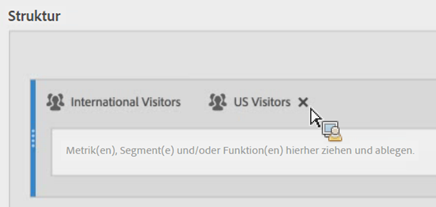
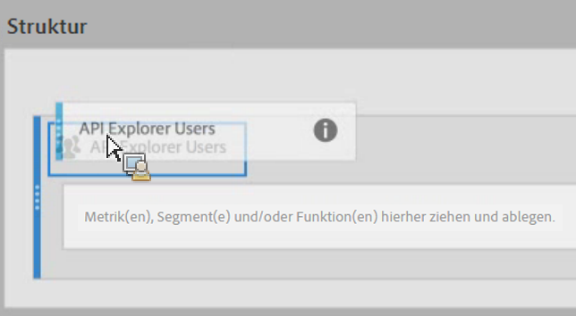

# Segmente stapeln und ersetzen

Hier wird erläutert, wie Sie Segmente mit dem Generator für berechnete Metriken stapeln und ersetzen.

## Stapelung von Segmenten   {#section_3FC1118FEE2B40B7BB90F29C8521AF53}

Ziehen Sie das neue Segment einfach in die Arbeitsfläche „Definition“ und legen Sie es neben dem vorhandenen Segment ab:

## Ersetzen eines Segments durch ein anderes   {#section_3DA899DF522A44D7A583C5DC8C0A033E}

Ziehen Sie das neue Segment einfach in die Arbeitsfläche „Definition“ und legen Sie es auf dem vorhandenen Segment ab:

