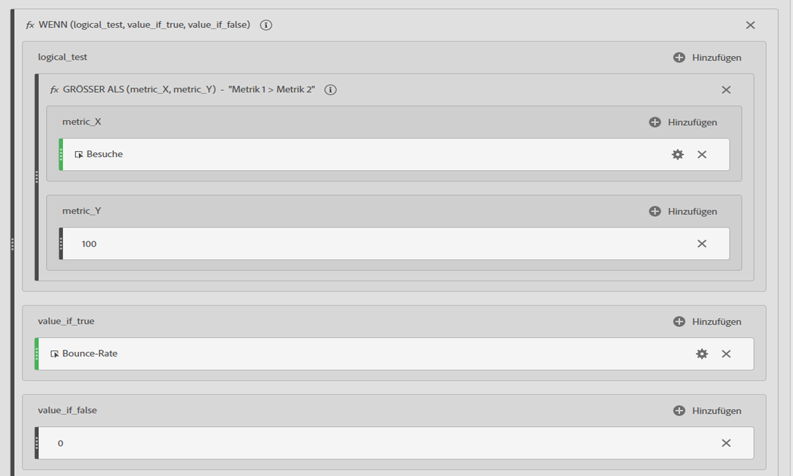
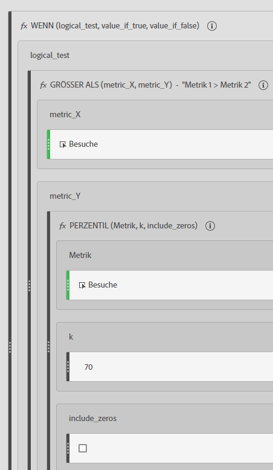
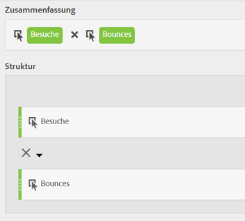

# Gefilterte und gewichtete Metriken

Enthält Beispiele für gefilterte und gewichtete Metriken.

## Gefilterte Absprungrate   {#section_D42F2452E4464948934063EB6F2DAAB4}

Mit dieser einfachen Metrik wird die Absprungrate nur für die Seiten mit mehr als 100 Besuchen angezeigt:

Denken Sie daran, dass diese Formel von einem konsistenten Zeitraum abhängig ist. Wenn Sie einen Bericht für einen Tag ausführen, lohnt es sich, jede Seite mit mehr als 20 Besuchen zu betrachten. Wenn der Bericht für einen Monat ausgeführt wird, sollte der Filter mehr Besuche umfassen.

## Gefilterte Absprungrate mit Perzentil   {#section_4F3E6D33A1FD438A932FA662B3510552}

Dieser Filter zeigt die Absprungrate für die oberen 30 Prozent der Seiten bei Sortierung nach Besuchen an.

## Gewichtete Metrik   {#section_F2D16B14569948289CF1310F9E6E3FC2}

Beispiel: Sie möchten nach Absprungrate im Allgemeinen sortieren, aber Seiten mit mehr Besuchen weiter oben in der Liste anzeigen. Dazu könnten Sie eine gewichtete Absprungrate erstellen, die in etwa wie folgt aussieht:

