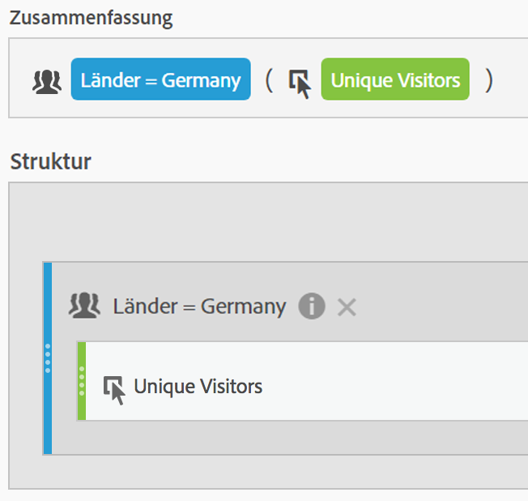
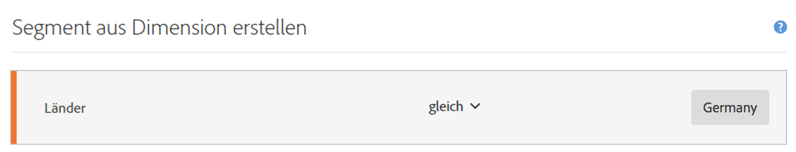
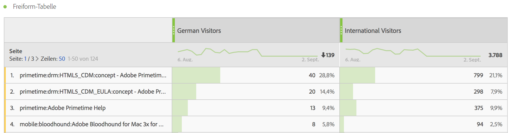
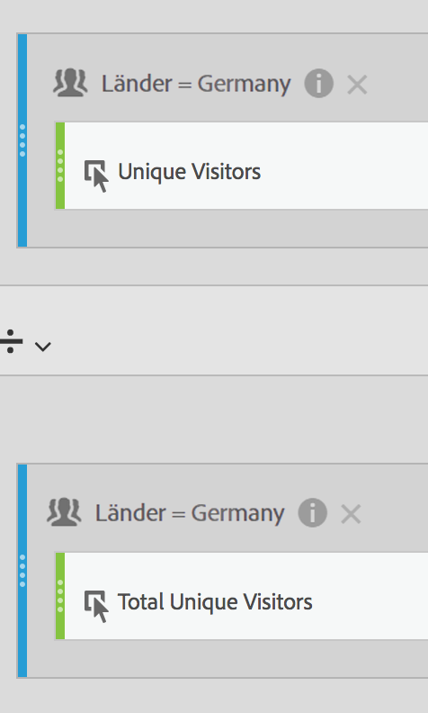

# Segmentierte Metriken

Im Generator für berechnete Metriken können Sie Segmente innerhalb Ihrer Metrikdefinition anwenden. Dies ist hilfreich, wenn Sie neue Metriken ableiten möchten, die in Ihrer Analyse verwendet werden sollen. Beachten Sie, dass Segmentdefinitionen über den Segmentaufbau aktualisiert werden können. Wenn Änderungen vorgenommen werden, wird das Segment automatisch an einer beliebigen Stelle aktualisiert, auch wenn es Teil einer Definition für berechnete Metriken ist.

## Erstellen einer segmentierten Metrik {#create}

Nehmen wir an, Sie möchten verschiedene Aspekte eines Segments &quot;Deutscher Besucher&quot;mit denen eines Segments &quot;Internationale Besucher&quot;vergleichen. Dazu können Sie Metriken erstellen, die Einblick in Folgendes ermöglichen:

* Wie sieht das Browsingverhalten im Vergleich zwischen den beiden Gruppen aus? (Ein weiteres Beispiel wäre: Wie sieht die Konversionsrate im Vergleich zwischen den beiden Segmenten aus?)
* Wie viele deutsche Besucher durchsuchen bestimmte Besucher, verglichen mit internationalen Besuchern?
* Wo liegen die größten Unterschiede in Bezug darauf, welcher Inhalt von den verschiedenen Segmenten aufgerufen wird?

1. Wenn Sie kein vergleichbares Segment haben, erstellen Sie im Generator für berechnete Metriken ein Ad-hoc-Segment mit dem Namen &quot;Deutsche Besucher&quot;, wobei &quot;Länder&quot;gleich &quot;Deutschland&quot;ist. Ziehen Sie die „Länder“-Dimension einfach in die Arbeitsfläche „Definition“ und wählen Sie als Wert „Deutschland“:

   

   >[!NOTE]
   >
   >Sie können diesen Vorgang auch im [Segmentaufbau](/help/components/segmentation/segmentation-workflow/seg-build.md) durchführen, aber wir haben den Arbeitsablauf vereinfacht. Daher stehen Dimensionen auch im Generator für berechnete Metriken zur Verfügung. &quot;Adhoc&quot; means that the segment is not visible in the **[!UICONTROL Segments]** list in the left rail. Sie können es aber auch veröffentlichen, indem Sie über das „i“ daneben fahren und auf **[!UICONTROL Als öffentlich einstellen klicken]**.

1. Wenn kein vergleichbares Segment vorliegt, erstellen Sie ein Segment namens „Internationale Besucher“, bei dem Sie für „Länder“ nicht „Deutschland“ angeben.
1. Erstellen und speichern Sie eine Metrik namens „Deutsche Besucher“, indem Sie das Segment „Deutschland“ in die Arbeitsfläche „Definition“ ziehen und die Metrik „Unique Visitors“ darauf ablegen:

   

1. Wiederholen Sie Schritt 3 mit dem Segment „Internationale Besucher“ und der Metrik „Unique Visitors“, um die Metrik „Internationale Besucher“ zu erstellen.
1. Ziehen Sie in Analysis Workspace die Dimension **[!UICONTROL Seite]** in eine Freiform-Tabelle und dann die zwei neuen berechneten Metriken nebeneinander oben in die Tabelle:

   

## Prozent der Gesamtmetriken {#percent-total}

Sie können das obige Beispiel weiter ausführen, indem Sie Ihr Segment mit der Gesamtpopulation vergleichen. Erstellen Sie dazu zwei neue Metriken: &quot;% der deutschen Besucher insgesamt&quot;und &quot;% der internationalen Besucher insgesamt&quot;:

1. Ziehen Sie das Segment „Deutsche Besucher“ (oder „Internationale Besucher“) in die Arbeitsfläche.
1. Legen Sie darunter ein weiteres Segment „Deutsche Besucher“ (oder „Internationale Besucher“) ab. Klicken Sie dieses Mal aber auf das zugehörige Konfigurationssymbol (Zahnrad), um den Metriktyp „Gesamt“ auszuwählen. Das Format sollte „Prozent“ lauten. Der Operator sollte „Geteilt durch“ lauten. Dadurch erhalten Sie die folgende Metrikdefinition:

   

1. Wenden Sie diese Metrik auf das Projekt an:

   

