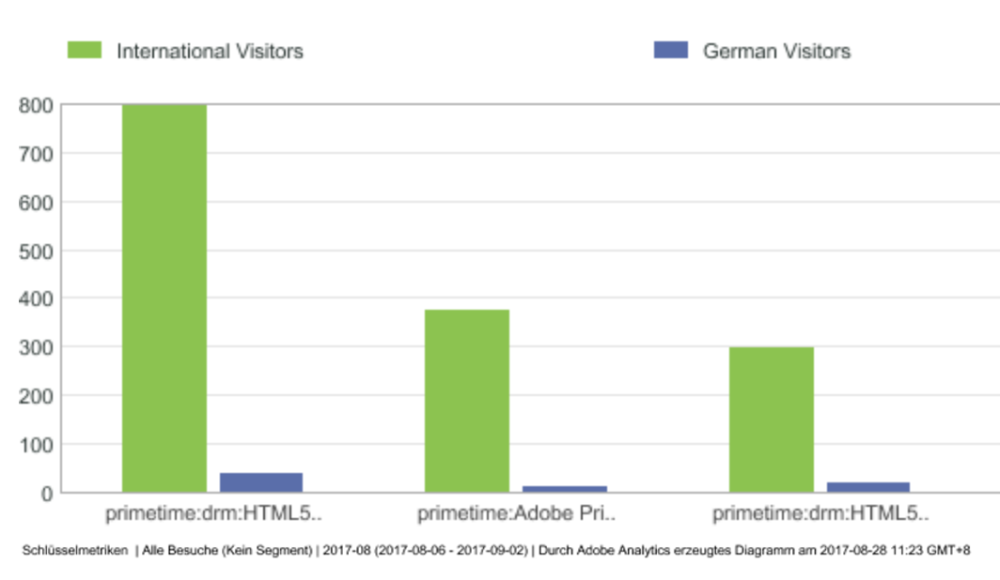
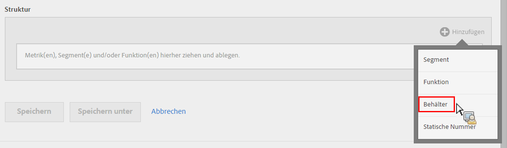
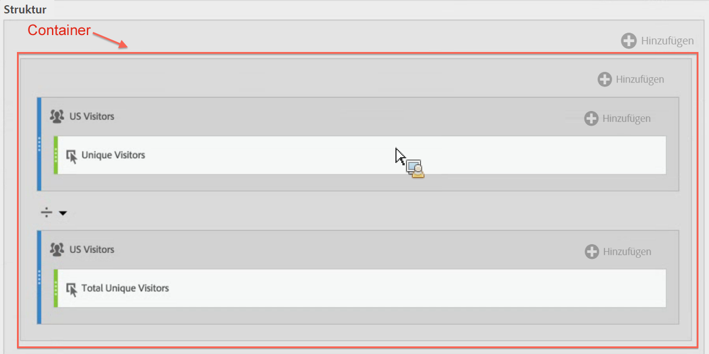
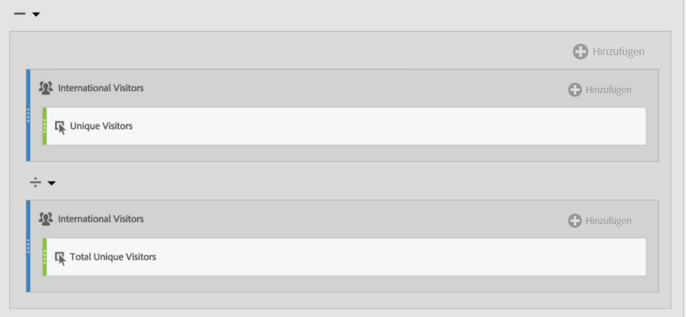

# Segmentierte Metriken

Durch die Segmentierung einzelner Metriken können Sie Metriken innerhalb eines Berichts vergleichen. (Nur abgeleitete Metriken)

## Segmente vergleichen {#section_29A6E0070F084BFDB6228FA9CE106F48}

Beispiel: Sie möchten unterschiedliche Aspekte des Segments „US-Besucher“ mit denen des Segments „Internationale Besucher“ vergleichen. Dazu können Sie Metriken erstellen, die Einblick in Folgendes ermöglichen:

* Wie sieht das Browsingverhalten im Vergleich zwischen den beiden Gruppen aus? (Ein weiteres Beispiel wäre: Wie sieht die Konversionsrate im Vergleich zwischen den beiden Segmenten aus?)
* Wie viele US-Besucher navigieren zu bestimmten Seiten im Vergleich mit internationalen Besuchern (als Prozentsatz der Gesamtbesucher)?
* Wo liegen die größten Unterschiede in Bezug darauf, welcher Inhalt von den verschiedenen Segmenten aufgerufen wird?

Untersuchen wir nun zunächst die erste Frage: Wie sieht das Browsingverhalten im Vergleich zwischen den beiden Gruppen aus?

1. Wenn kein vergleichbares Segment vorliegt, erstellen Sie direkt im Generator für berechnete Metriken ein Segment namens „Deutsche Besucher“, bei dem Sie für „Länder“ „Deutschland“ angeben. Ziehen Sie die „Länder“-Dimension einfach in die Arbeitsfläche „Definition“ und wählen Sie als Wert „Deutschland“:

   

   >[!NOTE]
   >
   >Sie können diesen Vorgang auch im [Segmentaufbau](/help/components/segmentation/segmentation-workflow/seg-build.md) durchführen, aber wir haben den Arbeitsablauf vereinfacht. Daher stehen Dimensionen auch im Generator für berechnete Metriken zur Verfügung.

   >[!NOTE]
   >
   >„Internal“ bedeutet, dass das Segment nicht in der Liste der **[!UICONTROL Segmente]** in der linken Leiste angezeigt wird. Sie können es aber auch veröffentlichen, indem Sie über das „i“ daneben fahren und auf **[!UICONTROL Als öffentlich einstellen klicken]**.

1. Wenn kein vergleichbares Segment vorliegt, erstellen Sie ein Segment namens „Internationale Besucher“, bei dem Sie für „Länder“ nicht „Deutschland“ angeben.
1. Erstellen und speichern Sie eine Metrik namens „Deutsche Besucher“, indem Sie das Segment „Deutschland“ in die Arbeitsfläche „Definition“ ziehen und die Metrik „Unique Visitors“ darauf ablegen:

   

1. Wiederholen Sie Schritt 3 mit dem Segment „Internationale Besucher“ und der Metrik „Unique Visitors“, um die Metrik „Internationale Besucher“ zu erstellen.
1. Ziehen Sie in Analysis Workspace die Dimension **[!UICONTROL Seite]** in eine Freiform-Tabelle und dann die zwei neuen berechneten Metriken nebeneinander oben in die Tabelle:

   

1. Alternativ öffnen Sie in [!UICONTROL Reports &amp; Analytics] den Bericht [!UICONTROL Seiten] und klicken Sie auf **[!UICONTROL Metriken anzeigen]**. Wenden Sie dann die neuen segmentierten Metriken „US-Besucher“ und „Internationale Besucher“ an, um den Vergleich im Browsingverhalten anzuzeigen.

   

## Prozentsätze der Gesamtwerte vergleichen {#section_846CB89725F04388AE0352DB20189EE8}

Sie können eine weitere Ebene einführen, indem Sie das Browsingverhalten der Besucher in normalisierten Prozentsätzen vergleichen. Erstellen Sie dazu zwei neue Metriken: „% aller deutschen Besucher“ und „% der Gesamtzahl internationaler Besucher“:

1. Ziehen Sie das Segment „Deutsche Besucher“ (oder „Internationale Besucher“) in die Arbeitsfläche.
1. Legen Sie darunter ein weiteres Segment „Deutsche Besucher“ (oder „Internationale Besucher“) ab. Klicken Sie dieses Mal aber auf das zugehörige Konfigurationssymbol (Zahnrad), um den Metriktyp „Gesamt“ auszuwählen. Das Format sollte „Prozent“ lauten. Der Operator sollte „Geteilt durch“ lauten. Dadurch erhalten Sie die folgende Metrikdefinition:

   

1. Wenden Sie diese Metrik auf das Projekt an:

   

## Unterschiede in Prozentsätzen vergleichen (anhand von Containern) {#section_13D6353259B74C09B37BA6378A501938}

Wenn Sie die größten Unterschiede zwischen dem Browsingverhalten der US-Besucher und der internationalen Besucher auf einen Blick sehen möchten, können Sie eine weitere Metrik erstellen, mit der die Prozentsätze voneinander abgezogen werden. Dazu können Sie die Containerfunktion verwenden, die gewissermaßen als Klammer um die zwei Metriksätze dient.

1. Klicken Sie in der Arbeitsfläche [!UICONTROL Definition] auf **[!UICONTROL Hinzufügen]** > **[!UICONTROL Container]**:

   

1. Legen Sie die zuvor erstellte Metrik „% der Gesamt-US-Besucher“ im ersten Container ab. Daraufhin wird die vollständige Definition eingeblendet:

   

1. Erstellen Sie einen weiteren Container darunter und legen Sie die Metrik „% der Gesamtzahl internationale Besucher“ darin ab.
1. Ändern Sie den Operator zwischen den zwei Containern in ein Minus (−).

   

1. Speichern Sie die Metrik. (Achten Sie darauf, ihr einen aussagekräftigen Namen zu geben, wie „Unterschied in % zwischen US und International“.)
1. Wenn Sie die Metrik auf den Bericht anwenden, können Sie leicht erkennen, wo die größten Unterschiede in Prozent liegen, und den Bericht entsprechend sortieren.

   

