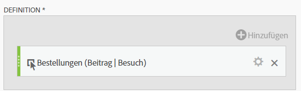

# Beitragsmetrik

Im Folgenden wird ein einfacher Anwendungsfall beschrieben: Als Inhaber von Inhalt möchten Sie sehen, welche Seiten bei Besuchen beteiligt waren, die zu einer Bestellung geführt haben. So geht’s:

>[!NOTE]
>
>Bisher mussten Sie hierzu die Admin Tools verwenden. Sie können Teilnahmemetriken nach wie vor in der Admin Tools aktivieren, jedoch lediglich für die benutzerdefinierten Ereignisse 1–100.

Im Folgenden wird ein einfacher Anwendungsfall beschrieben: Als Inhaber von Inhalt möchten Sie sehen, welche Seiten bei Besuchen beteiligt waren, die zu E-Mail-Anmeldungen geführt haben. So geht’s:

1. Erstellen Sie eine neue Metrik im Generator für berechnete Metriken.
1. Ziehen Sie das Erfolgsereignis „Bestellungen“ in die Arbeitsfläche „Definition“.
1. Ändern Sie das [Attributionsmodell](/help/components/c-calcmetrics/c-workflow/cm-workflow/c-build-metrics/m-metric-type-alloc.md) dieses Ereignisses in **[!UICONTROL Beteiligung]** unter dem Zahnradsymbol für **[!UICONTROL Einstellungen]**. Wählen Sie das Lookback **[!UICONTROL Besuch]**. Die Definition sollte etwa so aussehen:

   

1. Speichern Sie die Metrik.
1. Verwenden Sie die berechnete Metrik im Bericht **[!UICONTROL Seiten]**.

   

1. (Optional) Geben Sie die Metrik für andere Benutzer in Ihrer Organisation frei.

