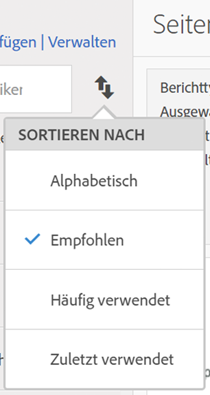
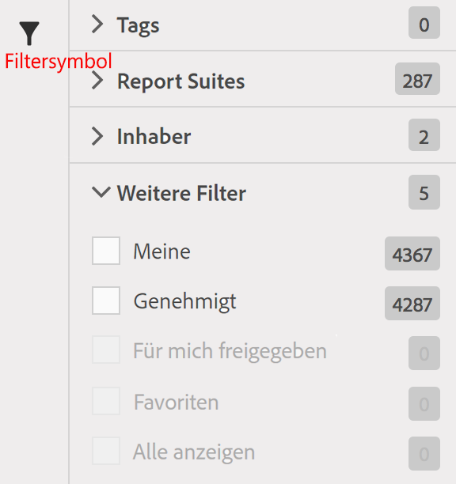

# Metriken suchen

Hier werden die zwei Hauptarten zum Suchen von Metriken beschrieben: Sortieren und Filtern.

## Sortieren   {#section_89F9C4D515084F5796F2A54D468BF6C8}

Wenn Sie einen Bericht öffnen und auf das Metriksymbol  auf der linken Seite des Berichts klicken, um die Metrikleiste anzuzeigen, werden in der Dropdown-Liste **[!UICONTROL Sortieren nach]** der Metrikauswahl vier Optionen zur Sortierung angezeigt:

| Option | Einsatz |
|---|---|
| Alphabetisch | Nützlich, wenn Sie den Namen kennen. |
| Empfohlen | Häufige Metriken, die im Bericht verwendet werden. Dies wird vom Backend anhand von Metriken erfasst, die Benutzer häufig mit diesem Bericht verwenden. |
| Häufig verwendet | Nützlich, wenn Sie ein unerfahrener Benutzer sind und sehen möchten, was häufig im Bericht verwendet wird. |
| Kürzlich verwendet | Nützlich, wenn Sie an einem Projekt arbeiten und denselben Satz aus Metriken immer wieder verwenden. |

## Filtern - Erweiterte Auswahl   {#section_33818CC048C04F098703AC229693F8CA}

Wenn Sie einen Bericht öffnen, klicken Sie auf das Metriksymbol und anschließend auf **[!UICONTROL Verwalten]**. Klicken Sie dann auf das Filtersymbol. Sie haben verschiedene Möglichkeiten zum Filtern.

<table id="table_269081BC9DF54FFDA4E949FFC7488F42"> 
 <thead> 
  <tr> 
   <th colname="col1" class="entry"> Ziel </th> 
   <th colname="col2" class="entry"> Sortieren nach </th> 
  </tr>
 </thead>
 <tbody> 
  <tr> 
   <td colname="col1"> Anzeigen aller Metriken in dieser Report Suite. </td> 
   <td colname="col2"> Weitere Filter &gt; Alle anzeigen </td> 
  </tr> 
  <tr> 
   <td colname="col1"> Nur die eigenen Metriken anzeigen </td> 
   <td colname="col2"> Weitere Filter &gt; Meine </td> 
  </tr> 
  <tr> 
   <td colname="col1"> Metriken anzeigen, die jemand für mich freigegeben hat </td> 
   <td colname="col2">Entweder Inhaber oder 
 Weitere Filter &gt; Für mich freigegeben 
 </td> 
  </tr> 
  <tr> 
   <td colname="col1"> Nur Metriken anzeigen, die vom Unternehmen genehmigt wurden. </td> 
   <td colname="col2"> Genehmigt </td> 
  </tr> 
  <tr> 
   <td colname="col1"> Filtern von Metriken für ein Projekt, an dem Sie arbeiten. </td> 
   <td colname="col2">Einem der Tags. </td> 
  </tr> 
 </tbody> 
</table>

