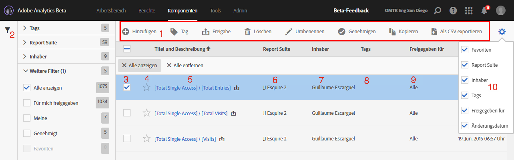

# Berechnete Metriken – Manager

Der Manager für berechnete Metriken bietet verschiedene Möglichkeiten zum Kuratieren von Metriken, wie das Freigeben, Filtern, Taggen, Genehmigen, Kopieren, Löschen und Kennzeichnen als Favoriten.

Der Manager für berechnete Metriken zeigt Ihnen alle Segmente, die sich in Ihrem Besitz befinden und für Sie freigegeben wurden. Benutzer auf Administratorebene sehen alle benutzerdefinierten Metriken der Organisation. Dieser Überblick präsentiert die Benutzeroberfläche und die Funktionen des Managers für berechnete Metriken. Sie greifen wie folgt darauf zu:

* Going to **[!UICONTROL Analytics]** &gt; **[!UICONTROL Components]** in the left navigation. Klicken Sie anschließend auf **[!UICONTROL Berechnete Metriken]**.

| Funktion der Benutzeroberfläche | Beschreibung |
|---|---|
| Werkzeugleiste für die Verwaltung berechneter Metriken | Diese Werkzeugleiste wird angezeigt, sobald Sie eine Metrik aktivieren. Über diese Werkzeugleiste können die meisten Verwaltungsaufgaben erledigt werden. |
| Filter anzeigen/Filter ausblenden | Wenn Sie auf „Filter anzeigen“ klicken, wird das Filtermenü angezeigt. Sie können nach Tags, Report Suites, Inhabern, „Alle anzeigen“ (nur Admin), „Für mich freigegeben“, „Meine“, „Favoriten“ und „Genehmigt“ filtern. |
| Kontrollkästchen | Aktivieren Sie eine benutzerdefinierte Metrik, um sie zu verwalten. |
| Favoriten | Wenn Sie auf den Stern neben einer Metrik klicken, wird der Stern gelb angezeigt und kennzeichnet die Metrik als Favorit. |
| Segmenttitel und Beschreibungen | Werden im Generator für berechnete Metriken angegeben. Klicken Sie auf den Titellink, um den Titel und die Beschreibung zu bearbeiten. Dadurch gelangen Sie zurück zum Generator für berechnete Metriken. |
| Report Suites | Diese Spalte zeigt an, in welcher Report Suite die Metrik zuletzt gespeichert wurde. |
| Inhaber | Gibt den Inhaber der benutzerdefinierten Metrik an. Wenn Sie kein Administrator sind, können Sie nur Metriken sehen, deren Inhaber Sie sind, sowie Metriken, die für Sie freigegeben wurden. |
| Tags | Zeigt Tags an, die entweder durch Sie oder durch Personen, die eine Metrik für Sie freigegeben haben, auf die Metrik angewendet wurden. |
| Freigegeben für | Zeigt Personen oder Gruppen (nur Administrator) oder „Alle“ (nur Administrator) an, für die Sie das Segment freigegeben haben. |
| Spaltenauswahl | Damit können Sie Spalten im Manager für berechnete Metriken aktivieren oder deaktivieren, um so die Ansicht anzupassen. |
| Gemeinsam-Symbol  (nicht angezeigt) | Gibt an, dass diese benutzerdefinierte Metrik von Ihnen oder für Sie freigegeben wurde. |
| Freigegeben-Symbol  (nicht angezeigt) | Gibt an, dass diese benutzerdefinierte Metrik durch einen Administrator genehmigt wurde. |