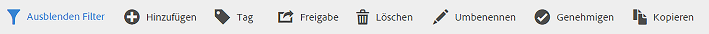
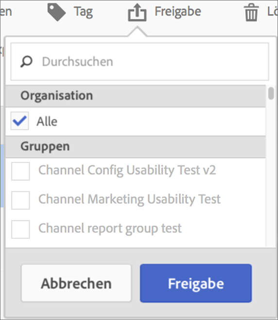

# Berechnete Metriken freigeben

Abhängig von Ihren Berechtigungen können Sie Metriken für Ihre gesamte Organisation, für Gruppen oder für einzelne Benutzer freigeben.

| Rolle | Zugriffsberechtigung |
|---|---|
| Administrator | Kann Metriken für alle, für Gruppen und für Benutzer freigeben. Gruppen werden in der Admin Console als Berechtigungsgruppen eingerichtet. |
| Nicht-Administrator | Kann Metriken nur für einzelne Benutzer freigeben. |

Wann sollten Metriken für das gesamte Unternehmen und wann nur für eine Benutzergruppe oder einzelne Benutzer freigegeben werden? Im Folgenden finden Sie einige Best Practices, an denen Sie sich orientieren können:

* Geben Sie als Administrator eine Metrik für **[!UICONTROL Alle]** frei, wenn sie für das gesamte Unternehmen von Nutzen ist und von jedem problemlos verwendet werden kann. In diesem Fall sollten Sie die Metrik eventuell auch genehmigen.
* Geben Sie als Administrator eine Metrik für eine bestimmte **[!UICONTROL Gruppe]** frei, wenn die Metrik für das entsprechende Team einen Geschäftswert bietet.
* Geben Sie als Administrator oder als einzelner Benutzer eine Metrik für andere einzelne Benutzer frei, um eine Metrik zu prüfen und zu validieren. Wenn er sich als nicht nützlich erweist, kann er verworfen werden. Führen Sie für diesen Metriktyp keine offizielle Genehmigung durch.

1. Aktivieren Sie im Manager für berechnete Metriken das Kontrollkästchen neben der Metrik, die Sie freigeben möchten. Die Taskleiste wird angezeigt:

   

1. Klicken Sie auf das Symbol **[!UICONTROL Freigabe]**.

   

   Wenn Sie Administrator sind, können Sie **[!UICONTROL Alle]** oder **[!UICONTROL Gruppen]** und (durch Bildlauf nach unten) **[!UICONTROL Benutzer]** in Ihrer Organisation auswählen. Als Nicht-Administrator sehen Sie nur einzelne Benutzer. Benutzen Sie das Feld **[!UICONTROL Suchen]**, um nach Gruppen oder Benutzern zu suchen

1. Klicken Sie auf **[!UICONTROL Freigabe]**.

   Neben der Metrik wird das Freigabesymbol angezeigt:  

1. Sie können nach für Sie freigegebenen Metriken filtern, indem Sie **[!UICONTROL Filter]** > **[!UICONTROL Weitere Filter]** > **[!UICONTROL Für mich freigegeben]** verwenden.

