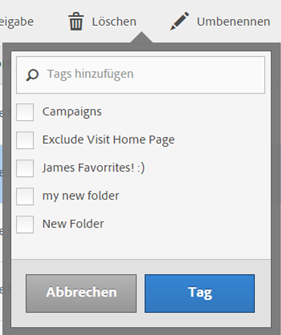

# Taggen Sie berechnete Metriken.

Durch das Taggen von Segmenten können Sie diese im Manager für berechnete Metriken organisieren.

Alle Benutzer können Tags für berechnete Metriken erstellen und eines oder mehrere Tags auf eine Metrik anwenden. Sie sehen Tags jedoch nur für die berechneten Metriken, deren Inhaber Sie sind oder die für Sie freigegeben wurden. Welche Arten von Tags sollten Sie erstellen? Hier finden Sie einige Vorschläge für nützliche Tags:

* Auf **Teamnamen** basierende Tags wie Social Marketing, Mobile Marketing.
* **Projekt**-Tags (Analyse-Tags) wie Entrypage-Analyse.
* **Kategorie**-Tags: Männer, Region.
* **Arbeitsablauf**-Tags: Genehmigung ausstehend, kuratiert für (einen bestimmten Geschäftsbereich)

1. Aktivieren Sie im Manager für berechnete Metriken das Kontrollkästchen neben der Metrik, die Sie taggen möchten. Die Werkzeugleiste für die Verwaltung wird angezeigt:
1. Klicken Sie auf **[!UICONTROL Taggen]und**

   * wählen Sie entweder ein vorhandenes Tag aus oder
   * fügen Sie einen neuen Tag-Namen im Dialogfeld „Tags hinzufügen/Suchen“ hinzu und drücken Sie die **[!UICONTROL Eingabetaste]**.

      

1. Klicken Sie erneut auf **[!UICONTROL Taggen], um die Metrik zu taggen.**

Das Tag wird jetzt in der Spalte „Tags“ angezeigt. (Klicken Sie oben rechts auf das Zahnradsymbol, um Ihre Spalten zu verwalten.)

You can also filter on tags by going to **[!UICONTROL Show Filters]** &gt; **[!UICONTROL Tags]**.
