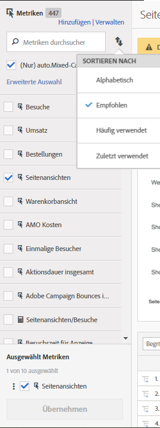

# Berechnete und erweiterte berechnete (abgeleitete) Metriken

Berechnete und erweiterte berechnete (abgeleitete) Metriken sind benutzerdefinierte Metriken, die Sie über vorhandene Metriken erstellen können.

Mit unseren Tools für berechnete Metriken können Sie Metriken auf flexiblere Weise erstellen, verwalten und kuratieren. Damit können Marketingexperten, Produktmanager und Analytiker Fragen zu den Daten beantworten, ohne die [!DNL Analytics]-Implementierung ändern zu müssen. Dies sind die benutzerdefinierten Metriken, die in den einzelnen [!DNL Analytics]-Paketen verfügbar sind:

* Adobe [!DNL Analytics] Foundation: Berechnet
* [Adobe Analytics Select](https://www.adobe.com/de/data-analytics-cloud/analytics/select.html): Berechnet + erweitert berechnet
* [Adobe Analytics Prime](https://www.adobe.com/de/data-analytics-cloud/analytics/prime.html): Berechnet + erweitert berechnet
* [Adobe Analytics Ultimate](https://www.adobe.com/de/data-analytics-cloud/analytics/ultimate.html): Berechnet + erweitert berechnet

Hier sehen Sie einen Vergleich zwischen den jeweiligen Möglichkeiten, die berechnete und erweiterte berechnete Metriken bieten:

| Generatoroptionen | Berechnete Metriken | Erweiterte berechnete (abgeleitete) Metriken |
|---|---|---|
| [Formatarten (Dezimal, Zeit, Prozent, Währung)](/help/components/c-calcmetrics/c-workflow/cm-workflow/c-build-metrics/cm-build-metrics.md) | Ja | Ja |
| [Attributionsänderung (Standard, Linear, Teilnahme etc.)](/help/components/c-calcmetrics/c-workflow/cm-workflow/c-build-metrics/m-metric-type-alloc.md) | Ja | Ja |
| [Metriktypen (Standard, Total)](/help/components/c-calcmetrics/c-workflow/cm-workflow/c-build-metrics/m-metric-type-alloc.md) | Ja | Ja |
| Grundrechenarten (Addieren, Subtrahieren, Multiplizieren, Dividieren) | Ja | Ja |
| [Segmente anwenden](/help/components/c-calcmetrics/c-workflow/cm-workflow/c-build-metrics/metrics-with-segments.md) | Nein | Ja |
| [Allgemeine Funktionen (Zählen, Anzeigenwert, Mittel etc.)](/help/components/c-calcmetrics/cm-reference/cm-functions.md) | Nein | Ja |
| [Erweiterte Funktionen (Regression, Wenn-Dann, T-Transformation etc.)](/help/components/c-calcmetrics/cm-reference/cm-adv-functions.md) | Nein | Ja |

## Funktionen {#section_A0A5C275B68A4D628950BBB0B1EE631F}

Sie können

* Metriken über [!UICONTROL Analysis Workspace], [!UICONTROL Reports &amp; Analytics], [!UICONTROL Ad Hoc Analysis], [!UICONTROL Report Builder], [!UICONTROL Anomalieerkennung] und [!UICONTROL Beitragsanalyse] hinweg erstellen.
* Segmentierte Metriken erstellen, die zur Berichtslaufzeit abgeleitet werden, [ohne die Implementierung ändern zu müssen](https://youtu.be/CuQTm9RaUpY). Diese Metriken können historisch angezeigt werden, da sie auf Segmenten basieren.
* Metriken über Report Suites hinweg freigeben. Das bedeutet, dass alle neu erstellten Metriken für alle Report Suites in demselben Anmeldeunternehmen gelten.
* (Nur erweiterte berechnete Metriken) Segmente für Metriken. Sie können beispielsweise eine Metrik für „Neue Besucher“ erstellen, mit der Personen gezählt werden, für die dies die erste Sitzung ist.
* (Nur erweiterte berechnete Metriken) Statistische Funktionen miteinbeziehen, um Daten besser beschreiben zu können. Sie könnten beispielsweise die Elemente in einem Bericht zählen oder die Anzahl der Standardabweichungen für jedes Element addieren.
* Metriken, die in [!UICONTROL Ad Hoc Analysis] erstellt wurden, in anderen [!DNL Analytics]-Werkzeugen verwenden und umgekehrt.

   >[!NOTE]
   >
   >Sie können weiterhin Metriken in Ad Hoc Analysis erstellen. Die Benutzeroberfläche des dortigen Generators für berechnete Metriken ähnelt jetzt dem neuen Generator für Metriken.

## Einschränkungen {#section_CB878B02451541D68A68B508D4DBD19A}

Bei einigen [!DNL Analytics]-Funktionen können Sie Ereignisse, aber keine berechneten Metriken verwenden:

* [!UICONTROL Trichter] in [!UICONTROL Reports &amp; Analytics]
* [!UICONTROL Fallout] in [!UICONTROL Analysis Workspace]
* [!UICONTROL Kohortenanalyse] in Analysis Workspace
* [!UICONTROL Data Warehouse]
* [!UICONTROL Segmente]
* [!UICONTROL Echtzeitberichte]
* [!UICONTROL Aktuelle Datenberichte]
* [!DNL Analytics] für [!DNL Target]

## Tools {#section_D65E9C067E9C45E1A50DD30F50561BB2}

Im Folgenden erhalten Sie einen kurzen Überblick über die Werkzeuge für [!UICONTROL berechnete Metriken]:

<table id="table_520AFE97DB514958ABE23FD3C9CE0ABD"> 
 <thead> 
  <tr> 
   <th colname="col1" class="entry"> Tool </th> 
   <th colname="col2" class="entry"> Funktionen </th> 
  </tr>
 </thead>
 <tbody> 
  <tr> 
   <td colname="col1"><a href="/help/components/c-calcmetrics/c-workflow/cm-workflow/c-build-metrics/cm-build-metrics.md"  > Aufbau berechneter Metriken</a> </td> 
   <td colname="col2"> 
    <ul id="ul_E6F02AB9DF204C2F9A0AC92A31594B3E"> 
     <li id="li_A4A6E716374243A190C539A3F4A41C0C">Erstellen Sie einfache berechnete Metriken oder erweiterte berechnete Metriken mit erweiterten Zuordnungsmodellen. </li> 
     <li id="li_C8C97BA4E227463E98077ABA5818FFC6">Segmente inline zu Metrik-Formeln hinzufügen. </li> 
     <li id="li_8503D9E06A3C46569B5CDB4B90F72446">Segmente in einem Bericht vergleichen (beispielsweise lokale Besucher mit internationalen Besuchern vergleichen.) </li> 
     <li id="li_4B528FDE1F96400DBA0D3276408FF919">Statistische Funktionen verwenden. </li> 
     <li id="li_C1162B1EA6784B8189A8A87E2B0DA79A">Detaillierte Metrikbeschreibungen angeben (was die Metrik macht, wo sie verwendet werden sollte, wo sie NICHT verwendet werden sollte.) </li> 
     <li id="li_DEA13F5E8BF94AF1B311C467FE6E2A74">Definitionen in neue Metriken kopieren. </li> 
     <li id="li_8C21F55015D44910904202D2BF74221C">Eine Inline-Metrikvorschau bereitstellen. </li> 
     <li id="li_3704F66C321C477F9D4F52E068C231BD">Die Metrikpolarität festlegen, die angibt, ob es gut oder schlecht ist, wenn ein bestimmtes benutzerspezifisches Ereignis (eine Metrik) steigt. </li> 
     <li id="li_9D45319FA965476FB1C90DE8AA72BBD7">Metriken taggen. </li> 
    </ul> </td> 
  </tr> 
  <tr> 
   <td colname="col1"><a href="/help/components/c-calcmetrics/c-workflow/cm-workflow/cm-manager.md"  > Berechnete Metrik – Manager</a> </td> 
   <td colname="col2"> 
    <ul id="ul_E4D20D5DD3904CC6A85785B5BD4C1B1E"> 
     <li id="li_E0B216BA1478406EB6212263DF71D85B">Metriken für andere freigeben. </li> 
     <li id="li_96EB16FAF3454211AAEF78EA5B08927F">Metriken genehmigen und kuratieren. </li> 
     <li id="li_3ADBD2428EAC4B0AA61222D87C3AF2B7">Metriken organisieren (taggen), damit sie von Benutzern gefunden werden können. </li> 
     <li id="li_726F3C3390744E49BA63606FE196880E">Metriken löschen. </li> 
     <li id="li_F306BA4FA8AF4A6E987BA62634659A2F">Metriken umbenennen. </li> 
    </ul> </td> 
  </tr> 
  <tr> 
   <td colname="col1"> Leiste „Metrikauswahl“ </td> 
   <td colname="col2"> 
Ersetzt das Popup-Fenster Metriken anzeigen in Reports &amp; Analytics. 
 
Damit können Sie auch Metriken suchen und sie dem Bericht hinzufügen bzw. auf ihn anwenden. Außerdem können Sie die <a href="/help/components/c-calcmetrics/c-workflow/cm-workflow/cm-finding.md"  >Sortierfolge</a> ändern (Optionen sind: Alphabetisch, Empfohlen, Häufig verwendet, Kürzlich verwendet). Darüber hinaus können Sie nach Report Suites filtern, um nur Metriken anzuzeigen, die in einer bestimmten Report Suite erstellt wurden. 
 
Um auf diese Metrikauswahl zuzugreifen, klicken Sie auf das Metriksymbol  auf der linken Seite eines Berichts. Die Metrikauswahl sieht wie folgt aus: 
 
 
 </td> 
  </tr> 
  <tr> 
   <td colname="col1"><a href="https://www.adobe.io/apis/experiencecloud/analytics/docs.html#!AdobeDocs/analytics-2.0-apis/master/README.md"  > API für berechnete Metriken</a> </td> 
   <td colname="col2"> 
Teil des Adobe Analytics 2.0-API-Sets. 
 </td> 
  </tr> 
 </tbody> 
</table>

