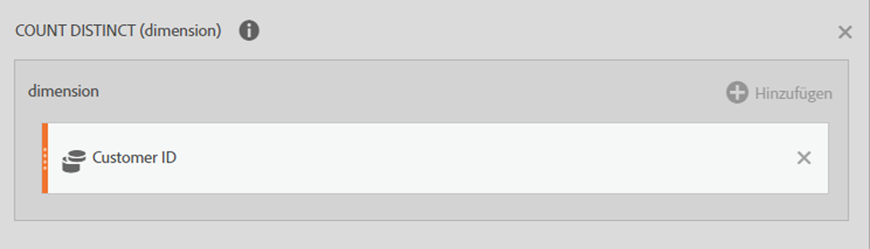
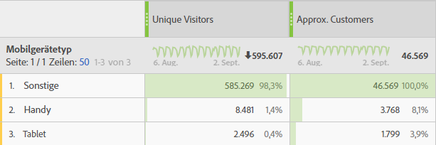

# Referenz: Erweiterte Funktionen

Greifen Sie auf diese Funktionen zu, indem Sie in der Dropdown-Liste **[!UICONTROL Funktionen]** die Option **[!UICONTROL Erweitert anzeigen]** wählen.

## Vergleich zwischen Tabellenfunktionen und Zeilenfunktionen {#section_8977BE40A47E4ED79EB543A9703A4905}

Bei einer Tabellenfunktion ist die Ausgabe für jede Tabellenzeile gleich. Bei einer Zeilenfunktion ist die Ausgabe für jede Tabellenzeile unterschiedlich.

## Was bedeutet der Parameter „Include-Zeros“?   {#section_C7A2B05929584C65B308FD372CB8E8E3}

Damit wird angegeben, ob Nullen in die Berechnung einbezogen werden sollen. In manchen Fällen bedeutet eine Null „nichts“, in anderen Fällen kann sie aber auch wichtig sein.

Beispiel: Wenn Sie mit einer Umsatzmetrik arbeiten und dem Bericht dann eine Seitenansichtsmetrik hinzufügen, gibt es plötzlich mehr Zeilen für den Umsatz, die alle Nullwerte enthalten. Dies soll sich sicherlich nicht auf Berechnungen für arithmetisches Mittel, Minimum, Quartil usw. auswirken, die Sie für die Umsatzspalte eingerichtet haben. In diesem Fall würden Sie den include-zeros-Parameter aktivieren.

Wenn Sie allerdings an zwei Metriken interessiert sind, soll vielleicht nicht eine Metrik einen höheren Durchschnitt oder Mindestwert erhalten, weil einige seiner Zeilen Null waren. Daher würden Sie den Parameter zum Einbeziehen der Nullwerte nicht aktivieren.

## AND {#concept_E14513FE464F4491AD0D4130D4EE621C}

Gibt den Wert des zugehörigen Arguments zurück. Mit „NOT“ können Sie sicherstellen, dass ein Wert nicht mit einem bestimmten Wert übereinstimmt.

>[!NOTE]
>
>0 (null) bedeutet „Falsch“ und jeder andere Wert „Wahr“.

```
AND(logical_test1,[logical_test2],...)
```

| Argument | Beschreibung |
|---|---|
| *logical_test1* | Erforderlich. Jeder Wert oder Ausdruck, der als TRUE oder FALSE ausgewertet werden kann. |
| *logical_test2* | Optional. Zusätzliche Bedingungen, die als TRUE oder FALSE ausgewertet werden sollen. |

## Ungefährer Distinct Count (Dimension) {#concept_000776E4FA66461EBA79910B7558D5D7}

Gibt den ungefähren Distinct Count für die Elemente der ausgewählten Dimension zurück. Diese Funktion verwendet die HyperLogLog (HLL)-Methode zur ungefähren Bestimmung des Distinct Count. Sie ist entsprechend eingestellt, um zu garantieren, dass der Wert zu 95 % der Zeit 5 % des tatsächlichen Werts beträgt.

```
Approximate Count Distinct (dimension)
```

| Argument |  |
|---|---|
| *Dimension* | Die Dimension, für die Sie den ungefähren Distinct Count für Elemente ermitteln möchten. |

### Beispielanwendungsfall   {#section_424E3FC5092948F0A9D655F6CCBA0312}

Ungefährer Distinct Count (Kunden-ID-eVar) ist ein typischer Anwendungsfall für diese Funktion.

Definition für eine neue berechnete „Ungefähre Kunden“-Metrik:



So könnte die „Ungefähre Kunden“-Metrik für Berichte verwendet werden:



### Individuelle Werte überschritten   {#section_9C583858A9F94FF7BA054D1043194BAA}

Ebenso wie Count() und RowCount() unterliegt Ungefährer Distinct Count() [„Uniques überschritten“-Beschränkungen](https://docs.adobe.com/content/help/de-DE/analytics/technotes/low-traffic.html). Wird für eine Dimension in einem bestimmten Monat die „Uniques überschritten“-Beschränkung erreicht, wird der Wert als 1 Dimensionselement gezählt.

### Vergleich von Count-Funktionen   {#section_440FB8FB44374459B2C6AE2DA504FC0B}

Ungefährer Distinct Count() ist eine Verbesserung im Vergleich zu Count()- und RowCount()-Funktionen, da die dadurch erstellte Metrik in allen Dimensionsberichten verwendet werden kann, um eine ungefähre Elementanzahl für eine separate Dimension zu rendern. Beispielsweise wird eine Anzahl an Kunden-IDs in einem Bericht zu Mobilgerätetypen verwendet.

Diese Funktion ist etwas weniger genau als Count() und RowCount(), da die HLL-Methode verwendet wird. Bei Count() und RowCount() hingegen handelt es sich um genaue Anzahlen.

## Arkuskosinus (Zeile) {#concept_1DA3404F3DDE4C6BAF3DBDD655D79C7B}

Gibt den Arkuskosinus (oder umgekehrten Kosinus) einer Metrik zurück. Der Arkuskosinus ist der Winkel, dessen Kosinus die Zahl ist. Der zurückgegebene Winkel wird in Radianten im Bereich zwischen 0 (null) und Pi angegeben. Wenn Sie das Ergebnis von Radianten in Grad umrechnen möchten, multiplizieren Sie es mit 180/PI( ).

```
ACOS(metric)
```

| Argument |  |
|---|---|
| *metric* | Der Kosinus des gewünschten Winkels von -1 bis 1. |

## Arkussinus (Zeile) {#concept_90F00DEC46BA47F8A21493647D9668CD}

Gibt den Arkussinus (oder umgekehrten Sinus) einer Zahl zurück. Der Arkussinus ist der Winkel, dessen Sinus die Zahl ist. Der zurückgegebene Winkel wird in Radianten im Bereich zwischen -Pi/2 und Pi/2 angegeben. Um den Arkussinus in Grad auszudrücken, multiplizieren Sie das Ergebnis mit 180/PI( ).

```
ASIN(metric) 
```

| Argument |  |
|---|---|
| *Metrik* | Der Kosinus des gewünschten Winkels von -1 bis 1. |

## Arkustangens (Zeile) {#concept_3408520673774A10998E9BD8B909E90C}

Gibt den Arkustangens (oder umgekehrten Tangens) einer Zahl zurück. Der Arkustangens ist der Winkel, dessen Tangens die Zahl ist. Der zurückgegebene Winkel wird in Radianten im Bereich zwischen -Pi/2 und Pi/2 angegeben. Um den Arkustangens in Grad auszudrücken, multiplizieren Sie das Ergebnis mit 180/PI( ).

```
ATAN(metric)
```

| Argument |  |
|---|---|
| *Metrik* | Der Kosinus des gewünschten Winkels von -1 bis 1. |

## Exponentielle Regression: Vorhersage für Y (Zeile) {#concept_25615693312B4A7AB09A2921083502AD}

Berechnet die prognostizierten y-Werte (metric_Y) anhand der bekannten x-Werte (metric_X) mittels der Methode der kleinsten Quadrate für die Berechnung der Ausgleichsgeraden basierend auf .

```
ESTIMATE.EXP(metric_X, metric_Y)
```

| Argument | Beschreibung |
|---|---|
| *metric_X* | Eine Metrik, der unabhängiger Datenstatus zugewiesen werden soll. |
| *metric_Y* | Eine Metrik, der abhängiger Datenstatus zugewiesen werden soll. |

## Cdf-T {#concept_4E2F2673532A48B5AF786521DE428A66}

Gibt den Prozentsatz von Werten in studentischer t-Verteilung mit n Freiheitsgraden zurück, die einen z-Wert unter x aufweisen.

```
cdf_t( -∞, n ) = 0 
cdf_t(  ∞, n ) = 1 
cdf_t( 3, 5 ) ? 0.99865 
cdf_t( -2, 7 ) ? 0.0227501 
cdf_t( x, ∞ ) ? cdf_z( x )
```

## Cdf-Z {#concept_99C97ACC40A94FADBCF7393A17BC2D12}

Gibt den Prozentsatz von Werten in einer normalen Verteilung zurück, die einen z-Wert unter x aufweisen.

```
cdf_z( -∞ ) = 0 
cdf_z( ∞ ) = 1 
cdf_z( 0 ) = 0.5 
cdf_z( 2 ) ? 0.97725 
cdf_z( -3 ) ? 0.0013499 
 
```

## Nächsthöhere ganze Zahl (Ceiling) (Zeile) {#concept_A14CDB1E419B4AA18D335E5BA2548346}

Gibt die kleinste Ganzzahl zurück, die nicht kleiner als ein angegebener Wert ist. Beispiel: Wenn Sie keine Währungsdezimalzahlen für den Umsatz in Berichte aufnehmen möchten und ein Produkt einen Umsatz von 569,34 US-Dollar aufweist, können Sie mit der Formel CEILING(*Umsatz*) den Umsatz bis zum nächsten Dollar aufrunden (in diesem Fall 570 US-Dollar).

```
CEILING(metric)
```

| Argument | Beschreibung |
|---|---|
| *Metrik* | Die Metrik, die gerundet werden soll. |

## Kosinus (Zeile) {#concept_DD07AA1FB08145DC89B69D704545FD0A}

Gibt den Kosinus des angegebenen Winkels zurück. Wenn der Winkel in Grad vorliegt, multiplizieren Sie ihn mit PI( )/180.

```
COS(metric)
```

| Argument | Beschreibung |
|---|---|
| *Metrik* | Der Winkel in Radianten, für den Sie den Kosinus ermitteln möchten. |

## Kubikwurzel {#concept_BD93EFA45DF7447A8F839E1CA5B5F795}

Gibt die positive Kubikwurzel einer Zahl zurück. Die Kubikwurzel einer Zahl ist der Wert dieser Zahl hoch 1/3.

```
CBRT(metric)
```

| Argument | Beschreibung |
|---|---|
| *Metrik* | Die Metrik, für die Sie die Kubikwurzel abrufen möchten. |

## Zusammengefasst {#concept_3D3347797B6344CE88B394C3E39318ED}

Gibt die Summe von x für die letzten N Zeilen zurück (angeordnet nach Dimension mit Hashwerten für zeichenfolgenbasierte Felder).

Wenn N &lt;= 0 ist, werden alle vorherigen Zeilen verwendet. Da die Anordnung nach Dimensionen erfolgt, ist dies nur bei Dimensionen mit einer natürlichen Reihenfolge nützlich, wie Datum oder Pfadlänge.

```
| Date | Rev  | cumul(0,Rev) | cumul(2,Rev) | 
|------+------+--------------+--------------| 
| May  | $500 | $500         | $500         | 
| June | $200 | $700         | $700         | 
| July | $400 | $1100        | $600         | 
 
```

## Kumulativer Durchschnitt {#concept_ABB650962DC64FD58A79C305282D3E61}

Gibt den Durchschnitt der letzten N Zeilen zurück.

Wenn N &lt;= 0 ist, werden alle vorherigen Zeilen verwendet. Da die Anordnung nach Dimensionen erfolgt, ist dies nur bei Dimensionen mit einer natürlichen Reihenfolge nützlich, wie Datum oder Pfadlänge.

>[!NOTE]
>
>Mit Quotenmetriken, wie Umsatz/Besucher, funktioniert dies nicht so, wie Sie es vielleicht erwarten: Es wird der Quotendurchschnitt ermittelt, anstatt dass der Umsatz über die letzten N und die Besucher über die letzten N summiert und anschließend geteilt werden. Verwenden Sie stattdessen

```
cumul(revenue)/cumul(visitor)
```

## Gleich {#concept_A3B97152B5F74E04A97018B35734BEEB}

Gibt Elemente mit einer exakten Entsprechung für numerische oder Zeichenfolgenwerte wieder.

## Exponentielle Regression: Korrelationskoeffizient (Tabelle) {#concept_C18BBFA43C1A499293290DF49566D8D8}

Gibt den Korrelationskoeffizienten *r* zwischen zwei Metrikspalten (*metric_A* und *metric_B*) für die Regressionsgleichung zurück.

```
CORREL.EXP(metric_X, metric_Y)
```

| Argument | Beschreibung |
|---|---|
| *metric_X* | Die Metrik, die mit *metric_Y* korreliert werden soll. |
| *metric_Y* | Die Metrik, die mit *metric_X* korreliert werden soll. |

## Exponentielle Regression: Konstante (Tabelle) {#concept_0047206C827841AD936A3BE58EEE1514}

Gibt die Konstante *b* zwischen zwei Metrikspalten (*metric_X* und *metric_Y*) zurück für

```
INTERCEPT.EXP(metric_X, metric_Y)
```

| Argument | Beschreibung |
|---|---|
| *metric_X* | Eine Metrik, der unabhängiger Datenstatus zugewiesen werden soll. |
| *metric_Y* | Eine Metrik, der abhängiger Datenstatus zugewiesen werden soll. |

## Exponentielle Regression: Steigung (Tabelle) {#concept_230991B0371E44308C52853EFA656F04}

Gibt die Steigung *a* zwischen zwei Metrikspalten (*metric_X* und *metric_Y*) zurück für.

```
SLOPE.EXP(metric_X, metric_Y)
```

| Argument | Beschreibung |
|---|---|
| *metric_X* | Eine Metrik, der unabhängiger Datenstatus zugewiesen werden soll. |
| *metric_Y* | Eine Metrik, der abhängiger Datenstatus zugewiesen werden soll. |

## Nächstniedrigere ganze Zahl (Floor) (Zeile) {#concept_D368150EC3684077B284EE471463FC31}

Gibt die größte Ganzzahl zurück, die nicht größer als ein angegebener Wert ist. Beispiel: Wenn Sie keine Währungsdezimalzahlen für den Umsatz in Berichte aufnehmen möchten und ein Produkt einen Umsatz von 569,34 US-Dollar aufweist, können Sie mit der Formel FLOOR(*Umsatz*) den Umsatz bis zum nächsten Dollar abrunden (in diesem Fall 569 US-Dollar).

```
FLOOR(metric)
```

| Argument | Beschreibung |
|---|---|
| *Metrik* | Die Metrik, die gerundet werden soll. |

## Größer als {#concept_A83734A0C0C14646B76D2CC5E677C644}

Gibt Elemente zurück, deren numerische Anzahl größer als der eingegebene Wert ist.

## Größer gleich {#concept_8CA6DF1F84784D50849BF1C566AE1D37}

Gibt Elemente zurück, deren numerische Anzahl größer als der eingegebene Wert ist oder damit übereinstimmt.

## Hyperbelkosinus (Zeile) {#concept_79DD5681CE9640BDBA3C3F527343CA98}

Gibt den Hyperbelkosinus einer Zahl zurück.

```
COSH(metric)
```

| Argument | Beschreibung |
|---|---|
| *Metrik* | Der Winkel in Radianten, für den Sie den Hyperbelkosinus ermitteln möchten. |

## Hyperbelsinus (Zeile) {#concept_96230731600C45E3A4E823FE155ABA85}

Gibt den Hyperbelsinus einer Zahl zurück.

```
SINH(metric)
```

| Argument | Beschreibung |
|---|---|
| *Metrik* | Der Winkel in Radianten, für den Sie den Hyperbelsinus ermitteln möchten. |

## Hyperbeltangens (Zeile) {#concept_BD249013732F462B9863629D142BCA6A}

Gibt den Hyperbeltangens einer Zahl zurück.

```
TANH(metric)
```

| Argument | Beschreibung |
|---|---|
| *Metrik* | Der Winkel in Radiant, dessen hyperbolischer Tangens berechnet werden soll. |

## IF (Zeile) {#concept_6BF0F3EAF3EF42C288AEC9A79806C48E}

Die IF-Funktion gibt einen Wert zurück, wenn eine angegebene Bedingung TRUE ergibt, und einen anderen Wert, wenn diese Bedingung FALSE ergibt.

```
IF(logical_test, [value_if_true], [value_if_false])
```

| Argument | Beschreibung |
|---|---|
| *logical_test* | Erforderlich. Jeder Wert oder Ausdruck, der als TRUE oder FALSE ausgewertet werden kann. |
| *[value_if_true]* | Der Wert, der zurückgegeben soll, wenn das Argument *logical_test* TRUE ergibt. (Für dieses Argument wird standardmäßig 0 verwendet, wenn es nicht angegeben wird.) |
| *[value_if_false]* | Der Wert, der zurückgegeben soll, wenn das Argument *logical_test* FALSE ergibt. (Für dieses Argument wird standardmäßig 0 verwendet, wenn es nicht angegeben wird.) |

## Kleiner als {#concept_A4A85C0FDF944AACAD4B8B55699D1B11}

Gibt Elemente zurück, deren numerische Anzahl kleiner als der eingegebene Wert ist.

## Kleiner gleich {#concept_99D12154DE4848B1B0A6327C4322D288}

Gibt Elemente zurück, deren numerische Anzahl kleiner als der eingegebene Wert ist oder damit übereinstimmt.

## Lineare Regression: Korrelationskoeffizient {#concept_132AC6B3A55248AA9C002C1FBEB55C60}

Y = a X + b. Gibt den Korrelationskoeffizienten zurück.

## Lineare Regression: Konstante {#concept_E44A8D78B802442DB855A07609FC7E99}

Y = a X + b. Gibt b zurück.

## Lineare Regression: Vorhersage für Y {#concept_9612B9BF106D4D278648D2DF92E98EFC}

Y = a X + b. Gibt Y zurück.

## Lineare Regression: Steigung {#concept_12352982082A4DDF824366B073B4C213}

Y = a X + b. Gibt a zurück.

## Logarithmus zur Basis 10 (Zeile) {#concept_4C65DF9659164261BE52AA5A95FD6BC1}

Gibt den Logarithmus zur Basis 10 einer Zahl zurück.

```
LOG10(metric)
```

| Argument | Beschreibung |
|---|---|
| *Metrik* | Die positive reale Zahl, dessen Logarithmus zur Basis 10 gewünscht ist. |

## Logistische Regression: Korrelationskoeffizient (Tabelle) {#concept_F3EB35016B754E74BE41766E46FDC246}

Gibt den Korrelationskoeffizienten *r* zwischen zwei Metrikspalten (*metric_X* und *metric_Y*) für die Regressionsgleichung [!DNL Y = a ln(X) + b] zurück. Dies wird mit der Gleichung CORREL berechnet.

```
CORREL.LOG(metric_X,metric_Y)
```

| Argument | Beschreibung |
|---|---|
| *metric_X* | Die Metrik, die mit *metric_Y* korreliert werden soll. |
| *metric_Y* | Die Metrik, die mit *metric_X* korreliert werden soll. |

## Logistische Regression: Konstante (Tabelle) {#concept_75A3282EDF54417897063DC26D4FA363}

Gibt die Konstante *b* als die Regression der kleinsten Quadrate zwischen zwei Metrikspalten (*metric_X* und *metric_Y*) für die Regressionsgleichung [!DNL Y = a ln(X) + b] zurück. Dies wird mit der Gleichung INTERCEPT berechnet.

```
INTERCEPT.LOG(metric_X, metric_Y)
```

| Argument | Beschreibung |
|---|---|
| *metric_X* | Eine Metrik, der unabhängiger Datenstatus zugewiesen werden soll. |
| *metric_Y* | Eine Metrik, der abhängiger Datenstatus zugewiesen werden soll. |

## Logistische Regression: Vorhersage für Y (Zeile) {#concept_5F3A9263BBB84E6098160A4DFB9E3607}

Berechnet die prognostizierten [!DNL y]-Werte (metric_Y) anhand der bekannten [!DNL x]-Werte (metric_X) mittels der Methode der kleinsten Quadrate für die Berechnung der Ausgleichsgeraden mit [!DNL Y = a ln(X) + b]. Dies wird mit der Gleichung ESTIMATE berechnet.

In der Regressionsanalyse berechnet diese Funktion die prognostizierten [!DNL y]-Werte (*metric_Y*) anhand der bekannten [!DNL x]-Werte (*metric_X*) mithilfe des Logarithmus zur Berechnung der Ausgleichsgraden für die Regressionsgleichung [!DNL Y = a ln(X) + b]. Die [!DNL a]-Werte entsprechen den jeweiligen x-Werten und [!DNL b] ist eine Konstante.

```
ESTIMATE.LOG(metric_X, metric_Y)
```

| Argument | Beschreibung |
|---|---|
| *metric_X* | Eine Metrik, der unabhängiger Datenstatus zugewiesen werden soll. |
| *metric_Y* | Eine Metrik, der abhängiger Datenstatus zugewiesen werden soll. |

## Logistische Regression: Steigung (Tabelle) {#concept_B291EFBE121446A6B3B07B262BBD4EF2}

Gibt die Steigung *a* zwischen zwei Metrikspalten (*metric_X* und *metric_Y*) für die Regressionsgleichung [!DNL Y = a ln(X) + b] zurück. Dies wird mit der Gleichung SLOPE berechnet.

```
SLOPE.LOG(metric_A, metric_B)
```

| Argument | Beschreibung |
|---|---|
| *metric_A* | Eine Metrik, der unabhängiger Datenstatus zugewiesen werden soll. |
| *metric_B* | Eine Metrik, der abhängiger Datenstatus zugewiesen werden soll. |

## Natürlicher Logarithmus {#concept_D3BE148A9B84412F8CA61734EB35FF9E}

Gibt den natürlichen Logarithmus einer Zahl zurück. Natürliche Logarithmen basieren auf der Konstante *e* (2,71828182845904). LN ist die Umkehrung der Exponentialfunktion.

```
LN(metric)
```

| Argument | Beschreibung |
|---|---|
| *Metrik* | Die positive reale Zahl, deren natürlicher Logarithmus gewünscht ist. |

## NOT {#concept_BD954C455A8148A3904A301EC4DC821E}

Gibt 1 zurück, wenn die Zahl 0 ist, oder gibt 0 zurück, wenn es eine andere Zahl ist.

```
NOT(logical)
```

| Argument | Beschreibung |
|---|---|
| *logisch* | Erforderlich. Ein Wert oder Ausdruck, der als TRUE oder FALSE ausgewertet werden kann. |

Bei Verwendung von NOT müssen Sie wissen, ob die Ausdrücke (&lt;, >, =, &lt;> usw.) 0- oder 1-Werte zurückgeben.

## Ungleich {#concept_EC010B7A9D2049099114A382D662FC16}

Gibt alle Elemente zurück, die keine exakte Übereinstimmung mit dem eingegebenen Wert enthalten.

## Oder (Zeile) {#concept_AF81A33A376C4849A4C14F3A380639D2}

Gibt TRUE zurück, wenn ein Argument TRUE ist, oder FALSE, wenn alle Argumente FALSE sind.

>[!NOTE]
>
>0 (null) bedeutet „Falsch“ und jeder andere Wert „Wahr“.

```
OR(logical_test1,[logical_test2],...)
```

| Argument | Beschreibung |
|---|---|
| *logical_test1* | Erforderlich. Jeder Wert oder Ausdruck, der als TRUE oder FALSE ausgewertet werden kann. |
| *logical_test2* | Optional. Zusätzliche Bedingungen, die als TRUE oder FALSE ausgewertet werden sollen. |

## Pi {#concept_41258789660D4A33B5FB86228F12ED9C}

Gibt die Konstante PI (3,14159265358979) mit 15 Stellen zurück.

```
PI()
```

Die Funktion [!DNL PI] weist keine Argumente auf.

## Potenzregression: Korrelationskoeffizient (Tabelle) {#concept_91EC2CFB5433494F9E0F4FDD66C63766}

Gibt den Korrelationskoeffizienten *r* zwischen zwei Metrikspalten (*metric_X* und *metric_Y*) für [!DNL Y = b*X] zurück.

```
CORREL.POWER(metric_X, metric_Y)
```

| Argument | Beschreibung |
|---|---|
| *metric_X* | Die Metrik, die mit *metric_Y* korreliert werden soll. |
| *metric_Y* | Die Metrik, die mit *metric_X* korreliert werden soll. |

## Potenzregression: Konstante (Tabelle) {#concept_7781C85597D64D578E19B212BDD1764F}

Gibt die Konstante *b* zwischen zwei Metrikspalten (*metric_X* und *metric_Y*) für [!DNL Y = b*X] zurück.

```
 INTERCEPT.POWER(metric_X, metric_Y)
```

| Argument | Beschreibung |
|---|---|
| *metric_X* | Eine Metrik, der unabhängiger Datenstatus zugewiesen werden soll. |
| *metric_Y* | Eine Metrik, der abhängiger Datenstatus zugewiesen werden soll. |

## Potenzregression: Vorhersage für Y (Zeile) {#concept_CD652C0A921D4EFBA8F180CB8E486B18}

Berechnet die prognostizierten [!DNL y]-Werte ([!DNL metric_Y]) anhand der bekannten [!DNL x]-Werte ([!DNL metric_X]) mittels der Methode der kleinsten Quadrate für die Berechnung der Ausgleichsgeraden für [!DNL Y = b*X].

```
 ESTIMATE.POWER(metric_X, metric_Y)
```

| Argument | Beschreibung |
|---|---|
| *metric_X* | Eine Metrik, der unabhängiger Datenstatus zugewiesen werden soll. |
| *metric_Y* | Eine Metrik, der abhängiger Datenstatus zugewiesen werden soll. |

## Potenzregression: Steigung (Tabelle) {#concept_5B9E71B989234694BEB5EEF29148766C}

Gibt die Steigung *a* zwischen zwei Metrikspalten (*metric_X* und *metric_Y*) für [!DNL Y = b*X]a zurück.

```
SLOPE.POWER(metric_X, metric_Y)
```

| Argument | Beschreibung |
|---|---|
| *metric_X* | Eine Metrik, der unabhängiger Datenstatus zugewiesen werden soll. |
| *metric_Y* | Eine Metrik, der abhängiger Datenstatus zugewiesen werden soll. |

## Quadratische Regression: Korrelationskoeffizient (Tabelle) {#concept_9C9101A456B541E69BA29FCEAC8CD917}

Gibt den Korrelationskoeffizienten *r* zwischen zwei Metrikspalten (*metric_X* und *metric_Y*) für [!DNL Y=(a*X+b)]**** zurück.

```
CORREL.QUADRATIC(metric_X, metric_Y)
```

| Argument | Beschreibung |
|---|---|
| *metric_X* | Die Metrik, die mit *metric_Y* korreliert werden soll. |
| *metric_Y* | Die Metrik, die mit *metric_X* korreliert werden soll. |

## Quadratische Regression: Konstante (Tabelle) {#concept_69DC0FD6D38C40E9876F1FD08EC0E4DE}

Gibt die Konstante *b* zwischen zwei Metrikspalten (*metric_X* und *metric_Y*) für [!DNL Y=(a*X+b)]**** zurück.

```
INTERCEPT.POWER(metric_X, metric_Y)
```

| Argument | Beschreibung |
|---|---|
| *metric_X* | Eine Metrik, der unabhängiger Datenstatus zugewiesen werden soll. |
| *metric_Y* | Eine Metrik, der abhängiger Datenstatus zugewiesen werden soll. |

## Quadratische Regression: Vorhersage für Y (Zeile) {#concept_2F1ED70B1BDE4664A61CC09D30C39CBB}

Berechnet die prognostizierten [!DNL y]-Werte (metric_Y) anhand der bekannten [!DNL x]-Werte (metric_X) mittels der Methode der kleinsten Quadrate für die Berechnung der Ausgleichsgeraden mit [!DNL Y=(a*X+b)]**** .

```
ESTIMATE.QUADRATIC(metric_A, metric_B)
```

| Argument | Beschreibung |
|---|---|
| *metric_A* | Eine Metrik, der unabhängiger Datenstatus zugewiesen werden soll. |
| *metric_B* | Eine Metrik, der abhängiger Datenstatus zugewiesen werden soll. |

## Quadratische Regression: Steigung (Tabelle) {#concept_0023321DA8E84E6D9BCB06883CA41645}

Gibt die Steigung *a* zwischen zwei Metrikspalten (*metric_X* und metric_Y) für [!DNL Y=(a*X+b)]**** zurück.

```
SLOPE.QUADRATIC(metric_X, metric_Y)
```

| Argument | Beschreibung |
|---|---|
| *metric_X* | Eine Metrik, der unabhängiger Datenstatus zugewiesen werden soll. |
| *metric_Y* | Eine Metrik, der abhängiger Datenstatus zugewiesen werden soll. |

## Reziproke Regression: Korrelationskoeffizient (Tabelle) {#concept_EBEC509A19164B8AB2DBDED62F4BA2A5}

Gibt den Korrelationskoeffizienten *r* zwischen zwei Metrikspalten (*metric_X* und *metric_Y*) für [!DNL Y = a/X+b] zurück.

```
CORREL.RECIPROCAL(metric_X, metric_Y)
```

| Argument | Beschreibung |
|---|---|
| *metric_X* | Die Metrik, die mit *metric_Y* korreliert werden soll. |
| *metric_Y* | Die Metrik, die mit *metric_X* korreliert werden soll. |

## Reziproke Regression: Konstante (Tabelle) {#concept_2DA45B5C69F140EC987649D2C88F19B3}

Gibt die Konstante *b* zwischen zwei Metrikspalten (*metric_X* und *metric_Y*) für [!DNL Y = a/X+b] zurück.

```
INTERCEPT.RECIPROCAL(metric_A, metric_B)
```

| Argument | Beschreibung |
|---|---|
| *metric_X* | Eine Metrik, der unabhängiger Datenstatus zugewiesen werden soll. |
| *metric_Y* | Eine Metrik, der abhängiger Datenstatus zugewiesen werden soll. |

## Reziproke Regression: Vorhersage für Y (Zeile) {#concept_2CF4B8F417A84FE98050FE488E227DF8}

Berechnet die prognostizierten [!DNL y]-Werte (metric_Y) anhand der bekannten [!DNL x]-Werte (metric_X) mittels der Methode der kleinsten Quadrate für die Berechnung der Ausgleichsgeraden mit [!DNL Y = a/X+b].

```
ESTIMATE.RECIPROCAL(metric_X, metric_Y)
```

| Argument | Beschreibung |
|---|---|
| *metric_X* | Eine Metrik, der unabhängiger Datenstatus zugewiesen werden soll. |
| *metric_Y* | Eine Metrik, der abhängiger Datenstatus zugewiesen werden soll. |

## Reziproke Regression: Steigung (Tabelle) {#concept_8A8B68C9728E42A6BFDC6BD5CBDCCEC5}

Gibt die Steigung *a* zwischen zwei Metrikspalten (*metric_X* und *metric_Y*) für [!DNL Y = a/X+b] zurück.

```
SLOPE.RECIPROCAL(metric_X, metric_Y)
```

| Argument | Beschreibung |
|---|---|
| *metric_X* | Eine Metrik, der unabhängiger Datenstatus zugewiesen werden soll. |
| *metric_Y* | Eine Metrik, der abhängiger Datenstatus zugewiesen werden soll. |

## Sinus (Zeile) {#concept_21C8C3AA835947A28B53A4E756A7451E}

Gibt den Sinus des angegebenen Winkels zurück. Wenn der Winkel in Grad vorliegt, multiplizieren Sie ihn mit PI( )/180.

```
SIN(metric)
```

| Argument | Beschreibung |
|---|---|
| *Metrik* | Der Winkel in Radianten, für den Sie den Sinus ermitteln möchten. |

## t-Transformation {#concept_80D2B4CED3D0426896B2412B4FC73BF7}

Alias für z-Transformation, also die Abweichung vom arithmetischen Mittel geteilt durch die Standardabweichung.

## t-Test {#concept_A1F78F4A765348E38DBCAD2E8F638EB5}

Führt einen m-seitigen t-Test mit einem t-Wert von Spalte und n Freiheitsgraden durch.

Die Signatur lautet `t_test( x, n, m )`. Darunter wird einfach `m*cdf_t(-abs(x),n)` aufgerufen. (Dies entspricht der z-Test-Funktion, die wie folgt lautet `m*cdf_z(-abs(x))`.

Hier gibt `m` die Anzahl der Seiten und `n` die Freiheitsgrade an. Hierbei sollte es sich um Ziffern handeln (im gesamten Bericht konstant, d. h. die Werte sollten nicht von Zeile zu Zeile variieren).

`X` ist die t-Test-Statistik. Hierbei handelt es sich häufig um eine auf einer Metrik basierende Formel (z. B. z-Wert), die in jeder Zeile bewertet wird.

Der Rückgabewert ist die Wahrscheinlichkeit, die Teststatistik x zu erhalten, bei gegebenen Freiheitsgraden und der Anzahl an Seiten.

**Beispiele:**

1. Verwenden Sie ihn zum Auffinden von Ausreißern:

   ```
   t_test( zscore(bouncerate), row-count-1, 2)
   ```

1. Kombinieren Sie ihn mit `if`, um sehr hohe oder niedrige Absprungraten zu ignorieren und alle weiteren Besuche zu zählen:

   ```
   if ( t_test( z-score(bouncerate), row-count, 2) < 0.01, 0, visits )
   ```

## Tangens {#concept_C25E00CB17054263AB0460D9EF94A700}

Gibt den Tangens des angegebenen Winkels zurück. Wenn der Winkel in Grad vorliegt, multiplizieren Sie ihn mit PI( )/180.

```
TAN (metric)
```

| Argument | Beschreibung |
|---|---|
| *Metrik* | Der Winkel in Radianten, für den Sie den Tangens ermitteln möchten. |

## z-Transformation (Zeile) {#concept_96BEAC79476C49B899DB7E193A5E7ADD}

Gibt die z-Transformation oder Normaltransformation basierend auf einer normalen Verteilung zurück. Die z-Transformation ist die Anzahl der Standardabweichungen, die eine Beobachtung vom arithmetischen Mittel darstellt. Eine z-Transformation von 0 (null) gibt an, dass die Transformation mit dem arithmetischen Mittel identisch ist. Eine z-Transformation kann positiv oder negativ sein, abhängig davon, ob sie über oder unter dem arithmetischen Mittel liegt und um wie viele Standardabweichungen es sich handelt.

Die Gleichung für z-Transformation lautet:


wobei [!DNL x] der Rohwert, [!DNL μ] das arithmetische Mittel der Population und [!DNL σ] die Standardabweichung der Population ist.

>[!NOTE]
>
>[!DNL μ] (Mu) und[!DNL σ] (Sigma) werden automatisch aus der Metrik berechnet.

z-Transformation (Metrik)

<table id="table_AEA3622A58F54EA495468A9402651E1B"> 
 <thead> 
  <tr> 
   <th colname="col1" class="entry"> Argument </th> 
   <th colname="col2" class="entry"> Beschreibung </th> 
  </tr> 
 </thead>
 <tbody> 
  <tr> 
   <td colname="col1"> <i>Metrik</i> </td> 
   <td colname="col2"> <p> Gibt den Wert des ersten Arguments ungleich null zurück. </p> </td> 
  </tr> 
 </tbody> 
</table>

## z-Test {#concept_2A4ADD6B3AEB4A2E8465F527FAFC4C23}

Führt einen n-seitigen z-Test mit einem z-Wert von A durch.

Gibt zurück, wie wahrscheinlich es ist, dass die aktuelle Zeile zufällig in der Spalte gesehen wird.

>[!NOTE]
>
>Dabei wird von einer Normalverteilung der Werte ausgegangen.

