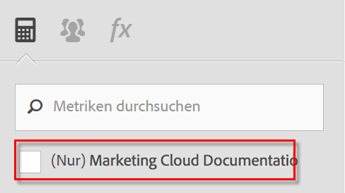

# Häufig gestellte Fragen

Diese Änderungen an der Funktionsweise von berechneten Metriken in [!DNL Analytics] können sich auf Ihre Arbeit auswirken.

[Wie greife ich auf den Generator für berechnete Metriken zu?](/help/components/c-calcmetrics/cm-transition.md#section_D9AE9A0ACF824BACB5D05F0C2F7E9CA1)

[Wie greife ich auf den Manager für berechnete Metriken zu?](/help/components/c-calcmetrics/cm-transition.md#section_DD0BD13E9EC940268EBE8BC88241A152)

[Warum werden so viele berechnete Metriken mit demselben Namen angezeigt?](/help/components/c-calcmetrics/cm-transition.md#section_E15C5B6CCC58498CAEC3FBDA8988F0A1)

[Was ist mit meinen globalen berechneten Metriken passiert?](/help/components/c-calcmetrics/cm-transition.md#section_7351D4C7361F4ABAA1B43F8E89AAD211)

[Was ist mit globalen berechneten Metriken passiert, die über Anmeldeunternehmen hinweg freigegeben wurden?](/help/components/c-calcmetrics/cm-transition.md#section_59E5CD948ED643AE9AD3D2E4277647F8)

[Was ist mit berechneten Metriken mit der Classification Numerisch oder Numerisch2 passiert?](/help/components/c-calcmetrics/cm-transition.md#section_71AFE6C4A7CD4AA19AB3A9D3C41D115B)

[Was ist mit Lebensdauermetriken passiert?](/help/components/c-calcmetrics/cm-transition.md#section_AEDB02EF24584DAD8731BED9DDCE4F48)

[Was muss ich über berechnete Metriken basierend auf Metriken für tägliche/wöchentliche/monatliche/vierteljährliche/jährliche Unique Visitor wissen?](/help/components/c-calcmetrics/cm-transition.md#section_E9A77EBB41CE4881B196CC1C282B2DF3)

[Was passiert mit berechneten Metriken, die mit den alten Report Suite-API-Methoden erstellt oder verwaltet wurden?](/help/components/c-calcmetrics/cm-transition.md#section_13ED1BAD02634674BDAEB479B060A4B6)

[Unterstützt „Aktuelle Daten“ alle Typen an berechneten Metriken?](/help/components/c-calcmetrics/cm-transition.md#section_1DAA718BB8DB4413BAF8AD4B4FAAFFA2)

[Was bedeutet „Kein Name angegeben“ im Zusammenhang mit migrierten berechneten Metriken?](/help/components/c-calcmetrics/cm-transition.md#section_C90CBB72A67644F38D583301981F8D03)

[Was passiert mit den berechneten Metriken eines Benutzers, wenn dieser Benutzer gelöscht wird?](/help/components/c-calcmetrics/cm-transition.md#section_42ED4C15830540879C4A161423690E5A)

[Warum werden „unbekannte“ berechnete Metriken angezeigt, die nicht für andere Report Suites „gültigׅ“ sind, obwohl sie erstellt und auf diese Report Suites angewendet werden können?](/help/components/c-calcmetrics/cm-transition.md#section_6772818EFDED46E9B7095D64C3B77211)

[Warum wurden Änderungen an meinen alten berechneten Metriken nicht gespeichert?](/help/components/c-calcmetrics/cm-transition.md#section_81CDEFCA1FD542579AF183DA1494EAF0)

[Warum werden meine berechneten Metriken nicht im Marketing-Kanal-Bericht angezeigt?](/help/components/c-calcmetrics/cm-transition.md#section_FC350359A775433AB5F43C7CAB304D62)

[Warum enthalten einige der berechneten Metriken Formeln ohne die Klammern, die ich hinzugefügt habe?](/help/components/c-calcmetrics/cm-transition.md#section_AC0D1E9714AD487F9A1C73359F518B5E)

[(Nur Ad Hoc Analysis) Werden berechnete Metriken mit eingebetteten oder Inline-Segmentdefinitionen weiterhin unterstützt?](/help/components/c-calcmetrics/cm-transition.md#section_B25C924A282F49388AB604E3D826F44C)

[(Nur Report Builder) Warum sind berechnete Metriken aus meinen Anforderungen verschwunden?](/help/components/c-calcmetrics/cm-transition.md#section_DA4792FE5D7945218CD5E6328DE08E82)

[Wie werden Gesamtwerte für berechnete Metriken ermittelt?](/help/components/c-calcmetrics/cm-transition.md#section_57BA3A299C7948ABB82B0392A9B0F33E)

## Wie greife ich auf den Generator für berechnete Metriken zu? {#section_D9AE9A0ACF824BACB5D05F0C2F7E9CA1}

* Klicken Sie oben im Manager für berechnete Metriken auf **[!UICONTROL + Hinzufügen]** oder
* Klicken Sie in einem beliebigen Analytics-Bericht auf das Metriksymbol  auf der linken Seite des Berichts, um die Metrikleiste anzuzeigen. Klicken Sie dann auf **[!UICONTROL Hinzufügen]**.

## Wie greife ich auf den Manager für berechnete Metriken zu? {#section_DD0BD13E9EC940268EBE8BC88241A152}

* Wechseln Sie in der linken Navigation zu **[!UICONTROL Analytics]** > **[!UICONTROL Komponenten]**. Klicken Sie anschließend auf **[!UICONTROL Berechnete Metriken]**.

* Klicken Sie in einem beliebigen [!DNL Analytics]-Bericht auf das Metriksymbol  auf der linken Seite des Berichts, um die Metrikleiste anzuzeigen. Klicken Sie anschließend auf **[!UICONTROL Verwalten]**.

## Warum werden so viele berechnete Metriken mit demselben Namen angezeigt? {#section_E15C5B6CCC58498CAEC3FBDA8988F0A1}

(Bisher hatten globale berechnete Metriken keinen spezifischen Administrator als Inhaber und waren für alle Benutzer dieser Report Suite sichtbar. Die Metriken waren nach Report Suite eingeteilt. Wenn eine Metrik in einer Report Suite denselben Namen wie eine Metrik in einer anderen Report Suite hatte, wurde sie den Benutzern einfach als dieselbe Metrik angezeigt, wenn diese die Report Suite änderten.)

Jetzt werden Metriken nicht mehr nach Report Suites eingeteilt. Wenn eine Metrik in einer Report Suite denselben Namen wie eine Metrik in einer anderen Report Suite hat, sind beide Metriken im Generator für berechnete Metriken und in der Metrikauswahl sichtbar und können als doppelte Metriken angezeigt werden, obwohl sie möglicherweise nicht dieselbe Definition aufweisen.

Berechnete Metriken, die denselben Namen aufweisen (aber in unterschiedlichen Report Suites erstellt wurden), werden nur angezeigt, wenn Sie das Kontrollkästchen (Nur `<report suite>`) wie hier gezeigt deaktivieren:

**Zu ergreifende Maßnahme**

Sie sollten berechnete Metriken mit ähnlichen Namen und Definitionen konsolidieren. Gehen Sie dabei aber vorsichtig vor. Sie können die Report Suite auf eine berechnete Metrik im Manager für berechnete Metriken prüfen, um die Original-Report Suite zu verifizieren. Sie sollten auch die Definitionen von Metriken prüfen, wenn sie potenzielle Duplikate löschen, um sicherzustellen, dass Sie Metriken korrekt konsolidieren.

>[!NOTE]
>
>Auch wenn berechnete Metriken nicht mehr an eine spezielle Report Suite gebunden sind und in jeder Report Suite verwendet werden können, die für das Anmeldeunternehmen sichtbar ist, wird die Report Suite, unter der die berechnete Metrik erstellt oder zuletzt gespeichert wurde, weiterhin im Manager für berechnete Metriken angezeigt.

>[!NOTE]
>
>Selbst wenn eine berechnete Metrik gelöscht wird, funktionieren alle Lesezeichen oder Dashboard-Berichte, die diese Metrik referenzieren, weiterhin.

## Was ist mit meinen globalen berechneten Metriken passiert? {#section_7351D4C7361F4ABAA1B43F8E89AAD211}

Bisher konnte ein Administrator berechnete Metriken (als „globale berechnete Metriken“ oder „berechnete Report Suite-Metriken“ bezeichnet) in einer Report Suite über Admin Tools erstellen.

Der Inhaber von globalen berechneten Metriken ist jetzt der erste Administrator in der Administratorenliste des Anmeldeunternehmens. Sie werden standardmäßig für „Alle“ freigegeben. Dieses Muster folgt demselben Freigabemodell und denselben Migrationsplänen wie Segmente.

**Zu ergreifende Maßnahme**

Keine. Der neue Administrator sollte beim Ändern oder Löschen dieser berechneten Metriken allerdings mit Vorsicht vorgehen, da diese möglicherweise in Lesezeichenberichten und Dashboards verwendet werden.

>[!NOTE]
>
>Selbst wenn eine berechnete Metrik gelöscht wird, funktionieren alle Lesezeichen oder Dashboard-Berichte, die diese Metrik referenzieren, weiterhin.

## Was ist mit globalen berechneten Metriken passiert, die über Anmeldeunternehmen hinweg freigegeben wurden? {#section_59E5CD948ED643AE9AD3D2E4277647F8}

Bisher konnte ein Administrator berechnete Metriken (als „globale berechnete Metriken“ oder „berechnete Report Suite-Metriken“ bezeichnet) in einer Report Suite über Admin Tools erstellen. Diese Metriken konnten dann über Anmeldeunternehmen hinweg „freigegeben“ werden, indem die Report Suite mehreren Anmeldeunternehmen hinzugefügt wurde.)

Globale berechnete Metriken können nun nicht mehr über Anmeldeunternehmen hinweg freigegeben werden. Sie sind nicht mehr an eine bestimmte Report Suite gebunden, sondern stattdessen an ein bestimmtes Anmeldeunternehmen. Berechnete Metriken, die über Anmeldeunternehmen hinweg freigegeben waren

* werden in alle Anmeldeunternehmen mit Zugriff auf diese Report Suite migriert;
* werden standardmäßig für alle freigegeben;
* werden zu von allen anderen Anmeldeunternehmen unabhängigen Kopien.

>[!NOTE]
>
>Wenn die berechnete Metrik in einem Lesezeichen, Dashboard, Warnhinweis oder terminierten Bericht verwendet wurde, wirkt sich die Bearbeitung der neuen Kopie NICHT auf die alte beibehaltene berechnete Metrik aus.

## Was ist mit berechneten Metriken mit der Classification Numerisch oder Numerisch2 passiert? {#section_71AFE6C4A7CD4AA19AB3A9D3C41D115B}

(Zuvor waren berechnete Metriken mit der Classification „Numerisch“ oder „Numerisch 2“ nur in [!UICONTROL Reports &amp; Analytics], [!UICONTROL Report Builder] und den APIs sichtbar.)

Jetzt sind berechnete Metriken mit der Classification „Numerisch“ oder „Numerisch 2“ weiterhin in [!UICONTROL Reports &amp; Analytics], [!UICONTROL Report Builder] und den APIs sichtbar. Sie werden allerdings in keinem Bericht mit einem angewendeten Segment unterstützt.

Darüber hinaus werden berechnete Metriken mit der Classification „Numerisch“ oder „Numerisch 2“ in den folgenden Komponenten nicht unterstützt: [!UICONTROL Ad Hoc Analysis], [!UICONTROL Analysis Workspace], [!UICONTROL Echtzeitberichte], [!UICONTROL Anomalieerkennung] und [!UICONTROL Beitragsanalyse]. Wenn Sie eine berechnete Metrik mit der Classification Numerisch oder Numerisch2 erstellen oder bearbeiten, wird eine Kompatibilitätswarnung angezeigt, dass die berechnete Metrik mit bestimmten Produktbereichen nicht kompatibel ist.

**Zu ergreifende Maßnahme**

Erstellen Sie keine berechnete Metrik mit der Classification Numerisch oder Numerisch2, wenn die Metrik mit einem Segment oder mit einer der nicht kompatiblen Komponenten verwenden werden soll.

## Was ist mit Lebensdauermetriken passiert? {#section_AEDB02EF24584DAD8731BED9DDCE4F48}

Lebensdauermetriken werden nicht mehr unterstützt und sind nicht mehr in der Benutzeroberfläche von [!UICONTROL Reports &amp; Analytics] oder einer anderen Benutzeroberfläche sichtbar. Sie können nicht von der Berichts-API abgefragt werden.

Alle Lesezeichen, Dashboards, terminierten Berichte oder Warnhinweise mit einer Lebensdauermetrik werden weiterhin ohne diese Metrik ausgeführt, solange noch mindestens eine andere gültige Metrik im Bericht enthalten ist. Wenn die einzige Metrik im Lesezeichen, Dashboard, terminierten Bericht oder Warnhinweis eine Lebensdauermetrik ist, wird der Bericht nicht mehr ausgeführt.

## Was muss ich über berechnete Metriken basierend auf Metriken für tägliche/wöchentliche/monatliche/vierteljährliche/jährliche Unique Visitor wissen? {#section_E9A77EBB41CE4881B196CC1C282B2DF3}

Berechnete Metriken, die auf Unique Visitor-Metriken basieren, sind in den folgenden [!DNL Analytics]-Komponenten sichtbar: [!UICONTROL Reports &amp; Analytics], [!UICONTROL Report Builder] und Reporting-API.

In den folgenden Komponenten werden diese Metriken allerdings nicht unterstützt: [!UICONTROL Segmente], [!UICONTROL Analysis Workspace], [!UICONTROL Echtzeit]-Berichte, [!UICONTROL Anomalieerkennung] und [!UICONTROL Beitragsanalyse]. Wenn Sie eine berechnete Metrik erstellen oder bearbeiten, die auf Unique Visitors-Metriken basiert, wird eine Kompatibilitätswarnung angezeigt, dass die Metrik mit bestimmten Produktbereichen nicht kompatibel ist.

Sie verwenden eine Basis-Unique Visitor-Metrik in einem Bericht mit einem Segment. Sie können berechnete Metriken, die auf Unique Visitor-Metriken basieren, zwar erstellen, aber diese berechneten Metriken können nicht auf Berichte mit Segmenten angewendet werden. Außerdem können keine Segmente in diese berechneten Metriken eingebettet werden.

## Was passiert mit berechneten Metriken, die mit den alten Report Suite-API-Methoden erstellt oder verwaltet wurden? {#section_13ED1BAD02634674BDAEB479B060A4B6}

Das Speichern einer berechneten Metrik mit der API-Methode ReportSuite.SaveCalculatedMetrics (1.3 oder 1.4) war zuvor mit dem Erstellen oder Aktualisieren einer berechneten Metrik in der Admin Console identisch. Dasselbe galt für ReportSuite.DeleteCalculatedMetrics. Außerdem war die Liste der berechneten Metriken, die in der Admin Console oder beim Aufruf von ReportSuite.GetCalculatedMetrics angezeigt wurde, identisch.

Nun werden berechnete Metriken mit den ReportSuite CalculatedMetrics-API-Methoden (1.3 oder 1.4) weiterhin mit dem alten Speicher gespeichert, gelöscht und abgerufen. Vorhandene berechnete Metriken werden migriert und im neuen Generator für berechnete Metriken angezeigt. **Neue berechnete Metriken, die mit den API-Methoden erstellt werden, sind nur in der API sichtbar. Sie können weiterhin in der Berichterstellungs-API verwendet werden.**

**Zu ergreifende Maßnahme**

Wenn Sie sowohl die API als auch den Generator für berechnete Metriken verwenden müssen, sollten Sie die ReportSuite CalculatedMetrics-API-Methoden nicht mehr verwenden und stattdessen die neuen CalculatedMetrics-API-Methoden (Get, Save, Delete und GetFunctions) nutzen.

## Unterstützt „Aktuelle Daten“ alle Typen an berechneten Metriken? {#section_1DAA718BB8DB4413BAF8AD4B4FAAFFA2}

Berechnete Metriken mit Segmenten oder statistischen Funktionen werden von „Aktuelle Daten“ nicht unterstützt. Lediglich einfache mathematische Funktionen wie Addition, Löschung, Multiplikation, Division und Negierung (-x) werden unterstützt.

## Was bedeutet „Kein Name angegeben“ im Zusammenhang mit migrierten berechneten Metriken? {#section_C90CBB72A67644F38D583301981F8D03}

„Kein Name angegeben“ bedeutet, dass kein Metrikname mit dieser migrierten Metrik verknüpft ist (lediglich eine Formel ohne einen beschreibenden Namen).

## Was passiert mit den berechneten Metriken eines Benutzers, wenn dieser Benutzer gelöscht wird? {#section_42ED4C15830540879C4A161423690E5A}

Alle von diesem Benutzer erstellten berechneten Metriken werden ebenfalls gelöscht. Gelöschte berechnete Metriken funktionieren aber weiterhin innerhalb von gespeicherten Lesezeichen, Dashboards oder terminierten Berichten.

## Warum werden „unbekannte“ berechnete Metriken angezeigt, die nicht für andere Report Suites „gültigׅ“ sind, obwohl sie erstellt und auf diese Report Suites angewendet werden können? {#section_6772818EFDED46E9B7095D64C3B77211}

In der Benutzeroberfläche wird „Unbekannt“ angezeigt, wenn die berechnete Metrik Basismetriken oder Dimensionen enthält, die nicht für die gewählte Report Suite vorhanden sind.

## Warum wurden Änderungen an meinen alten berechneten Metriken nicht gespeichert? {#section_81CDEFCA1FD542579AF183DA1494EAF0}

Dazu kann es aufgrund der Zeit für die Migration in die neue Datenbank für berechnete Metriken kommen (vom 15. Juni 2015 bis zum 18. Juni 2015).

**Zu ergreifende Maßnahme**

Sie müssen die Änderungen an den alten Metriken erneut vornehmen.

## Warum werden meine berechneten Metriken nicht im Marketing-Kanal-Bericht angezeigt? {#section_FC350359A775433AB5F43C7CAB304D62}

(Bisher wurden alle berechneten Metriken in der Metrikauswahl in Marketingkanalberichten mit der Option „Erstkontakt“ und „Letztkontakt“ aufgeführt.)

Jetzt sind nur die berechneten Metriken in der Metrikauswahl in Marketingkanalberichten verfügbar, deren Zuordnungstyp im Generator für berechnete Metriken spezifisch auf „Erstkontakt“ oder „Letztkontakt“ gesetzt wurde. Beachten Sie, dass alle berechneten Metriken, die bereits auf Marketingkanalberichte angewendet wurden, weiterhin angewendet werden und wie bisher funktionieren. Um eine berechnete Metrik für Marketingkanäle zu erstellen, klicken Sie im Metrikgenerator auf das Konfigurationssymbol und wählen Sie entweder „Erstkontakt“ oder „Letztkontakt“ als Zuordnungstyp. Denken Sie daran, dass die berechnete Metrik dadurch ausschließlich mit Marketing-Kanal-Berichten kompatibel ist und in keinen anderen Berichten verwendet werden kann.

## Warum enthalten einige der berechneten Metriken Formeln ohne die Klammern, die ich hinzugefügt habe? {#section_AC0D1E9714AD487F9A1C73359F518B5E}

Bei der Migration hat Adobe überflüssige Klammern aus einigen Formeln entfernt. Dabei wurden nur Klammern entfernt, die keinen Einfluss auf die Berechnung der Metrik haben. Die Daten werden dadurch nicht geändert, es wird lediglich die Formel vereinfacht.

## (Nur Ad Hoc Analysis) Werden berechnete Metriken mit eingebetteten oder Inline-Segmentdefinitionen weiterhin unterstützt? {#section_B25C924A282F49388AB604E3D826F44C}

In Ad Hoc Analysis erstellte berechnete Metriken konnten bisher Inline-Segmentdefinitionen enthalten. Dies ist nun nicht mehr möglich.

**Zu ergreifende Maßnahme**

Sie müssen das Segment explizit speichern. Vorhandene berechnete Metriken mit Inline-Segmentdefinitionen werden weiterhin ordnungsgemäß ausgeführt und können in Ad Hoc Analysis angezeigt werden. Sie können allerdings nicht gespeichert werden, ohne das Segment explizit zu speichern.

## (Nur Report Builder) Warum sind berechnete Metriken aus meinen Anforderungen verschwunden? {#section_DA4792FE5D7945218CD5E6328DE08E82}

Wenn die Anforderung in Version 5.2 erstellt wurde und berechnete Metriken enthält, sind diese Metriken nicht in Version 5.1 (oder früheren Versionen) sichtbar. Dies liegt daran, dass berechnete Metriken nun globale IDs (nicht Report Suite-spezifische IDs) verwenden.

**Zu ergreifende Maßnahme**

Sie müssen ein Upgrade auf Version 5.2 vornehmen, um diese Metriken sehen zu können.

## Wie werden Gesamtwerte für berechnete Metriken ermittelt? {#section_57BA3A299C7948ABB82B0392A9B0F33E}

Wenn in [!UICONTROL Reports &amp; Analytics] ein Gesamtwert für berechnete Metriken unter [!UICONTROL Reports &amp; Analytics] angezeigt wird, wurde lediglich die Formel auf die entsprechenden Gesamtwerte angewendet. Beispiel: Der Gesamtwert für die berechnete Metrik „Bestellungen/Besuch“ wird ermittelt, indem die Gesamtbestellungen durch die Gesamtbesuche dividiert werden. In einigen Fällen ist jedoch der Gesamtwert für eine berechnete Metrik nicht nur die Summe der Einzelposten, sondern ein Gesamtwert für die Site.

Beispiel 1: Besucher nach Suchbegriff: Ein einzelner Besucher hat ggf. nach mehreren Begriffen gesucht. In diesem Fall entspricht also die Gesamtanzahl der Besucher nicht dem Gesamtwert der Einzelposten.

Beispiel 2: Seitenansichten zu Produkten: Im Warenkorb können sich mehrere Produkte befinden, daher ergeben sich mehrere Seitenansichten für den Warenkorb. Weitere Informationen zum Vergleich der Summe von Einzelposten mit Berichtsgesamtwerten finden Sie in [diesem Artikel der Wissensdatenbank](https://helpx.adobe.com/de/analytics/kb/sum-line-items-different-from-total.html).
