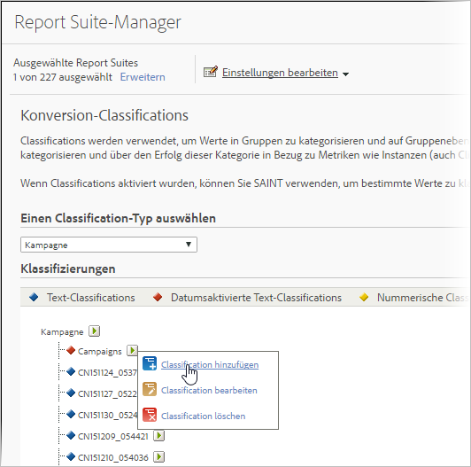

# Informationen über Klassifizierungen

Eine Klassifizierung ist eine Methode, mit der Sie Analytics-Variablendaten in Kategorien aufgliedern und diese Daten auf unterschiedliche Weise darstellen, sobald Sie einen Bericht erzeugen.

Videoüberblick über [Analytics-Classifications](https://video.tv.adobe.com/v/16853/?captions=ger).

**[!UICONTROL Admin]** > **[!UICONTROL Report Suites]** > **[!UICONTROL Einstellungen bearbeiten]** > *`<Traffic or Conversion>`*

Beim Klassifizieren bilden Sie eine Beziehung zwischen der Variablen und den Metadaten, die mit dieser Variable zusammenhängen. Classifications kommen am häufigsten in Kampagnen zum Einsatz. Die mit Variablen (eVars, Props und Ereignisse) erfassten Daten lassen sich durch Anwenden von Metadaten zusammenfassen.

Nach der Classification kann jeder Bericht, den Sie mithilfe der Schlüsselvariable erstellen können, auch mithilfe der zugeordneten Attribute erstellt werden. Sie können beispielsweise [!UICONTROL Produkt-IDs] mit zusätzlichen Produktattributen wie Produktname, Farbe, Größe, Beschreibung und SKU klassifizieren. Durch die Erweiterung der Reports &amp; Analysen-Daten um zusätzliche Attribute werden tiefergehende und komplexere Berichte möglich.

>[!IMPORTANT]
>
>Die Möglichkeit, die Classifications „Numerisch 2“ und „Datumsaktiviert“ zu importieren, wurde aus der Codebasis entfernt. Diese Änderung wird mit der Wartungsversion vom Juni 2019 wirksam. Wenn die Importdatei die Spalte „Numerisch“ oder „Datumsaktiviert“ enthält, werden diese Zellen still ignoriert, und alle anderen Daten in dieser Datei werden normal importiert. Vorhandene Classifications können weiterhin über den Standard-Classification-Workflow exportiert werden und sind weiterhin in Berichten verfügbar.

>[!NOTE]
>
>Nach der Analytics-Wartungsversion vom 10. Mai 2018 schränkte Adobe die Funktion für datumsaktivierte und numerische Classifications ein. Diese Classification-Typen wurden aus den Admin- und Classification Importer-Schnittstellen entfernt. Es können keine neuen datumsaktivierten und Numerisch-Classifications hinzugefügt werden. Vorhandene Classifications können weiterhin über den Standard-Classification-Arbeitsablauf verwaltet (hochgeladen, gelöscht) werden und stehen auch noch für die Berichterstellung zur Verfügung.

Nach dem Erstellen der Klassifizierungen können Sie die neuen Datenattribute im gesamten Adobe Analytics nutzen.

**Beispiel zu Trackingcodes**

Angenommen, Sie möchten die Kampagnen nicht nur nach dem Trackingcode betrachten, sondern die Kampagnenergebnisse sollen nach Suchmaschinen, Keywords und Kampagnenkanälen angezeigt werden. In diesem Fall muss nicht jeweils eine Konversionsvariable festgelegt werden. Stattdessen können Sie drei Classifications der Kampagnenvariable für Suchmaschine, Keyword und Kampagnenkanal anlegen. Mit dieser Strategie werden die Erfolgsereignisse der Website ohne zusätzliches Tagging nach allen vier Variablen dargestellt.

Die Reports &amp; Analysen Funktion beinhaltet vordefinierte Classifications für die Trackingcode-Variable, mit der Classification-Basierte Berichte namens „Kreative Elemente“ und „Kampagnen“ erstellt werden können. Für alle anderen Konversion- und Traffic-Variablen müssen Sie die Classifications manuell konfigurieren.

Weitere Informationen finden Sie unter [Traffic-Classifications](/help/admin/admin/c-traffic-variables/traffic-classifications.md) und [Konversion-Classifications](https://docs.adobe.com/content/help/de-DE/analytics/admin/admin-tools/conversion-variables/conversion-classifications.html).

In der folgenden Tabelle werden die verschiedenen verfügbaren Classification-Typen und die Variablentypen, die sie unterstützen, beschrieben. Beachten Sie die Informationen unter [Allgemeine Dateistruktur](/help/components/c-classifications2/c-classifications-importer/c-saint-data-files.md) vor dem Hochladen von Datendateien.

<table id="table_279728C28D9C40EE832ACC9F211B5F17"> 
 <thead> 
  <tr> 
   <th colname="col1" class="entry"> 
TYP 
 </th> 
   <th colname="col2" class="entry"> 
VERFÜGBARKEIT 
 </th> 
   <th colname="col3" class="entry"> 
BESCHREIBUNG 
 </th> 
  </tr> 
 </thead>
 <tbody> 
  <tr> 
   <td colname="col1"> 
  Text 
 </td> 
   <td colname="col2"> 
Konversion- und Traffic-Variablen 
 </td> 
   <td colname="col3"> 
Text-Classifications definieren eine Kategorie, mit der Sie unterschiedliche Daten zu Berichtzwecken gruppieren können. 
 
Wenn Sie beispielsweise Hemden verkaufen, möchten Sie möglicherweise den Hemdenverkauf (Konversionen) nach Farbe, Größe und Stil kategorisieren, um Berichte zu erstellen, in denen die Hemdenverkäufe nach diesen Kategorien organisiert sind. 
 </td> 
  </tr> 
  <tr> 
   <td colname="col1"> 
  Datumsaktivierter Text 
 
Hinweis: Seit der Analytics-Wartungsversion vom 10. Mai 2018 schränkt Adobe die Funktion für datumsaktivierte Klassifizierungen ein. Diese Classification-Typen wurden aus den Admin- und Classification Importer-Schnittstellen entfernt. Es können keine neuen datumsaktivierten Klassifizierungen hinzugefügt werden. Vorhandene Classifications können weiterhin über den Standard-Classification-Arbeitsablauf verwaltet (hochgeladen, gelöscht) werden und stehen auch noch für die Berichterstellung zur Verfügung. 
 </td> 
   <td colname="col2"> 
Konversionsvariablen 
 </td> 
   <td colname="col3"> 
Mit einer datumsaktivierten Text-Classification können Sie einer Text-Classification Datumsbereiche zuweisen. Dies wird üblicherweise bei Kampagnen-Classifications gemacht, damit Sie die Vorteile der Gantt-Diagrammansicht im Kampagnen bericht nutzen können. 
 
Sie können die Datumsangaben der Kampagne in die Datendatei aufnehmen, mit der die Classification-Daten bestückt werden. 
 
Reports &amp; Analytics sammelt Kampagnen-Trackingcodes selbst dann, wenn das Enddatum der Kampagne bereits erreicht wurde. Die nach Ende der Kampagne gesammelten Daten werden jedoch nicht der Kampagne zugeordnet. 
 </td> 
  </tr> 
  <tr> 
   <td colname="col1"> 
  Numerisch 
Hinweis: Seit der Analytics-Wartungsversion vom 10. Mai 2018 schränkt Adobe die Funktion für numerische Klassifizierungen ein. Diese Classification-Typen wurden aus den Admin- und Classification Importer-Schnittstellen entfernt. Es können keine neuen numerischen Klassifizierungen hinzugefügt werden. Vorhandene Classifications können weiterhin über den Standard-Classification-Arbeitsablauf verwaltet (hochgeladen, gelöscht) werden und stehen auch noch für die Berichterstellung zur Verfügung. 
 
 </td> 
   <td colname="col2"> 
Konversionsvariablen 
 </td> 
   <td colname="col3"> 
Mit numerischen Classifications können Sie feste numerische Werte auf Konversions berichte anwenden. Diese Classifications werden als Metriken in Berichten angezeigt. 
 
Bei der Erwägung, ob eine numerische Classification hinzugefügt werden soll, muss der numerische Wert fest eingestellt sein und darf sich im Laufe der Zeit nicht verändern. 
 </td> 
  </tr> 
 </tbody> 
</table>

