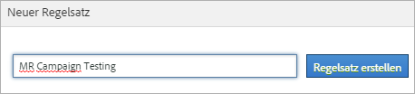
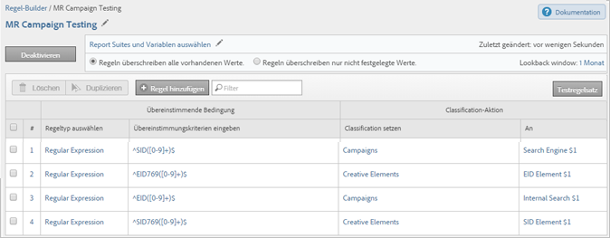

# Classification-Regelsätze

Ein Regelsatz ist eine Gruppe von Classification-Regeln für eine bestimmte Variable. Auf den Regelsatz wird eine Variable angewendet. Sollen mehrere Regelsätze für eine einzelne Variable erstellt werden, so müssen Sie jeden Regelsatz auf mehrere Report Suites anwenden.

## Classification rule sets {#concept_CD3D510F5070486584F3BB535AE41524}

Ein Regelsatz ist eine Gruppe von Classification-Regeln für eine bestimmte Variable. Auf den Regelsatz wird eine Variable angewendet. Sollen mehrere Regelsätze für eine einzelne Variable erstellt werden, so müssen Sie jeden Regelsatz auf mehrere Report Suites anwenden.

## Classification Rule Builder-Seite {#section_C60B0888C76D49C596EF19F11808B718}

**[!UICONTROL Analytics]** &gt; **[!UICONTROL Admin]** &gt; **[!UICONTROL Classification Rule Builder]**

Die Seite [!UICONTROL Classifications Rule Builder] bietet die nachfolgenden Felder und Optionen.

<table id="table_A5D92409969747E39E041216A5AA32CD"> 
 <thead> 
  <tr> 
   <th colname="col1" class="entry"> Element </th> 
   <th colname="col2" class="entry"> Beschreibung </th> 
  </tr> 
 </thead>
 <tbody> 
  <tr> 
   <td colname="col1"> 
<a href="../../../components/c-classifications2/crb/classification-rule-set.md#task_86F216DFD2534FA181E64ABDF306782B" format="dita" scope="local"> Regelsatz hinzufügen</a> 
 </td> 
   <td colname="col2"> 
Erstellt einen Regelsatz. 
 </td> 
  </tr> 
  <tr> 
   <td colname="col1"> 
Regeln 
 </td> 
   <td colname="col2"> Zeigt die Anzahl der Regeln im Regelsatz an. </td> 
  </tr> 
  <tr> 
   <td colname="col1"> 
Status 
 </td> 
   <td colname="col2"> Zeigt den Aktivitätsstatus des Regelsatzes an, beispielsweise „Entwurf“ oder „Aktiv“. Aktive Regeln werden täglich verarbeitet, wobei die zu untersuchenden Classification-Daten in der Regel einen Monat zurückgehen. Die Regeln suchen automatisch nach neuen Werten und laden die Classifications hoch. </td> 
  </tr> 
  <tr> 
   <td colname="col1"> 
Zuletzt geändert 
 </td> 
   <td colname="col2"> Gibt den Zeitpunkt an, zu dem der Regelsatz bearbeitet wurde. </td> 
  </tr> 
  <tr> 
   <td colname="col1"> 
Duplizieren 
 </td> 
   <td colname="col2"> Dupliziert (kopiert) einen Regelsatz, so dass Sie diesen Regelsatz auf eine andere Variable anwenden können (oder auch auf dieselbe Variable in einer anderen Report Suite). </td> 
  </tr> 
 </tbody> 
</table>

## Create a Classification Rule Set {#task_86F216DFD2534FA181E64ABDF306782B}

<!-- 

t_classification_rule_set.xml

 -->

Benennen Sie den Classification-Regelsatz, wenden Sie die Variable an und legen Sie die Einstellungen für Überschreiben fest.

1. (Prerequisite) Define the classification structure in **[!UICONTROL Admin]** &gt; **[!UICONTROL Report Suites]**.

   (Informationen zum Hinzufügen von Classifications finden Sie unter [Classifications](https://marketing.adobe.com/resources/help/en_US/reference/index.html?f=classifications) in der Admin Tools-Hilfe.)

   Variablen werden erst im Bereich [!UICONTROL Neuer Regelsatz] angezeigt, nachdem mindestens eine Classification für diese Variable definiert wurde.

   You can create classifications on a variable in **[!UICONTROL Admin]** &gt; **[!UICONTROL Report Suites]** &gt; **[!UICONTROL Traffic]** &gt; **[!UICONTROL Traffic Classifications]** (or **[!UICONTROL Conversion]** &gt; **[!UICONTROL Conversion Classifications]**). Wählen Sie dann die Variable aus und klicken Sie auf **[!UICONTROL Classification hinzufügen]**.

1. To create the rule set, click **[!UICONTROL Admin]** &gt; **[!UICONTROL Classification Rule Builder]** &gt; **[!UICONTROL Add Rule Set]**.

   

1. Name the rule set, then click **[!UICONTROL Create Rule Set]**.
1. Wählen Sie den zu bearbeitenden Regelsatz aus.

   

1. Click **[!UICONTROL Select Report Suites and Variables]**.

   Die Report Suite und die Variablenliste werden mit allen klassifizierten Variablen ausgefüllt, die in allen Report Suites Ihres angemeldeten Unternehmens verfügbar sind. Eine Variable in einer Report Suite kann nur zu jeweils einem einzigen Regelsatz gehören.

   Siehe *`Variable`* in den Definitionen für die Seite [Classification Rule Builder](../../../components/c-classifications2/crb/classification-rule-definitions.md#section_4D1A70A607C9419EB2116A5174EACB72) für weitere Informationen.
1. Specify the report suites and variables to use, then click **[!UICONTROL Save]**.
1. Continue by [adding classification rules](../../../components/c-classifications2/crb/classification-rule-set.md#task_86F216DFD2534FA181E64ABDF306782B) to the rule set.
