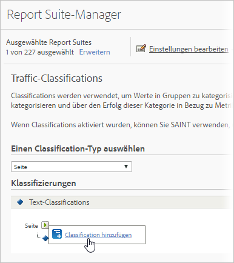

# Traffic-Classifications

Mit Traffic-Classifications können Sie Traffic-Variablen (Eigenschaften) klassifizieren. Traffic-Classifications können nur Text-Classifications nutzen.

## Traffic classifications {#concept_028079B29A9C412AA68910A87E11176F}

Mit Traffic-Classifications können Sie Traffic-Variablen (Eigenschaften) klassifizieren. Traffic-Classifications können nur Text-Classifications nutzen.

Auf der Seite „Traffic-Classifications“ können Sie Classifications für ausgewählte Report Suites erstellen. Nach der Classification kann jeder Bericht, den Sie mithilfe der wichtigen Daten erstellen können, auch mithilfe der zugeordneten Attribute erstellt werden.

Nach der Aktivierung der Classifications verwenden Sie den [Classifications Importer](../../components/c-classifications2/c-classifications-importer/c-working-with-saint.md#concept_08ED8C7A86C64E7DA5DE3044BB94B2EA), um bestimmte Werte der entsprechenden Classification zuzuweisen.

## Add a Traffic Classification {#task_4DB49CCB1D764483907BC33A5CEB7315}

<!-- 

t_classification_add_traffic.xml

 -->

Schritte, die beschreiben, wie Classifications für bestimmte Report Suites hinzugefügt oder bearbeitet werden.

1. Click **[!UICONTROL Admin]** &gt; **[!UICONTROL Report Suites]** in the Suite header.
1. Wählen Sie eine Report Suite aus.
1.  Wählen Sie im Feld **„Einen Klassifizierungstyp auswählen“** die Variable aus, für die Sie eine Klassifizierung hinzufügen möchten.
1. Click **[!UICONTROL Edit Settings]** &gt; **[!UICONTROL Traffic]** &gt; **[!UICONTROL Traffic Classifications]**.

   

1. Mouse over the **[!UICONTROL Edit Classification]** icon, then select **[!UICONTROL Add Classification]** or **[!UICONTROL Edit Classification]**.
1. In the **[!UICONTROL Text Classification]** dialog box, configure the classification as desired:

   **[!UICONTROL Name:]** Geben Sie den Classification-Namen ein.

   **[!UICONTROL Beschreibung:]** Geben Sie eine ausführlichere Beschreibung an.
1. Klicken Sie auf **[!UICONTROL Speichern]**.
