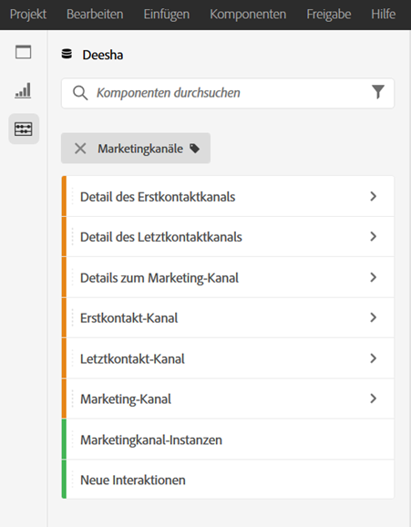
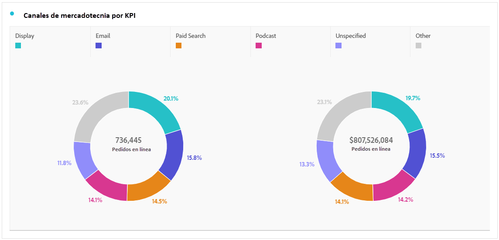
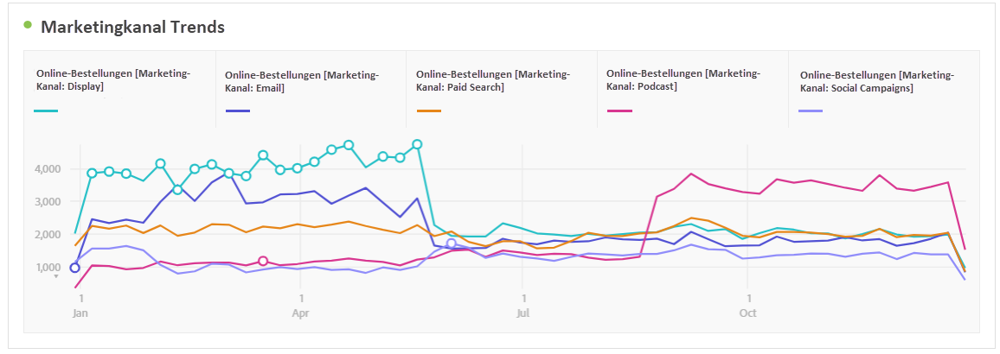
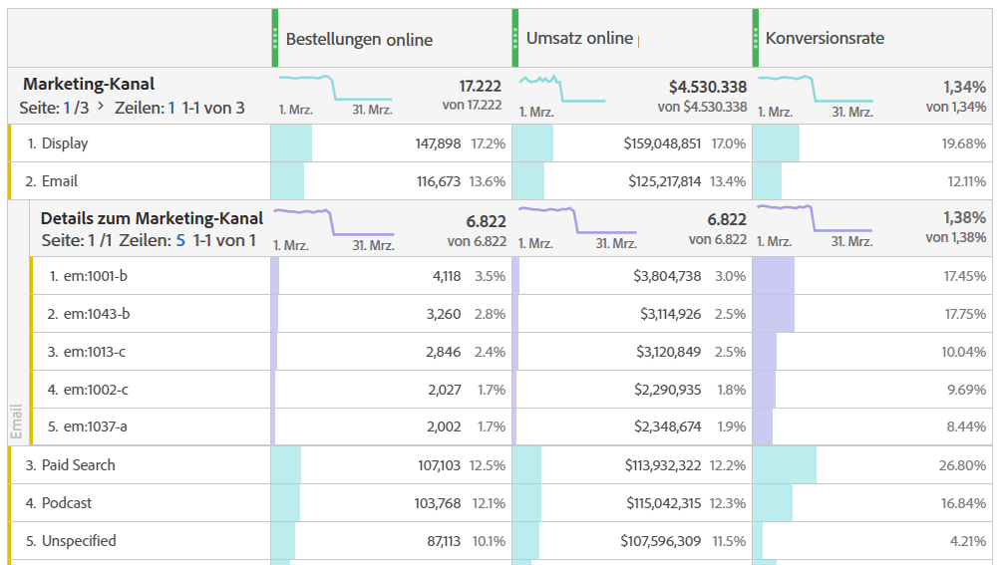
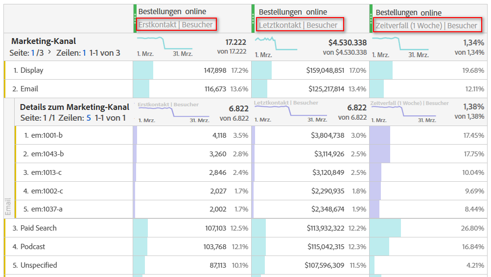
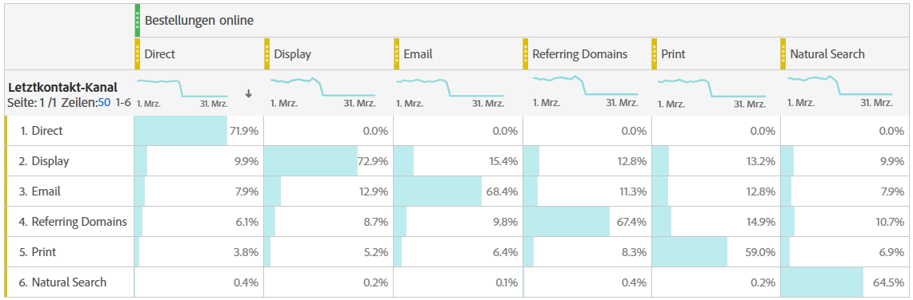

# Analysieren von Marketing-Kanälen

Sie möchten wahrscheinlich wissen, welcher Ihrer Marketing-Kanäle der effektivste ist und bei wem, damit Sie Ihre Bemühungen gezielter ausrichten und eine bessere Rendite aus Ihrem Marketing-Budget erzielen können. Die Dimensionen und Metriken der Marketing-Kanäle in Workspace sind eines der Tools in Adobe Analytics, mit dem Sie den Einfluss verschiedener Kanäle auf Ihre Bestellungen, Umsätze usw. verfolgen. und nützliche Einblicke in die Kanäle gewinnen können. Hier sind die Dimensionen und Metriken, die Sie in Bezug auf Marketing-Kanäle verwenden können:

| Dimension/Metrik | Definition |
|---|---|
| Marketing-Kanal | Dies ist die empfohlene Dimension für Marketing-Kanäle. Attribution IQ-Modelle können zur Laufzeit darauf angewendet werden. Diese Dimension verhält sich identisch mit den Dimensionen des Letztkontakt-Kanals, ist jedoch anders gekennzeichnet, um Verwirrung bei der Verwendung mit einem anderen Attributionsmodell zu vermeiden. |
| Letztkontakt-Kanal | Veraltete Dimension mit vorab angewendetem und unveränderlichem Letztkontakt-Attributionsmodell. |
| Erstkontakt-Kanal | Veraltete Dimension mit vorab angewendetem und unveränderlichem Erstkontakt-Attributionsmodell. |
| Marketing-Kanalinstanzen | Diese Metrik misst, wie oft ein Marketing-Kanal in einer Bildanforderung definiert wurde, einschließlich standardmäßiger Seitenansichten und benutzerspezifischer Link-Aufrufe. Enthält keine persistenten Werte. |
| Neue Interaktionen | Diese Metrik ähnelt Instanzen, wird jedoch nur inkrementiert, wenn in einer Bildanforderung ein Erstkontakt-Marketing-Kanal definiert wird. |

## Basisanalyse

Diese Freiform-Tabelle zeigt die Metriken „Online-Bestellungen“, „Online-Umsatz“ und „Konversionsrate“ für jeden Marketing-Kanal an:

Hier sehen Sie die Online-Bestellungen und den Online-Umsatz der einzelnen Marketing-Kanäle in einem Ringdiagramm:

Dieses Liniendiagramm zeigt die Trends bei Online-Bestellungen für verschiedene Kanäle im Zeitverlauf:

## Erweiterte Analyse

„Details des Marketing-Kanals“ taucht tiefer in die einzelnen Kanal ein, um Ihnen bestimmte Kampagnen, Platzierungen usw. zu zeigen. Sie können jeden Marketing-Kanal in Details unterteilen:

## Anwenden von Attributionsmodellen

Sie können [Attribution IQ](https://docs.adobe.com/content/help/de-DE/analytics/analyze/analysis-workspace/panels/attribution.html) verwenden, um verschiedene Attributionsmodelle sofort anzuwenden:

Beachten Sie, dass dieselbe Metrik (Online-Bestellungen) unterschiedliche Ergebnisse generiert, wenn Sie verschiedene Attributionsmodelle anwenden.

## Tab-übergreifende Marketing-Analyse

Die veralteten Firstkontakt- und Letztkontakt-Kanäle bieten einen hilfreichen Einblick in die Kanalinteraktionen:

In diesem Video erfahren Sie mehr über tabulatorübergreifende Marketing-Analyse: [Verwendung von tabulatorübergreifender Analyse zur Überprüfung der grundlegenden Marketingzuordnung in Analysis Workspace](https://docs.adobe.com/content/help/en/analytics-learn/tutorials/analysis-workspace/attribution-iq/using-cross-tab-analysis-to-explore-basic-marketing-attribution-in-analysis-workspace.html).
