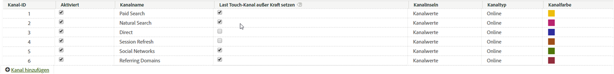

# Marketing-Kanäle verwalten

Fügen Sie im Marketing-Kanal-Manager Marketingkanäle hinzu oder aktivieren Sie sie. Für Report Suites ohne Marketingkanäle können Sie mit einem automatischen Setup mehrere Kanäle und deren Regeln erstellen. Sie können die vordefinierten Kanäle an Ihren Bedarf anpassen oder neue erstellen (bis insgesamt 25).

Der Zusatz von Kanälen in der [!UICONTROL Marketingkanal]-Seite erfolgt separat von der Regelerstellung in der Seite der [Marketingkanal-Verarbeitungsregeln](/help/components/c-marketing-channels/c-rules.md). Bei der Regelerstellung verbinden Sie Regeln mit Kanälen.

Beachten Sie bei der Erstellung von Kanälen die folgenden Richtlinien:

* Richten Sie in der Vorbereitung eine Liste aller Kanäle ein, so dass alle Besucherzugriffe in die richtigen Kanäle eingeordnet werden.
* Schließen Sie Kanäle für die Trefferkategorien [Intern](/help/components/c-marketing-channels/c-rules.md) und [Direkt](/help/components/c-marketing-channels/c-rules.md) ein.
* Schließen Sie einen Kanal „Sonstige Kampagnen“ ein, der nach den bezahlten Kanälen und vor den kostenlosen Kanälen platziert wird.

## Voraussetzungen {#prereqs}

* Richten Sie den Zugriff auf die Marketing-Kanal-Dimensionen ein.

   Siehe [Berechtigungen für Marketing-Kanäle](/help/components/c-marketing-channels/c-channel-report-access.md).

## Hinzufügen von Marketingkanälen {#add-mktg-channels}

Fügen Sie im Marketingkanal-Manager Marketingkanäle hinzu.

>[!NOTE]
>
>Ein Kanal kann nicht gelöscht werden. Wenn Sie einen Kanal nicht verwenden möchten, können Sie ihn deaktivieren oder umbenennen oder ihn zur späteren Verwendung aufbewahren.

1. Klicken Sie auf **[!UICONTROL Analytics]** > **[!UICONTROL Admin]** > **[!UICONTROL Report Suites]**.
1. Wählen Sie im [!UICONTROL Report Suite Manager] die Report Suite aus.

   Wenn Sie mehrere Report Suites auswählen, wählen Sie eine Vorlage aus, die die Einstellungen aus der Vorlage in die jeweiligen Report Suites kopiert.

   Siehe [Übernehmen von Report Suite-Vorlageneinstellungen für mehrere Report Suites](/help/components/c-marketing-channels/c-getting-started-mchannel.md).

1. Klicken Sie auf **[!UICONTROL Einstellungen bearbeiten]** > **[!UICONTROL Marketingkanäle]** > **[!UICONTROL Marketingkanal-Manager]**.

   Wenn in Ihrer Report Suite keine Kanäle definiert wurden, wird die Seite [Automatisches Setup](/help/components/c-marketing-channels/c-getting-started-mchannel.md) angezeigt.

1. Klicken Sie auf der Seite [!UICONTROL Marketingkanal-Manager] auf **[!UICONTROL Kanal hinzufügen]**.

   Diese Option steht nicht zur Verfügung, wenn 25 Kanäle definiert wurden.

1. Klicken Sie auf **[!UICONTROL Speichern]**.
1. Klicken Sie zur Regelkonfiguration für den Kanal auf **[!UICONTROL Marketing-Kanal-Verarbeitungsregeln]**.

   Weitere Informationen finden Sie unter [Einrichten von Marketing-Kanal-Verarbeitungsregeln](/help/components/c-marketing-channels/c-rules.md).

## Anwenden der Kanaleinstellungen {#mktg-channel-mgr}

Es gibt verschiedene Einstellungen, die für jeden Kanal auf der Seite [!UICONTROL Marketing-Kanal-Manager] angewendet werden können.

| Feld | Definition |
|--- |--- |
| Aktiviert | Aktiviert oder deaktiviert den Marketingkanal. |
| Kanalname | Benutzerfreundlicher Name des Marketingkanals. |
| Last Touch-Kanal außer Kraft setzen | Ermöglicht Ihnen, je nach Bedarf einen vorhandenen, beständigen Last Touch-Kanal durch den gewählten Kanal außer Kraft zu setzen. Wenn Sie diese Option auswählen, könnte jeder beliebige Kanal (einschließlich Direkt und Intern) einen vorhandenen Last Touch-Kanal außer Kraft setzen. Dies führt dazu, dass Konversionen den falschen Kanälen gutgeschrieben werden. Diese Option kann beispielsweise sicherstellen, dass dem direkten Kanal keine Konversionen gutgeschrieben werden, wenn der Benutzer zuvor über den Kanal Kostenlose Suche angeworben wurde. |
| Kanalinseln | Ermöglicht die Unterteilung des Kanals nach diesem Wert. Sie können mögliche Kanalunterteilungen (Sub-Kanäle) bei der Erstellung von [Marketing-Kanalklassifizierungen](/help/components/c-marketing-channels/classifictions-mchannel.md) hinzufügen. |
| Typ | Zeigt an, wie der Benutzer zu Ihrer Site gelangt ist. Sie können „Online“ oder „Offline“ auswählen. Online-Kanäle lassen sich z. B. für Besucher einsetzen, die über eine Suchmaschine oder E-Mail-Kampagne zu Ihrer Site gelangten. Offline-Kanäle gelten beispielsweise für Besucher, die Ihre Site durch Anzeigen in Zeitungen oder Zeitschriften fanden. Offline-Kanäle beinhalten in der Regel Daten, die über Berichterstellungs-Data Sources importiert wurden. Siehe [Data Sources](https://docs.adobe.com/content/help/de-DE/analytics/import/data-sources/datasrc-home.html). Weitere Informationen finden Sie unter [Hinzufügen von Offline-Daten](/help/components/c-marketing-channels/c-getting-started-mchannel.md). |
| Farbe | Nur Reports &amp; Analytics: Die mit diesem Marketing-Kanal verknüpfte Farbe. Die Farbe stellt den Kanal im Marketing-Kanalbericht dar. |

### Überschreiben von Best Practices

Es empfiehlt sich, die Option zum Außerkraftsetzen des Letztkontakts für die Kanäle „Direkt“ und „Intern“ zu deaktivieren, damit sie keine Gutschriften von anderen persistenten Letztkontakt-Kanälen (oder voneinander) erhalten.

## Definieren von Kanalregeln

Bevor Kanäle und ihre Daten im Bericht angezeigt werden, müssen Sie die Kanäle und die zur Datenverarbeitung erforderlichen Regeln einrichten. Sie können auch angeben, wie lange der [Besucherinteraktionszeitraum](/help/components/c-marketing-channels/visitor-engagement.md) dauern soll.

Adobe stellt während eines [automatischen Setups](/help/components/c-marketing-channels/c-getting-started-mchannel.md) mehrere vordefinierte Kanäle zur Verfügung, die Sie nach Ihren Bedürfnissen bearbeiten können. Darüber hinaus können Sie dieses Setup ändern und benutzerdefinierte Regeln innerhalb der [Verarbeitungsregeln für Marketing-Kanäle](/help/components/c-marketing-channels/c-rules.md) definieren.

>[!NOTE]
>
>Adobe empfiehlt, dass Sie Ihren Bericht in einer Report Suite einrichten, die Sie zu Testzwecken als Vorlage verwenden können. Verwenden Sie die Vorlage, um Kanal- und Regelsätze global auf eine oder mehrere Produktions-Report Suites anzuwenden.
>
>Siehe [Übernehmen von Report Suite-Vorlageneinstellungen für mehrere Report Suites](/help/components/c-marketing-channels/c-getting-started-mchannel.md).
