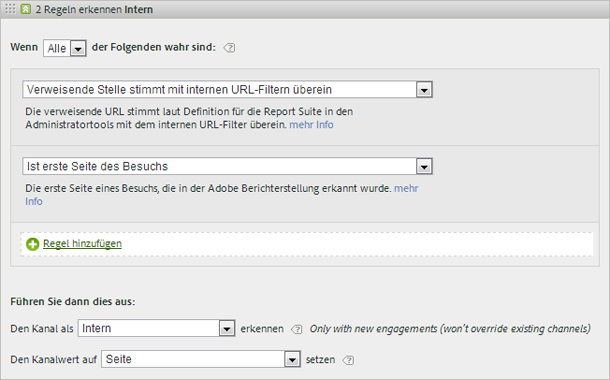

# Häufig gestellte Fragen und Beispiele

Erfahren Sie mehr über Best Practices und Beispiele, wie Sie die verschiedenen Regeln füllen, die Sie ggf. für Ihre Marketingkanäle einrichten.

* [Häufig gestellte Fragen](../../components/c-marketing-channels/c-faq.md#section_E490CEAF0E76422C91D34D8A80A0C573)
* [Kein Kanal identifiziert](../../components/c-marketing-channels/c-faq.md#section_451E42994DA247A8A7B8559C715A5EE7)
* [Gebührenpflichtige Suche](../../components/c-marketing-channels/c-faq.md#section_E934BFE182E4404A93FE07AFEAE64DC1)
* [Kostenlose Suche](../../components/c-marketing-channels/c-faq.md#section_A4C6B8F0360449BE94F0128FF7C71386)
* [Affiliates](../../components/c-marketing-channels/c-faq.md#section_8D142C7074CD4DEC87DF55B691107622)
* [Sozialen Netzwerke](../../components/c-marketing-channels/c-faq.md#section_492B72A3B261479D9C84F631E90C03D8)
* [Anzeigen](../../components/c-marketing-channels/c-faq.md#section_4FD846B89FCE4ECFB7781BD02874A1AB)
* [Intern](../../components/c-marketing-channels/c-faq.md#section_179A2BE5C8E24719A9E5C0DC09AF0947)
* [E-Mail](../../components/c-marketing-channels/c-faq.md#section_4A927BE947B748E39595F4525B7280DE)
* [Direkt](../../components/c-marketing-channels/c-faq.md#section_D0A1DD9D5EEF4A05A1CC81F9EADC074A)

Siehe [Create Marketing Channel Processing Rules](../../components/c-marketing-channels/t-rules.md#task_84EDE9F46F404CB9B7CA0537328CEE08) for definitions of fields displayed on the [!UICONTROL Marketing Channel Processing Rules] page.

## Häufig gestellte Fragen {#section_E490CEAF0E76422C91D34D8A80A0C573}

Die Implementierungen der Marketingkanal-Verarbeitungsregeln unterscheiden sich je nach verwendetem Trackingcode. Die Konfiguration der Regeln, die die gewünschten Ergebnisse erzielen, will gut durchdacht sein, um Probleme zu vermeiden.

**Frage**: Meine Trackingcodes sind alle verschieden, und für meinen Affiliates-Kanal muss ich Tausende dieser Codes angeben.

* Sortieren Sie aus, was Sie nicht brauchen. Wenn Ihre E-Mail- und Affiliates-Kanäle denselben Abfragezeichenfolgenparameter verwenden, aber nur wenig E-Mail-Trackingcodes vorliegen, können Sie die E-Mail-Trackingcodes in einem Regelsatz zu „email“ angeben. Klassifizieren Sie dann alle weiteren Trackingcodes als  *`affiliates.`*
* In your email system, add a query string parameter to all landing page URLs, such as *`&ch=eml`*. Erstellen Sie einen Regelsatz, der erkennt, ob der „ch“-Abfrageparameter gleich *`eml`*. If it does not contain *`eml`*, then it is an affiliate.

**Frage**: Verweisende Domänen enthalten mehr Daten als erwartet.

* Verweisende Domänen stehen in der Liste der Verarbeitungsregeln eventuell zu weit oben. Da die Verarbeitungsreihenfolge wichtig ist, sollte dies einer der letzten bzw. der letzte Regelsatz sein.

**Frage**: Ich habe eine Regel erstellt, die mit einem Abfragezeichenfolgenparameter übereinstimmt aber nicht funktioniert.

* Vergewissern Sie sich, dass der Parametername in den Feldern des Abfragenzeichenfolgenparameters angegeben ist (gewöhnlich ein alphanummerischer Wert). Vergewissern Sie sich zudem, dass der Parameterwert nach dem Operator steht, wie in folgendem Beispiel einer E-Mail-Regel dargestellt.

   

**Frage**: Warum wird der gesamte Last Touch-Traffic einer internen Domäne zugeschrieben?

* Sie verwenden eine Regel, die internem Traffic entspricht. Denken Sie daran, dass diese Regeln für jeden Treffer auf Ihrer Site verarbeitet werden, nicht nur beim Erstbesuch. Wenn Sie eine Regel wie *`Page URL exists`* ohne weitere Kriterien verwenden, wird bei jedem nachfolgenden Treffer auf Ihrer Site eine Übereinstimmung mit dem betreffenden Kanal erfasst, da die Seiten-URL immer vorhanden ist.

**Frage**: Wie behebe ich Traffic-Fehler, die im Bericht als „Kein Kanal identifiziert“ auftreten?

* Regeln werden der Reihe nach verarbeitet. Wenn keine Übereinstimmung mit den spezifischen Kriterien vorliegt, fallen die Treffer in eine von drei Kategorien:

1. Kein Verweis (ein Direktbesuch).

2. Interner Verweis, auf der ersten Seite des Besuchs.

3. Ein Verarbeitungsfehler auf der Seite.

Stellen Sie sicher, dass Sie einen Kanal für diese drei Möglichkeiten haben. Erstellen Sie beispielsweise diese Regeln:

1. **[!UICONTROL Verweisende Stelle]** und **[!UICONTROL Nicht vorhanden]** und **[!UICONTROL Ist erste Seite des Besuchs]**. (Siehe [Direct](../../components/c-marketing-channels/c-faq.md#section_D0A1DD9D5EEF4A05A1CC81F9EADC074A).)

2. **[!UICONTROL Verweisende Stelle stimmt mit internen URL-Filtern]** überein und **[!UICONTROL Ist erste Seite des Besuchs]**. (Siehe [Internal](../../components/c-marketing-channels/c-faq.md#section_179A2BE5C8E24719A9E5C0DC09AF0947).)

3. **[!UICONTROL Verweisende Domäne]** und **[!UICONTROL Vorhanden]** und **[!UICONTROL Verweis stimmt nicht mit internen URL-Filtern überein]**.

Erstellen Sie abschließend einen Kanal *Other*, der die verbleibenden Treffer erfasst, wie in [Kein Kanal identifiziert](../../components/c-marketing-channels/c-faq.md#section_451E42994DA247A8A7B8559C715A5EE7) beschrieben.

## Kein Kanal identifiziert {#section_451E42994DA247A8A7B8559C715A5EE7}

Wenn Ihre Regeln keine Daten erfassen oder die Regeln nicht korrekt konfiguriert sind, zeigt der Bericht die Daten in der Zeile [!UICONTROL Kein Kanal identifiziert] im Bericht an. Sie können beispielsweise am Ende der Verarbeitungsreihenfolge einen Regelsatz mit dem Namen *Sonstige* einrichten, der internen Traffic auch wie folgt identifiziert:

Diese Art von Regel dient als Auffangbehälter, um zu gewährleisten, dass Kanal-Traffic stets externem Traffic entspricht und in der Regel nicht **[!UICONTROL Kein Kanal identifiziert zugeordnet wird]**. Achten Sie darauf, keine Regel zu erstellen, die auch internen Traffic erkennt. Zur Erstellung einer wirksamen Regel „Sonstige“ ist es häufig am sinnvollsten, den Kanalwert auf **[!UICONTROL Verweisende Domäne]** oder **Seiten-URL]zu setzen.[!UICONTROL **

>[!NOTE]
>
>Es kann immer noch Kanal-Traffic geben, der in die Kategorie Kein Kanal identifiziert fallen kann. Beispiel: Ein Besucher öffnet die Site und versieht eine Seite mit einem Lesezeichen. Beim gleichen Besuch kehrt dieser Besucher über das Lesezeichen zur Seite zurück. Da es sich dabei nicht um die erste Seite des Besuchs handelt, wird es weder dem direkten Kanal noch einem anderen Kanal zugeordnet, da keine Referrer-Domäne vorliegt.

## Gebührenpflichtige Suche {#section_E934BFE182E4404A93FE07AFEAE64DC1}

Eine gebührenpflichtige Suche ist ein Begriff oder eine Wortgruppe, die auf Bezahlung von der Suchmaschine in die Suchergebnisse gesetzt wird. Zum Erfüllen der Erkennungsregeln der bezahlten Suche verwendet der Marketingkanal die auf der Seite [!UICONTROL Gebührenpflichtige Sucherkennung] konfigurierten Einstellungen. ( **[!UICONTROL Admin]** &gt; **[!UICONTROL Report Suites]** &gt; **[!UICONTROL Edit Settings]** &gt; **[!UICONTROL General]** &gt; **[!UICONTROL Paid Search Detection]**). Die Ziel-URL stimmt mit der vorhandenen gebührenpflichtigen Sucherkennungsregel für die betreffende Suchmaschine überein.

Die [!UICONTROL gebührenpflichtigen Sucheinstellungen] für die Marketingkanalregel lauten wie folgt:

Weitere Informationen finden Sie unter [Gebührenpflichtige Sucherkennung](https://marketing.adobe.com/resources/help/en_US/reference/paid_search_detection.html) in „Admin“.

## Kostenlose Suche {#section_A4C6B8F0360449BE94F0128FF7C71386}

Eine Suche ist „kostenlos“, wenn Besucher Ihre Website durch eine Websuche finden, bei der die Suchmaschine Ihre Website aufführt, ohne dass Sie dafür Gebühren entrichten müssen. Sie können die von der Suchmaschine für die Verlinkung zu Ihrer Website verwendete Ziel-URL steuern. Diese URL ermöglicht Analytics die Bestimmung, ob eine Suche kostenlos ist.

Es gibt keine Erkennung kostenloser Suchen in Analytics. Das System erkennt nach Einrichtung der gebührenpflichtigen Sucherkennung kostenlose Suchverweise durch Schlussfolgerung, wenn der Verweis nicht aus der gebührenpflichtigen Suche entstand. Bei der kostenlosen Suche stimmt die Ziel-URL nicht mit der vorhandenen gebührenpflichtigen Sucherkennungsregel für die betreffende Suchmaschine überein.

Die kostenlosen Sucheinstellungen für die Marketingkanalregel lauten wie folgt:

Weitere Informationen finden Sie unter [Gebührenpflichtige Sucherkennung](https://marketing.adobe.com/resources/help/en_US/reference/paid_search_detection.html) in „Admin“.

## Affiliates {#section_8D142C7074CD4DEC87DF55B691107622}

Eine Affiliate-Regel identifiziert Besucher, die aus einem bestimmten Satz verweisender Domänen stammen. Listen Sie in der Regel die Affiliate-Domänen, die verfolgt werden sollen, so auf:

## Sozialen Netzwerke {#section_492B72A3B261479D9C84F631E90C03D8}

Diese Regel identifiziert Besucher, die aus sozialen Netzwerken wie Facebook* stammen. Die Einstellungen können wie folgt lauten:

## Anzeigen {#section_4FD846B89FCE4ECFB7781BD02874A1AB}

Diese Regel identifiziert Besucher, die von Banner-Werbung zu Ihnen gelangten. Sie wird durch einen Abfragezeichenfolgenparameter in der Ziel-URL bestimmt, in diesem Fall *`Ad_01`* zu trennen.

## Intern {#section_179A2BE5C8E24719A9E5C0DC09AF0947}

Diese Regel identifiziert Besucher, die über eine verweisende Stelle kamen, die mit den internen URL-Filtern der Report Suite übereinstimmt.

## E-Mail {#section_4A927BE947B748E39595F4525B7280DE}

Geben Sie zur Regeleinrichtung den Abfragezeichenfolgenparameter für Ihre E-Mail-Kampagne ein. In diesem Beispiel lautet der Parameter *`eml`*:

Wenn Ihre Regel Rück-Trackingcodes enthält, geben Sie wie nachfolgend beschrieben einen Wert pro Zeile ein:

## Direkt {#section_D0A1DD9D5EEF4A05A1CC81F9EADC074A}

Diese Regel identifiziert Besucher, die keine verweisende Domäne haben. Dazu zählen Besucher, die direkt zu Ihrer Site gelangten, z. B. über einen Favoriten-Link oder durch Kopieren des Links in den Browser.

