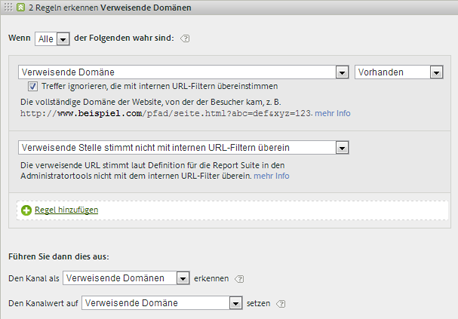

# Häufig gestellte Fragen zu Marketing-Kanälen

Häufig gestellte Fragen zu Marketing-Kanälen.

## Meine Trackingcodes sind alle verschieden, und für meinen Affiliates-Kanal muss ich Tausende dieser Codes angeben.

* Sortieren Sie aus, was Sie nicht brauchen. Wenn Ihre E-Mail- und Affiliates-Kanäle denselben Abfragezeichenfolgenparameter verwenden, aber nur wenig E-Mail-Trackingcodes vorliegen, können Sie die E-Mail-Trackingcodes in einem Regelsatz zu „email“ angeben. Klassifizieren Sie dann alle weiteren Trackingcodes als   *`affiliates.`*
* Fügen Sie allen Landingpage-URLs in Ihrem E-Mail-System einen Abfragezeichenfolgenparameter hinzu, z. B. *`&ch=eml`*. Erstellen Sie einen Regelsatz, der erkennt, ob der „ch“-Abfrageparameter gleich *`eml`*. Wenn er *`eml`* nicht enthält, ist er ein Affiliate.

## Referrer-Domänen enthalten mehr Daten als erwartet.

* Verweisende Domänen stehen in der Liste der Verarbeitungsregeln eventuell zu weit oben. Da die Verarbeitungsreihenfolge wichtig ist, sollte dies einer der letzten bzw. der letzte Regelsatz sein.

## Ich habe eine Regel erstellt, die mit einem Abfragezeichenfolgenparameter übereinstimmt aber nicht funktioniert.

* Vergewissern Sie sich, dass der Parametername in den Feldern des Abfragenzeichenfolgenparameters angegeben ist (gewöhnlich ein alphanummerischer Wert). Vergewissern Sie sich zudem, dass der Parameterwert nach dem Operator steht, wie in folgendem Beispiel einer E-Mail-Regel dargestellt.

   

## Warum wird der gesamte Letztkontakt-Traffic einer internen Domäne zugeschrieben?

* Sie verwenden eine Regel, die internem Traffic entspricht. Denken Sie daran, dass diese Regeln für jeden Treffer auf Ihrer Site verarbeitet werden, nicht nur beim Erstbesuch. Wenn Sie eine Regel wie  *`Page URL exists`* ohne weitere Kriterien verwenden, wird bei jedem nachfolgenden Treffer auf Ihrer Site eine Übereinstimmung mit dem betreffenden Kanal erfasst, da die Seiten-URL immer vorhanden ist.

## Wie behebe ich Traffic-Fehler, die im Bericht als „Kein Kanal identifiziert“ auftreten?

* Regeln werden der Reihe nach verarbeitet. Wenn keine Übereinstimmung mit den spezifischen Kriterien vorliegt, fallen die Treffer in eine von drei Kategorien:

1. Kein Verweis (ein Direktbesuch).

2. Interner Verweis, auf der ersten Seite des Besuchs.

3. Ein Verarbeitungsfehler auf der Seite.

Stellen Sie sicher, dass Sie einen Kanal für diese drei Möglichkeiten haben. Erstellen Sie beispielsweise diese Regeln:

1. **[!UICONTROL Verweisende Stelle]** und **[!UICONTROL Nicht vorhanden]** und **[!UICONTROL Ist erste Seite des Besuchs]**. (Siehe [Direct.](/help/components/c-marketing-channels/c-faq.md))

2. **[!UICONTROL Referrer entspricht internen URL-Filtern]** und **[!UICONTROL Ist erste Seite des Besuchs]**. (Siehe [Internal](/help/components/c-marketing-channels/c-faq.md).)

3. **[!UICONTROL Verweisende Domäne]** und **[!UICONTROL Vorhanden]** und **[!UICONTROL Verweis stimmt nicht mit internen URL-Filtern überein]**.

Erstellen Sie abschließend einen Kanal *Sonstige*, der die verbleibenden Treffer erfasst, wie in [Kein Kanal identifiziert](/help/components/c-marketing-channels/c-faq.md#no-channel-identified) beschrieben.

## Beziehung zwischen Erstkontakt und Letztkontakt

Um die Interaktion zwischen den veralteten Erstkontakt- und Letztkontaktdimensionen zu verstehen und zu bestätigen, dass Überschreibungen erwartungsgemäß funktionieren, können Sie einen Erstkontaktkanalbericht abrufen, der sich auf einen Letztkontaktkanalbericht bezieht, wobei Ihre wichtigste Erfolgsmetrik hinzugefügt wird (siehe Beispiel unten). Das Beispiel zeigt die Interaktion zwischen Erstkontakt- und Letztkontaktkanälen.

Die Schnittmenge, bei der Erstkontakt gleich Letztkontakt ist, ist die Diagonale der Tabelle. Sowohl „Direkt“ als auch „Sitzungsaktualisierung“ erhalten nur dann eine Letztkontakt-Gutschrift, wenn sie auch der Erstkontaktkanal sind, da sie keine Gutschrift von anderen persistenten Kanälen erhalten können (hervorgehobene Zeilen).

## Gründe für „Kein Kanal erkannt“ {#no-channel-identified}

Wenn Ihre Regeln keine Daten erfassen oder die Regeln nicht korrekt konfiguriert sind, zeigt der Bericht die Daten in der Zeile [!UICONTROL Kein Kanal identifiziert] im Bericht an. Sie können beispielsweise am Ende der Verarbeitungsreihenfolge einen Regelsatz mit dem Namen *Sonstige* einrichten, der internen Traffic auch wie folgt identifiziert:

Diese Art von Regel dient als Auffangbehälter, um zu gewährleisten, dass Kanal-Traffic stets externem Traffic entspricht und in der Regel nicht **[!UICONTROL Kein Kanal identifiziert zugeordnet wird]**. Achten Sie darauf, keine Regel zu erstellen, die auch internen Traffic erkennt. Zur Erstellung einer wirksamen Regel „Sonstige“ ist es häufig am sinnvollsten, den Kanalwert auf **[!UICONTROL Verweisende Domäne]** oder **[!UICONTROL Seiten-URL]** zu setzen.

>[!NOTE]
>
>Es kann dennoch vorkommen, dass Kanal-Traffic teilweise in die Kategorie „Kein Kanal identifiziert“ fällt. Beispiel: Ein Besucher öffnet die Site und versieht eine Seite mit einem Lesezeichen. Beim gleichen Besuch kehrt dieser Besucher über das Lesezeichen zur Seite zurück. Da es sich dabei nicht um die erste Seite des Besuchs handelt, wird es weder dem direkten Kanal noch einem anderen Kanal zugeordnet, da keine Referrer-Domäne vorliegt.

## Gründe für „Intern“ (Sitzungsaktualisierung) {#internal}

Eine Letztkontakt-Sitzungsaktualisierung („Intern“) kann nur auftreten, wenn es sich auch um den Erstkontakt handelt. Weitere Informationen finden Sie unter „Beziehung zwischen Erstkontakt und Letztkontakt“ weiter oben. Die folgenden Szenarien erläutern, wie eine Sitzungsaktualisierung ein Erstkontaktkanal sein könnte.

* **Sitzungstimeout**: Ein Besucher ruft die Website auf und lässt die Registerkarte dann in seinem Browser geöffnet, um sie später erneut zu verwenden. Der Interaktionszeitraum des Besuchers läuft ab (oder er löscht seine Cookies freiwillig), und er verwendet die geöffnete Registerkarte, um die Website erneut zu besuchen. Da die verweisende URL eine interne Domäne ist, wird der Besuch als Sitzungsaktualisierung klassifiziert.

* **Nicht alle Seiten der Site werden mit Tags versehen**: Ein Besucher landet auf Seite A, die nicht mit Tags versehen ist, und wechselt dann zu Seite B, die mit Tags versehen ist. Seite A wird als interner Referrer angesehen, und der Besuch wird als Sitzungsaktualisierung klassifiziert.

* **Umleitungen**: Wenn eine Umleitung nicht so eingerichtet ist, dass Referrer-Daten an die neue Landingpage weitergegeben werden, gehen die Referrer-Daten verloren, und die Umleitungsseite (wahrscheinlich eine interne Seite) erscheint als Referrer-Domäne. Der Besuch wird als Sitzungsaktualisierung klassifiziert.

* **Domänenübergreifender Traffic**: Ein Besucher wechselt von einer Domäne, die zu Suite A führt, zu einer zweiten Domäne, die zu Suite B führt wird. Wenn in Suite B die internen URL-Filter die erste Domäne enthalten, wird der Besuch in Suite B als intern aufgezeichnet, da Marketingkanäle ihn als neuen Besuch in der zweiten Suite sehen. Der Besuch wird als Sitzungsaktualisierung klassifiziert.

* **Lange Ladezeiten der Entrypage**: Ein Besucher landet auf Seite A mit viel Inhalt, und der Adobe Analytics-Code befindet sich unten auf der Seite. Bevor der gesamte Inhalt (einschließlich Adobe Analytics-Bildanforderungen) geladen werden kann, klickt der Besucher auf Seite B. Seite B löst ihre Adobe Analytics-Bildanforderung aus. Da die Bildanforderung von Seite A nie geladen wurde, wird die zweite Seite als erster Treffer des Besuchs in Adobe Analytics angezeigt, wobei Seite A als Referrer dient. Der Besuch wird als Sitzungsaktualisierung klassifiziert.

* **Löschen von Cookies auf der Site**: Ein Besucher besucht die Site und löscht seine Cookies während der Sitzung. Die Erstkontakt- und Letztkontakt-Kanäle werden zurückgesetzt, und der Besuch wird als Sitzungsaktualisierung klassifiziert (weil der Referrer intern ist).

Unten finden Sie ein Beispiel, indem „Intern“ (Sitzungsaktualisierung) sowohl als Erstkontakt- als auch als Letztkontakt-Kanal festgelegt wird:

* Tag 1: Der Benutzer gelangt per Anzeige zur Site. Erstkontakt- und Letztkontakt-Kanäle werden auf „Anzeige“ eingestellt.
* Tag 2: Der Benutzer gelangt per natürlicher Suche zur Site. Erstkontakt bleibt „Anzeige“, Letztkontakt wird auf „Natürliche Suche“ eingestellt.
* Tag 35: Der Benutzer war seit 33 Tagen nicht mehr auf der Site und kehrt über die Registerkarte zurück, die er in seinem Browser geöffnet hatte. Bei einem Interaktionsfenster von 30 Tagen wäre das Fenster geschlossen, und die Marketingkanal-Cookies wären abgelaufen. Die Erstkontakt- und Letztkontakt-Kanäle werden zurückgesetzt und auf „Sitzungsaktualisierung“ eingestellt, da der Benutzer von einer internen URL kam.

## Warum bleiben einige Kanäle nach Änderung der Verarbeitungsregeln für Marketing-Kanäle unverändert?

Manchmal sind die Verarbeitungsregeln für Marketing-Kanäle falsch eingerichtet, sodass es notwendig ist, die Verarbeitungsregeln zu ändern. Nach Anwendung der Änderungen können Sie sehen, dass einige Metriken immer noch Daten einem falschen Kanal zuordnen. Es gibt mehrere Punkte zu beachten:

* **Marketing-Kanaldaten werden in Echtzeit erfasst**: Marketing-Kanaldaten werden bei der Datenerfassung verarbeitet und sind zu 100 % permanent. Geänderte Verarbeitungsregeln wirken sich nicht rückwirkend auf die Daten aus.
* **Änderungen der Verarbeitungsregeln wirken sich nicht unmittelbar auf die Erstkontakt-Daten aus**: Beispiel:
   1. Ein Benutzer kommt über Ihren E-Mail-Kanal herein, da sie falsch eingerichtet waren, und verlässt dann Ihre Website.
   2. Am nächsten Tag ändern Sie Ihre E-Mail-Verarbeitungsregel, um sie zu korrigieren.
   3. Dieser Benutzer kommt einige Tage später über die kostenlose Suche zurück und tätigt einen Kauf.
   4. Der E-Mail-Kanal erhält die Erstkontakt-Gutschrift und die kostenlose Suche erhält die Letztkontakt-Gutschrift.

   Auch mehrere Tage nach Änderung der Verarbeitungsregeln können Daten im falschen Erstkontakt-Kanal erfasst werden. Erstkontakt-Daten werden kontinuierlich im falschen Kanal erfasst, bis die Benutzerinteraktion abläuft.

Der beste Weg, um diese Unstimmigkeiten zu beheben, besteht darin, eine oder beide der folgenden Aktionen auszuführen:

* **Alle Besucherinteraktionszeiträume manuell ablaufen lassen**: Mit dieser Einstellung laufen alle Erstkontakt- und Letztkontakt-Kanäle über alle Besucher hinweg sofort ab:
   1. Gehen Sie zu „Admin Tools“ > „Report Suites“.
   2. Bewegen Sie den Mauszeiger über „Einstellungen bearbeiten“> „Marketing-Kanäle“> „Besucherinteraktionsablauf“.
   3. Klicken Sie auf „Alle ablaufen lassen“.
   4. Klicken Sie im Popup-Fenster mit der Warnung auf „OK“, um zu bestätigen, dass Sie verstanden haben, was passieren wird.

* **Ab dem Zeitpunkt, zu dem Sie Ihre Regeln korrigiert haben, nur Letztkontakt-Metriken anzeigen**: Letztkontakt-Metriken folgen immer dem aktuellen Regelsatz. Ab dem Zeitpunkt, zu dem Sie die Verarbeitungsregeln geändert haben, werden die aktuellsten Verarbeitungsregeln angezeigt.
