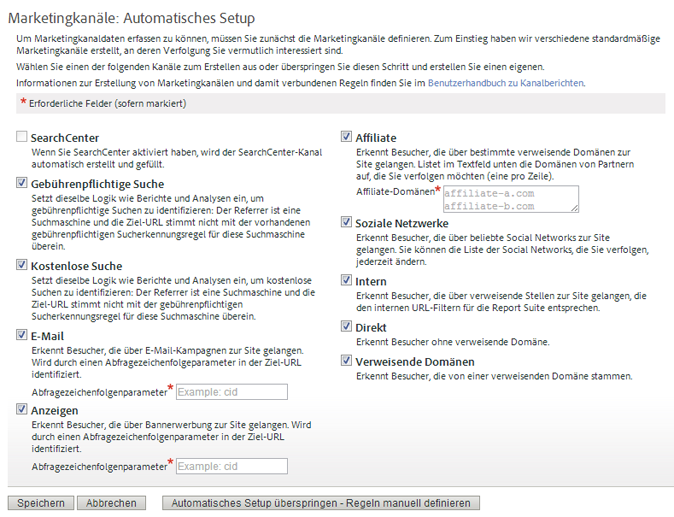

# Erste Schritte mit Marketing-Kanälen

>[!NOTE]
>
>Um die Effektivität von Marketing-Kanälen für Attribution IQ und Customer Journey Analytics zu maximieren, haben wir einige [überarbeitete Best Practices](/help/components/c-marketing-channels/mchannel-best-practices.md) veröffentlicht.

Marketing-Kanäle geben Aufschluss darüber, wie Besucher auf Ihre Site gelangen. Sie können basierend auf den Kanälen, die Sie nachverfolgen möchten, und darauf, wie Sie diese nachverfolgen möchten, eigene Marketingkanal-Verarbeitungsregeln anpassen.

Marketingkanäle kreisen um First- und Last-Touch-Metriken, die Komponenten von standardmäßigen Konversionsmetriken sind.

## Marketing-Kanal-Workflow

 Definieren jedes Kanals auf Grundlage Ihrer Geschäftsanforderungen.

Das Definieren der von Ihnen verwendeten Kanäle ist eine der wichtigsten Komponenten der Marketingkanäle. Das Definieren der Kanäle kann die Zusammenarbeit mehrerer Einzelpersonen in Ihrer Organisation erfordern. Im Folgenden finden Sie einige zu berücksichtigende Fragen:

* Nutzen Sie eine gebührenpflichtige Suche?
* Nutzen Sie E-Mail-Kampagnen? Nutzen Sie mehrere E-Mail-Kampagnen, die Sie getrennt nachverfolgen möchten?
* Haben Sie Affiliates, die den Datenverkehr an Ihre Website weiterleiten? Sind Affiliates vorhanden, die Sie einzeln nachverfolgen möchten?
* Sind externe Kampagnen vorhanden, für die eine getrennte Nachverfolgung vorteilhaft wäre?
* Möchten Sie alle Websites mit sozialen Netzwerken zusammenfassen, oder gibt es soziale Netzwerke, die Sie einzeln nachverfolgen möchten?
* Sind andere Kanäle vorhanden, die möglicherweise die Konversion beeinflussen, die Sie nachverfolgen möchten?

Eine Liste mit empfohlenen Kanälen finden Sie unter  [Häufig gestellte Fragen und Beispiele](/help/components/c-marketing-channels/c-faq.md). Erstellen Sie eine Liste der Kanäle, die Sie nutzen möchten, um die Aktivierung und Definierung beim Erstellen von Kanälen zu vereinfachen.

 Fügen Sie auf der Seite [!UICONTROL Marketing-Kanal-Manager] Marketing-Kanäle hinzu.

Nach der Definition der nachverfolgten Kanäle können Sie sie in **[!UICONTROL Admin]** > **[!UICONTROL Report Suites]** aktivieren.

Wichtige Voraussetzungen und grundlegende Informationen finden Sie unter [Kanäle und Regeln](/help/components/c-marketing-channels/c-channels.md).

Informationen zum Verfahren finden Sie unter [Hinzufügen von Marketing-Kanälen](/help/components/c-marketing-channels/c-channels.md).

>[!NOTE]
>
>Wenn Marketing-Kanäle noch nicht konfiguriert wurden, wird das [automatische Setup](/help/components/c-marketing-channels/c-getting-started-mchannel.md) angezeigt. Dieses Setup stellt mehrere vorkonfigurierte Kanäle bereit, die Sie anpassen können. Adobe empfiehlt, dass Sie diese Regeln als Vorlage verwenden. Wenn Sie jedoch bereits über zuverlässige Kanaldefinitionen verfügen, können Sie das automatische Setup überspringen.

 Konfigurieren oder grenzen Sie die Regeln jedes Kanals auf der Seite [!UICONTROL Marketingkanal-Verarbeitungsregeln] ein.

Konfigurieren Sie nach der Erstellung von Kanälen auf der Seite [!UICONTROL Marketingkanal-Manager] die Regeln, damit Kanäle Daten abrufen können und Berichte dazu erstellen können.

Siehe  [Marketingkanal-Verarbeitungsregeln](/help/components/c-marketing-channels/c-rules.md).

Wenn Kanäle im automatischen Setup erstellt wurden, werden die Regeln in diesen Kanälen definiert. Sie können sie an Ihre Bedürfnisse anpassen.

## Automatische Einrichtung für Marketing-Kanäle {#run-auto-setup}

Der Marketing-Kanal-Bericht bietet zum Einstieg eine einmalige Setup-Seite. Hier finden Sie eine Vielzahl an Marketing-Kanälen, die Sie zur Nachverfolgung nutzen können. Wenn Sie mit der Erstellung von Kanälen und Regeln vertraut sind, können Sie dieses Setup überspringen. Adobe empfiehlt jedoch, dass Sie den Assistent zur Erstellung der Kanäle nutzen. Durch das automatische Setup sehen Sie, wie Regeln erstellt werden. Darüber hinaus haben Sie die Möglichkeit, diese individuell anzupassen. Sie können die vordefinierten Kanäle jederzeit deaktivieren oder löschen.

So führen Sie das automatische Setup für Marketing-Kanäle aus.

1. Klicken Sie auf **[!UICONTROL Analytics]** > **[!UICONTROL Admin]** > **[!UICONTROL Report Suites]**.
1. Wählen Sie im [!UICONTROL Report Suite Manager] eine Report Suite aus.
1. Klicken Sie auf **[!UICONTROL Einstellungen bearbeiten]** > **[!UICONTROL Marketingkanäle]** > **[!UICONTROL Marketingkanal-Manager]**.

   

   >[!NOTE]
   >
   >Die Seite [!UICONTROL Marketing-Kanäle: Automatisches Setup] wird automatisch bei Zugriff auf die Kanalkonfigurationsanwendungen in „Admin Tools“ angezeigt. (Weitere Informationen finden Sie unter [Marketing-Kanal-Manager](/help/components/c-marketing-channels/c-channels.md).) Die Seite wird nicht angezeigt, wenn Ihre Report Suite einen oder mehrere Marketingkanäle enthält. Sie können nur dann erneut auf die Seite zugreifen, wenn Sie eine andere Report Suite ohne Marketingkanäle auswählen.

1. Stellen Sie sicher, dass die gewünschten Kanäle ausgewählt sind.

   Bei Auswahl sind **[!UICONTROL E-Mail]**, **[!UICONTROL Anzeigen]** und **[!UICONTROL Affiliate]** erforderliche Felder.

1. Klicken Sie auf **[!UICONTROL Speichern]**.

## Übernehmen von Report Suite-Vorlageneinstellungen für mehrere Report Suites

So verwenden Sie eine Master-Report Suite als Vorlage, um Ihre Marketingkanalkonfiguration zu testen. Diese Vorlage kann zur Zeitersparnis in einer Massenaktualisierung für eine oder mehrere Produktions-Report Suites übernommen werden. Diese Aufgabe muss separat für Kanäle und Regelsätze erfolgen.

>[!NOTE]
>
>Übernehmen Sie zunächst die Kanäle aus einer Vorlage, bevor Sie Regelsätze einsetzen. Bei diesem Ablauf müssen die Kanäle für alle Report Suites identisch sein.

1. Stellen Sie sicher, dass der Marketingkanalbericht für die gewünschten Report Suites aktiviert wurde. Dieser Schritt wird von Ihrem Kundenbetreuer durchgeführt.
1. Klicken Sie auf **[!UICONTROL Analytics]** > **[!UICONTROL Admin]** > **[!UICONTROL Report Suites]**.
1. Wählen Sie auf der Seite **[!UICONTROL Report Suite Manager]** die Vorlagen-Report Suite sowie eine oder mehrere Ziel-Report Suites aus.
1. Klicken Sie auf **[!UICONTROL Einstellungen bearbeiten]** > **[!UICONTROL Marketingkanäle]** > **[!UICONTROL Marketingkanal-Manager]**.
1. Wählen Sie auf der **[!UICONTROL Master Report Suites]**-Seite die Vorlage der Report Suite aus.
1. Klicken Sie auf **[!UICONTROL Alle speichern]**.
1. Übernehmen von Regeln aus einer Vorlage für mehrere Report Suites:
   1. Kehren Sie zur Seite [!UICONTROL Report Suite Manager] zurück.
   1. Wählen Sie auf der Seite Report Suite-Manager die Vorlagen-Report Suite sowie eine oder mehrere Ziel-Report Suites aus.
   1. Klicken Sie auf **[!UICONTROL Einstellungen bearbeiten]** > **[!UICONTROL Marketingkanäle]** > **[!UICONTROL Marketingkanal-Verarbeitungsregeln]**.
   1. Klicken Sie auf **[!UICONTROL Speichern]**. Wenn die Schaltfläche „Speichern“ deaktiviert ist, aktivieren Sie sie, indem Sie eine der Regeln erweitern.

