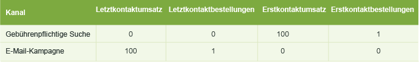
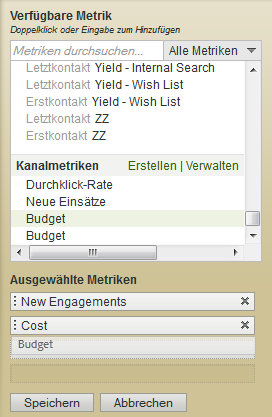

# In Marketingkanalberichten verwendete Metriken

Verwenden von Metriken in Marketingkanalberichten.

## Metrics used in Marketing Channel reports {#topic_F83F5D4C3E144967AD90D956F0E8A999}

Verwenden von Metriken in Marketingkanalberichten.

Fügen Sie Metriken hinzu (oder bearbeiten Sie diese).

Fügen Sie dem Bericht eine Spalte hinzu.

## First and last-touch metrics {#concept_68D9A50204304BA58C1F8013451E7853}

First Touch und Last Touch sind Kanalattribute, mit denen Sie sehen können, wie viele neue Bindungen (oder Metrikdaten wie Produktansichten, Umsatz und Bestellungen) aus der Aktivität eines Besuchers im Kanal resultieren.

When a success event occurs, Analytics looks at the entire visitor's activity and history (back to the [visitor's engagement expiration](../../components/c-marketing-channels/visitor-engagement.md#topic_32ADFDB12D3A4F35843A4545AC97C49F)). Es nimmt den ersten Kanal, durch den der Benutzer gelangte, zur Kenntnis. Gleiches gilt für den aktuellsten Kanal. Es weist dann das Erfolgsereignis jedem entsprechenden Kanal zu.

<!-- 

<note>
  A first-touch value has a rolling expiration based on the frequency of a visitor returning to the site. This first-touch expiration resets whenever a visitor returns to the site. This effects reporting by causing first-touch values to persist longer than you might expect. For example, this can occur if an instance of an first-touch channel was created a year ago. Remove the values on the eVar in the admin console to reset. 
</note>

 -->

**Beispiel**: 

Angenommen, Sie richten zwei Marketing-Kanäle ein: „Gebührenpflichtige Suche“ und „E-Mail-Kampagne“.

Die gebührenpflichtige Suche ist eine Produktwerbung. Sie erweckt das Interesse des Besuchers, der sich dann das Produkt ansieht, aber erzielt kein Konversionsereignis.

Einen Monat später führen Sie eine E-Mail-Kampagne für dasselbe Produkt durch. Daraus ergibt sich ein Kauf im Wert von 100 USD (oder ein anderes, erwünschtes Konversionsereignis).

Das Ergebnis im Marketingkanalbericht kann wie folgt dargestellt werden:

Der gebührenpflichtige Suchkanal erhält als First Touch-Kanal mit Umsatz die Gutschrift von 100 USD, ab einer First Touch-Bestellung. Dem E-Mail-Kampagnenkanal werden als Last Touch-Umsatzkanal die 100 USD gutgeschrieben (dies ist der Kanal, den der Besucher vor Konversion zuletzt aufsuchte) und es erfolgte 1 Last Touch-Bestellung. Der Zweck dieses Berichts ist demnach die Unterschiede in der Verteilung des Umsatzes zwischen First Touch- und Last Touch-Kanälen aufzuzeigen.

Jedes Erfolgsereignis hat genau einen First-Touch- und genau einen Last-Touch-Kanal. Wenn Sie demnach eine angegebene Metrikspalte für ein Erfolgsereignis hinzufügen, entspricht es immer der Summe für denselben Zeitraum. Die Summe entspricht zudem exakt der Gesamtanzahl an Ereignissen im entsprechenden Bericht [!UICONTROL Site-Metriken] &gt; [!UICONTROL Benutzerspezifische Ereignisse]. Nicht-Erfolgsereignis-Metriken wie Besuche und Besucher stimmen nicht 1:1 überein, da mehrere Kanäle beim selben Besuch ausgelöst werden können.

>[!NOTE]
>
>Dieser Bericht verwendet die First Touch- oder Last Touch-Version jeder Metrik. Aus diesem Grund stimmen die Daten eines [!UICONTROL Marketingkanalsberichts] ggf. nicht mit denen anderer Berichte überein.

## Metric definitions {#section_364D003D34D748B79503DFA4DD208EDB}

| Metrik | Definition |
|--- |--- |
| Erstkontaktkanal | Der erste Marketingkanal, durch den die Besucherbindung entstand. Technisch gesehen ist der First Touch-Kanal eine evar mit Originalzuordnung. |
| First-Touch-Besucher | In der Kanalberichterstattung ist ein First-Touch-Besucher ein „Unique Visitor pro Tag“, der aus einem Kanal stammt. Die Besucherinteraktion wird für die Dauer der Interaktion an die Site (was mehrere Besuche umfassen kann) gespeichert. |
| Last-Touch-Kanal | Der Konversionkanal, d. h. der letzte Marketingkanal mit Besucherbindung, der zur Konversion führte. Als First Touch-Kanal kann nur ein Kanal eingestellt werden. Der Last Touch-Kanal kann sich bei jedem Site-Besuch ändern. Jedem Besuch ist ein First Touch- und ein Last Touch-Kanal zugewiesen. Der Wert des First Touch-Kanals verändert sich jedoch bei nachfolgenden Besuchen nicht. |

## Durchklicken {#reference_55E2254F02EF4E7EB0AD2838C948347A}

Ein Clickthrough eine Instanz innerhalb des Last Touch-Kanals. Es handelt sich um eine eVar mit der Zuordnung „Zuletzt verwendet“.

Beispiel: Ein Besucher besucht Ihre Website jeden Tag, wobei jeder Besuch über einen anderen Marketingkanal generiert wird:

* Tag 1: Gebührenpflichtige Suche
* Tag 2: Anzeigen
* Tag 3: Kostenlose Suche
* Tag 4: Anzeigen
* Tag 5: Gebührenpflichtige Suche
* Tag 6: Anzeigen
* Tag 7: Kostenlose Suche

Der First Touch-Kanalbericht würde hier 1 neue Interaktion für „Gebührenpflichtige Suche“ anzeigen. Für jeden anderen Kanal würden 0 neue Interaktionen angezeigt. Der Last Touch-Kanalbericht würde 2 Clickthroughs für „Gebührenpflichtige Suche“ anzeigen, 3 für „Anzeigen“ und 2 für „Kostenlose Suche“.

## Hinzufügen von Metriken zu einem Marketingkanalbericht {#task_D381139E00504666AB2402D553CFEA5B}

Fügen Sie dem Marketingkanalbericht Metriken hinzu. Sie können jeder Berichtsspalte bis zu vier Metriken pro Spalte und so viele Spalten wie gewünscht hinzufügen.

1. Öffnen Sie den [!UICONTROL Marketingkanalbericht].
1. Klicken Sie auf Metrik hinzufügen.

   

1.  Ziehen Sie Metriken aus dem Bereich [!UICONTROL Verfügbare Metrik] in den Bereich [!UICONTROL Ausgewählte Metriken]. 

   

1. Scrollen Sie zur Einrichtung errechneter Metriken zu [!UICONTROL Errechnete Metriken]**und klicken Sie auf[!UICONTROL Erstellen]**.
1. Klicken Sie auf **[!UICONTROL Speichern.]**
