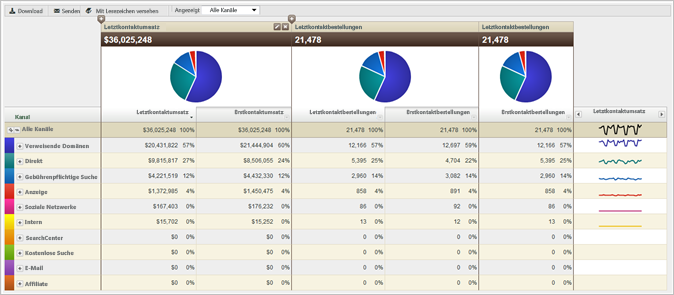

# Informationen zu Marketingkanalberichten

Marketingkanalberichte geben Aufschluss über die Umsätze Ihrer Marketingkanäle. Sie geben einen Überblick über die Zuordnung der First Touch- und Last Touch-Kanäle. Der Bericht informiert über geschäftskritische Standardmetriken wie Umsatz, Bestellungen und Kosten.

Sie können Kanaldefinitionsregeln in „Admin Tools“ definieren. Für die Kanalberichte stehen spezifische APIs zur Verfügung. Zur Ausführung des [!UICONTROL Marketingkanal]berichts werden keine externen Implementierungsänderungen benötigt.

* [Beispielbericht](../../components/c-marketing-channels/c-overview.md#section_64F7FB1326A64B318654BAFE66FA97EC)
* [Verfügbare Berichte](../../components/c-marketing-channels/c-overview.md#section_8A95A56AE24E4F34BBA069361D6354B9)

## Beispielbericht {#section_64F7FB1326A64B318654BAFE66FA97EC}

Kanaldaten werden in Dashboards, APIs, ReportBuilder (für Excel), Ad-hoc-Analysen, Data Warehouse und Datenextraktion unterstützt.

Fügen Sie Metriken hinzu (oder bearbeiten Sie diese).

Fügen Sie dem Bericht eine Spalte hinzu.

## Verfügbare Berichte {#section_8A95A56AE24E4F34BBA069361D6354B9}

Die folgenden [!UICONTROL Marketingkanalberichte] sind in der Experience Cloud verfügbar.

| Bericht | Beschreibung |
|--- |--- |
| Kanalübersicht  | Der Übersichtsbericht bietet eine Zusammenfassung, in der anhand von Kreisdiagrammen und Abbildungen Trends im jeweiligen Zeitraum erkennbar werden. Sie können diesem Bericht First Touch- und Last Touch-Metriken hinzufügen oder errechnete Metriken für den Bericht erstellen. Sie können auch einen Drilldown für den First Touch- und Last Touch-Kanal und für Detailberichte aus der Übersichtstabelle durchführen. Andere Marketingkanalberichte beschreiben Verfahren, mit denen Sie einen tieferen Einblick in die in diesem Bericht zusammengefassten Daten erhalten.  Wenn Sie einen Kanal innerhalb des Berichts erweitern, werden Unterteilungsberichte für die Kanalwerte angezeigt. Kanalwerte sind nicht klassifizierte Werte in den Kanaldetails. |
| First Touch- oder Last Touch-Kanal | Zeigt Metriken an, die Daten zu einem bestimmten First Touch- oder Last Touch-Kanal einblenden. In diesen Berichten können Sie einen Kanal unterteilen und die Details der einzelnen Kanäle anzeigen. |
| First Touch- oder Last Touch-Kanaldetails | Zeigt Details wie Seitennamen und verweisende Stellen an, die aus den Kanalwerten stammen, die Sie beim Konfigurieren von Regeln auf der Option "Den Kanalwert setzen auf" festgelegt haben. Kanaldetailberichte geben Ihnen die Möglichkeit, die Kanaldetailwerte aus dem Übersichtsbericht sorgfältig zu prüfen. |