# Verarbeitungsregeln für Marketing-Kanäle

Die Verarbeitungsregeln für Marketing-Kanäle bestimmen, ob der Besucherzugriff die einem Kanal zugewiesenen Kriterien erfüllt, indem jeder Treffer eines Besuchers auf Ihrer Site verarbeitet wird. Das Regeln werden in der angegebenen Reihenfolge verarbeitet. Sobald eine Regel erfüllt ist, stoppt das System die Verarbeitung der verbleibenden Regeln.

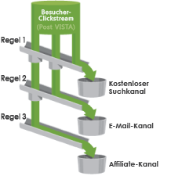

Weitere Hinweise zur Verarbeitung:
* Mit diesen Regeln erfasste Daten sind zu 100 % dauerhaft und nach der Datenerfassung geänderte Regeln sind nicht rückwirkend. Es wird dringend empfohlen, alle Umstände zu prüfen und in Erwägung zu ziehen, bevor [!UICONTROL Marketingkanal-Verarbeitungsregeln] gespeichert werden, um zu verhindern, dass Daten in falschen Kanälen erfasst werden.
* Der Bericht kann bis zu 25 Kanäle gleichzeitig verarbeiten.
* Regeln haben Zugriff auf Variablen, die von VISTA gesetzt wurden, können jedoch nicht auf Daten zugreifen, die von VISTA gelöscht wurden.
* Dasselbe Ereignis kann niemals zwei Marketingkanälen gutgeschrieben werden (wie Käufe oder Klicks). In dieser Hinsicht unterscheiden sich Marketingkanäle von eVars (dasselbe Ereignis kann zwei eVars gutgeschrieben werden).
* Wenn die Abdeckung Ihrer Regeln lückenhaft ist, sehen Sie möglicherweise [Kein Kanal erkannt](/help/components/c-marketing-channels/c-faq.md).

## Voraussetzungen

* Sehen Sie sich die Konzeptinformationen unter [Erste Schritte mit Marketing-Kanälen](/help/components/c-marketing-channels/c-getting-started-mchannel.md) an.
* Erstellen Sie einen oder mehr Kanäle, um Regeln zuweisen zu können. Weitere Informationen finden Sie unter [Hinzufügen von Marketing-Kanälen](/help/components/c-marketing-channels/c-channels.md).

## Einrichten von Marketingkanal-Verarbeitungsregeln

Richten Sie Marketingkanal-Verarbeitungsregeln ein, die bestimmen, ob der Besucherzugriff die dem Kanal zugewiesenen Kriterien erfüllt.

1. Klicken Sie auf **[!UICONTROL Analytics]** > **[!UICONTROL Admin]** > **[!UICONTROL Report Suites]**.
2. Wählen Sie eine Report Suite aus.

   Wenn in Ihrer Report Suite keine Kanäle definiert wurden, wird die Seite [!UICONTROL Marketingkanäle: Automatisches Setup] angezeigt.

   Siehe [Ausführen des automatischen Setups](/help/components/c-marketing-channels/c-getting-started-mchannel.md).

3. Klicken Sie auf **[!UICONTROL Einstellungen bearbeiten]** > **[!UICONTROL Marketingkanäle]** > **[!UICONTROL Marketingkanal-Verarbeitungsregeln]**. Wenn Sie das automatische Setup ausgeführt haben, wurden automatisch ein Kanal- und Regelsatz definiert.

   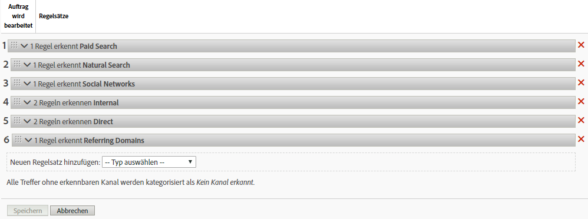

4. Wenn Sie eine neue Regel hinzufügen möchten, wählen Sie aus dem Menü **[!UICONTROL Hinzufügen Neuer Regelsatz]**. Wenn Sie einen Kanal auswählen, erhalten Sie eine Regelvorlage. Wenn Sie &quot;Benutzerdefiniert&quot;auswählen, wird der Beginn aus einer leeren Tonspur angezeigt. Mit beiden Optionen können Sie den Regelsatz nach Bedarf ändern.

   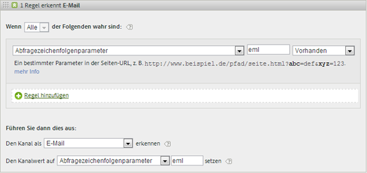

5. Um mit der Erstellung von Regeln fortzufahren, klicken Sie auf **[!UICONTROL Hinzufügen Neue Regelsatz]**.
6. Ziehen Sie die Regeln zur Priorisierung an die gewünschte Position.
7. Klicken Sie auf **[!UICONTROL Speichern]**.

Weiter unten auf dieser Seite finden Sie Empfehlungen für die Reihenfolge der Kanalregeln sowie weitere Definitionsbeispiele.

### Festlegen des Marketing-Kanalwerts

**[!UICONTROL Legen Sie den]** Wert des Kanals fest und definieren Sie die Detail-Dimension des Marketing-Kanals, die für diesen Kanal verfügbar ist. Auf diese Weise können Sie die Dimensionen des Marketing-Kanals unterteilen und detailliertere Informationen zum Kanal anzeigen.

Es wird empfohlen, den Kanalwert auf dieselben Kriterien einzustellen, die zum Definieren des Kanals selbst verwendet wurden. Wenn beispielsweise der Abfragezeichenfolgenparameter zum Definieren des Kanals verwendet wird, legen Sie den Abfragezeichenfolgenparameter ebenfalls als Kanalwert fest.

### Regelkriterien

Diese Referenztabelle definiert die Trefferattribute, die Sie zum Festlegen von Verarbeitungsregeln für Marketing-Kanäle verwenden können.

>[!NOTE]
>
>Jedes von Ihnen definierte Textfeld, z. B. der Zeichenfolgenparameter der Abfrage oder die Listen der Werte, die abgeglichen werden sollen, wird als **Groß-/Kleinschreibung unterschieden**. Wenn Sie beispielsweise eine Regel haben, bei der der Abfrage-Zeichenfolgenparameter cmp = abc123, stimmen alle Versionen von &quot;cmp&quot;und &quot;abc123&quot;mit der Regel überein. Es ist nicht erforderlich, mehrere Groß-/Kleinbuchstaben dieser Werte Liste.

| Begriff | Definition |
|--- |--- |
| Alle | Aktiviert diesen Kanal nur, wenn alle Regeln in der nummerierten Regel „true“ sind. |
| Alle | Aktiviert diesen Kanal, wenn eine der Regeln im Regelsatz „true“ ist. Diese Option steht nur zur Verfügung, wenn mehr als eine Regel in der nummerierten Regel vorhanden ist. |
| AMO-ID | Der primäre Trackingcode, der von den Advertising Cloud- und Advertising Analytics-Integrationen verwendet wird. Wenn eine dieser Integrationen aktiviert ist, kann das Trackingcode-Präfix verwendet werden, um Advertising Cloud-spezifische Kanäle zu identifizieren. Die Verwendung von „AMO-ID“ beginnt mit „AL“ für die Suche, „AC“ für die Anzeige oder „AO“ für Social. Wenn die AMO-ID in Marketing-Kanälen verwendet wird, können die Klick-/Kosten-/Impressionsmetriken dem richtigen Kanal zugeordnet werden (wenn diese nicht konfiguriert sind, gehen diese Metriken zu „Direkt“ oder „Keine“). |
| AMO-EF-ID | Der von Advertising Cloud verwendete sekundäre Trackingcode. Der Hauptzweck dieses Trackingcodes besteht darin, als Schlüssel zum Zurücksenden von Daten an Ad Cloud zu dienen. Sie kann jedoch auch zur Identifizierung von Anzeige-Clickthroughs oder Anzeige-Viewthroughs verwendet werden, wenn Sie diese als zwei separate Marketing-Kanäle betrachten möchten. Dazu können Sie die Marketing-Kanal-Logik so festlegen, dass „AMO EF ID“ für Anzeige-Clickthroughs auf „:d“ oder „AMO EF ID“ für Anzeige-Viewthroughs auf „:i“ endet. Wenn Sie die Anzeige nicht in zwei Kanäle aufteilen möchten, verwenden Sie stattdessen die „AMO-ID“-Dimension. |
| Konversionsvariablen | Setzt sich aus eVars zusammen, die für diese Report Suite aktiviert wurden, und gilt nur, wenn diese Variablen über den Adobe-Code auf der Seite gesetzt wurden.  Siehe Implementierungshandbuch. |
| Vorhanden | Mehrere Auswahlmöglichkeiten sind verfügbar, einschließlich:<ul><li>**Nicht vorhanden**: Gibt an, dass das Trefferattribut nicht in der Anfrage vorhanden ist. Beispiel: Wenn der Benutzer in einer Referrer-Domäne eine URL eingibt oder auf ein Lesezeichen klickt, ist das Attribut für die Referrer-Domäne nicht vorhanden.</li><li>**Ist leer**: Gibt an, dass ein Trefferattribut vorhanden ist. In der Regel handelt es sich dabei um eine eVar oder einen Abfragezeichenfolgenparameter, doch dem Trefferattribut ist kein Wert zugeordnet.</li><li>**Enthält nicht**: Hiermit können Sie beispielsweise angeben, dass eine verweisende Domäne einen bestimmten Wert nicht enthält (anders als bei Auswahl von  „Enthält“.)</li></ul> |
| Den Kanal identifizieren als | Verbindet die Regel mit dem Marketing-Kanal, den Sie der Seite „Marketing-Kanal-Manager“ hinzugefügt haben.  Weitere Informationen finden Sie unter „Hinzufügen von Marketing-Kanälen“. |
| Stimmt mit Erkennungsregeln gebührenpflichtiger Suchvorgänge überein | Eine von Adobe erkannte, gebührenpflichtige Suche. Gebührenpflichtige Suchvorgänge treten ein, wenn Firmen Gebühren an die Suchmaschine zahlen, damit diese deren Site auflistet. Gebührenpflichtige Suchergebnisse tauchen gewöhnlich oben oder rechts von den Suchergebnissen auf. |
| Stimmt mit Erkennungsregeln kostenloser Suchvorgänge überein | Eine von Adobe erkannte, kostenlose Suche. |
| Verweisende Stelle stimmt mit internen URL-Filtern überein | Ein Besuch, dessen Seiten-URL laut der Definition für die Report Suite in „Admin Tools“ mit dem internen URL-Filter übereinstimmt. |
| Verweisende Stelle stimmt nicht mit internen URL-Filtern überein | Die verweisende URL stimmt laut Definition für die Report Suite in „Admin Tools“ nicht mit dem internen URL-Filter überein. Sie können diese Einstellung mit    Seiten-URL und „Existiert“ einsetzen, um eine Sammelregel zu erstellen, sodass keine Besuche im Berichtabschnitt „Kein Kanal identifiziert“ landen. |
| Treffer ignorieren, die mit internen URL-Filtern übereinstimmen | (Für verweisende Stellen) Verfolgt nur Treffer, die von extern verweisenden Stellen stammen. Normalerweise wird diese Option nicht aktiviert, es sei denn, Sie möchten internen Traffic einbeziehen. |
| Ist erste Seite des Besuchs | Die erste Seite eines Besuchs, die in der Adobe Berichterstellung erkannt wurde. |
| Seite | Der Seitenname einer Web-Seite auf Ihrer Site, die unter Verwendung des Adobe Webbeacons mit Tags versehen wurde. Dieser Wert entspricht s.pageName. Beispiele sind `Home Page` und `About Us`. |
| Seitendomäne | Die Domäne der Seite, auf der der Besucher landet, z. B. `products.example.co.uk`. |
| Seitendomäne und Pfad | Die Domäne und der Pfad, z. B. `products.example.co.uk/mens/pants/overview.html`. |
| Stammdomäne der Seite (TLD+1) | Die Stammdomäne der Seite, auf der der Besucher landet, z. B. example.co.uk. |
| Seiten-URL | Die URL einer Webseite auf Ihrer Site. |
| Referrer-Domäne | Die Domäne, von der Ihre Besucher kamen, als sie Ihre Site aufriefen; Referrer können z. B. `abcsite.com` oder `xyzsite.com` sein. |
| Abfragezeichenfolgenparameter | Wenn eine Seiten-URL auf Ihrer Site wie `https://example.com/?page=12345&cat=1` aussieht, dann sind &quot;page&quot;und &quot;cat&quot;beide Abfragen-Zeichenfolgenparameter. (Siehe `https://en.wikipedia.org/wiki/Query_string`.)  Sie können pro Regelsatz nur einen Abfragezeichenfolgenparameter angeben. Verwenden Sie zum Hinzufügen zusätzlicher Abfragezeichenfolgenparameter `ANY` als Ihren Operator und fügen Sie dann der Regel neue Abfragezeichenfolgenparameter hinzu. Zeichenfolgenparameter der Abfrage werden als nicht zwischen Groß- und Kleinschreibung unterschieden. Beispielsweise werden &quot;cat&quot;und &quot;CAT&quot;auf die gleiche Weise bewertet. |
| Referrer | Die Webseite (volle URL), auf der sich Besucher befanden, bevor sie zu Ihrer Site kamen. Die verweisende Stelle befindet sich außerhalb Ihrer definierten Domäne. |
| Verweisende Domäne und Pfad | Eine Verkettung aus verweisender Domäne und URL-Pfad. Beispiele sind: `www.example.com/products/id/12345` oder `ad.example.com/foo` |
| Verweisender Parameter | Abfragezeichenfolgenparameter der verweisenden URL. Wenn Ihre Besucher z. B. von `example.com/?page=12345&cat=1` kommen, sind „page“ und „cat“ die verweisenden Parameter. |
| Verweisende Stammdomäne | Die Stammdomäne der verweisenden Stelle. Die verweisende Stelle befindet sich außerhalb Ihrer definierten Domäne. |
| Suchmaschine | Eine Suchmaschine wie Google oder Yahoo!, über die Besucher zu Ihrer Site gelangten. |
| Suchkeywords | Ein Wort, mit dem in einer Suchmaschine gesucht wird. |
| Suchmaschine + Keywords | Eine Verkettung aus Keyword und Suchmaschine, um die Suchmaschine eindeutig zu kennzeichnen. Wenn Sie z. B. nach dem Begriff „computer“ suchen, werden die Suchmaschine und Keyword wie folgt identifiziert:  `Search Tracking Code = "<search_type>:<search engine>:<search keyword>" where    search_type = "n" or "p", search_engine = "Google", and search_keyword = "computer"`**Hinweis:** „n“ = kostenlos; „p“ = gebührenpflichtig |
| Den Kanalwert setzen auf | Neben der Erkenntnis, welche Marketing-Kanäle einen Besucher zu Ihrer Site führen, ist es auch von Interesse, welche Bannerwerbung, welches Keyword und welche E-Mail-Kampagne in dem Kanal die Gutschrift für die Site-Aktivität des Besuchers erhält. Diese ID ist ein Kanalwert, der mit dem Kanal gespeichert wird. Häufig handelt es sich dabei um eine Kampagnen-ID, die in die Landingpage oder die verweisende URL integriert ist. In anderen Fällen ist es eine Kombination aus Suchmaschine und Keyword oder die verweisende URL, die den Besucher aus einem bestimmten Kanal am genauesten identifiziert. |

## Reihenfolge von Marketing-Kanalregeln und Definitionen {#channel-rules}

Kanalregeln werden in der angegebenen Reihenfolge verarbeitet. Ein empfohlener Ansatz für die Kanalreihenfolge besteht darin, bezahlte oder verwaltete Kanäle zuerst zu platzieren (z. B. Paid Search, natürliche Suche, Display, E-Mail), damit sie Gutschriften erhalten, gefolgt von organischen Kanälen (z. B. direkte, interne, Referrer-Domänen).

Nachfolgend finden Sie die empfohlene Reihenfolge für Kanalregeln und Beispieldefinitionen:

### Paid Search {#paid-search}

Paid Search ist ein Begriff oder eine Wortgruppe, die auf Bezahlung von der Suchmaschine in die Suchergebnisse gesetzt wird. Dieser Kanal wird in der Regel auf der Grundlage von Abfragezeichenfolgenparametern (siehe das Beispiel für einen Anzeige-Kanal) oder Regeln der gebührenpflichtige Sucherkennung definiert. Die Entscheidung hängt von den Details des Marketing-Kanals ab, den Sie aufzeichnen möchten.

#### Erkennung von Paid Search

Zum Erfüllen der Erkennungsregeln von Paid Search verwendet der Marketing-Kanal die auf der Seite [!UICONTROL Gebührenpflichtige Sucherkennung] konfigurierten Einstellungen. (**[!UICONTROL Admin]** > **[!UICONTROL Report Suites]** > **[!UICONTROL Einstellungen bearbeiten]** > **[!UICONTROL Allgemein]** > **[!UICONTROL Gebührenpflichtige Sucherkennung]**). Die Ziel-URL stimmt mit der vorhandenen gebührenpflichtigen Sucherkennungsregel für die betreffende Suchmaschine überein.

Die [!UICONTROL gebührenpflichtigen Sucheinstellungen] für die Marketingkanalregel lauten wie folgt:

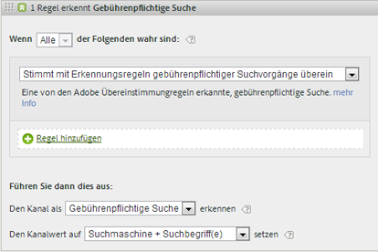

Weitere Informationen finden Sie unter [Gebührenpflichtige Sucherkennung](https://docs.adobe.com/content/help/de-DE/analytics/admin/admin-tools/paid-search-detection/paid-search-detection.html) in „Admin“.

### Kostenlose Suche  {#natural-search}

Bei einer natürlichen Suche finden Besucher Ihre Website durch eine Web-Suche, bei der die Suchmaschine Ihre Website aufführt, ohne dass Sie dafür Gebühren entrichten müssen.

Es gibt keine Erkennung kostenloser Suchen in Analytics. Das System erkennt nach Einrichtung der gebührenpflichtigen Sucherkennung kostenlose Suchverweise durch Schlussfolgerung, wenn der Verweis nicht aus der gebührenpflichtigen Suche entstand. Weitere Informationen finden Sie unter [Paid-Search-Erkennung](https://docs.adobe.com/content/help/en/analytics/admin/admin-tools/paid-search-detection/paid-search-detection.html) in „Admin“.

Die kostenlosen Sucheinstellungen für die Marketing-Kanalregel lauten wie folgt:

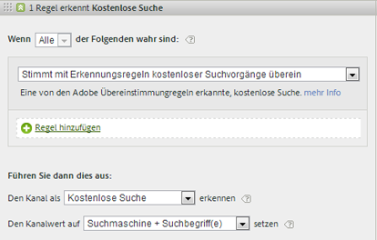

### Anzeigen   {#display}

Diese Regel identifiziert Besucher, die von Banner-Werbung zu Ihnen gelangten. Sie wird durch einen Abfragezeichenfolgenparameter in der Ziel-URL bestimmt, in diesem Fall  *`Ad_01`*. Der Zeichenfolgenparameter der Abfrage und die gesuchten Werte werden ohne Unterscheidung der Groß-/Kleinschreibung ausgewertet.

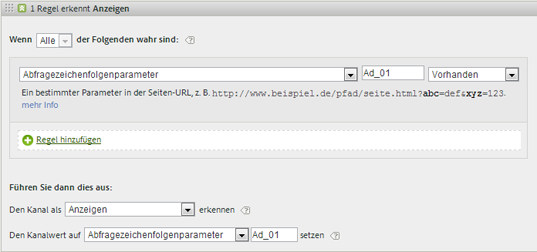

### E-Mail   {#email}

Diese Regel identifiziert Besucher, die von E-Mail-Kampagnen zu Ihnen gelangten. Sie wird durch einen Abfragezeichenfolgenparameter in der Ziel-URL bestimmt, in diesem Fall *`eml`*:

### Affiliates   {#afilliates}

Diese Regel identifiziert Besucher, die aus einem bestimmten Satz von Referrer-Domänen stammen. Führen Sie in der Regel die Affiliate-Domänen, die verfolgt werden sollen, so auf:

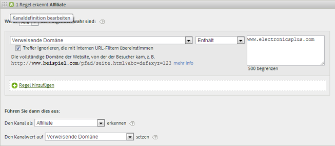

### Andere Kampagnen {#other-campaigns}

Eine Best Practice besteht darin, einen Kanal „Andere Kampagnen“ einzubeziehen, der allen Regeln für gebührenpflichtige Kanäle entspricht. Dieser Kanal dient als Sammelstelle für nicht kategorisierten gebührenpflichtigen Traffic.

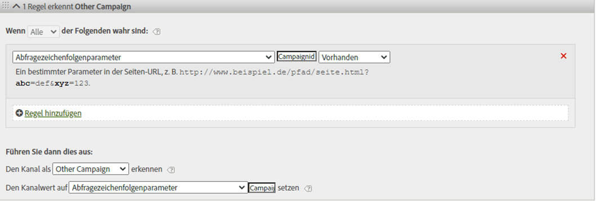

### Soziale Netzwerke   {#social-networks}

Diese Regel identifiziert Besucher, die aus einem sozialen Netzwerk wie Facebook;. Der Kanal wird oft in „Organic Social“ umbenannt. Die Einstellungen können wie folgt lauten:

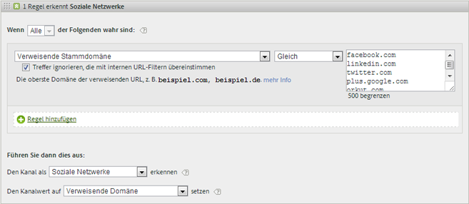

### Kanal „Intern“ (Sitzungsaktualisierung) {#internal}

Diese Regel gilt für Besucher, bei denen die Referrer-URL mit den in der Admin Console eingerichteten internen URL-Filtern übereinstimmt, d. h. der Besucher kam von innerhalb der Site, um seinen Besuch zu beginnen. Der Kanal wird oft in „Sitzungsaktualisierung“ umbenannt.

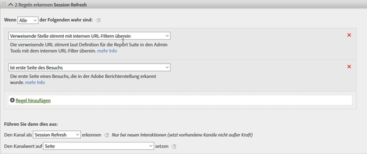

Weitere Informationen zum Auftreten dieses Kanals finden Sie unter [Gründe für „Intern“ (Sitzungsaktualisierung)](https://docs.adobe.com/content/help/de-DE/analytics/components/marketing-channels/c-faq.html#internal).

### Direkt   {#direct}

Diese Regel identifiziert Besucher, die über keine Referrer-Domäne verfügen. Dazu zählen Besucher, die direkt zu Ihrer Site gelangten, z. B. über einen Favoriten-Link oder durch Kopieren des Links in den Browser. Dieser Kanal wird oft in „Direkte Eingabe/Lesezeichen“ umbenannt.

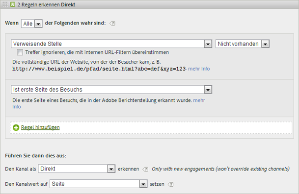

### Kanal „Referrer-Domänen“ {#referring-domains}

Der Kanal „Referrer-Domänen“ identifiziert Besucher mit einer Referrer-Domäne. Gemeinsam fungieren die Kanäle „Intern“, „Direkt“ und „Referrer-Domänen“ als Sammelstelle für alle verbleibenden Treffer, die noch nicht in einen Kanal kategorisiert wurden.

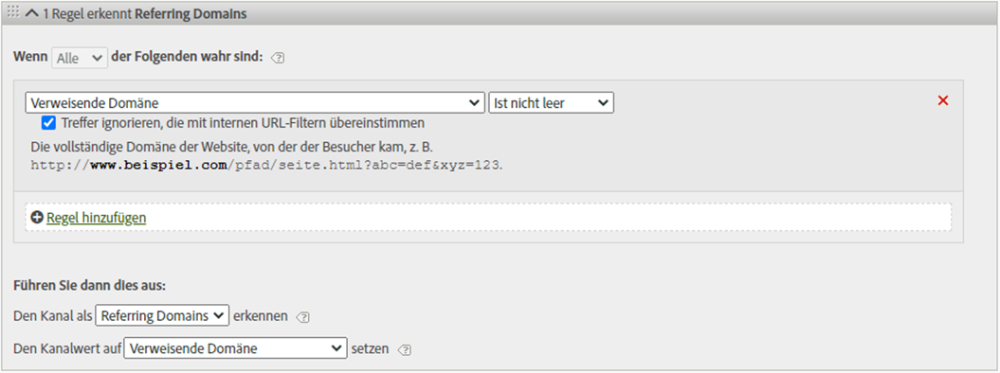
