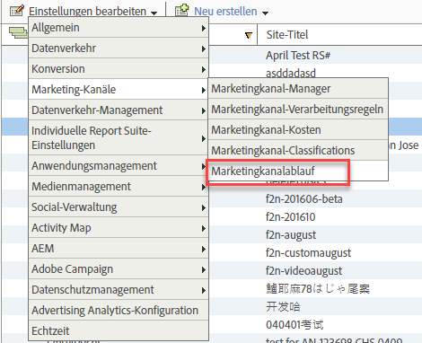

# Marketing-Kanalablauf

Erfahren Sie, wie Sie den Ablaufzeitpunkt oder den Zeitraum der Besucherinteraktion für Marketing-Kanäle festlegen.

Die Besucherinteraktion bezeichnet die Zeit, die Sie der vorherigen Aktivität des Besuchers auf Ihrer Site zur Anrechnung im Erstkontakt-Kanal einräumen wollen. Die Standardablaufeinstellung ist 30 Tage.

Wenn der Besucher die Site häufig nutzt, passt sich das Interaktionsfenster daran an. Der Besucher muss 30 Tage lang inaktiv sein, damit der Zeitraum abläuft und die Kanäle zurückgesetzt werden. Sowohl die Erstkontakt- als auch die Letztkontaktkanäle eines Besuchers werden nach 30 Tagen Inaktivität in diesem Browser zurückgesetzt.

Beispiel:

* Tag 1: Der Benutzer gelangt per Anzeige zur Site. Erstkontakt- und Letztkontakt-Kanäle werden auf „Anzeige“ eingestellt.
* Tag 2: Der Benutzer gelangt per natürlicher Suche zur Site. Erstkontakt bleibt „Anzeige“, Letztkontakt wird auf „Natürliche Suche“ eingestellt.
* Tag 35: Der Benutzer war seit 33 Tagen nicht mehr auf der Site und kehrt über die Registerkarte zurück, die er in seinem Browser geöffnet hatte. Bei einem Interaktionsfenster von 30 Tagen wäre das Fenster geschlossen, und die Marketingkanal-Cookies wären abgelaufen. Die Erstkontakt- und Letztkontakt-Kanäle werden zurückgesetzt und auf „Sitzungsaktualisierung“ eingestellt, da der Benutzer von einer internen URL kam.

## Ablaufeinstellungen für Marketing-Kanäle

Die Ablaufeinstellungen umfassen Folgendes:

| Feld | Definition |
|--- |--- |
| Tage der Inaktivität | Diese Anzahl von Tagen muss verstreichen, bevor die First Touch-Interaktion des Besuchers abläuft. Der Standardwert lautet 30. |
| Nie | Die Zeit der Besucherinteraktion läuft nie ab. |
| Kanal zurücksetzen | Lässt alle Besucherinteraktionszeiträume ablaufen.  Wenn Sie alle Marketingkanaldaten zurücksetzen müssen, können Sie die Besucherinteraktionszeiträume ablaufen lassen. Sie müssen möglicherweise Daten zurücksetzen, wenn die Verarbeitungsregeln zuvor falsch konfiguriert wurden. Alle Erst- und Letztkontaktkanalwerte laufen sofort ab und werden bei der Rückkehr der Besucher zurückgesetzt. |

## Definieren des Marketing-Kanalablaufs {#define-expiration}

Geben Sie den Zeitraum der Besucherinteraktion an.

1. Klicken Sie auf **[!UICONTROL Analytics]** > **[!UICONTROL Admin]** > **[!UICONTROL Report Suites]**.
2. Klicken Sie in [!UICONTROL Report Suite Manager] auf **[!UICONTROL Einstellungen bearbeiten]** > **[!UICONTROL Marketing-Kanäle]** > **[!UICONTROL Marketingkanalablauf]**.

   

3. Konfigurieren Sie die Felder für den Besucherinteraktionszeitraum.
4. Klicken Sie auf **[!UICONTROL Speichern]**.

