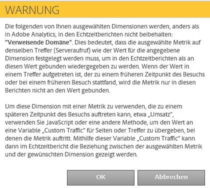

# Echtzeitberichte konfigurieren

Administrative Schritte zum Einrichten von Echtzeitberichten

Setting up real-time reports within [!UICONTROL Reports &amp; Analytics] consists of selecting the report suite and configuring up to 3 reports for it.

1. Wählen Sie die Report Suite aus, für die Sie Echtzeit-Berichte aktivieren möchten.

   Navigate to **[!UICONTROL Analytics]** &gt; **[!UICONTROL Reports]** &gt; **[!UICONTROL View All Reports &gt; Site Metrics]** &gt; **[!UICONTROL Real-Time]** and select the report suite from the drop-down at the top:

   

   Wenn Sie versuchen, Echtzeitberichte für eine Report Suite anzuzeigen, die nicht für Echtzeitberichte eingerichtet wurde, wird eine Meldung angezeigt, die Ihnen das Einrichten der Report Suite ermöglicht.

   

1. Click **[!UICONTROL Configure]** (gear icon) to run the [!UICONTROL Report Suite Manager].

   (Also available under **[!UICONTROL Analytics]** &gt; **[!UICONTROL Admin &gt; Report Suites]** &gt; **[!UICONTROL Edit Settings]** &gt; **[!UICONTROL Real-Time]**.)

1. Turn on the **[!UICONTROL Enable Real-Time]** setting.
1. Richten Sie die Echtzeit-Datenerfassung für bis zu drei Berichte ein, wobei pro Bericht eine Metrik und drei Dimensionen oder Classifications erstellt werden.

   

   Informationen zu unterstützten Echtzeit-Metriken und -Dimensionen finden Sie unter [Unterstützte Metriken und Dimensionen](/help/components/c-real-time-reporting/realtime-metrics.md).

   Falls Sie Classifications erstellt haben, werden sie unter der Dimension angezeigt, für die sie definiert wurden:

   

   >[!NOTE]
   >
   >Für einen einzelnen Echtzeitbericht wird die Aktivierung doppelter Dimensionen derzeit nicht unterstützt, auch wenn für jede Dimension eine andere Classification ausgewählt wurde.

   Weitere Informationen zu Klassifizierungen finden Sie unter [Info zu Klassifizierungen](/help/components/c-classifications2/c-classifications.md).

   >[!NOTE]
   >
   >Einige Dimensionen, wie "Suchbegriff"oder "Produkt", bleiben in Echtzeit nicht erhalten, wie dies in anderen Adobe Analytics der Fall ist. Wenn Sie eine nicht persistente Metrik auswählen, erscheint folgende Warnmeldung:

   

1. Click **[!UICONTROL Save]** or **[!UICONTROL Save and View Report]**.

   Nach diesem ersten Bericht-Setup kann es bis zu 20 Minuten dauern, bis Daten gestreamt werden. Daraufhin sind die Daten sofort verfügbar. Informationen zum Anzeigen von Echtzeitberichten erhalten Sie unter [Einen Echtzeitbericht ausführen](https://marketing.adobe.com/resources/help/en_US/sc/user/reports_realtime.html).

1. Standardmäßig haben alle Benutzer Zugriff auf Echtzeitberichte.
