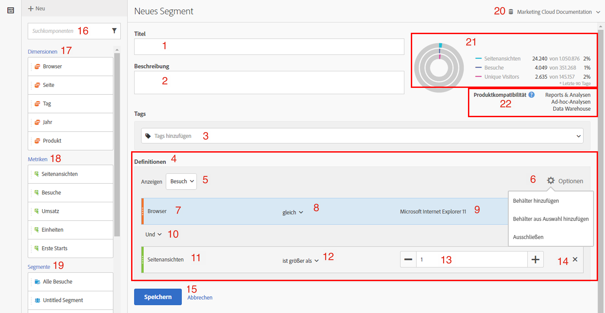
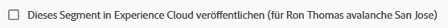
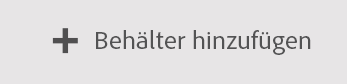
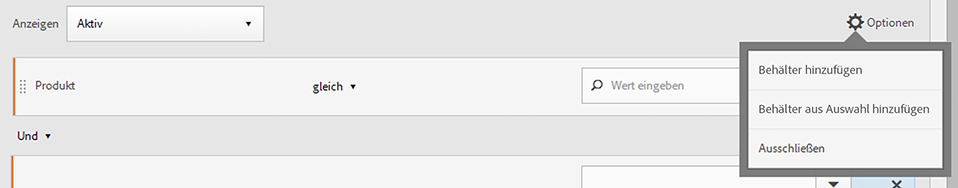
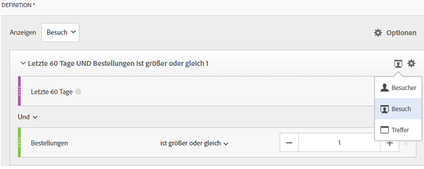
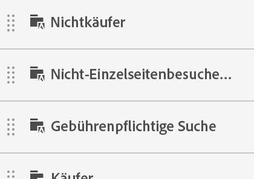

# Segmentaufbau

The [!UICONTROL Segment Builder] provides a canvas to drag and drop Metrics, Dimensions, Segments, and Events to segment visitors based on container hierarchy logic, rules, and operators. Mit diesem integrierten Entwicklungstool können Sie einfache oder komplexe Segmente erstellen und speichern, mit deren Hilfe Besucherattribute und Aktionen bei Besuchen und Seitentreffern identifiziert werden.

>[!IMPORTANT]
>
>In der Version vom Juni 2019 haben wir Dimensionsattributionsmodelle eingeführt. Siehe #6 unter „Funktionen der Web-Benutzeroberfläche“ unten.

Es gibt mehrere Möglichkeiten für den Zugriff auf den Segmentaufbau:

* **Obere Navigation** in Analytics: Klicken Sie auf **[!UICONTROL Analytics]** > **[!UICONTROL Components]** > **[!UICONTROL Segments]**.
* **[!UICONTROL Analysis Workspace]**: Klicken Sie auf **[!UICONTROL Analytics]** > **[!UICONTROL Workspace]**, öffnen Sie ein Projekt und klicken Sie auf **[!UICONTROL + New]** > **[!UICONTROL Create Segment]**.
* **[!UICONTROL Reports & Analytics]**: Klicken Sie auf **[!UICONTROL Analytics]** > **[!UICONTROL Reports]**, öffnen Sie einen vorhandenen Bericht und klicken Sie auf das Segmentsymbol  in der linken Navigation und dann auf **[!UICONTROL Add]**.
* **[!UICONTROL Ad Hoc Analysis]**: [Segmente in Ad-hoc-Analysen erstellen](/help/components/c-segmentation/c-segmentation-workflow/seg-build.md#build-segments).
* **[!UICONTROL Report Builder]**: [Hinzufügen oder Bearbeiten von Segmenten in ReportBuilder](https://docs.adobe.com/content/help/en/analytics/analyze/report-builder/data-requests/segmentation.html).

## Benutzeroberfläche von Segment Builder {#concept_643F2DF74C544796B58F4656ABC5F726}

The [!UICONTROL Segment Builder] lets you build simple or complex segments that identify visitor attributes and actions across visits and page hits. Er bietet eine Arbeitsfläche zum Ziehen und Ablegen von metrischen Dimensionen, Ereignissen und anderen Segmenten, um Besucher mithilfe von Hierarchielogik, Regeln und Operatoren zu segmentieren.

## Funktionen der Web-Benutzeroberfläche  {#section_F61C4268A5974C788629399ADE1E6E7C}

Mit [!UICONTROL Segment Builder] können Sie Segmente über die Web-Benutzeroberfläche (oder eine [Java-Benutzeroberfläche in Ad Hoc Analysis](/help/components/c-segmentation/c-segmentation-workflow/seg-workflow.md)) erstellen und bearbeiten. Sie können Regeldefinitionen und Behälter hinzufügen, um Ihre Segmente zu verfeinern, zu stapeln und zu verschachteln. Sie können auch prüfen, wie viele Seitenansichten, Besuche und Unique Visitors aus der aktuellen Segmentdefinition resultieren. Speichern Sie dann das Segment für den künftigen Bedarf.

Sie können wie folgt auf den Segmentaufbau zugreifen:

* öffnen Sie einen vorhandenen Bericht und klicken Sie auf das Segmentsymbol  im linken Navigationsmenü. In the segment rail that displays, click **[!UICONTROL Add]**.

* From within the Segment Manager, clicking **[!UICONTROL + Add]**.
* Klicken Sie im Segment-Manager auf einen Segmenttitel, um das Segment im Segmentaufbau zu bearbeiten.

1. **[!UICONTROL Title]**: Hiermit können Sie das Segment benennen oder umbenennen.
1. **[!UICONTROL Description]**: Geben Sie eine Beschreibung für das Segment ein. Wenn Sie das Segment freigeben möchten, ist die Eingabe einer Beschreibung erforderlich.
1. **[!UICONTROL Tags]**: [Kennzeichnen Sie das Segment](/help/components/c-segmentation/c-segmentation-workflow/seg-workflow.md), das Sie erstellen, mit einem Tag, indem Sie ein vorhandenes es aus der Liste auswählen oder ein neues erstellen.
1. **[!UICONTROL Definitions]**: Hier [erstellen und konfigurieren Sie Segmente](/help/components/c-segmentation/c-segmentation-workflow/seg-workflow.md), fügen Regeln hinzu und verschachteln und sequenzieren Sie Container. Hier können Sie eine Beschreibung für das neue Segment angeben, indem Sie den Behälter auswählen und Dimensionen, Segmente oder Metriken in die Definition ziehen und dort ablegen.
1. : (Auswahl **[!UICONTROL Show]** Oberster Behälter.) Lets you select the top-level [container](/help/components/c-segmentation/seg-overview.md) ( [!UICONTROL Visitor], [!UICONTROL Visit], [!UICONTROL Hit]). Standardmäßig ist der Trefferbehälter der Behälter der obersten Ebene.
1. **[!UICONTROL Options]**: (Zahnradsymbol)

   * **[!UICONTROL + Add container]**: Hiermit können Sie der Segmentdefinition einen neuen Container (unterhalb des Containers der obersten Ebene) hinzufügen.
   * **[!UICONTROL + Add container from selection]**: Ermöglicht die Erstellung eines neuen Containers aus dem/den Elementen, die Sie (mehrere) im Feld Definitionen ausgewählt haben.
   * **[!UICONTROL Exclude]**: Hiermit können Sie das Segment definieren, indem Sie eine oder mehrere Dimensionen, Segmente oder Metriken ausschließen.

1. **[!UICONTROL Attribution Models]**: Für Dimensionssegmentierung. Dimensionsmodelle sind besonders bei der sequenziellen Segmentierung nützlich, z. B. bei denen, die Flussvisualisierungen unterstützen:

   * **[!UICONTROL Repeating]** (Standard): Beinhaltet Instanzen und beständige Werte für die Dimension.
   * **[!UICONTROL Instance]**: Enthält Instanzen für die Dimension.
   * **[!UICONTROL Non-repeating instance]**: Enthält einmalige Instanzen (nicht wiederholend) für die Dimension.
   

1. **[!UICONTROL Dimensions]**: Dimension wird aus der Liste Dimensionen (orangefarbene Seitenleiste) gezogen und abgelegt.
1. **[!UICONTROL Comparison]**: Sie können Werte mithilfe ausgewählter Operatoren vergleichen und beschränken.
1. **[!UICONTROL Value]**: Der Wert, den Sie für die Dimension, das Segment oder die Metrik eingegeben oder ausgewählt haben.
1. **[!UICONTROL And/Or/Then]**: Weist die [!UICONTROL AND/OR/THEN] Operatoren zwischen Containern oder Regeln zu. Mit dem Operator „DANN“ können Sie [sequenzielle Segmente definieren](/help/components/c-segmentation/c-segmentation-workflow/seg-sequential-build.md).
1. **[!UICONTROL Metric]**: (Grüne Seitenleiste) Metrik, die aus der Liste &quot;Metriken&quot;gezogen und abgelegt wurde.
1. **[!UICONTROL Comparison]** Operator: Sie können Werte mit ausgewählten Operatoren vergleichen und beschränken.
1. **[!UICONTROL Value]**: Der Wert, den Sie für die Dimension, das Segment oder die Metrik eingegeben oder ausgewählt haben.
1. **[!UICONTROL X]** (Löschen): Hiermit können Sie diesen Teil der Segmentdefinition löschen.
1. **[!UICONTROL Save]** oder **[!UICONTROL Cancel]**: Speichert oder bricht das Segment ab. After clicking **[!UICONTROL Save]**, you are taken to the Segment Manager where you can manage the segment.
1. **[!UICONTROL Search]**: Durchsucht die Liste der Dimensionen, Segmente oder Metriken.
1. **[!UICONTROL Dimensions]**: (Liste) Klicken Sie auf die Kopfzeile, um sie zu erweitern.
1. **[!UICONTROL Metrics]**: Klicken Sie auf die Kopfzeile zum Erweitern.
1. **[!UICONTROL Segments]**: Klicken Sie auf die Kopfzeile zum Erweitern.
1. **[!UICONTROL Report suite selector]**: Erlaubt die Auswahl der Report Suite, unter der dieses Segment gespeichert wird. Sie können das Segment weiterhin in allen Report Suites verwenden.
1. **[!UICONTROL Segment Preview]**: Liefert eine Vorschau der Schlüsselmetriken, die anzeigen, ob es sich um ein gültiges Segment handelt und wie breit das Segment ist. Stellt eine Aufschlüsselung des Datensatzes dar, den Sie erwarten können, wenn Sie dieses Segment anwenden. Shows 3 concentric circles and a list to show the number and percentage of matches for [!UICONTROL Hits], [!UICONTROL Visits], and [!UICONTROL Visitors] for a segment run against a data set. Dieses Diagramm wird beim Erstellen oder Ändern der Segmentdefinition sofort aktualisiert.
1. **[!UICONTROL Product Compatibility]**: Stellt eine Liste bereit, mit der Adobe Analytics-Produkte (Analyse Workspace, [!UICONTROL Reports & Analytics]Ad-hoc-Analysen, Data Warehouse), mit denen das erstellte Segment kompatibel ist. Die meisten Segmente sind mit allen Produkten kompatibel. Es sind jedoch nicht alle Operatoren und Dimensionen mit allen Analytics-Produkten kompatibel. Dies betrifft insbesondere  [Data Warehouse](/help/components/c-segmentation/seg-reference/seg-compatibility.md). Dieses Diagramm wird bei Änderungen der Segmentdefinition sofort aktualisiert.

Die Funktionsweise von Segmenten mit eingebetteten Datumsbereichen ist in Analysis Workspace und [!UICONTROL Reports & Analytics] weiterhin unterschiedlich: In Workspace wird der Datumsbereich des Bedienfelds mit dem eingebetteten Datumsbereich des Segments überschrieben. Im Gegensatz dazu erhalten Sie in [!UICONTROL Reports & Analytics] die Schnittmenge des Datumsbereichs des Berichts und des eingebetteten Datumsbereichs des Segments.

**[!UICONTROL Publish to Experience Cloud (for `<report suite name>`)]**: (Nicht auf dem Bildschirm angezeigt) Diese Option wird nur angezeigt, wenn die Report Suite, in der Sie dieses Segment speichern, für die Experience Cloud aktiviert ist. By publishing a segment to the Experience Cloud, you can use the segment for marketing activity in the [!UICONTROL Audience Library], [!DNL Target], and [!DNL Audience Manager]. Ein Segmenttitel und eine Beschreibung sind erforderlich.

>[!NOTE] In Analytics können Sie ein veröffentlichtes Segment bearbeiten oder löschen. Wird das Segment aktuell verwendet, wird ein Warnhinweis eingeblendet, wenn Sie das Segment bearbeiten. Ein veröffentlichtes Segment, das aktuell in Adobe [!DNL Target] verwendet wird, kann nicht gelöscht werden.

>[!IMPORTANT]
>
>Begrenzen Sie die Anzahl der von Analytics freigegebenen Zielgruppen auf 20, um zusätzliche Verarbeitungsverzögerungen zu vermeiden. Zielgruppen, die von der Experience Cloud und Analytics gemeinsam verwendet werden, dürfen nicht mehr als 20 Millionen eindeutige Mitglieder umfassen. Aufgrund der Caching-Funktion wird die Löschung von Report Suites in Analytics erst nach 12 Stunden durch die Experience Cloud übernommen.

>[!IMPORTANT]
>
>Wenn ein Besucher in die in Analytics freigegebene Zielgruppe aufgenommen wird, ist diese Information erst mit einer Verzögerung von 24 bis 48 Stunden in [!DNL Target], [!DNL Advertising Cloud] und [!DNL Campaign] verfügbar.

## Segmente erstellen {#build-segments}

1. Simply drag a Dimension, Segment, or Metric Event from the left pane to the [!UICONTROL Definitions] field.

   

   The default top-level [!UICONTROL Hit] container is shown after dragging an element to [!UICONTROL Definitions]. You can change the container type to Visit or Visitor from the **[!UICONTROL Show]** drop-down menu.

1. Legen Sie den [Operator](/help/components/c-segmentation/seg-reference/seg-operators.md) im Dropdown-Menü fest.
1. Geben Sie für das ausgewählte Element einen Wert ein oder wählen Sie einen aus.
1. Hinzufügen Sie bei Bedarf weitere Container, mithilfe von **[!UICONTROL And]**, **[!UICONTROL Or]** oder **[!UICONTROL Then]** Regeln.
1. Sehen Sie sich nach dem Platzieren der Behälter und dem Festlegen der Regeln rechts oben im Validierungsdiagramm die Ergebnisse des Segments an. Der Validator zeigt den Prozentsatz und die absolute Anzahl der Seitenansichten, Besuche und Unique Visitors an, die mit dem erstellten Segment übereinstimmen.
1. Under **[!UICONTROL Tags]**, [tag](/help/components/c-segmentation/c-segmentation-workflow/seg-tag.md) the container by selecting an existing tag or creating a new one.
1. Click **[!UICONTROL Save]** to save the segment.

Sie gelangen jetzt zum [Segment-Manager](/help/components/c-segmentation/c-segmentation-workflow/seg-manage.md). Dort können Sie Ihr Segment auf verschiedene Arten taggen, freigeben und verwalten.

## Erstellen und Verschachteln von Containern {#section_1C38F15703B44474B0718CEF06639EFD}

Sie können [einen Rahmen aus Containern](/help/components/c-segmentation/seg-overview.md) erstellen und dann Logikregeln und Operatoren dazwischen platzieren.

1. Klicken Sie auf **[!UICONTROL Options > Add Container]**.

   

   A new [!UICONTROL Hit] container opens without a [!UICONTROL Hit] (Page View) identified.

   

1. Ändern Sie gegebenenfalls den Behältertyp.
1. Ziehen Sie eine Dimension, ein Segment oder ein Ereignis aus dem linken Fenster in den Behälter.
1. Continue to add new containers from the top-level **[!UICONTROL Options]** > **[!UICONTROL Add container]** button at the top of the definition, or add containers from within a container to nest logic.

   **ODER**

   Select one or more rules and then click **[!UICONTROL Options]** > **[!UICONTROL Add container from selection]**. Dadurch wird Ihre Auswahl zu einem separaten Behälter.

## Verwenden von Datumsbereichen in Segmenten {#concept_252A83D43B6F4A4EBAB55F08AB2A1ACE}

Sie können Segmente erstellen, die rollierende Datumsbereiche enthalten, um Fragen zu laufenden Kampagnen oder Ereignissen zu beantworten.

Sie können beispielsweise ganz einfach ein Segment erstellen, das „alle, die etwas in den vergangenen 60 Tagen gekauft haben“ beinhaltet.

Sie erstellen einen Container &quot;Besuch&quot;und fügen darin den [!UICONTROL Last 60 days] Zeitraum und die Metrik [!UICONTROL Orders is greater than or equal to 1]mit einem UND-Operator hinzu:

## Stapeln von Segmenten {#task_58140F17FFD64FF1BC30DC7B0A1B0E6D}

Für die Stapelung von Segmenten werden die Kriterien der einzelnen Segmente mit einem „Und“-Operator kombiniert und dann gemeinsam angewendet.

Wenn Sie z. B. ein Segment „Mobiltelefonbenutzer“ und ein Segment „US-Geographie“ stapeln, werden ausschließlich Daten für Mobiltelefonbenutzer in den USA geliefert.

Stellen Sie sich diese Segmente als Bausteine oder Module vor, die Sie in eine Segmentbibliothek aufnehmen können, damit Benutzer diese verwenden können, wenn sie passend erscheinen. Auf diese Art können Sie die Anzahl der benötigten Segmente drastisch reduzieren. Angenommen, Sie haben 40 Segmente:

* 20 für Mobiltelefonbenutzer in verschiedenen Ländern (USA_mobil, Deutschland_mobil, Frankreich_mobil, Brasilien_mobil usw.)
* 20 für Tabletbenutzer in verschiedenen Ländern (USA_tablet, Deutschland_tablet, Frankreich_tablet, Brasilien_tablet usw.)

Indem Sie die Segmentstapelung nutzen, können Sie Ihre Segmente auf 22 verringern und diese bei Bedarf stapeln. Sie müssten folgende Segmente erstellen:

* ein Segment für Mobilbenutzer
* ein Segment für Tabletbenutzer
* 20 Segmente für die verschiedenen Regionen

>[!NOTE] Wenn Sie zwei Segmente stapeln, werden diese standardmäßig durch eine UND-Anweisung verbunden. Dies kann nicht in eine ODER-Anweisung geändert werden.

1. Wechseln Sie zum Segmentaufbau.
1. Geben Sie einen Titel und eine Beschreibung für das Segment ein.

   Schritt Ergebnis 1. Click **[!UICONTROL Show Segments]** to bring up the list of segments in the left navigation.

   Schritt Ergebnis 1. Ziehen Sie die Segmente, die Sie stapeln möchten, in die Arbeitsfläche der Segmentdefinition. Hier sehen Sie ein Beispiel eines Segments, das die vorhandenen Segmente „Besuche von Tablets“ und „US-Geo“ stapelt:

   

1. Speichern Sie das Segment.

   Schritt Ergebnis

## Verwenden von Segmentvorlagen {#concept_5098446CC78D441E93B8E4D1D1EA6558}

Vorlagen stellen die alten vorkonfigurierten und nützlichen Segmente dar.

In the Segment Manager, click **[!UICONTROL Add]**, which takes you to the Segment Builder. Klicken Sie dann auf das Segmentsymbol ,

um die Segmentleiste aufzurufen. Die Segmentvorlagen werden am Ende der Segmentliste angezeigt. Sie sind durch ein Ordnersymbol links neben dem Vorlagennamen gekennzeichnet:

Sie können diese Vorlagen in die Arbeitsfläche für die Definitionen ziehen und sie dort so verwenden, wie sie definiert wurden, oder vorher anpassen.

<table id="table_98B87D807E9344C9BEBF072C65D87B1B"> 
 <thead> 
  <tr> 
   <th colname="col1" class="entry"> Vorlagenname </th> 
   <th colname="col2" class="entry"> Definition </th> 
  </tr> 
 </thead>
 <tbody> 
  <tr> 
   <td colname="col1"> Warenkorb vorzeitig verlassen </td> 
   <td colname="col2">Daten zu Besuchern anzeigen, die Elemente zum Warenkorb hinzugefügt, aber nichts bestellt haben. In der Segmentdefinition ist der Behälter „Besuche“. Die Regel für dieses sequenzielle Segment ist 
 Zusätze zum Warenkorb ist nicht null 
 
Dann 
 
Bestellungen gleich 0. 
 </td> 
  </tr> 
  <tr> 
   <td colname="col1"> Erstbesuche </td> 
   <td colname="col2">Daten zu Besuchern mit maximal einem [1] Besuch anzeigen. In der Segmentdefinition ist der Behälter „Besuche“. Die Regel ist 
Besuchsnummer gleich 1. 
 </td> 
  </tr> 
  <tr> 
   <td colname="col1"> Nichtkäufer </td> 
   <td colname="col2">Daten zu Besuchern anzeigen, die nicht zu einem Bestellereignis beitrugen. In der Segmentdefinition ist der Behälter „Besucher“. Dieses Segment verwendet die Ausschließen-Logik. Die Regel ist 
Bestellungen ist nicht null. 
 </td> 
  </tr> 
  <tr> 
   <td colname="col1"> Nicht-Einzelseitenbesuche (Keine Absprünge) </td> 
   <td colname="col2">Daten zu Besuchern anzeigen, die mehr als einen Besuch ausgeführt haben. In der Segmentdefinition ist der Behälter „Besucher“. Dieses Segment verwendet die Ausschließen-Logik. Die Regel ist 
Einzelzugriff ist nicht null. 
 </td> 
  </tr> 
  <tr> 
   <td colname="col1"> Paid Search </td> 
   <td colname="col2">Daten zu Besuchern anzeigen, die von einer gebührenpflichtigen Suche stammen. In der Segmentdefinition ist der Behälter „Besuche“. Die Regel ist 
Gebührenpflichtige Sucherkennung gleich 1. 
 </td> 
  </tr> 
  <tr> 
   <td colname="col1"> Käufern </td> 
   <td colname="col2">Daten zu Besuchern anzeigen, die zu einem Bestellereignis beitrugen. In der Segmentdefinition ist der Behälter „Besucher“. Die Regel ist 
Bestellungen ist nicht null. 
 </td> 
  </tr> 
  <tr> 
   <td colname="col1"> Rückkehrende Besucher </td> 
   <td colname="col2">Daten zu Besuchern anzeigen, die mindestens einen Besuch durchgeführt haben. In der Segmentdefinition ist der Behälter „Besuche“. Die Regel ist 
Besuchsnummer ist größer als 1. 
 </td> 
  </tr> 
  <tr> 
   <td colname="col1"> Einzelseitenbesuche </td> 
   <td colname="col2"> Daten zu Besuchen anzeigen, bei denen ein Einzelseitenwert vorliegt, auch wenn während des Besuchs mehrere Seitenansichten übermittelt werden. Einzelseitenbesuche mit Exitlink-Ereignissen werden in das Segment einbezogen. In der Segmentdefinition ist der Behälter „Besuche“. Die Regel ist 
Einzelseitenbesuche gleich 1. 
 </td> 
  </tr> 
  <tr> 
   <td colname="col1"> Angesehenes Produkt wurde nicht dem Warenkorb hinzugefügt </td> 
   <td colname="col2">Daten zu Besuchern anzeigen, die Produkte angesehen, aber keine zum Warenkorb hinzugefügt haben. In der Segmentdefinition ist der Behälter „Besuche“. Die Regel für dieses sequenzielle Segment ist 
Produktansichten ist nicht null 
 
Dann 
 
 Warenkorbzusätze gleich 0. 
 </td> 
  </tr> 
  <tr> 
   <td colname="col1"> Besuche von Kampagnen </td> 
   <td colname="col2">Daten zu Besuchern aus Kampagnen anzeigen. In der Segmentdefinition ist der Behälter „Besuche“. Die Regel ist 
Trackingcode ist nicht null. 
 </td> 
  </tr> 
  <tr> 
   <td colname="col1"> Besuche von Mobilgeräten </td> 
   <td colname="col2">Daten zu Besuchern anzeigen, die Mobilgeräte verwenden. In der Segmentdefinition ist der Behälter „Besuche“. Die Regel ist 
Mobiles Gerät ist ungleich null. 
 </td> 
  </tr> 
  <tr> 
   <td colname="col1"> Besuche über eine kostenlose Suche </td> 
   <td colname="col2">Daten zu Besuchern anzeigen, die nicht von einer gebührenpflichtigen Suche stammen. In der Segmentdefinition ist der Behälter „Besuche“. Die Regel ist 
Gebührenpflichtige Sucherkennung gleich 0. 
 </td> 
  </tr> 
  <tr> 
   <td colname="col1"> Besuche von Nicht-Mobilgerät </td> 
   <td colname="col2">Daten zu Besuchern anzeigen, die kein Mobilgerät verwenden. In der Segmentdefinition ist der Behälter „Besuche“. Dieses Segment verwendet die Ausschließen-Logik. Die Regel ist 
Mobilgerätetyp gleich Mobiltelefon 
 
Oder 
 
Mobilgerätetyp gleich Tablet. 
 </td> 
  </tr> 
  <tr> 
   <td colname="col1"> Besuche von Smartphones </td> 
   <td colname="col2">Daten zu Besuchern anzeigen, die Smartphones verwenden. In der Segmentdefinition ist der Behälter „Besuche“. Die Regel ist 
Gerätetyp gleich Mobiltelefon. 
 </td> 
  </tr> 
  <tr> 
   <td colname="col1"> Besuche über Suchmaschinen </td> 
   <td colname="col2">Daten zu Besuchern aus Suchmaschinen anzeigen. In der Segmentdefinition ist der Behälter „Besuche“. Die Regel ist 
Referrer-Typ gleich Suchmaschinen. 
 </td> 
  </tr> 
  <tr> 
   <td colname="col1"> Besuche von sozialen Netzwerken aus </td> 
   <td colname="col2">Daten zu Besuchern aus sozialen Netzwerken anzeigen. In der Segmentdefinition ist der Behälter „Besuche“. Die Regel ist 
Referrer-Typ gleich soziale Netzwerke. 
 </td> 
  </tr> 
  <tr> 
   <td colname="col1"> Besuche von Tablets </td> 
   <td colname="col2">Daten zu Besuchern anzeigen, die Tablets verwenden. In der Segmentdefinition ist der Behälter „Besuche“. Die Regel ist 
Gerätetyp gleich Tablet. 
 </td> 
  </tr> 
  <tr> 
   <td colname="col1"> Besuche mit Besucher-ID-Cookie </td> 
   <td colname="col2">Daten zu Besuchern Ihrer Site anzeigen, für die ein persistentes Cookie erforderlich ist. In der Segmentdefinition ist der Behälter „Besuche“. Die Regel ist 
Beständiges Cookie gleich 1. 
 </td> 
  </tr> 
 </tbody> 
</table>

## Beispiel: Kampagnenbesuchersegment {#concept_61AC6115097B4EB3AEFE8CE98F38315D}

Präsentiert ein Beispiel für dieses häufig verwendete Segment.

Viele Kunden möchten Metriken von Besuchern sehen, die auf bestimmte Kampagnen reagiert haben. Das Erstellen eines Kampagnenbesuchersegments bietet eine einfache Möglichkeit, diese Daten zu erhalten.

Wenn Sie dieses Segment im Segmentaufbau erstellen, ziehen Sie eine Kampagnendimension – in diesem Fall „Kampagnenname“ – in einen Besuchebehälter der obersten Ebene:

(Optional) Sie können auch ein Kampagnen-Tag auf dieses Segment anwenden, wenn Sie Ihre gesamten kampagnenbezogenen Segmente auf einfache Art filtern möchten.
