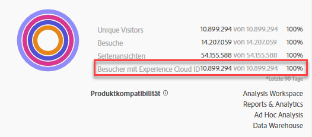

# Segmente in der Experience Cloud veröffentlichen

Durch das Veröffentlichen eines Adobe Analytics-Segments in der Experience Cloud können Sie das Segment für die Marketing-Aktivität in und in anderen Kanälen der Aktivierung, einschließlich Adobe [!DNL Audience Manager] , verwenden [!DNL Advertising Cloud]und [!DNL Target] [!DNL Campaign]. Die neuesten Updates haben den Veröffentlichungsarbeitsablauf erheblich optimiert. Sie können Analytics-Segmente jetzt in weniger als 8 Stunden in der Experience Cloud veröffentlichen. Verwenden Sie diese Segmente, um Audiencen in Audience Manager für alle nachfolgenden Ziele zu aktivieren.

Darüber hinaus wurde die maximale Anzahl an veröffentlichten Adobe Analytics-Segmenten von 20 auf 75 erhöht. Sie können veröffentlichte Segmente in Ansicht [!UICONTROL Analytics > Components > Segments]setzen.

>[!NOTE] Adobe Campaign (Classic und Standard) verhält sich anders, da es zusätzlich zur 8-Stunden-Latenz eine 24-Stunden-Latenz gibt.

## Voraussetzungen

* Stellen Sie sicher, dass die Report Suite, in der Sie dieses Segment speichern, [für die Experience Cloud aktiviert](https://docs.adobe.com/content/help/de-DE/core-services/interface/audiences/t-publish-audience-segment.html) ist. Andernfalls können Sie sie nicht in der Experience Cloud veröffentlichen.
* Vergewissern Sie sich, dass Sie an einer Report Suite arbeiten, die [Ihrer Experience Cloud-Organisation zugeordnet](https://docs.adobe.com/content/help/de-DE/core-services/interface/about-core-services/report-suite-mapping.html) ist.
* Stellen Sie sicher, dass Ihre Organisation Experience Cloud IDs verwendet.
* Before you can publish segments, your Admin needs to assign the [!UICONTROL Segment Publishing] permission to a product profile in the [Admin Console](https://docs.adobe.com/content/help/de-DE/core-services/interface/manage-users-and-products/admin-getting-started.html), and add you to the product profile.

## Zu beachten

* **Report Suite-Beschränkungen**: Sie können bis zu 75 Segmente pro Report Suite veröffentlichen. Diese Beschränkung wird erzwungen. Wenn Sie bereits 75 Segmente veröffentlicht haben, können Sie keine weiteren Segmente veröffentlichen, bis Sie die Veröffentlichung für genügend Segmente aufheben, um unter den Schwellenwert von 75 Segmenten zu gelangen.
* **Mitgliedsbeschränkungen**: Audiencen, die von Adobe Analytics für die [!DNL Experience Cloud] Benutzer freigegeben wurden, dürfen 20 Millionen individuelle Mitglieder nicht überschreiten.
* **Datenschutz**: Zielgruppen werden nicht nach dem Authentifizierungsstatus der Besucher gefiltert. Wenn Besucher Ihre Site sowohl authentifiziert als auch nicht authentifiziert anzeigen können, kann eine Aktion, die ein nicht authentifizierter Benutzer durchführt, dennoch dazu führen, dass der Besucher in die Zielgruppe aufgenommen wird. Lesen Sie sich die [Adobe Experience Cloud-Datenschutzbestimmungen](https://www.adobe.com/de/privacy/experience-cloud.html) durch, um die Auswirkungen der gemeinsamen Nutzung von Zielgruppen auf den Datenschutz zu verstehen.
* Eine Diskussion über die **Unterschiede zwischen Segmenten in [!DNL Adobe Analytics] und [!DNL Audience Manager]** finden Sie [hier](https://docs.adobe.com/content/help/de-DE/analytics/integration/audience-analytics/audience-analytics-workflow/aam-analytics-segments.html).

## Timeline für die Segmentveröffentlichung

| Was ist verfügbar? | Wann ist es verfügbar? | Wo ist es verfügbar? |
|---|---|---|
| Metadaten (Segmenttitel und Definition) | Sofort nach der Veröffentlichung | [!DNL Audience Manager], [!UICONTROL Experience Cloud Audience Library], [!DNL Target] |
| Verwendbares Segment mit Mitgliedschaft | ~ 8 Stunden nach der Veröffentlichung | Besucherprofil-Betrachter in [!DNL Audience Manager] |
| Eigenschaften- und Mitgliedspopulation | Nach 24–48 Stunden | [!DNL Audience Manager] |

>[!NOTE]
>Einmal pro Woche werden alle Daten vollständig synchronisiert, um alle Deltas oder Diskrepanzen zu berücksichtigen, die in der Vorwoche nicht erfasst wurden.

## Publish segments in [!UICONTROL Segment Builder]

1. Navigieren Sie zu **[!UICONTROL Analytics > Workspace > Components > Segments]> +**
1. Create a segment in the [!UICONTROL Segment Builder].
1. Geben Sie einen Titel und eine Beschreibung für das Segment ein. Andernfalls können Sie es nicht speichern.
1. Überprüfen Sie die **[!UICONTROL Publish this segment to the Experience Cloud (for *Report Suite *)]**.

>[!IMPORTANT]
>Stellen Sie sicher, dass Sie „Besucher mit Experience Cloud ID“ verwenden, wenn Sie Segmentvorschauen in Analytics anstelle der Segmentvorschau „Unique Visitors“ insgesamt betrachten, wenn Sie Adobe Analytics-Zahlen mit Audience Manager-Zahlen vergleichen:
>
>

| Element | Beschreibung |
|---|---|
| **[!UICONTROL Publish this segment to the Experience Cloud (for *<report suite>*)]** | Wenn diese Option aktiviert ist, werden der Segmenttitel und die Definition (d. h. die Shell-Zielgruppe, wie sie häufig in Anzeigenplattformen verwendet wird) sofort für die Experience Cloud freigegeben, während die Segmentmitgliedschaft ausgewertet und alle 4 Stunden freigegeben wird.   Wenn die Zielgruppe einer Aktivität beispielsweise in [!DNL Target] zugewiesen wird, beginnt [!DNL Analytics] damit, IDs für Besucher zu senden, die sich für diese Experience Cloud- und [!DNL Target]-Zielgruppe qualifizieren. Ab diesem Zeitpunkt werden der Zielgruppenname und die zugehörigen Daten auf der Experience Cloud Audiences-Seite angezeigt.   |
| **[!UICONTROL Audience Creation Window]** | Der von Ihnen ausgewählte Zeitrahmen wird verwendet, um die Zielgruppe in einem fortlaufenden Kalender zu erstellen. „Letzte 30 Tage“ (Standard) bezieht zum Beispiel Besucher ein, die sich in den letzten 30 Tagen ab dem heutigen Datum für die Zielgruppe qualifiziert haben (NICHT ab dem ursprünglichen Datum, an dem das Segment erstellt wurde). |
| **[!UICONTROL Create in Audience Library]** | Die Segmente, die Sie erstellen und veröffentlichen, können in der Experience Cloud-Zielgruppenbibliothek ohne Latenz zur Verfügung gestellt werden. Sie sind nicht von Analytics-Aktualisierungen abhängig. Diese Segmente werden nicht Ihrer Beschränkung auf 75 veröffentlichte Segmente angerechnet. |
| **[!UICONTROL x of 75 Published]** | Zeigt die Anzahl der Segmente an, die Sie in Experience Cloud veröffentlicht haben. Klicken Sie auf den Link, um eine Liste der veröffentlichten Segmente mit zugehöriger Report Suite und Eigentümer anzuzeigen. |
| **[!UICONTROL Save]** | Speichert dieses Segment. |

## Rückgängigmachen der Veröffentlichung oder Löschen von Segmenten

Um ein in Experience Cloud veröffentlichtes Segment zu löschen, müssen Sie zuerst die Veröffentlichung rückgängig machen. Um die Veröffentlichung eines Segments rückgängig zu machen, **deaktivieren Sie einfach das Kontrollkästchen**, das Sie zum Veröffentlichen aktiviert haben.

>[!NOTE]Sie können die Veröffentlichung eines Segments **nicht** rückgängig machen, das aktuell von einer der folgenden Adobe-Lösungen verwendet wird: [!DNL Analytics] (in [!DNL Audience Analytics]), [!DNL Campaign], [!DNL Advertising Cloud] (für Kunden von [!DNL Core Service] und [!DNL Audience Manager]) und alle anderen externen Partner (für Kunden von [!DNL Audience Manager]). Die Veröffentlichung eines Segments, das von [!DNL Target] verwendet wird, **kann** rückgängig gemacht werden.

## View segment publishing status in the [!UICONTROL Segment Manager]

1. Navigieren Sie zu [!UICONTROL Analytics > Components > Segments].
1. Notice the new [!UICONTROL Published] column. „Ja“/„Nein“ bezieht sich darauf, ob das Segment in der Experience Cloud veröffentlicht wurde oder nicht.

## Abrufen der [!DNL Audience Manager]-UUID

Es gibt zwei Möglichkeiten, die AAM-UUID zu erfassen, die derzeit mit dem Browser verknüpft ist:

* Adobe Experience Cloud-Debugger
* Natives Entwicklertool in Browsern (z. B. Chrome Developer Tools)

Die folgenden Screenshots zeigen Ihnen, wie Sie die AAM-UUID in Ihrem Browser abrufen und sie im Audience Manager-Besucherprofil-Betrachter verwenden, um Eigenschaften- und Segmentmitgliedschaften zu validieren.

**Methode 1: Verwenden des Adobe Experience Cloud-Debuggers**

1. Laden Sie den [Adobe Experience Cloud-Debugger](https://docs.adobe.com/content/help/de-DE/analytics/implementation/testing-and-validation/debugger.html) im Chrome-Webstore herunter und installieren Sie ihn.
1. Starten Sie den Debugger beim Laden einer Seite.
1. Blättern Sie zum Audience Manager-Abschnitt und suchen Sie die AAM-UUID, die auf der aktuellen Browserseite eingestellt ist (`50814298273775797762943354787774730612` im Beispiel unten).

**Methode 2: Verwenden von Chrome Developer Tools (oder anderen Browser-Entwicklertools)**

1. Starten Sie Chrome Developer Tools vor dem Laden einer Seite.
1. Laden Sie die Seite und aktivieren Sie „Anwendungen“ > „Cookies“. Die AAM-UUID sollte im Drittanbieter-Demdex-Cookie ([adobe.demdex.net](https://docs.adobe.com/content/help/de-DE/audience-manager/user-guide/reference/demdex-calls.translate.html) im Beispiel unten) festgelegt sein. Das Feld „demdex“ ist die AAM-UUID-Einstellung im Browser (`50814298273775797762943354787774730612` im Beispiel unten).

## Audience Manager verwenden [!UICONTROL Visitor Profile Viewer]

The AAM UUID on the browser will be used by default when [!UICONTROL Visitor Profile Viewer] is loaded. If verifying trait realizations for other users, input a UUID in the UUID field and click [!UICONTROL Refresh]. Weitere Informationen finden Sie unter [Besucherprofil-Betrachter](https://marketing.adobe.com/resources/help/en_US/aam/t_visitor_profile_viewer.html).

## Anzeigen von Segmenteigenschaften in [!DNL Audience Manager]

In AAM wird die Liste der Besucher mit ECIDs für ein bestimmtes Segment in Form von Streaming ausgewertet, da Analytics Segmente mit Experience Cloud teilt.

1. Gehen Sie [!DNL Audience Manager]nach [!UICONTROL Audience Data > Traits > Analytics Traits]. Es wird ein Ordner für jede Analytics Report Suite angezeigt, die mit Ihrer Experience Cloud-Organisation verknüpft ist. Diese Ordner (für Eigenschaften, Segmente und Data Sources) werden erstellt, wenn der Hauptdienst Profile und Zielgruppen/Personen initiiert oder bereitstellt.
1. Wählen Sie den Ordner für die Report Suite aus, in der Sie zuvor das Segment erstellt haben, das Sie für [!DNL Audience Manager] freigeben möchten. Sie sehen das Segment/die Zielgruppe, das/die Sie erstellt haben. Wenn Sie ein Segment freigeben, geschehen in [!DNL Audience Manager] zwei Dinge:
* Eine Eigenschaft wird erstellt, zunächst ohne Daten. Ca. 8 Stunden nach der Veröffentlichung des Segments in [!DNL Analytics] wird die Liste der ECIDs für [!DNL Audience Manager] und andere Experience Cloud-Lösungen integriert und freigegeben.

* Es wird ein Segment mit einer Eigenschaft erstellt. Es verwendet die Datenquelle, die mit der Report Suite verknüpft ist, in der Sie das Segment veröffentlicht haben.
* Der Trait-Ablauf ist nun auf 16 Tage eingestellt (zuvor war es 2 Tage).

## Anzeigen des Segments in [!DNL Adobe Target]

The [!UICONTROL Publish this segment to the Experience Cloud] checkbox during the segment creation process in Adobe Analytics allows the segment to be available within the Adobe Target&#39;s custom audience library. Ein in Analytics oder Audience Manager erstelltes Segment kann für Aktivitäten in Target verwendet werden. Sie können zum Beispiel Kampagnenaktivitäten basierend auf Analytics-Konversionsmetriken und in Analytics erstellten Zielgruppensegmenten erstellen.
], click [!UICONTROL Audiences].
1. On the [!UICONTROL Audiences] page, locate the audience sourced from the [!DNL Experience Cloud]. Diese Zielgruppen sind für [!DNL Target]-Aktivitäten verfügbar.

