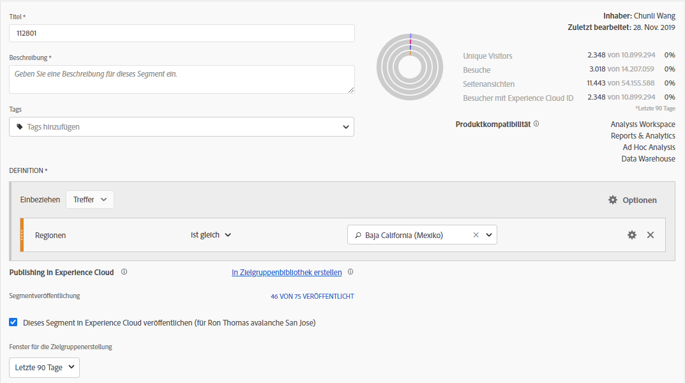
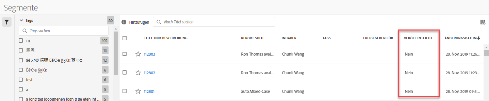

# Veröffentlichen von Segmenten in der Experience Cloud

>[!IMPORTANT]
>
>Die Verbesserungen an der Latenzzeit bezüglich der Segmentveröffentlichung und der auf dieser Seite beschriebenen Benutzeroberfläche werden noch nicht für alle Kunden eingeführt. The current production environment is described [here](https://docs.adobe.com/content/help/en/core-services/interface/audiences/t-publish-audience-segment.html).

Publishing a segment to the Experience Cloud lets you use the segment for marketing activity in the [!UICONTROL Audience Library], [!DNL Target], [!DNL Audience Manager], and [!DNL Advertising Cloud]. Die neuesten Updates haben den Veröffentlichungsarbeitsablauf erheblich optimiert. Zuvor dauerte die Veröffentlichung eines verwendbaren Segments ungefähr 48 Stunden.

Die Verarbeitung kann bis zu 8 Stunden dauern, je nach anderem Traffic und in der Segmentgröße kann die Verarbeitung sogar noch schneller erfolgen. (Zur Zeit haben wir jedoch keine Möglichkeit, Sie zu informieren, wenn das Segment verfügbar ist. Daher müssen Sie manuell prüfen.) Wir haben außerdem die maximale Anzahl von veröffentlichbaren Segmenten auf 75 erhöht (von 20). Sie können veröffentlichte Segmente in Komponenten &gt; Segmenten anzeigen.

## Voraussetzungen

* Ensure that the report suite that you are saving this segment to is [enabled for the Experience Cloud](https://docs.adobe.com/content/help/en/core-services/interface/audiences/t-publish-audience-segment.html). Andernfalls können Sie es nicht in der Experience Cloud veröffentlichen.
* Make sure you are working in a report suite that is [mapped to your Experience Cloud organization](https://docs.adobe.com/content/help/en/core-services/interface/about-core-services/report-suite-mapping.html).
* Before you can publish segments, your Admin needs to assign the [!UICONTROL Segment Publishing] permission to a product profile in the [Admin Console](https://docs.adobe.com/content/help/en/core-services/interface/manage-users-and-products/admin-getting-started.html), and add you to the product profile.

## Zu beachten

* **Report Suite-Beschränkungen**: Sie können pro Report Suite bis zu 75 Segmente veröffentlichen. Diese Beschränkung wird erzwungen. Wenn bereits 75 Segmente veröffentlicht wurden, können Sie keine zusätzlichen Segmente veröffentlichen, bis Sie die Veröffentlichung genügend Segmente veröffentlichen, um unter den Schwellenwert von 75 Segmenten zu fallen.
* **Mitgliedschaftsbeschränkungen**: Zielgruppen, die in Analytics [!DNL Experience Cloud] freigegeben wurden, dürfen 20 Millionen einzigartige Mitglieder nicht überschreiten.
* **Datenschutz**: Zielgruppen werden nicht basierend auf dem Authentifizierungsstatus eines Besuchers gefiltert. Wenn Besucher Ihre Site sowohl authentifiziert als auch nicht authentifiziert anzeigen können, kann eine Aktion, die ein nicht authentifizierter Benutzer durchführt, dennoch dazu führen, dass der Besucher in die Zielgruppe aufgenommen wird. Review [Adobe Experience Cloud privacy](https://www.adobe.com/privacy/experience-cloud.html) to understand the full privacy implications of audience sharing.
* For a discussion about the differences between segments in [!DNL Adobe Analytics] and [!DNL Audience Manager], go [here](https://docs.adobe.com/content/help/en/analytics/integration/audience-analytics/audience-analytics-workflow/aam-analytics-segments.html).

## Zeitschiene für das Veröffentlichen von Segmenten

| Verfügbare Funktionen | Sobald es verfügbar ist | Wo es verfügbar ist |
|---|---|---|
| Metadaten (Segmenttitel und Definition) | Unmittelbar nach der Veröffentlichung | [!DNL Audience Manager], [!UICONTROL Experience Cloud-Zielgruppenbibliothek], [!DNL Target] |
| Verwendetes Segment mit Mitgliedschaft | ~ 8 Stunden nach der Veröffentlichung | Visitor Profile Viewer in [!DNL Audience Manager] |
| Eigenschaften für Eigenschaften und Mitgliedschaften | Innerhalb von 24 Stunden | [!DNL Audience Manager] |

## Publish segments in [!UICONTROL Segment Builder]

1. Navigate to [!UICONTROL Analytics &gt; Workspace &gt; Components &gt; Segments] &gt; +
1. Create a segment in the [!UICONTROL Segment Builder].
1. Geben Sie einen Titel und eine Beschreibung für das Segment ein - andernfalls können Sie es nicht speichern.
1. Check [!UICONTROL Publish this segment to the Experience Cloud (for *report suite*)].

| Element | Beschreibung |
|---|---|
| Dieses Segment in Experience Cloud veröffentlichen (für `<report suite>`) | Wenn diese Option aktiviert ist, werden Segmenttitel und Definition (d. h. die Shell-Zielgruppe, wie sie oft in den Anzeigenplattformen verwendet wird) für die Experience Cloud sofort freigegeben, während die Segmentmitgliedschaft alle 4 Stunden ausgewertet und freigegeben wird.   Wenn die Zielgruppe mit einer Aktivität verknüpft ist, beginnt [!DNL Target]beispielsweise [!DNL Analytics] das Senden von IDs für Besucher, die sich für diese Experience Cloud und [!DNL Target] die Zielgruppe qualifizieren. Ab diesem Zeitpunkt werden der Zielgruppenname und die zugehörigen Daten auf der Experience Cloud Audiences-Seite angezeigt.   |
| Fenster für die Zielgruppenerstellung | Der ausgewählte Zeitraum wird verwendet, um die Zielgruppe auf einem rollierenden Kalenderkonto zu erstellen. Beispielsweise enthält "Letzte 30 Tage" (Standard) Besucher, die für die Zielgruppe über die letzten 30 Tage seit dem heutigen Datum (NICHT vom ursprünglichen Datum, an dem das Segment erstellt wurde) für die Zielgruppe qualifiziert wurden. |
| In Zielgruppenbibliothek erstellen | Die Segmente, die Sie erstellen und veröffentlichen, können ohne Latenzzeiten in der Experience Cloud-Zielgruppenbibliothek verfügbar gemacht werden. Sie sind nicht von Analytics-Aktualisierungen abhängig. Diese Segmente werden nicht mit Ihrem Limit von 75 veröffentlichten Segmenten gezählt. |
| X 75 veröffentlicht | Zeigt die Anzahl der Segmente an, die Sie in der Experience Cloud veröffentlicht haben. Klicken Sie auf den Link, um eine Liste der veröffentlichten Segmente und der zugehörigen Report Suite und des Eigentümers anzuzeigen. |
| Speichern | Speichert dieses Segment. |

## Rückgängigmachen der Veröffentlichung oder Löschen von Segmenten

Um ein Segment zu löschen, das in der Experience Cloud veröffentlicht wurde, müssen Sie die Veröffentlichung zunächst rückgängig machen. To unpublish a segment, just **unclick** the checkbox that you used to publish it.

>[!NOTE]
>
>You **cannot** unpublish a segment that is currently in use by any of the following Adobe solutions: [!DNL Analytics] (in [!DNL Audience Analytics]), [!DNL Campaign], [!DNL Advertising Cloud] (for [!DNL Core Service] &amp; [!DNL Audience Manager] customers) and all other external partners (for [!DNL Audience Manager] customers). You **can** unpublish a segment that is in use by [!DNL Target].

## View segment publishing status in the [!UICONTROL Segment Manager]

1. Navigate to [!UICONTROL Analytics &gt; Components &gt; Segments].
1. Notice the new [!UICONTROL Published] column. Ja/Nein bezieht sich darauf, ob das Segment in der Experience Cloud veröffentlicht wurde oder nicht.

## Retrieve the [!DNL Audience Manager] UUID

Es gibt zwei Möglichkeiten, die derzeit mit dem Browser verknüpfte AAM UUID zu erfassen:

* Adobe Experience Cloud-Debugger
* Native Entwicklerwerkzeuge in Browsern (z. B. Chrome Developer Tools)

Die folgenden Screenshots zeigen Ihnen, wie Sie die AAM UUID in Ihrem Browser abrufen und im Audience Manager-Besucherprofil-Viewer verwenden, um die Mitgliedschaft und Segmentmitgliedschaft zu validieren.

**Methode 1: Adobe Technical Ieence CLoud Debugger verwenden**

1. Download and install [Adobe Experience Cloud Debugger](https://docs.adobe.com/content/help/en/analytics/implementation/testing-and-validation/debugger.html) in the Chrome Web Store.
1. Starten Sie den Debugger beim Laden einer Seite.
1. Scroll to the Audience Manager section and find the AAM UUID set on the current browser page
(`50814298273775797762943354787774730612` in the example below)

**Methode 2: Verwenden Sie Chrome Developer Tools (oder andere Browserentwicklerwerkzeuge)**

1. Starten Sie Chrome Developer Tools, bevor Sie eine Seite laden.
1. Laden Sie die Seite und überprüfen Sie Anwendungen &gt; Cookies. The AAM UUID should be set in the 3rd-party
Demdex cookie ([adobe.demdex.net](https://marketing.adobe.com/resources/help/en_US/aam/demdex-calls.html) in the example below). The field demdex is the AAM UUID set
on the browser (`50814298273775797762943354787774730612` in the example below).

## Use Audience Manager [!UICONTROL Visitor Profile Viewer]

The AAM UUID on the browser will be used by default when [!UICONTROL Visitor Profile Viewer] is loaded. If verifying trait realizations for other users, input a UUID in the UUID field and click [!UICONTROL Refresh]. Refer to [Visitor Profile Viewer](https://marketing.adobe.com/resources/help/en_US/aam/t_visitor_profile_viewer.html) for more information.

## View the segment traits in [!DNL Audience Manager]

In AAM wird die Liste der Besucher mit ecids für ein bestimmtes Segment in Streaming ausgewertet, da Analytics Segmente mit Experience Cloud teilen.

1. In [!DNL Audience Manager], go to [!UICONTROL Audience Data &gt; Traits &gt; Analytics Traits]. Sie sehen einen Ordner für jede Analytics-Report Suite, die Ihrer Experience Cloud-Organisation zugeordnet ist. Diese Ordner (für Eigenschaften, Segmente und Datenquellen) werden erstellt, wenn die Profiles &amp; Audiences/People Core Service initiiert oder bereitgestellt werden.
1. Select the folder for the report suite in which you previously created the segment you wanted to share with [!DNL Audience Manager]. Sie sehen das Segment/die Zielgruppe, das Sie erstellt haben. When you share a segment, 2 things happen in [!DNL Audience Manager]:
* Eine Eigenschaft wird erstellt, zunächst ohne Daten darin. Approx. 8 hours after the segment gets published in [!DNL Analytics], the list of ECIDs gets onboarded and shared with [!DNL Audience Manager] and other Experience Cloud solutions.

* Ein einzelnes Segment wird erstellt. Verwendet die Datenquelle, die der Report Suite zugeordnet ist, in der Sie das Segment veröffentlicht haben.

## View the segment in [!DNL Adobe Target]

The [!UICONTROL Publish this segment to the Experience Cloud] checkbox during the segment creation process in Adobe Analytics allows the segment to be available within the Adobe Target's custom audience library. Ein in Analytics oder Audience Manager erstelltes Segment kann für Aktivitäten in Target verwendet werden. Sie können zum Beispiel Kampagnenaktivitäten basierend auf Analytics-Konversionsmetriken und in Analytics erstellten Zielgruppensegmenten erstellen.
], click [!UICONTROL Audiences].
1. On the [!UICONTROL Audiences] page, locate the audience sourced from the [!DNL Experience Cloud]. These audiences are available for use in [!DNL Target] activities.
