# Erstellen sequenzieller Segmente

Sequenzielle Segmente werden über den DANN-Operator anstelle von UND oder ODER erstellt. DANN gibt an, dass ein Segmentkriterium gefolgt von einem anderen auftritt. Standardmäßig identifiziert ein sequenzielles Segment alle übereinstimmenden Daten mit dem Filter „Alle einschließen“. Sequenzielle Segmente können außerdem nach einer Teilmenge an übereinstimmenden Treffern über die Optionen „Nur vor Sequenz“ und „Nur nach Sequenz“ weiter gefiltert werden.

Darüber hinaus können Sie sequenzielle Segmente nach spezifischer Zeitdauer, Granularität und Anzahl zwischen Checkpoints beschränken. Verwenden Sie dazu die [„Nach“- und „In“-Operatoren](../../../components/c-segmentation/c-segmentation-workflow/seg-sequential-build.md#concept_07708877D06742998C6237DD9FD194EA).

## Alle einschließen {#section_75ADDD5D41F04800A09E592BB2940B35}

Wenn bei der Erstellung eines Segments „Alle einschließen“ ausgewählt ist, identifiziert das Segment Pfade, die mit dem jeweiligen Muster insgesamt übereinstimmen. Hier ist ein Beispiel für ein einfaches Sequenzsegment, das nach einem Treffer sucht (Seite A), auf den ein weiterer folgt (Seite B), der vom gleichen Besucher besucht wurde. Das Segment ist so eingestellt, dass es alle einschließt.

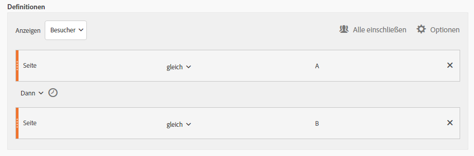

| Wenn Ergebnis… | Sequenz |
|--- |--- |
| Stimmt überein | A then B A then (in a different visit) B A then D then B |
| Stimmt nicht überein mit | B, dann A |

## „Nur vor Sequenz“ und „Nur nach Sequenz“ {#section_736E255C8CFF43C2A2CAAA6D312ED574}

Die Optionen **[!UICONTROL Nur vor Sequenz]** und **Nur nach Sequenz]filtern das Segment vor oder nach der angegebenen Sequenz nach einer Teilmenge an Daten.[!UICONTROL **

* **Nur vor Sequenz**: Umfasst alle Treffer vor einer Sequenz sowie den ersten Treffer der Sequenz selbst (siehe Beispiel 1 und 3). Wenn eine Sequenz innerhalb eines Pfads mehrmals vorkommt, umfasst „Nur vor Sequenz“ den ersten Treffer des letzten Vorkommens der Sequenz sowie alle vorangegangenen Treffer (siehe Beispiel 2).
* **Nur nach Sequenz**: Umfasst alle Treffer nach einer Sequenz sowie den letzten Treffer der Sequenz selbst (siehe Beispiel 1 und 3). Wenn eine Sequenz innerhalb eines Pfads mehrmals vorkommt, umfasst „Nur nach Sequenz“ den letzten Treffer des ersten Vorkommens der Sequenz sowie alle darauffolgenden Treffer (siehe Beispiel 2).

Betrachten wir beispielsweise eine Sequenz von B gefolgt von D. Die drei Filter würden die Treffer folgendermaßen identifizieren:

**Beispiel 1: B gefolgt von D kommt einmal vor**

| Beispiel | A | B | C | D | E | F |
|---|---|---|---|---|---|---|
| Alle einschließen | A | B | C | D | E | F |
| Nur vor Sequenz | A | B |  |  |  |  |
| Nur nach Sequenz |  |  |  | D | E | F |

**Beispiel 2: B gefolgt von D kommt mehrmals vor**

| Beispiel | A | B | C | D | B | C | D | E |
|---|---|---|---|---|---|---|---|---|
| Alle einschließen | A | B | C | D | B | C | D | E |
| Nur vor Sequenz | A | B | C | D | B |  |  |  |
| Nur nach Sequenz |  |  |  | D | B | C | D | E |

Nehmen wir zu diesem Konzept außerdem die Dimension der Treffertiefe hinzu.

**Beispiel 3: Treffertiefe 3 gefolgt von 5**

## Dimensionsbegrenzungen {#section_EAFD755F8E674F32BCE9B642F7F909DB}

In einem „Innerhalb“-Satz können Sie zwischen THEN-Anweisungen beispielsweise „innerhalb 1 Suchbegriffsinstanz“, „innerhalb 1 eVar 47-Instanz“ hinzufügen. Dadurch wird das Segment auf innerhalb einer Instanz einer Dimension beschränkt.

Durch einen ,Innerhalb von Dimension‘-Satz zwischen Regeln kann ein Segment Daten auf Sequenzen beschränken, in denen dieser Satz zutrifft. Siehe untenstehendes Beispiel, in dem die Begrenzung auf „Innerhalb 1 Seite“ festgelegt ist:

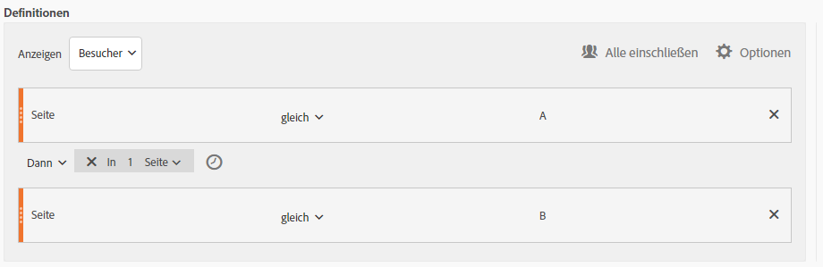

| Wenn Ergebnis… | Sequenz |
|--- |--- |
| Stimmt überein | A, dann B |
| Stimmt nicht überein mit | A then C then B (because B was not within 1 page of A) **Note:**  If the dimension restriction is taken out, &quot;A then B&quot; and &quot;A then C then B&quot; would both match. |

## Einfache Seitenansichtssequenz

Identifizieren Sie Benutzer, die eine Seite und anschließend eine andere Seite angezeigt haben. Die Daten auf Trefferebene filtern diese Sequenz ungeachtet vorheriger, letzter oder zwischenzeitlicher Besuchssitzungen oder der Zeit oder der Anzahl der Seitenansichten, die zwischenzeitlich vergangen ist bzw. erfolgt sind.

**Beispiel**: Besucher hat Seite A angezeigt und anschließend Seite B im selben oder einem anderen Besuch angezeigt.

**Anwendungsbeispiele**

Die folgenden Beispiele zeigen, wie dieses Segment verwendet werden kann.

1. Besucher einer Sport-Site sehen sich die Football-Landingpage und dann die Basketball-Landingpage in sequenzieller Reihenfolge an, aber nicht unbedingt während desselben Besuchs. Dies löst eine Kampagne aus, die während der Football-Saison Basketball-Inhalte an Football-Besucher liefert.
1. Der Händler ermittelt die Beziehung zwischen denen, die auf der Kundentreueseite landen und dann zu irgendeinem Zeitpunkt während des Besuchs oder bei einem anderen Besuch zur Videoseite wechseln.

**Dieses Segment erstellen**

Sie verschachteln zwei Seitenregeln in einem [!UICONTROL Besucherbehälter] der obersten Ebene und sequenzieren die Seitentreffer mit dem [!UICONTROL DANN]-Operator.

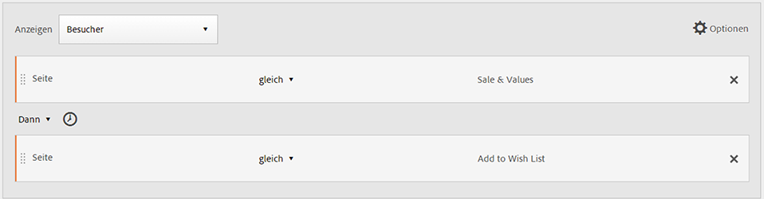

## Besuchersequenz über mehrere Besuche hinweg

Identifizieren Sie die Besucher, die aus einer Kampagne herausgefallen, aber im Rahmen einer anderen Sitzung zur Sequenz der Seitenansichten zurückgekehrt sind.

**Beispiel**: Besucher hat Seite A bei einem Besuch aufgerufen und dann Seite B in einem anderen Besuch angezeigt.

**Nutzungsszenarios**

Die folgenden Beispiele zeigen, wie dieser Segmenttyp verwendet werden kann:

* Besucher der Sportseite eine Nachrichten-Site, die anschließend in einer anderen Sitzung die Sportseite erneut besuchen.
* Ein Bekleidungshändler sieht eine Beziehung zwischen Besuchern, die in einer Sitzung auf einer Landingpage ankommen und dann in einer anderen Sitzung direkt zur Kassenseite gehen.

**Dieses Segment erstellen**

In diesem Beispiel sind zwei **[!UICONTROL Besuchebehälter]** im **[!UICONTROL Besucherbehälter]der obersten Ebene verschachtelt und das Segment ist mit dem[!UICONTROL DANN]-Operator sequenziert.**

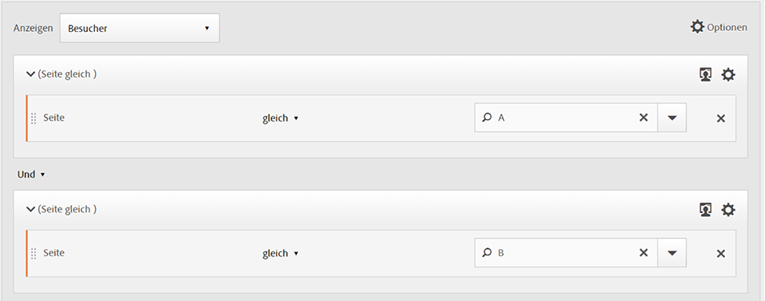

## Sequenz auf gemischten Ebenen

Erkennen von Besuchern, die bei einer nicht festgelegten Anzahl von Besuchen zwei Seiten ansehen, dann aber bei einem separaten Besuch eine dritte Seite ansehen.

**Beispiel**: Besucher besuchen Seite A und dann Seite B bei einem oder mehreren Besuchen, gefolgt von einem Besuch auf Seite C bei einem separaten Besuch.

**Nutzungsszenarios**

Die folgenden Beispiele zeigen, wie dieser Segmenttyp verwendet werden kann:

* Besucher besuchen zuerst eine Nachrichten-Site und sehen sich dann bei demselben Besuch die Sportseite an. Bei einem anderen Besuch sieht sich der Besucher die Wetterseite an.
* Ein Händler definiert Besucher, die die Hauptseite besuchen und dann zur Seite „Mein Konto“ wechseln. Bei einem anderen Besuch besuchen sie die Seite „Einkaufswagen anzeigen“.

**Dieses Segment erstellen**

1. Legen Sie zwei Seitendimensionen aus den linken Fenstern in einem [!UICONTROL Besucherbehälter] der obersten Ebene ab.
1. Fügen Sie zwischen den beiden den DANN-Operator ein. 
1. Click **[!UICONTROL Options]** &gt; **[!UICONTROL Add container]** and add a [!UICONTROL Visit] container underneath the [!UICONTROL Visitor] level and sequenced using the [!UICONTROL THEN] operator.

## Aggregations-Behälter

Durch das Hinzufügen mehrerer [!UICONTROL Trefferbehälter] innerhalb eines [!UICONTROL Besucherbehälters] können Sie die entsprechenden Operatoren zwischen identischen Behältertypen anwenden und Regeln und Dimensionen wie Seiten- und Besuchsnummer verwenden, um die Seitenansicht zu definieren und eine Sequenzdefinition innerhalb des [!UICONTROL Trefferbehälters] bereitzustellen. Wenn Sie eine Logik auf Trefferebene anwenden, können Sie Übereinstimmungen einschränken und als Treffer derselben Ebene im [!UICONTROL Besucherbehälter] kombinieren, um eine Vielzahl von Segmenttypen zu erstellen.

**Beispiel**: Die Besucher haben Seite A nach dem ersten Treffer in der Sequenz von Seitenansichten (in diesem Beispiel Seite D) besucht. Anschließend haben sie ungeachtet der Anzahl der Besuche entweder Seite B oder Seite C besucht.

**Nutzungsszenarios**

Die folgenden Beispiele zeigen, wie dieser Segmenttyp verwendet werden kann:

* Erkennen von Besuchern, die während eines Besuchs zur Haupt-Landingpage gelangen, dann bei einem anderen Besuch die Herrenbekleidungsseite ansehen und sich dann bei einem anderen Besuch entweder die Landingpage für Damen- oder Kinderbekleidung ansehen.
* Ein e-Zine erfasst Besucher, die bei einem Besuch die Homepage besuchen, bei einem anderen Besuch die Sportseite und bei einem anderen Besuch die Kommentarseite.

**Dieses Segment erstellen**

1. Wählen Sie den [!UICONTROL Besucherbehälter] als Behälter der obersten Ebene aus.
1. Fügen Sie zwei weitere Behälter der [!UICONTROL Trefferebene] hinzu – eine Dimension mit einer geeigneten numerischen Dimension wurde auf derselben [!UICONTROL Trefferebene] durch die [!UICONTROL UND]- und [!UICONTROL ODER]-Operatoren verknüpft.
1. Fügen Sie im [!UICONTROL Besuchsbehälter] einen weiteren [!UICONTROL Trefferbehälter] hinzu und verschachteln Sie zwei weitere [!UICONTROL Trefferbehälter], die mit einem [!UICONTROL ODER]- oder [!UICONTROL UND]-Operator verknüpft wurden.

   Sequenzieren Sie die verschachtelten [!UICONTROL Trefferbehälter] mit dem [!UICONTROL DANN]-Operator.

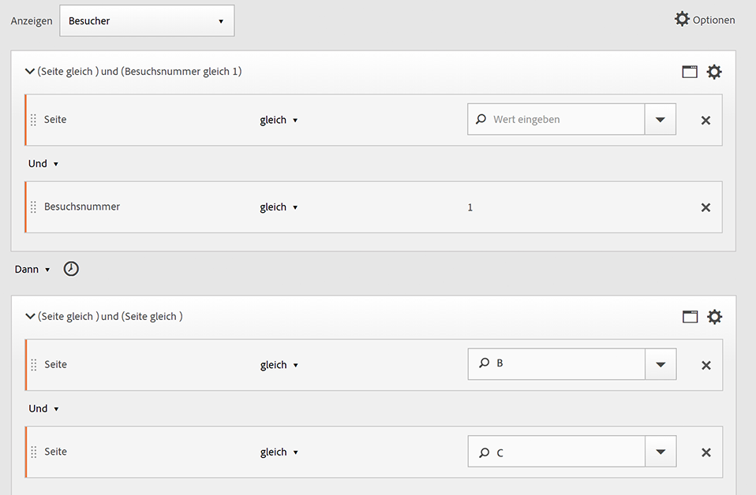

## Verschachtelung in sequenziellen Segmenten

Durch das Positionieren von Checkpoints auf [!UICONTROL Besuchs-] und [!UICONTROL Trefferebene] können Sie das Segment so einschränken, dass Anforderungen innerhalb eines spezifischen Besuchs sowie an einen spezifischen Treffer erfüllt werden.

**Beispiel**: Besucher hat Seite A besucht und dann Seite B beim selben Besuch besucht. Bei einem neuen Besuch ist der Besucher dann zur Seite C gewechselt.

**Dieses Segment erstellen**

1. Legen Sie unter einem [!UICONTROL Besuchebehälter] der obersten Ebene zwei Seitendimensionen ab.
1. Multi-select both rules, click **[!UICONTROL Options]** &gt; **[!UICONTROL Add container from selection]** and change it to a [!UICONTROL Visit] container.
1. Verbinden Sie beide mit einem [!UICONTROL DANN]-Operator.
1. Erstellen Sie einen Trefferbehälter, der gleichrangig zum [!UICONTROL Besuchebehälter] ist, und legen Sie darin eine Seitendimension ab.
1. Verknüpfen Sie die verschachtelte Sequenz im [!UICONTROL Besuchsbehälter] mit dem [!UICONTROL Trefferbehälter]. Verwenden Sie dazu einen weiteren [!UICONTROL DANN]-Operator.

## Treffer ausschließen

Segmentregeln beinhalten alle Daten, es sei denn, Sie schließen mithilfe der Regel zum [!UICONTROL Ausschließen] [!UICONTROL Besucher-], [!UICONTROL Besuchs-] oder [!UICONTROL Trefferdaten] aus. Sie ermöglicht Ihnen das Auslassen allgemeiner Daten und das gezieltere Erstellen von Segmenten. Alternativ ermöglicht sie Ihnen das Erstellen von Segmenten ohne gefundene Gruppen, um den verbleibenden Datensatz zu identifizieren. Sie können beispielsweise eine Regel erstellen, die erfolgreiche Besucher mit aufgegebenen Bestellungen einschließt und diese dann ausschließt, um die „Nicht-Käufer“ zu identifizieren. In den meisten Fällen ist es jedoch besser, Regeln zum Ausschließen umfassender Werte zu erstellen, anstelle zu versuchen, die [!UICONTROL Ausschlussregel] für spezielle Einschlusswerte zu verwenden.

Beispiel:

* **Schließen Sie Seiten aus**. Verwenden Sie eine Segmentregel, um eine spezielle Seite aus einem Bericht zu entfernen (beispielsweise die *`Home Page`*), erstellen Sie eine Trefferregel, bei der die Seite gleich &quot;Homepage&quot; ist, und schließen Sie sie dann aus. Diese Regel schließt mit Ausnahme der Homepage automatisch alle Werte ein.
* **Schließen Sie die Referrerdomäne aus**. Verwenden Sie eine Regel, die nur Referrerdomänen aus „Google.com“ einschließt und alle anderen Domänen ausschließt.
* **Identifizieren Sie Nicht-Käufer**. Bestimmen Sie, wann Bestellungen größer als null sind, und schließen Sie dann den [!UICONTROL Besucher] aus.

Der [!UICONTROL Ausschlussoperator] kann zum Identifizieren einer Sequenz verwendet werden, in der vom Besucher keine spezifischen Besuche oder Treffer ausgeführt wurden. [!UICONTROL Ausschluss-Checkpoints] können auch in eine [logische Gruppe](../../../components/c-segmentation/c-segmentation-workflow/seg-sequential-build.md#concept_23CE0E6071E14E51B494CD21A9799112).

## Ausschluss zwischen Checkpoints

Erzwingen Sie das Segmentieren von Besuchern mit einer Logik, wenn ein Checkpoint nicht explizit zwischen zwei anderen Checkpoints aufgetreten ist.

**Beispiel**: Besucher, die Seite A und anschließend Seite C - aber nicht Seite B besucht haben.

**Nutzungsszenarios**

Die folgenden Beispiele zeigen, wie dieser Segmenttyp verwendet werden kann:

* Besucher einer Lifestyle-Seite, die direkt den Theaterbereich aufsuchen, ohne die Feuilletonseite zu besuchen.
* Ein Autohändler sieht einen Zusammenhang zwischen denen, die die Haupt-Landingpage besuchen und dann direkt zur „Kein Interesse“-Kampagne wechseln, ohne die Fahrzeugseite zu besuchen.

**Dieses Segment erstellen**

Erstellen Sie ein Segment, wie Sie dies für ein  einfaches oder verschachteltes sequenzielles Segment bzw. ein Segment mit gemischten Ebenen tun würden, und legen Sie dann den [!UICONTROL AUSSCHLIESSEN]-Operator für das Behälterelement fest. Bei dem Beispiel unten handelt es sich um ein aggregiertes Segment, bei dem die drei [!UICONTROL Trefferbehälter] in die Arbeitsfläche gezogen wurden, der [!UICONTROL DANN]-Operator für die Verknüpfung mit der Behälterlogik zugeordnet wurde und dann der mittlere Seitenansichtsbehälter ausgeschlossen wurde, um nur die Besucher aufzunehmen, die in der Sequenz von Seite A zu Seite C gewechselt sind.

## Ausschluss am Anfang der Sequenz

Wenn sich der Ausschluss-Checkpoint am Anfang eines sequenziellen Segments befindet, wird sichergestellt, dass vor dem ersten nicht ausgeschlossenen Treffer keine ausgeschlossene Seitenansicht aufgetreten ist.

**Beispiel**: Besucher hat Seite A und nicht Seite B besucht.

**Nutzungsszenarios**

Im Folgenden werden Beispiele verwendet, wie dieser Segmenttyp verwendet werden kann:

* Besucher, die Seite A, aber nicht Seite B besucht haben.
* Ein Restaurant möchte treue Benutzer erkennen, die die Haupt-Landingpage umgehen und direkt zur Bestellseite navigieren.

**Dieses Segment erstellen**

Erstellen Sie zwei separate Trefferbehälter in einem Besucherbehälter der obersten Ebene. Legen Sie anschließend den [!UICONTROL AUSSCHLIESSEN]-Operator für den ersten Behälter fest.

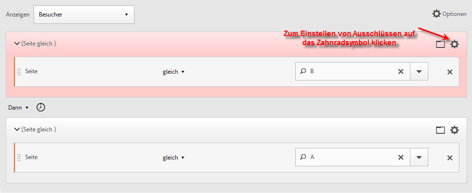

## Ausschluss am Ende der Sequenz

Wenn der Ausschluss-Checkpoint am Ende einer Sequenz liegt, wird sichergestellt, dass der Checkpoint nicht zwischen dem letzten nicht ausgeschlossenen Checkpoint und dem Ende der Besuchersequenz auftritt.

**Beispiel**: Besucher besuchen Seite A und haben dann Seite B im aktuellen oder nachfolgenden Besuch nicht besucht.

**Nutzungsszenarios**

Die folgenden Beispiele zeigen, wie dieser Segmenttyp verwendet werden kann:

* Besucher, die Seite A, aber nicht Seite B besucht haben.
* Ein Restaurant möchte treue Benutzer erkennen, die die Haupt-Landingpage umgehen und direkt zur Bestellseite navigieren.

**Dieses Segment erstellen**

Build a simple sequence segment by dragging two [!UICONTROL Hit] containers to the canvas and connecting them using the [!UICONTROL THEN] operator. Weisen Sie dann den [!UICONTROL AUSSCHLIESSEN]-Operator dem zweiten [!UICONTROL Trefferbehälter] in der Sequenz zu.

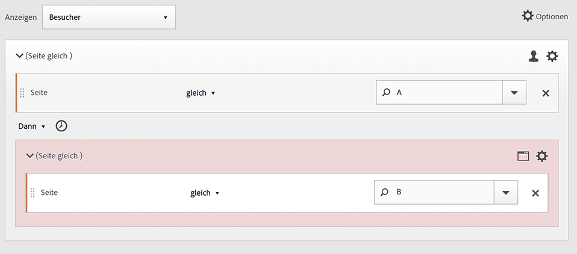

## Logische Gruppenbehälter

Innerhalb einer sequenziellen Segmentierung müssen Behälter innerhalb der [Behälterhierarchie](../../../components/c-segmentation/seg-overview.md#concept_A38E7000056547399E346559D85E2551) streng geordnet werden. Der [!UICONTROL logische Gruppenbehälter] wurde für den Einsatz konzipiert, wenn in sequenziellen Segmenten Behälter einer höheren Ebene erforderlich sind, um Besucher weiter zu filtern und um komplexe, verschachtelte Einschränkungen auf Besucherebene zum Präzisieren des Segments bereitzustellen.

| Standardbehälterhierarchie |
|---|
|  |
| Innerhalb des [!UICONTROL Besuchercontainers] werden die Container für [!UICONTROL Besuche] und [!UICONTROL Treffer] in einer Sequenz verschachtelt, um Segmente basierend auf Treffern, der Anzahl der Besuche und basierend auf dem Besucher zu extrahieren. |

>[!NOTE]
>
>A [!UICONTROL Logic Group] can only be defined in a sequential segment, meaning that the [!UICONTROL THEN] operator is used within the expression.

Ein [!UICONTROL logischer Gruppenbehälter] behandelt mehrere Checkpoints als Gruppe ohne Sortierung. Sie können beispielsweise einen [!UICONTROL Besucherbehälter] nicht in einem [!UICONTROL Besuchsbehälter] verschachteln. Stattdessen können Sie jedoch einen [!UICONTROL logischen Gruppenbehälter] in einem [!UICONTROL Besucherbehälter] verschachteln, indem Sie spezielle Checkpoints auf [!UICONTROL Besuchs-] und [!UICONTROL Trefferebene] verwenden.

| Nicht-Standardhierarchie für logische Behälter |
|---|
| 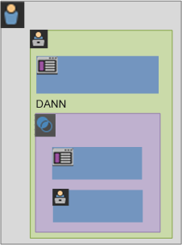 |
| Die Standardbehälterhierarchie ist auch außerhalb des [!UICONTROL logischen Gruppenbehälters] erforderlich. Innerhalb des [!UICONTROL logischen Gruppenbehälters] ist für die Checkpoints jedoch keine bestimmte Reihenfolge oder Hierarchie erforderlich. Diese Checkpoints müssen einfach vom Besucher in beliebiger Reihenfolge getroffen werden. |

## Build a Logic Group segment {#section_A5DDC96E72194668AA91BBD89E575D2E}

[!UICONTROL Logische Gruppenbehälter] können wie andere Behälter auch auf  mehrere Arten innerhalb von [!UICONTROL Segment Builder] erstellt werden. Hier finden Sie eine bevorzugte Methode zum Verschachteln von [!UICONTROL logischen Gruppenbehältern]:

1. Ziehen Sie Dimensionen, Ereignisse oder Segmente aus den linken Fenstern.
1. Ändern Sie den oberen Behälter in einen [!UICONTROL Besucher]behälter.
1. Ändern Sie den standardmäßig eingefügten [!UICONTROL UND]- oder [!UICONTROL ODER]-Operator in den DANN-Operator.
1. Select the [!UICONTROL Hit] containers (the Dimension, Event, or Item) and click **[!UICONTROL Options]** &gt; **[!UICONTROL Add container from selection]**.
1. Klicken Sie auf das Behältersymbol und wählen Sie **[!UICONTROL Logische Gruppe aus]**.  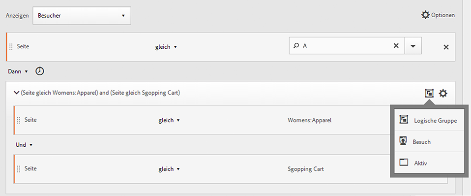
1. Nun können Sie die [!UICONTROL Treffer] im [!UICONTROL logischen Gruppenbehälter] ungeachtet der Hierarchie festlegen.

## Checkpoints für logische Gruppen in beliebiger Reihenfolge

Die Verwendung der [!UICONTROL logischen Gruppe] ermöglicht Ihnen das Erfüllen von Bedingungen innerhalb der jeweiligen Gruppe, die sich außerhalb der Sequenz befinden. Dies ermöglicht Ihnen das Erstellen von Segmenten, in denen ungeachtet der normalen Hierarchie ein [!UICONTROL Besuchs-] oder [!UICONTROL Trefferbehälter] existiert.****

**Beispiel**: Besucher, die Seite A und dann Seite B und C in beliebiger Reihenfolge besucht haben.

**Dieses Segment erstellen**

Seite B und C sind in einem [!UICONTROL logischen Gruppenbehälter] innerhalb des äußeren [!UICONTROL Besucherbehälters] verschachtelt. Der [!UICONTROL Trefferbehälter] für A wird anschließend vom [!UICONTROL logischen Gruppenbehälter] gefolgt, wobei B und C mithilfe des [!UICONTROL UND]-Operators identifiziert werden. Da sie sich in der [!UICONTROL logischen Gruppe] befindet, wird die Sequenz nicht definiert und durch einen Treffer auf Seite B oder C wird das Argument wahr.

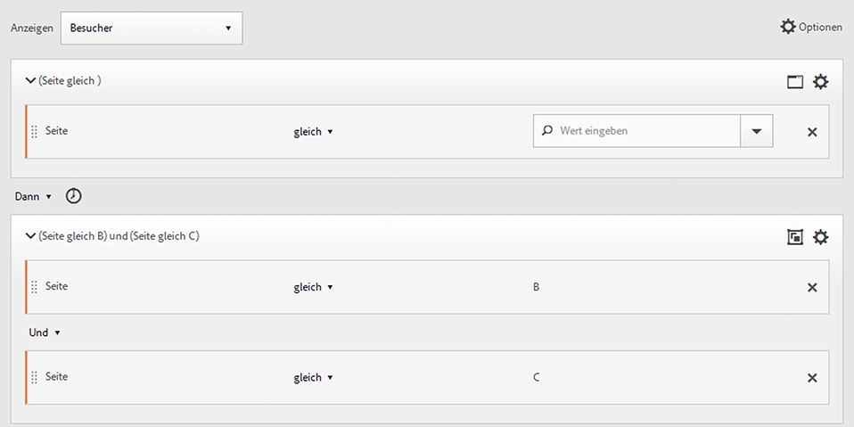

## Logische Gruppe, erste Übereinstimmung

Die Verwendung der [!UICONTROL logischen Gruppe] ermöglicht Ihnen das Erfüllen von Bedingungen innerhalb der jeweiligen Gruppe, die sich außerhalb der Sequenz befinden. In diesem nicht geordneten Segment der ersten Übereinstimmung werden die Regeln der [!UICONTROL logischen Gruppe] zuerst als Seitenansicht von Seite B oder C und dann als erforderliche Ansicht von Seite A identifiziert.

**Beispiel**: Besucher, die Seite B oder C und dann Seite A besucht haben.

**Dieses Segment erstellen**

Die Dimensionen von Seite B und C werden innerhalb eines [!UICONTROL logischen Gruppenbehälters] gruppiert, wobei der [!UICONTROL ODER]-Operator ausgewählt ist. Dann folgt der [!UICONTROL Trefferbehälter], der eine Seitenansicht von Seite A als Wert definiert.

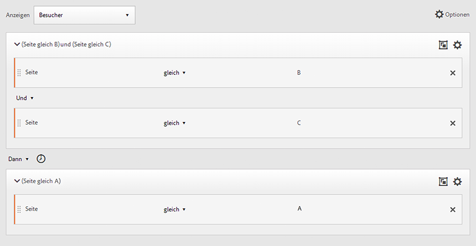

## Logische Gruppe ausgeschlossen UND

Erstellen Sie mithilfe der [!UICONTROL logischen Gruppe] Segmente, wobei mehrere Seitenansichten aggregiert werden, um zu definieren, welche Seiten getroffen werden müssen, während andere Seiten speziell ausgelassen wurden. ****

**Beispiel**: Besucher hat Seite A besucht und dann explizit Seite B oder C nicht besucht, aber Treffer D.

**Dieses Segment erstellen**

Erstellen Sie dieses Segment, indem Sie Dimensionen, Ereignisse und vorgefertigte Segmente aus den linken Fenstern ziehen. Siehe [Erstellen eines logischen Gruppensegments](../../../components/c-segmentation/c-segmentation-workflow/seg-sequential-build.md#concept_23CE0E6071E14E51B494CD21A9799112).

Klicken Sie nach dem Verschachteln der Werte in der [!UICONTROL logischen Gruppe] im **[!UICONTROL logischen Gruppenbehälter]** auf die Schaltfläche [!UICONTROL Ausschließen].

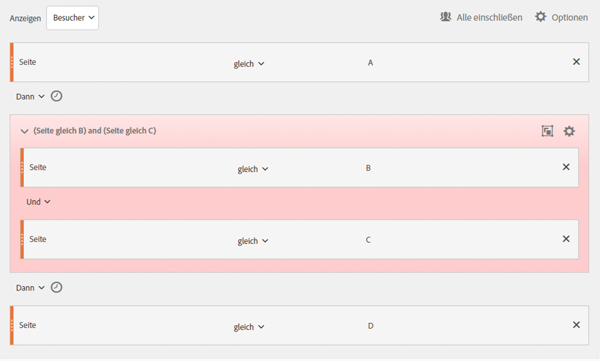

## Logische Gruppe schließt ODER ein

Erstellen Sie mithilfe der [!UICONTROL logischen Gruppe] Segmente, wobei mehrere Seitenansichten aggregiert werden, um zu definieren, welche Seiten getroffen werden müssen, während andere Seiten speziell ausgelassen wurden.

**Beispiel**: Besucher, die Seite A, aber Seite B oder C nicht vor Seite A besucht haben.

**Dieses Segment erstellen**

Die ursprünglichen Seiten B und C werden in einem ausgeschlossenen [!UICONTROL logischen Gruppenbehälter] identifiziert und werden dann von einem Treffer auf Seite A durch den Besucher gefolgt.

Erstellen Sie dieses Segment, indem Sie Dimensionen, Ereignisse und vorgefertigte Segmente aus den linken Fenstern ziehen.

Klicken Sie nach dem Verschachteln der Werte in der [!UICONTROL logischen Gruppe] im **[!UICONTROL logischen Gruppenbehälter]** auf die Schaltfläche [!UICONTROL Ausschließen].

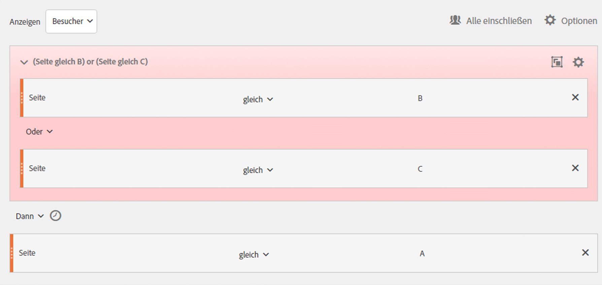

## Zeit- und Uhrzeit-Segmente erstellen

Mithilfe der in die Kopfzeilen der einzelnen Behälter integrierten [!UICONTROL In]- und [!UICONTROL Nach]-Operatoren können Sie die Zeit, Ereignisse und Anzahl definieren.

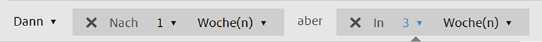

Mit den [!UICONTROL In]- und [!UICONTROL Nach]-Behältern und durch Angabe einer Granularität und Anzahl können Sie die Übereinstimmung auf eine angegebene Zeitdauer beschränken. Der [!UICONTROL In]-Operator wird zum Angeben einer maximalen Zeitbegrenzung zwischen zwei Checkpoints verwendet. Mit dem [!UICONTROL Nach]-Operator wird eine minimale Zeitbegrenzung zwischen zwei Checkpoints angegeben.

## Nach- und In-Operatoren {#section_CCAF5E44719447CFA7DF8DA4192DA6F8}

Die Dauer wird durch einen einzelnen Großbuchstaben für die Granularität gefolgt von einer Zahl für die Wiederholungszahl der Granularität angegeben.

**[!UICONTROL In]** schließt den Endpunkt ein (kleiner gleich).

**[!UICONTROL Nach]** schließt den Endpunkt nicht mit en (größer als).

| Operatoren | Beschreibung |
|--- |--- |
| NACH | Der Nach-Operator wird zum Angeben einer minimalen Zeitbegrenzung zwischen zwei Checkpoints verwendet. Beim Festlegen der Nach-Werte beginnt die Zeitbegrenzung mit dem Anwenden des Segments. Wenn beispielsweise der Nach-Operator in einem Behälter so eingestellt ist, dass Besucher, die Seite A besuchen, aber nicht zurückkehren, um Seite B zu besuchen, erst nach einem Tag besucht werden, beginnt dieser Tag, wenn der Besucher Seite A verlässt. Damit der Besucher in das Segment einbezogen wird, müssen nach dem Verlassen von Seite A zur Anzeige von Seite B mindestens 1.440 Minuten (ein Tag) vergehen. |
| IN | Der In-Operator wird zum Angeben einer maximalen Zeitbegrenzung zwischen zwei Checkpoints verwendet. Wenn beispielsweise der In-Operator in einem Behälter festgelegt ist, um Besucher zu identifizieren, die Seite A besuchen und dann innerhalb eines Tages zum Besuch Seite B zurückkehren, beginnt dieser Tag, wenn der Besucher Seite A verlässt. Um in das Segment aufzunehmen, hat der Besucher eine maximale Zeit von einem Tag, bevor Seite B geöffnet wird. Damit der Besucher in das Segment einbezogen wird, muss der Besuch auf Seite B innerhalb von maximal 1440 Minuten (ein Tag) erfolgen, nachdem Seite A zur Anzeige von Seite B verlassen wurde. |
| NACH/IN | Beim Verwenden der Nach- und In-Operatoren gilt es zu beachten, dass beide Operatoren parallel und nicht sequenziell beginnen und enden.   For example, if you build a segment with the container set to: `After = 1 Week(s) and Within = 2 Week(s)` Then the conditions to identify visitors in the segment are met only between 1 and 2 weeks. Beide Bedingungen werden vom Zeitpunkt des ersten Seitentreffers an erzwungen. |

## Verwenden des Nach-Operators

* Der Nach-Zeitoperator ermöglicht Ihnen eine Verfolgung nach Jahr, Monat, Tag, Stunde und Minute, um Besuche zuzuordnen.
* Der Nach-Zeitoperator kann nur auf einen [!UICONTROL Trefferbehälter] angewendet werden, da dies die einzige Ebene ist, für die eine solch feine Granularität definiert ist.

**Beispiel**: Besucher, die Seite A besucht haben und anschließend erst nach 2 Wochen Seite B besucht haben. ****

**Erstellen Sie das Segment**: Dieses Segment wird erstellt, indem ein [!UICONTROL Besucherbehälter] mit zwei [!UICONTROL Trefferbehältern] hinzugefügt wird. Anschließend können Sie den [!UICONTROL DANN]-Operator festlegen und die Dropdown-Liste für den [!UICONTROL NACH]-Operator öffnen, um die Wochenanzahl festzulegen.

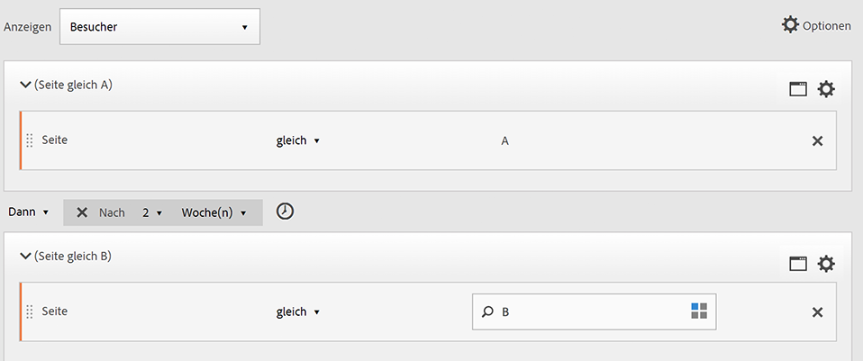

**Stimmt überein mit**

Wenn „Nach 2 Wochen“ festgelegt ist und am 1. Juni 2019 um 00:01 Uhr auf Seite A ein Treffer stattfindet, stimmt ein darauf folgender Treffer auf Seite B überein, sofern er vor dem 15. Juni 2019 um 00:01 Uhr (14 Tage später) erfolgt. 

| Treffer A | Treffer B | Übereinstimmend |
|--- |--- |--- |
| Treffer **A**: 01. Juni 2019 00:01 | Treffer **B**: 15. Juni 2019 00:01 | **Übereinstimmungen:** Diese Zeitbeschränkung stimmt überein, weil sie Nach dem 1. Juni 2019 (zwei Wochen) liegt. |
| Treffer **A**: 01. Juni 2019 00:01 | **** Treffer B: Treffer 00:2019 00:01 B: 15. Juni 2019 00:01 | **Stimmt nicht überein:** Der erste Treffer auf Seite B stimmt nicht überein, weil er mit der Beschränkung in Konflikt gerät, laut der er nach zwei Wochen erforderlich ist. |

## Verwenden des In-Operators

* Mit dem [!UICONTROL In]-Operator können Sie eine Verfolgung nach Jahr, Monat, Tag, Stunde und Minute ausführen, um Besuche zuzuordnen.
* Der [!UICONTROL In]-Operator kann nur auf einen [!UICONTROL Trefferbehälter] angewendet werden, da dies die einzige Ebene ist, für die eine solch feine Granularität definiert ist.

>[!IMPORTANT]
>
>In einem „Innerhalb“-Satz können Sie zwischen THEN-Anweisungen beispielsweise „innerhalb 1 Suchbegriffsinstanz“, „innerhalb 1 eVar 47-Instanz“ hinzufügen. Dadurch wird das Segment auf innerhalb einer Instanz einer Dimension beschränkt.

**Beispiel**: Besucher, die Seite A besucht haben, dann innerhalb von 5 Minuten Seite B besucht haben.

**Erstellen Sie das Segment**: Dieses Segment wird erstellt, indem ein [!UICONTROL Besucherbehälter] hinzugefügt und dann zwei [!UICONTROL Trefferbehälter] gezogen werden. Dann können Sie den [!UICONTROL DANN]-Operator festlegen und das Dropdown-Feld [!UICONTROL NACH] öffnen, um das Intervall festzulegen: Treffer, Seitenansichten, Besuche, Minuten, Stunden, Tage, Wochen, Monate, Quartale oder Jahre.

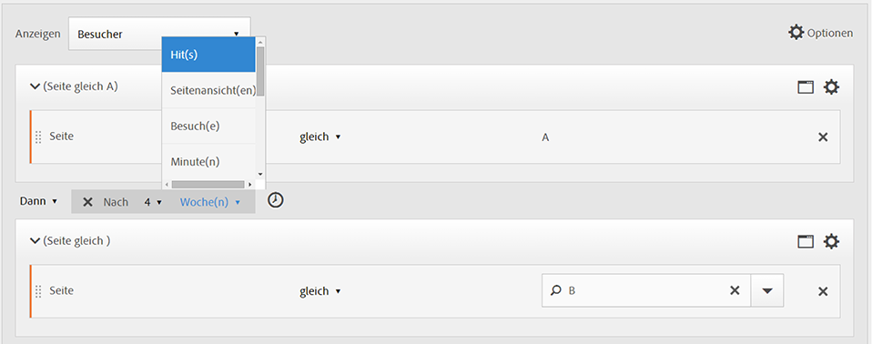

**Stimmt überein mit**

Übereinstimmungen müssen innerhalb der Zeitbeschränkung erfolgen. Für den Ausdruck gilt: Wenn ein Besucher die Seite A um 00:01 Uhr trifft, stimmt ein folgenden Treffer auf Seite B überein, sofern er auf oder vor 00:06 (fünf Minuten später, einschließlich derselben Minute) eintritt. Mit Treffern innerhalb derselben Minuten werden ebenfalls Treffer erzielt.

## Die In- und Nach-Operatoren

Verwenden Sie die [!UICONTROL In]- und [!UICONTROL Nach]-Operatoren zum Bereitstellen eines maximalen und minimalen Endpunkts an beiden Enden eines Segments.

**Beispiel**: Besucher, die Seite A besucht haben, dann nach 2 Wochen, aber innerhalb eines Monats Seite B besucht haben.

**Erstellen Sie das Segment**: Erstellen Sie das Segment, indem Sie zwei [!UICONTROL Trefferbehälter] in einem [!UICONTROL Besucherbehälter] sequenzieren. Legen Sie anschließend die [!UICONTROL Nach]- und [!UICONTROL In]-Operatoren fest.

**Stimmt überein mit**

Es werden alle Besucher in das Segment eingeschlossen, die am 1. Juni 2019 auf Seite A einen Treffer erzielen und die nach dem 15. Juni 2019, aber *vor* dem 1. Juli 2019 zurückkehren. Siehe im Vergleich [Zeit zwischen Ausschlüssen](../../../components/c-segmentation/c-segmentation-workflow/seg-sequential-build.md#concept_C5CB0A391B7C4AC8A95B9724A14E28E8).

Die [!UICONTROL Nach]- und [!UICONTROL In]-Operatoren können zusammen verwendet werden, um ein sequenzielles Segment zu definieren.

In diesem Beispiel wird ein zweiter Besuch zum Erzielen eines Treffers auf Seite B nach zwei Wochen aber innerhalb eines Monats dargestellt.
