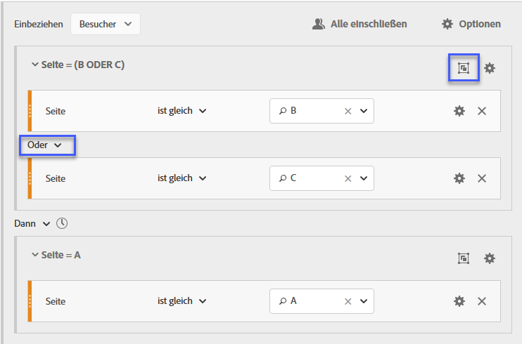

# Sequentielle Segmente erstellen

Sequenzielle Segmente werden über den DANN-Operator anstelle von UND oder ODER erstellt. DANN gibt an, dass ein Segmentkriterium gefolgt von einem anderen auftritt. Standardmäßig identifiziert ein sequenzielles Segment alle übereinstimmenden Daten mit dem Filter „Alle einschließen“. Sequenzielle Segmente können außerdem nach einer Teilmenge an übereinstimmenden Treffern über die Optionen „Nur vor Sequenz“ und „Nur nach Sequenz“ weiter gefiltert werden.

Darüber hinaus können Sie sequenzielle Segmente nach spezifischer Zeitdauer, Granularität und Anzahl zwischen Checkpoints beschränken. Verwenden Sie dazu die [Nach- und In-Operatoren](/help/components/c-segmentation/c-segmentation-workflow/seg-sequential-build.md).

## Alle einschließen {#section_75ADDD5D41F04800A09E592BB2940B35}

Wenn bei der Erstellung eines Segments „Alle einschließen“ ausgewählt ist, identifiziert das Segment Pfade, die mit dem jeweiligen Muster insgesamt übereinstimmen. Dies ist ein Beispiel für ein einfaches Sequenzsegment, das nach einem Hit sucht (Seite A), gefolgt von einem anderen (Seite B), der vom gleichen Besucher besucht wurde. Das Segment ist auf Alle einschließen eingestellt.

| Wenn Ergebnis... | Sequenz |
|--- |--- |
| Stimmt überein | A, dann B A, dann B (in einem anderen Besuch) B A, dann D, dann B |
| Stimmt nicht überein mit | B, dann A |

## „Nur vor Sequenz“ und „Nur nach Sequenz“  {#section_736E255C8CFF43C2A2CAAA6D312ED574}

Die Optionen **[!UICONTROL Only Before Sequence]** und **[!UICONTROL Only After Sequence]** filtern das Segment in eine Untergruppe von Daten vor oder nach der angegebenen Sequenz.

* **Nur vor Sequenz**: Umfasst alle Treffer vor einer Sequenz sowie den ersten Treffer der Sequenz selbst (siehe Beispiel 1 und 3). Wenn eine Sequenz innerhalb eines Pfads mehrmals vorkommt, umfasst „Nur vor Sequenz“ den ersten Treffer des letzten Vorkommens der Sequenz sowie alle vorangegangenen Treffer (siehe Beispiel 2).
* **Nur nach Sequenz**: Umfasst alle Treffer nach einer Sequenz sowie den letzten Treffer der Sequenz selbst (siehe Beispiel 1 und 3). Wenn eine Sequenz innerhalb eines Pfads mehrmals vorkommt, umfasst „Nur nach Sequenz“ den letzten Treffer des ersten Vorkommens der Sequenz sowie alle darauffolgenden Treffer (siehe Beispiel 2).

Betrachten Sie zum Beispiel eine Sequenz von B -> D. Die drei Filter würden die Treffer wie folgt identifizieren:

**Beispiel 1: B, dann D wird einmal angezeigt**

| Beispiel | A | B | C | D | E | Fr |
|---|---|---|---|---|---|---|
| Alle einschließen | A | B | C | D | E | Fr |
| Nur vor Sequenz | A | B |  |  |  |  |
| Nur nach Sequenz |  |  |  | D | E | Fr |

**Beispiel 2: B, dann D wird mehrmals angezeigt**

| Beispiel | A | B | C | D | B | C | D | E |
|---|---|---|---|---|---|---|---|---|
| Alle einschließen | A | B | C | D | B | C | D | E |
| Nur vor Sequenz | A | B | C | D | B |  |  |  |
| Nur nach Sequenz |  |  |  | D | B | C | D | E |

Nehmen wir zu diesem Konzept außerdem die Dimension der Treffertiefe hinzu.

**Beispiel 3: Treffertiefe 3 gefolgt von 5**

## Dimensionsbegrenzungen {#section_EAFD755F8E674F32BCE9B642F7F909DB}

In einem „Innerhalb“-Satz können Sie zwischen DANN-Anweisungen beispielsweise „innerhalb 1 Suchbegriffsinstanz“, „innerhalb 1 eVar 47-Instanz“ hinzufügen. Dadurch wird das Segment auf innerhalb einer Instanz einer Dimension beschränkt.

Durch einen „Innerhalb von Dimension“-Satz zwischen Regeln kann ein Segment Daten auf Sequenzen beschränken, in denen dieser Satz zutrifft. Siehe untenstehendes Beispiel, in dem die Begrenzung auf „Innerhalb 1 Seite“ festgelegt ist:

| Wenn Ergebnis... | Sequenz |
|--- |--- |
| Stimmt überein | A, dann B |
| Stimmt nicht überein mit | A, dann C, dann B (da B nicht innerhalb einer Seite von A war) **Hinweis:** Wenn die Dimensionsbeschränkung entfernt wird, stimmen „A, dann B“und „A, dann C, dann B“ überein. |

## Einfache Seitenansichtssequenz

Identifizieren Sie Besucher, die eine Seite angezeigt und dann eine andere Seite angezeigt haben. Die Daten auf Trefferebene filtern diese Sequenz unabhängig von vorherigen, vorherigen oder zwischenzeitlichen Besuchssitzungen oder der Ansicht bzw. Anzahl der dazwischen auftretenden Seitenaufrufe.

**Beispiel**: Besucher hat Seite A angesehen, dann Seite B bei demselben oder einem anderen Besuch.

**Anwendungsbeispiele**

Die folgenden Beispiele zeigen, wie das Segment verwendet werden kann.

1. Besucher zu einer Sportseite Ansicht der Fußball-Landingpage und dann Ansicht der Basketball-Landingpage in sequenzieller Reihenfolge, aber nicht unbedingt beim gleichen Besuch. Dies veranlasst eine Kampagne, während der Fußballsaison Basketball-Inhalte an Football-Zuschauer zu übertragen.
1. Der Händler identifiziert eine Beziehung zwischen denjenigen, die auf der Seite &quot;Kundentreue&quot;landen und dann während des Besuchs oder eines anderen Besuchs jederzeit zur Videoseite wechseln.

**Dieses Segment erstellen**

You nest two page rules within a top-level [!UICONTROL Visitor] container and sequence the page hits using the [!UICONTROL THEN] operator.

## Besuchsübergreifende Besuchersequenz

Identifizieren Sie die Besucher, die aus einer Kampagne herausgefallen, aber im Rahmen einer anderen Sitzung zur Sequenz der Seitenansichten zurückgekehrt sind.

**Beispiel**: Besucher hat Seite A in einem Besuch aufgerufen und dann Seite B in einem anderen Besuch besucht.

**Nutzungsszenarios**

Die folgenden Beispiele zeigen, wie dieser Segmenttyp verwendet werden kann:

* Besucher auf der Sportseite einer News-Site besuchen dann die Sportseite in einer anderen Sitzung erneut.
* Ein Bekleidungshändler sieht eine Beziehung zwischen Besuchern, die in einer Sitzung auf einer Landingpage landen und dann in einer anderen Sitzung direkt zur Kasse gehen.

**Dieses Segment erstellen**

This example nests two **[!UICONTROL Visit]** containers within the top-level **[!UICONTROL Visitor]** container and sequences the segment using the [!UICONTROL THEN] operator.

## Sequenz mit gemischten Ebenen

Erkennen von Besuchern, die bei einer nicht festgelegten Anzahl von Besuchen zwei Seiten ansehen, dann aber bei einem separaten Besuch eine dritte Seite ansehen.

**Beispiel**: Besucher besuchen Seite A und dann Seite B bei einem oder mehreren Besuchen, gefolgt von einem Besuch der Seite C bei einem separaten Besuch.

**Nutzungsszenarios**

Die folgenden Beispiele zeigen, wie dieser Segmenttyp verwendet werden kann:

* Besucher besuchen zuerst eine News-Site und dann die Sportseite im selben Besuch. Bei einem anderen Besuch besucht der Besucher die Wetterseite.
* Einzelhändler definiert Besucher, die die Hauptseite aufrufen und dann zur Seite &quot;Mein Konto&quot;wechseln. Bei einem anderen Besuch besuchen sie die Seite &quot;Ansicht Warenkorb&quot;.

**Dieses Segment erstellen**

1. Legen Sie zwei Seitendimensionen aus den linken Fenstern in einem [!UICONTROL Visitor] Container der obersten Ebene ab.
1. Fügen Sie zwischen den beiden den DANN-Operator ein.
1. Klicken Sie auf **[!UICONTROL Options]** > **[!UICONTROL Add container]** und fügen Sie einen [!UICONTROL Visit] Container unterhalb der [!UICONTROL Visitor] Ebene hinzu, der mithilfe des [!UICONTROL THEN] Operators sequenziert wird.

## Aggregieren von Containern

Durch Hinzufügen mehrerer [!UICONTROL Hit] Container innerhalb eines [!UICONTROL Visitor] Containers können Sie die entsprechenden Operatoren zwischen demselben Container verwenden und Regeln und Dimensionen wie Seiten- und Besuchsnummer verwenden, um die Ansicht der Seite zu definieren und eine Sequenzdimension innerhalb des [!UICONTROL Hit] Containers bereitzustellen. Durch Anwendung der Logik auf Trefferebene können Sie Übereinstimmungen auf derselben Trefferebene innerhalb des [!UICONTROL Visitor] Containers einschränken und kombinieren, um eine Vielzahl von Segmenttypen zu erstellen.

**Beispiel**: Besucher besuchten Seite A nach dem ersten Treffer in der Sequenz von Ansichten (in diesem Beispiel Seite D) und besuchten dann ungeachtet der Anzahl der Besuche entweder Seite B oder Seite C.

**Nutzungsszenarios**

Die folgenden Beispiele zeigen, wie dieser Segmenttyp verwendet werden kann:

* Identifizieren Sie Besucher, die bei einem Besuch zur Haupt-Landingpage gehen, und führen Sie dann bei einem anderen Besuch die Ansicht der Herrenbekleidungsseite und dann bei einem anderen Besuch die Ansicht der Landingpage &quot;Damen&quot;oder &quot;Kinder&quot;durch.
* Ein e-Zine erfasst die Besucher, die bei einem Besuch zur Startseite gehen, bei einem anderen Besuch zur Sportseite und bei einem anderen Besuch zur Meinungsseite.

**Dieses Segment erstellen**

1. Wählen Sie den [!UICONTROL Visitor] Container als Container der obersten Ebene aus.
1. Hinzufügen Container mit zwei [!UICONTROL Hit]Ebenen - eine Dimension mit einer entsprechenden numerischen Dimension wird auf derselben [!UICONTROL Hit] Ebene durch den [!UICONTROL AND] Operator und den [!UICONTROL OR] -Operator verbunden.
1. Fügen Sie innerhalb des [!UICONTROL Visit] Containers einen weiteren [!UICONTROL Hit] Container hinzu und verschachteln Sie zwei zusätzliche [!UICONTROL Hit] Container, die mit einem [!UICONTROL OR] oder [!UICONTROL AND] -Operator verbunden sind.

   Sequenzieren Sie diese verschachtelten [!UICONTROL Hit] Container mit dem [!UICONTROL THEN] -Operator.

## „Verschachtelung“ in sequenziellen Segmenten

By placing checkpoints at both the [!UICONTROL Visit] and [!UICONTROL Hit] level, you can constrain the segment to meet requirements within a specific visit as well as a specific hit.

**Beispiel**: Besucher hat Seite A und dann Seite B im selben Besuch besucht. Bei einem neuen Besuch ist der Besucher dann zur Seite C gewechselt.

**Dieses Segment erstellen**

1. Underneath a top-level [!UICONTROL Visit] container, drag in two page dimensions.
1. Wählen Sie beide Regeln aus, klicken Sie auf **[!UICONTROL Options]** > **[!UICONTROL Add container from selection]** und ändern Sie sie in einen [!UICONTROL Visit] Container.
1. Verbinden Sie sie mit einem [!UICONTROL THEN] Operator.
1. Erstellen Sie einen Container für Treffer als Peer zum [!UICONTROL Visit] Container und ziehen Sie in eine Seitendimension.
1. Verknüpfen Sie die verschachtelte Sequenz im [!UICONTROL Visit] Container mit dem [!UICONTROL Hit] Container mit einem anderen [!UICONTROL THEN] -Operator.

## Treffer ausschließen

Segmentregeln beinhalten alle Daten, es sei denn, Sie schließen [!UICONTROL Visitor], [!UICONTROL Visit]oder [!UICONTROL Hit] Daten mithilfe der [!UICONTROL Exclude] Regel aus. Dadurch können Sie allgemeine Daten löschen und Segmente mit mehr Fokus erstellen. Sie können auch Segmente ohne gefundene Gruppen erstellen, um den verbleibenden Datensatz zu identifizieren, z. B. eine Regel zu erstellen, die erfolgreiche Besucher umfasst, die Bestellungen aufgegeben haben, und diese dann auszuschließen, um &quot;Nicht-Käufer&quot;zu identifizieren. In den meisten Fällen ist es jedoch besser, Regeln zu erstellen, die breite Werte ausschließen, anstatt die [!UICONTROL Exclude] Regel zur Zielgruppe spezifischer Einschlusswerte zu verwenden.

Beispiel:

* **Schließen Sie Seiten** aus. Verwenden Sie eine Segmentregel, um eine spezielle Seite aus einem Bericht zu entfernen (beispielsweise die  *`Home Page`*), erstellen Sie eine Trefferregel, bei der die Seite der „Homepage“ entspricht, und schließen Sie sie dann aus. Diese Regel enthält automatisch alle Werte außer der Startseite.
* **Schließen Sie die Referrerdomäne aus**. Verwenden Sie eine Regel, die nur verweisende Domänen von Google.com enthält und alle anderen Domänen ausschließt.
* **Identifizieren Sie Nicht-Käufer**. Identifizieren Sie, wenn die Bestellungen größer als null sind, und schließen Sie dann die [!UICONTROL Visitor].

Der [!UICONTROL Exclude] Operator kann verwendet werden, um eine Sequenz zu identifizieren, in der der Besucher keine spezifischen Besuche oder Treffer ausführt. [!UICONTROL Exclude Checkpoints] kann auch in eine [logische Gruppe](/help/components/c-segmentation/c-segmentation-workflow/seg-sequential-build.md)einbezogen werden.

### Ausschluss zwischen Checkpoints

Erzwingen Sie das Segmentieren von Besuchern mit einer Logik, wenn ein Checkpoint nicht explizit zwischen zwei anderen Checkpoints aufgetreten ist.

**Beispiel**: Besucher, die Seite A besucht haben und anschließend Seite C – ohne Seite B besucht zu haben.

**Nutzungsszenarios**

Die folgenden Beispiele zeigen, wie dieser Segmenttyp verwendet werden kann:

* Besucher zu einer Lifestyle-Seite und dann zum Theaterbereich, ohne zur Arts-Seite zu gehen.
* Ein Autohändler sieht eine Beziehung zwischen denen, die die Hauptversion besuchen und dann direkt zur Kampagne &quot;Kein Interesse&quot;gehen, ohne zur Fahrzeugseite zu gehen.

**Dieses Segment erstellen**

Erstellen Sie ein Segment, wie Sie dies für ein  simple, mixed-level, or nested sequential segment and then set the [!UICONTROL EXCLUDE] operator for the container element. Das folgende Beispiel zeigt ein Aggregat-Segment, bei dem die drei [!UICONTROL Hit] Container auf die Arbeitsfläche gezogen werden. Dabei handelt es sich um den [!UICONTROL THEN] Operator, der der Logik des Containers zugeordnet ist, und der Container der mittleren Ansicht wird dann ausgeschlossen, sodass nur Besucher berücksichtigt werden, die in der Sequenz von Seite A zu Seite C auftraten.

### Ausschluss am Anfang der Sequenz

Wenn sich der Ausschluss-Checkpoint am Anfang eines sequenziellen Segments befindet, wird sichergestellt, dass vor dem ersten nicht ausgeschlossenen Treffer keine ausgeschlossene Seitenansicht aufgetreten ist.

**Beispiel**: Besucher hat Seite A und nicht Seite B besucht.

**Nutzungsszenarios**

Die folgenden Anwendungsbeispiele zeigen, wie dieser Segmenttyp verwendet werden kann:

* Besucher, die Seite A besucht haben und nicht Seite B besucht haben.
* Ein Restaurant möchte erwachsene Benutzer sehen, die die Hauptversion vermeiden und direkt zur Bestellseite gehen.

**Dieses Segment erstellen**

Erstellen Sie zwei separate Trefferbehälter in einem Besucherbehälter der obersten Ebene. Legen Sie dann den [!UICONTROL EXCLUDE] Operator für den ersten Container fest.

### Ausschluss am Ende der Sequenz

Wenn der Ausschluss-Checkpoint am Ende einer Sequenz liegt, wird sichergestellt, dass der Checkpoint nicht zwischen dem letzten nicht ausgeschlossenen Checkpoint und dem Ende der Besuchersequenz auftritt.

**Beispiel**: Besucher besuchen Seite A und sie haben dann im aktuellen Besuch oder in darauf folgenden Besuchen nicht Seite B besucht.

**Nutzungsszenarios**

Die folgenden Beispiele zeigen, wie dieser Segmenttyp verwendet werden kann:

* Besucher, die Seite A besucht haben und nicht Seite B besucht haben.
* Ein Restaurant möchte erwachsene Benutzer sehen, die die Hauptversion vermeiden und direkt zur Bestellseite gehen.

**Dieses Segment erstellen**

Build a simple sequence segment by dragging two [!UICONTROL Hit] containers to the canvas and connecting them using the [!UICONTROL THEN] operator. Then assign the [!UICONTROL EXCLUDE] operator to the second [!UICONTROL Hit] container in the sequence.

## Logische Gruppencontainer

Logische Gruppencontainer sind erforderlich, um Bedingungen in einem einzigen sequenziellen Segment-Checkpoint zu gruppieren. Der spezielle logische Gruppencontainer ist nur in der sequenziellen Segmentierung verfügbar, um sicherzustellen, dass seine Bedingungen nach einem vorherigen sequenziellen Checkpoint und vor einem nachfolgenden sequenziellen Checkpoint erfüllt werden. Die Bedingungen innerhalb des Checkpoints für logische Gruppen können in beliebiger Reihenfolge erfüllt werden. Dagegen erfordern nicht sequenzielle Container (Treffer, Besuch, Besucher) nicht, dass ihre Bedingungen innerhalb der Gesamtsequenz erfüllt werden, was bei Verwendung mit einem DANN-Operator zu intuitiven Ergebnissen führt.
The [!UICONTROL Logic Group] container was designed to treat *several checkpoints as a group*, *without any ordering* among the grouped checkpoints. Mit anderen Worten: Die Reihenfolge der Checkpoints in dieser Gruppe spielt keine Rolle. For example, you can&#39;t nest a [!UICONTROL Visitor] container within a [!UICONTROL Visitor] container. But instead, you can nest a [!UICONTROL Logic Group] container within a [!UICONTROL Visitor] container with specific [!UICONTROL Visit]-level and [!UICONTROL Hit]-level checkpoints.

>[!NOTE] Eine [!UICONTROL Logic Group] kann nur in einem sequenziellen Segment definiert werden, d. h. der [!UICONTROL THEN] Operator wird im Ausdruck verwendet.

| Behälterhierarchie | Illustration | Definition |
|---|---|---|
| Standardbehälterhierarchie |  | Innerhalb des [!UICONTROL Visitor] Containers werden die Segmente [!UICONTROL Visit] und [!UICONTROL Hit] Container nacheinander verschachtelt, um Segmente basierend auf Treffern, der Anzahl Besuche und dem Besucher zu extrahieren. |
| Logische Containerhierarchie |  | Die standardmäßige Container-Hierarchie ist auch außerhalb des [!UICONTROL Logic Group] Containers erforderlich. Innerhalb des [!UICONTROL Logic Group] Containers erfordern die Checkpoints jedoch keine feste Reihenfolge oder Hierarchie - diese Checkpoints müssen einfach vom Besucher in beliebiger Reihenfolge erfüllt werden. |

Logische Gruppen wirken vielleicht abschreckend – hier finden Sie einige Best Practices zur Verwendung dieser Gruppen:

**Logische Gruppe oder Treffer-/Besuchecontainer?**
Wenn Sie sequenzielle Checkpoints gruppieren möchten, ist Ihr „Container“ eine logische Gruppe. Müssen diese sequenziellen Checkpoints jedoch innerhalb eines einzelnen Treffers oder Besuchs auftreten, ist ein „Treffercontainer“ oder ein „Besuchecontainer“ erforderlich. (Natürlich ergibt „Treffer“ keinen Sinn für eine Gruppe sequenzieller Checkpoints, wenn einem Treffer nicht mehr als ein Checkpoint gutgeschrieben werden kann).

**Vereinfachen logische Gruppen das Erstellen sequenzieller Segmente?**
Ja, unter Umständen. Nehmen wir einmal an, Sie versuchen, diese Frage zu beantworten: **Hat ein Besucher nach Seite A Seite B, Seite C oder Seite D angesehen?**

Sie können dieses Segment ohne logischen Gruppencontainer erstellen, was jedoch komplex und aufwändig ist:
* `Visitor Container [Page A THEN Page B THEN Page C THEN Page D] or`
* `Visitor Container [Page A THEN Page B THEN Page D THEN Page C] or`
* `Visitor Container [Page A THEN Page C THEN Page B THEN Page D] or`
* `Visitor Container [Page A THEN Page C THEN Page D THEN Page B] or`
* `Visitor Container [Page A THEN Page D THEN Page B THEN Page C] or`
* `Visitor Container [Page A THEN Page D THEN Page C THEN Page B]`

Ein logischer Gruppencontainer vereinfacht das Erstellen dieses Segments erheblich, wie nachfolgend gezeigt:

### Erstellen eines logischen Gruppensegments {#section_A5DDC96E72194668AA91BBD89E575D2E}

Like other containers, [!UICONTROL Logic Group] containers can be built in multiple ways within the [!UICONTROL Segment Builder]. Hier finden Sie eine bevorzugte Methode zum Verschachteln von [!UICONTROL Logic Group] Containern:

1. Ziehen Sie Dimensionen, Ereignis oder Segmente aus den linken Fenstern.
1. Change the top container to a [!UICONTROL Visitor] container.
1. Ändern Sie den standardmäßig eingefügten [!UICONTROL AND] oder [!UICONTROL OR] -Operator in den DANN-Operator.
1. Wählen Sie die [!UICONTROL Hit] Container (Dimension, Ereignis oder Element) und klicken Sie auf **[!UICONTROL Options]** > **[!UICONTROL Add container from selection]**.
1. Click the container icon and select **[!UICONTROL Logic Group]**.  
1. You can now set the [!UICONTROL Hit] within the [!UICONTROL Logic Group] container without regard to hierarchy.

### Logische Gruppe – Checkpoints in beliebiger Reihenfolge

Using the [!UICONTROL Logic Group] lets you meet conditions within that group that reside outside of the sequence. This allows you to build segments where a [!UICONTROL Visit] or [!UICONTROL Hit] container happens irrespective of the normal hierarchy.

**Beispiel**: Besucher, die Seite A und dann Seite B und C in beliebiger Reihenfolge besucht haben.

**Dieses Segment erstellen**

Page B and C are nested in a [!UICONTROL Logic Group] container within the outer [!UICONTROL Visitor] container. The [!UICONTROL Hit] container for A is then followed by the [!UICONTROL Logic Group] container with B and C identified using the [!UICONTROL AND] operator. Because it is in the [!UICONTROL Logic Group], the sequence is not defined and hitting both page B and C in any order makes the argument true.

**Weiteres Beispiel**: Besucher, die Seite B oder C und anschließend Seite A besucht haben:

Das Segment muss mindestens mit einem der Checkpoints der logischen Gruppe (B oder C) übereinstimmen. Außerdem können die Bedingungen für logische Gruppen im selben Treffer oder über mehrere Treffer hinweg erfüllt werden.&#x200B;

### Logische Gruppe – Erste Übereinstimmung

Using the [!UICONTROL Logic Group] lets you meet conditions within that group that reside outside of the sequence. In diesem nicht geordneten Segment für die erste Übereinstimmung werden die [!UICONTROL Logic Group] Regeln zuerst als Ansicht der Seite B oder C und dann als erforderliche Ansicht der Seite A identifiziert.

**Beispiel**: Besucher, die Seite B oder C und anschließend Seite A besucht haben.

**Dieses Segment erstellen**

Page B and page C dimensions are grouped within a [!UICONTROL Logic Group] container with the [!UICONTROL OR] operator selected, then the [!UICONTROL Hit]container identifying a page view of page A as the value.

### Logische Gruppe – UND-Ausschluss

Build segments using the [!UICONTROL Logic Group] where multiple page views are aggregated to define what pages were necessary to be hit while other pages were specifically missed. ****

**Beispiel**: Der Besucher hat Seite A besucht. Anschließend hat er Seite B oder C explizit nicht besucht, aber auf Seite D einen Treffer erzielt.

**Dieses Segment erstellen**

Erstellen Sie dieses Segment, indem Sie Dimensionen, Ereignisse und vorgefertigte Segmente aus den linken Fenstern ziehen. Siehe [Erstellen eines logischen Gruppensegments](/help/components/c-segmentation/c-segmentation-workflow/seg-sequential-build.md).

Klicken Sie nach dem Verschachteln der Werte im [!UICONTROL Logic Group]Container auf die **[!UICONTROL Exclude]** Schaltfläche innerhalb des [!UICONTROL Logic Group] .

### Logische Gruppe – ODER-Ausschluss

Build segments using the [!UICONTROL Logic Group] where multiple page views are aggregated to define what pages were necessary to be hit while other pages were specifically missed.

**Beispiel**: Besucher, die Seite A besucht haben, die jedoch vor dem Besuch von Seite A die Seite B oder C nicht besucht haben.

**Dieses Segment erstellen**

The initial B and C pages are identified in a [!UICONTROL Logic Group] container that is excluded, and then followed by a hit to page A by the visitor.

Erstellen Sie dieses Segment, indem Sie Dimensionen, Ereignisse und vorgefertigte Segmente aus den linken Fenstern ziehen.

Klicken Sie nach dem Verschachteln der Werte im [!UICONTROL Logic Group]Container auf die **[!UICONTROL Exclude]** Schaltfläche innerhalb des [!UICONTROL Logic Group] .

## Erstellen von Zeit-In- und Zeit-Nach-Segmenten

Verwenden Sie die in der Kopfzeile jedes Containers integrierten Operatoren [!UICONTROL Within] und [!UICONTROL After] , um die Uhrzeit, die Ereignis und die Anzahl zu definieren.

Sie können die Übereinstimmung auf eine bestimmte Zeitdauer beschränken, indem Sie die [!UICONTROL Within] und die [!UICONTROL After] Container verwenden und eine Granularität und Anzahl angeben. The [!UICONTROL Within] operator is used to specify a max limit on the amount of time between two checkpoints. The [!UICONTROL After] operator is used to specify a minimum limit on the amount of time between two checkpoints.

### Nach- und In-Operatoren  {#section_CCAF5E44719447CFA7DF8DA4192DA6F8}

Die Dauer wird durch einen einzelnen Großbuchstaben für die Granularität gefolgt von einer Zahl für die Wiederholungszahl der Granularität angegeben.

**[!UICONTROL Within]** enthält den Endpunkt (kleiner oder gleich).

**[!UICONTROL After]** enthält nicht den Endpunkt (größer als).

| Operatoren | Beschreibung |
|--- |--- |
| NACH | Der Nach-Operator wird zum Angeben einer minimalen Zeitbegrenzung zwischen zwei Checkpoints verwendet. Beim Festlegen der Nach-Werte beginnt die Zeitbegrenzung mit dem Anwenden des Segments. Wenn der Nach-Operator beispielsweise für einen Container festgelegt ist, um Besucher zu identifizieren, die Seite A besuchen, aber erst einen Tag später zum Besuch von Seite B zurückkehren, beginnt dieser Tag, wenn der Besucher Seite A verlässt. Damit der Besucher in das Segment einbezogen wird, müssen nach dem Verlassen von Seite A und der Ansicht von Seite B mindestens 1.440 Minuten (ein Tag) vergehen. |
| IN | Der In-Operator wird zum Angeben einer maximalen Zeitbegrenzung zwischen zwei Checkpoints verwendet. Wenn der In-Operator beispielsweise für einen Container festgelegt ist, um Besucher zu identifizieren, die Seite A besuchen und dann am selben Tag zum Besuch von Seite B zurückkehren, beginnt dieser Tag, sobald der Besucher Seite A verlässt. Damit der Besucher in das Segment einbezogen wird, muss er innerhalb von maximal einem Tag Seite B öffnen. Damit der Besucher in das Segment einbezogen wird, muss der Besuch auf Seite B innerhalb von maximal 1.440 Minuten (einem Tag) erfolgen, nachdem Seite A zur Ansicht von Seite B verlassen wurde. |
| NACH/IN | Beim Verwenden der Nach- und In-Operatoren gilt es zu beachten, dass beide Operatoren parallel und nicht sequenziell beginnen und enden.   Wenn Sie beispielsweise ein Segment erstellen, bei dem der Container auf:  `After = 1 Week(s) and Within = 2 Week(s)` festgelegt ist, werden die Bedingungen zum Identifizieren von Besuchern nur zwischen 1 und 2 Wochen erfüllt. Beide Bedingungen werden vom Zeitpunkt des ersten Seitentreffers an erzwungen. |

### Verwenden von Nach-Operatoren

* Mit &quot;Zeit nach&quot;können Sie die Verfolgung nach Jahr, Monat, Tag, Stunde und Minute durchführen, um Besuche zuzuordnen.
* &quot;Zeit nach&quot;kann nur auf einen [!UICONTROL Hit] Container angewendet werden, da dies die einzige Ebene ist, für die eine solche feine Granularität definiert wird.

**Beispiel**: Besucher, die Seite A und dann erst nach 2 Wochen Seite B besucht haben.****

**Segment** erstellen: Dieses Segment wird durch Hinzufügen eines [!UICONTROL Visitor] Containers mit zwei [!UICONTROL Hit] Containern erstellt. You can then set the [!UICONTROL THEN] operator, and open the [!UICONTROL AFTER] operator drop down and set the number of weeks.

**Stimmt überein mit**

Wenn „Nach 2 Wochen“ festgelegt ist und am 1. Juni 2019 um 00:01 Uhr auf Seite A ein Treffer stattfindet, stimmt ein darauf folgender Treffer auf Seite B überein, sofern er vor dem 15. Juni 2019 um 00:01 Uhr (14 Tage später) erfolgt.

| Treffer A | Treffer B | Übereinstimmung |
|--- |--- |--- |
| Treffer **A**: 01. Juni 2019 00:01 | Treffer **B**: 15. Juni 2019 00:01 | **Stimmt überein mit:** Diese Zeitbeschränkung erzielt eine Übereinstimmung, weil sie nach dem 1. Juni 2019 (zwei Wochen) liegt. |
| Treffer **A**: 01. Juni 2019 00:01 | Treffer **B**: 8. Juni 2019 00:01 Treffer B: 15. Juni 2019 00:01 | **Stimmt nicht überein mit:** Der erste Treffer auf Seite B erzielt keine Übereinstimmung, weil er mit der Beschränkung in Konflikt gerät, laut der er nach zwei Wochen erforderlich ist. |

### Verwenden von In-Operatoren

* [!UICONTROL Within] Ermöglicht die Verfolgung nach Jahr, Monat, Tag, Stunde und Minute, um Besuche zuzuordnen.
* [!UICONTROL Within] kann nur auf einen [!UICONTROL Hit] Container angewendet werden, da dies die einzige Ebene ist, für die eine solche feine Granularität definiert ist.

>[!IMPORTANT]
>
>In einem „Innerhalb“-Satz können Sie zwischen DANN-Anweisungen beispielsweise „innerhalb 1 Suchbegriffsinstanz“, „innerhalb 1 eVar 47-Instanz“ hinzufügen. Dadurch wird das Segment auf innerhalb einer Instanz einer Dimension beschränkt.

**Beispiel**: Besucher, die Seite A und dann innerhalb von 5 Minuten Seite B besucht haben.

**Segment** erstellen: Dieses Segment wird durch Hinzufügen eines [!UICONTROL Visitor] Containers und anschließendes Ziehen mit zwei [!UICONTROL Hit] Containern erstellt. You can then set the [!UICONTROL THEN] operator, and open the [!UICONTROL AFTER] operator drop down and set the interval: hits, page views, visits, minutes, hours, days, weeks, months, quarters, or years.

**Stimmt überein mit**

Übereinstimmungen müssen innerhalb der Zeitbeschränkung erfolgen. Für den Ausdruck gilt Folgendes: Wenn ein Besucher um 00:01 Uhr Seite A trifft, stimmt ein darauf folgender Treffer auf Seite B überein, sofern er innerhalb von 6 Minuten erfolgt (fünf Minuten später, einschließlich derselben Minute). Mit Treffern innerhalb derselben Minuten werden ebenfalls Treffer erzielt.

### Die In- und Nach-Operatoren

Use [!UICONTROL Within] and [!UICONTROL After] to provide a maximum and minimum endpoint at both ends of a segment.

**Beispiel**: Besucher, die Seite A und dann nach 2 Wochen, aber innerhalb eines Monats, Seite B besucht haben.

**Segment** erstellen: Erstellen Sie das Segment, indem Sie zwei [!UICONTROL Hit] Container innerhalb eines [!UICONTROL Visitor] Containers sequenzieren. Legen Sie dann die Operatoren [!UICONTROL After] und [!UICONTROL Within] fest.

**Stimmt überein mit**

Es werden alle Besucher in das Segment eingeschlossen, die am 1. Juni 2019 auf Seite A einen Treffer erzielen und die nach dem 15. Juni 2019, aber *vor* dem 1. Juli 2019 zurückkehren. Vergleichen Sie mit der [Zeit zwischen Ausschlüssen](/help/components/c-segmentation/c-segmentation-workflow/seg-sequential-build.md).

Die Operatoren [!UICONTROL After] und [!UICONTROL Within] können zusammen verwendet werden, um ein sequenzielles Segment zu definieren.

Dieses Beispiel zeigt einen zweiten Besuch, bei dem nach zwei Wochen, aber innerhalb eines Monats auf Seite B gestoßen wird.
