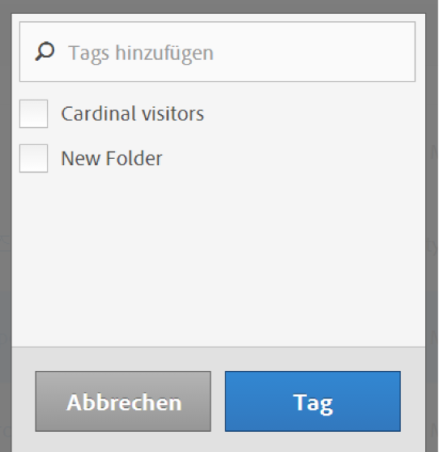

# Taggen von Segmenten

Durch das Taggen von Segmenten können Sie diese im Segment-Manager organisieren. 

Alle Benutzer können Tags für Segmente erstellen und eines oder mehrere Tags auf ein Segment anwenden. Sie sehen Tags jedoch nur für die Segmente, deren Inhaber Sie sind oder die für Sie freigegeben wurden. Welche Arten von Tags sollten Sie erstellen? Hier finden Sie einige Vorschläge für nützliche Tags:

* Auf **Teamnamen** basierende Tags wie Social Marketing, Mobile Marketing.
* **Projekt**-Tags (Analyse-Tags) wie Entrypage-Analyse.
* **Kategorie**-Tags: Männer, Region.
* **Arbeitsablauf**-Tags: Genehmigung ausstehend, kuratiert für (einen bestimmten Geschäftsbereich)

1. Aktivieren Sie im Segment-Manager das Kontrollkästchen neben dem Segment, das Sie taggen möchten. Die Werkzeugleiste für die Segmentverwaltung wird angezeigt:

   

1. Klicken Sie auf **[!UICONTROL Taggen]und**

   * wählen Sie entweder ein vorhandenes Tag aus oder
   * fügen Sie ein neues Tag hinzu und drücken Sie die **[!UICONTROL Eingabetaste]**.

      

1. Klicken Sie erneut auf **[!UICONTROL Taggen], um das Segment zu taggen.**

Das Tag wird jetzt in der Spalte „Tags“ angezeigt. (Klicken Sie oben rechts auf das Zahnradsymbol, um Ihre Spalten zu verwalten.)

You can also filter on tags by going to **[!UICONTROL Filters]** &gt; **[!UICONTROL Tags]**.
