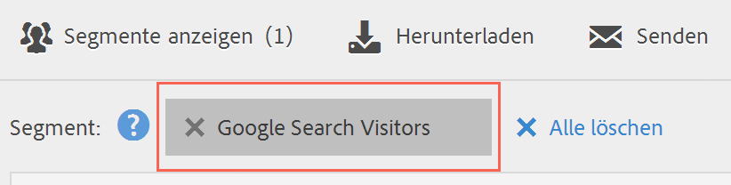

# Segmente auswählen und anwenden

So wenden Sie eines oder mehrere Segmente über die Segmentleiste auf einen Bericht an.

1. Wählen Sie den Bericht aus, auf den Sie ein Segment anwenden möchten, z. B. den [!UICONTROL Seitenbericht].
1. Click **[!UICONTROL Show Segments]** above the report. Die Segmentleiste wird geöffnet.

   

1. Mark the checkbox next to one or more of the segments or **[!UICONTROL Search Segments]** to find the right segment.

   >[!NOTE]
   >
   >Sie können mehrere Segmente auf einen Bericht anwenden (dies wird als Segmentstapelung bezeichnet). Wenn mehrere Segmente angewendet werden, werden die in den einzelnen Segmenten enthaltenen Kriterien mit einem UND-Operator verbunden und dann angewendet. Sie können beliebig viele Segmente stapeln.

   >[!NOTE]
   >
   >Durch Klicken auf das Informationssymbol (i) neben dem Segmentnamen können Sie eine Vorschau der Schlüsselmetriken anzeigen, um zu sehen, ob Sie über ein gültiges Segment verfügen und wie breit das Segment ist.

1. You can filter by report suite by selecting the **[!UICONTROL (Only)`<report suite name>`]** check box. Dadurch werden nur die Segmente angezeigt, die zuletzt in der entsprechenden Report Suite gespeichert wurden.
1. Click **[!UICONTROL Apply Segment]** and the report will refresh. Die angewendeten Segmente werden jetzt oben im Bericht angezeigt:

   
