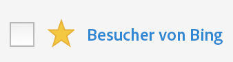

# Markieren von Segmenten als Favoriten

Das Kennzeichnen von Segmenten als Favoriten bietet eine weitere Möglichkeit, diese für eine einfache Verwendung zu organisieren.

1. Klicken Sie im Segment-Manager auf den Stern neben allen Segmenten, die Sie als Favoriten kennzeichnen möchten. Der Stern wird daraufhin gelb angezeigt:

   

1. You can also filter on favorites under **[!UICONTROL Filters]** &gt; **[!UICONTROL Other Filters]** &gt; **[!UICONTROL Favorites]**.
