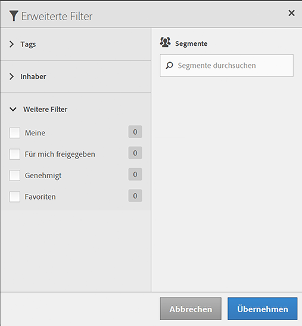

# Segmente filtern

Filtern Sie nach Tags, Inhabern und anderen Filtern („Alle anzeigen“, „Meine“, „Für mich freigegeben“, „Favoriten“ und „Genehmigt“.)

Das Filtern erleichtert die Suche nach Segmenten in der Segmentleiste.

1. In the Segment Manager, click the **[!UICONTROL Filters]** icon:  

   

1. Folgende Filter sind verfügbar:

   | Name des Filters | Beschreibung |
   |---|---|
   | Tags | Filtert Segmente nach bestimmten [Tags stehen](/help/components/c-segmentation/c-segmentation-workflow/seg-tag.md). Die Spalte „Tags“ wird standardmäßig angezeigt. |
   | Inhaber | Filtert Segmente nach Inhaber. |
   | Weitere Filter &gt; Alle anzeigen | **(Nur Administrator)** Zeigt alle Segmente, deren Inhaber und das Datum der letzten Änderung an. |
   | Weitere Filter &gt; Meine | Zeigt alle Segmente an, deren Inhaber Sie sind. |
   | Weitere Filter &gt; Für mich freigegeben | Zeigt alle Segmente an, die andere für Sie [freigegeben](/help/components/c-segmentation/c-segmentation-workflow/t-seg-share.md) haben. |
   | Weitere Filter &gt; Favoriten | Zeigt alle Segmente an, die Sie als [Favoriten](/help/components/c-segmentation/c-segmentation-workflow/t-seg-favorite.md). |
   | Weitere Filter &gt; Genehmigt | Zeigt alle offiziell   [genehmigten](/help/components/c-segmentation/c-segmentation-workflow/seg-approve.md) Segmente an. |
   | Segmente durchsuchen | Sucht Segmente nach Namen. |

