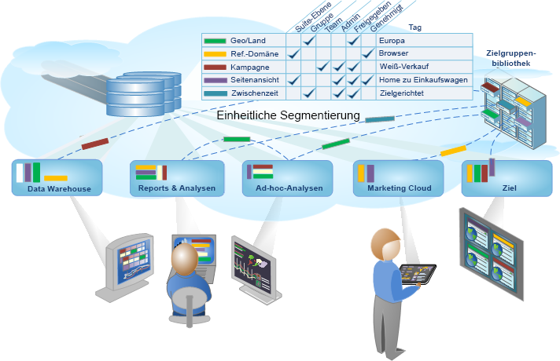

# Analytics-Segmentierung

Mit Adobe Analytics können Sie leistungsstarke, fokussierte Zielgruppensegmente erstellen, verwalten, freigeben und anwenden, um Berichte mithilfe von Analytics-Funktionen, der Adobe Experience Cloud, Adobe Target und anderen integrierten Adobe-Produkten zu erstellen.

Die Analytics-Segmentierung umfasst den [Segment Builder](../../components/c-segmentation/c-segmentation-workflow/seg-workflow.md#concept_BD4C17B01C5B4E378D0C14C852D055D4) zum Aufbau von Segmenten und zur Ausführung eines Vorab-Tests sowie den [Segment-Manager](../../components/c-segmentation/c-segmentation-workflow/seg-workflow.md#section_7FDCD12949BE4741A402DB83AB7B37DF) zur Erfassung, Kennzeichnung, Freigabe, Sicherheitseinstellung und Weitergabe von Segmenten in Ihrer Organisation.

Data Scientists und Marketinganalysten können für bedarfsgerechte Analysen Segmente einsetzen, erweitern und verfeinern und ein Segment dann für andere Benutzer speichern oder erweitern, verfeinern und als neues Segment in der Bibliothek speichern. Einmal in Gang gesetzt, handelt es sich um einen Kreislauf des Entwerfens und Verwaltens kodifizierter Zielgruppeneinblicke als [einheitlicher Segmentarbeitsablauf](../../components/c-segmentation/c-segmentation-workflow/seg-workflow.md#concept_6D2E1A72A3AD4EBBB9135094F2D9DEDF).

**Einstieg**

Mit [Einrichten eines Segmentierungsarbeitsablaufs](../../components/c-segmentation/c-segmentation-workflow/seg-workflow.md#concept_6D2E1A72A3AD4EBBB9135094F2D9DEDF) oder [Erstellen von Segmenten](../../components/c-segmentation/c-segmentation-workflow/seg-build.md#concept_BD4C17B01C5B4E378D0C14C852D055D4)oder Anzeigen von [Segmenten](../../components/c-segmentation/seg-overview.md#concept_82653C7E29FE49F5A4B5E5E93B0A6399) für einen schnellen Überblick.
