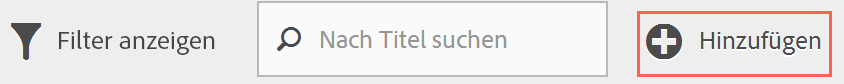
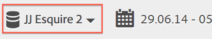
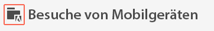
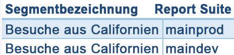
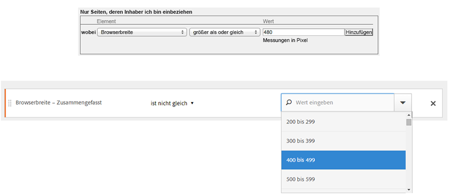

# Häufig gestellte Fragen

beantwortet häufig Fragen zu Segmentierungsfunktionen, Zugriff, Berechtigungen, Best Practices und Verwalten älterer Segmente.

## Funktionen {#section_BD58629D1A9346BF879E229FA6BEC7A2}

* Segmentierung in Analysis Workspace:

   * Sie können [Segmente vergleichen](https://marketing.adobe.com/resources/help/en_US/analytics/analysis-workspace/segment-comparison.html).
   * Verwenden Sie [Segmente als Dimensionen](https://marketing.adobe.com/resources/help/en_US/analytics/analysis-workspace/segments_as_dimensions.html) bei Vergleichen.
   * Verwenden Sie Segmente in der [Fallout-Analyse](https://marketing.adobe.com/resources/help/en_US/analytics/analysis-workspace/graphics/compare-segments-fallout.html).

* Sie können [mehrere Segmente auf einen Bericht oder ein Projekt anwenden](../../components/c-segmentation/c-segmentation-workflow/seg-workflow.md#task_13E69C7D428A43EF9CCCA7F1104F1E8F).
* Alle Segmente gelten nun für alle Report Suites.
* The [Segment Builder](../../components/c-segmentation/c-segmentation-workflow/seg-workflow.md#concept_643F2DF74C544796B58F4656ABC5F726) simplifies segment creation.
* Der neue [Segment-Manager](../../components/c-segmentation/c-segmentation-workflow/seg-workflow.md#concept_7A2E019317864065B7C641DC3315928F) ermöglicht die Einrichtung von [Workflows](../../components/c-segmentation/c-segmentation-workflow/seg-workflow.md#concept_6D2E1A72A3AD4EBBB9135094F2D9DEDF) und bietet Funktionen zum Teilen, Taggen, Prüfen und Genehmigen.

* Sie können Segmente zum Organisieren und Suchen [taggen](../../components/c-segmentation/c-segmentation-workflow/seg-workflow.md#concept_CD892CEB326C4986A1B67487052DBA50), anstatt Ordner zu verwenden. Previously, you used folders (in [!DNL Ad Hoc Analysis]) to organize your segments.

* [Sequenzielle Segmente](/help/components/c-segmentation/c-segmentation-workflow/seg-sequential-build.md) können jetzt außerhalb von Ad Hoc Analysis erstellt werden.
* Der Seitenansichtscontainer wurde in Treffercontainer umbenannt, um anzuzeigen, dass dieser Container alle Datentypen segmentiert und nicht nur Seitenansichten. So werden z. B. Linktracking-Aufrufe und trackAction-Aufrufe aus den Mobile SDKs durch den Treffercontainer vollständig ein- oder ausgeschlossen. Beachten Sie, dass sich die Funktionsweise dieses Containers nicht geändert hat. Er wurde lediglich umbenannt.

Weitere Details finden Sie im Beitrag [Verbesserung der Segmentierung in Adobe Analytics](https://blogs.adobe.com/digitalmarketing/analytics/improving-segmentation-adobe-analytics/) im Digital Marketing Blog.

## Access the Segmentation Tools {#section_088AD0E4E21943DFA8CF7206AEC485DD}

**Wie komme ich zum Segment Builder?**

Sie können wie folgt auf den Segment Builder zugreifen:

* öffnen Sie einen vorhandenen Bericht und klicken Sie auf das Segmentsymbol  In the segment rail that displays, then click **[!UICONTROL Add]**, or

* At the top of the Segment Manager, clicking **[!UICONTROL + Add]**.  

   oder

* klicken Sie im Segment-Manager auf einen Segmenttitel, um das Segment im Segment Builder zu bearbeiten.

**Wie komme ich zum Segment-Manager?**

Sie können wie folgt auf den Segment-Manager zugreifen:

* Going to  **[!UICONTROL Analytics]** &gt; **[!UICONTROL Components]** in the top navigation. Then click **[!UICONTROL Segments]**, or

* öffnen Sie einen vorhandenen Bericht und klicken Sie auf das Segmentsymbol  Then click **[!UICONTROL Manage]**, or

* drücken Sie an einer beliebigen Stelle die Schrägstrich-Taste (/) und suchen Sie nach Segment Manager.

**Wo ist das Dropdown-Feld für Segmente?**

The segment drop-down in Reports &amp; Analytics has been replaced by a much more feature rich [Segment Builder](../../components/c-segmentation/c-segmentation-workflow/seg-workflow.md#concept_643F2DF74C544796B58F4656ABC5F726) interface that lets you to create "universal" segments usable across report suites and across Adobe Analytics solutions. To view a list of existing segments, click the Segments icon  

in der linken Navigation und der Segmentleiste angezeigt.

**Wo ist das Dropdown-Feld für die Report Suite?**

Das Dropdown-Feld für die Report Suite wurde in die obere rechte Ecke jedes Berichts oder Dashboards neben die Datumsauswahl verschoben.

## Zugriffsberechtigung {#section_648DFA3A882146C485A84ED014EEC707}

**Welche Berechtigungen und Rechte brauche ich, um Segmente zu verwenden, zu erstellen und zu verwalten?**

Standardmäßig können alle Benutzer persönliche Segmente erstellen und bearbeiten. Administratoren können jedoch entscheiden, wer [Berechtigungen zur Erstellung von Segmenten](https://marketing.adobe.com/resources/help/en_US/reference/groups.html) erhält, und sie bestimmten Gruppen zuweisen. Diese Segmente können direkt für andere Analytics-Benutzer freigegeben werden.

Administratoren können alle Segmente bearbeiten und Segmente für Gruppen und alle Personen der Organisation freigeben. [Mehr …](../../components/c-segmentation/seg-reference/seg-rights.md)

**Kann ich alle in meinem Unternehmen vorhandenen Segmente sehen?**

Yes, Admins can see all segments within the [!DNL Analysis Workspace] and [!DNL Reports & Analytics] user interfaces.

Ad-hoc-Analysen und ReportBuilder zeigen Segmente an, deren Inhaber Sie sind, sowie Segmente, die für Sie freigegeben wurden.

**Kann ich alle Analytics-Segmente im Segment-Manager verwalten?**

Ja, alle Segmente können im Segment-Manager in Analysis Workspace und Reports &amp; Analysen sowie in Ad-hoc-Analysen verwaltet werden. Der Segment-Manager zeigt Segmente an, die für den Inhaber (den Benutzer, der das Segment erstellt hat), Benutzer, für die diese freigegeben sind, und Administratorbenutzer sichtbar sind. Die Segmentauswahl zeigt Segmente an, deren Inhaber der Benutzer ist, und solche, die für ihn freigegeben wurden.

Admins can see all segments within the Analysis Workspace and [!DNL Reports & Analytics] user interfaces.

Ad-hoc-Analysen und ReportBuilder zeigen lediglich von Ihnen erstellte Segmente oder Segmente, die spezifisch mit Ihnen geteilt wurden, an.

**Warum kann ich dieses Segment nicht löschen?**

In der [Experience Cloud](../../components/c-segmentation/c-segmentation-workflow/seg-workflow.md#concept_1E9FC92437D748C392546542B6511D01) veröffentlichte Segmente können nicht gelöscht oder bearbeitet werden. Sie können das Segment jedoch kopieren und die Kopie bearbeiten.

## Best Practices {#section_E2C3A1B4B4274D1B86CAA9C0359D049C}

**Was mache ich mit doppelten Segmenten, die denselben Namen und unterschiedliche Definitionen haben?**
Nachdem Segmente jetzt von unterschiedlichen Report-Suites genutzt werden können, kann es vorkommen, dass Sie mehrere Segmente mit demselben Namen haben. Wir empfehlen Folgendes:

* Benennen Sie Segmente um, die denselben Namen, aber unterschiedliche Definitionen haben, oder
* Löschen Sie Segmente, die Sie nicht mehr benötigen.

**Welche Empfehlungen hat Adobe bezüglich der Segmentbereinigung?**

* Markieren Sie alle alten Segmente mit einem Tag.
* Überprüfen Sie all Ihre Segmente.
* Fügen Sie Ihre Segmente gegebenenfalls zu einer Segmentbibliothek hinzu.
* Genehmigen Sie vorschriftsmäßige Segmente.
* Taggen Sie Segmente unter Einhaltung der  [Best Practices](../../components/c-segmentation/c-segmentation-workflow/seg-workflow.md#concept_CD892CEB326C4986A1B67487052DBA50).

## Verwaltung alter Segmente {#section_76CF47142D1A4FB6A0718AD9073049FE}

**Was ist mit meinen vorhandenen Segmenten passiert?**

Ihre vorhandenen Segmente funktionieren weiterhin wie bisher. Alle Berichte, auf die diese Segmente angewendet wurden, funktionieren weiterhin korrekt. [Mehr …](../../components/c-segmentation/seg-transition.md#section_83ACAB256F394DCD8B424D8920BDD853)

Die meisten bisherigen vordefinierten und Suite-Segmente werden als  Segmentvorlagen in den Segmentaufbau migriert. Segmentvorlagen werden verwendet, um schnell benutzerdefinierte Segmente mit gängigen Zielgruppen zu erstellen. Segmentvorlagen können nicht direkt auf einen Bericht angewendet werden, sie können aber problemlos in einem benutzerdefinierten Segment gespeichert werden.

Segmentvorlagen sind im Segmentaufbau durch ein spezielles Symbol gekennzeichnet:

**Was ist mit meinen vorhandenen Segmentordnern passiert?**

Anstatt der (Ad-hoc-Analysen-) Ordner verwendet der Segment-Manager  Tags. Ihre Ordnernamen werden automatisch zu Tags, die auf die jeweiligen Segmente angewendet werden.

**Was ist mit terminierten Berichten passiert, auf die Segmente angewendet sind?**

Terminierte Berichte werden weiterhin fehlerfrei mit den von Ihnen definierten Segmenten ausgeführt.

Wenn Sie ein Segment löschen, funktionieren terminierte Berichte und Dashboards, auf die dieses Segment angewendet wird, weiter normal, d. h., das Segment bzw. das Dashboard verwendet weiterhin das gelöschte Segment.

Terminierte Berichte werden nicht aktualisiert, wenn Sie ein Segment mit demselben Namen aktualisieren. Ein Beispiel: Angenommen, Sie haben 2 Segmente mit demselben Namen in unterschiedlichen Report Suites:

Sie haben ein Lesezeichen, das das Segment für die Report Suite „mainprod“ referenziert. Dann löschen Sie das Segment, weil es sich um ein Duplikat handelt. Das Lesezeichen funktioniert weiterhin und referenziert die Definition des gelöschten Segments. Wenn Sie die Segmentdefinition des maindev-Segments ändern und „Catalina Island“ und „Tijuana Mexiko“ einfügen, wird das auf das Lesezeichen angewendete Segment nicht geändert. Es verwendet weiterhin die alte Definition. Um dies zu beheben, müssen Sie das Lesezeichen aktualisieren, damit es die neue Definition referenziert. Wenn Sie nicht sicher sind, ob ein Lesezeichen, ein Dashboard oder ein terminierter Bericht ein gelöschtes Segment verwenden, können Sie den Namen des Segments ändern, damit deutlich wird, ob das Lesezeichen das Segment verwendet.

**Was passiert mit Data Warehouse-Segmenten?**

Alle vorhandenen Data Warehouse-Segmente funktionieren weiterhin in Data Warehouse. Die meisten Data Warehouse-Segmente funktionieren auch in anderen Komponenten wie Analysis Workspace, Ad-hoc-Analysen und Reports &amp; Analysen.

Sie können neue Data Warehouse-Segmente im Segment Builder/Segment-Manager erstellen oder bearbeiten. Durch den Produktkompatibilitätsmechanismus wird im Segment Builder automatisch ermittelt, ob ein Segment mit Data Warehouse kompatibel ist.

**Was geschieht mit Favoriten-Segmenten (Ad-hoc-Analysen)?**

Diese Ad-hoc-Analysen-Segmente werden in Adobe Analytics als gewöhnliche Segmente angezeigt.

Verwechseln Sie sie nicht mit der Favoriten-Funktion im Segment-Manager, über die Sie Segmente als Favoriten markieren können.

**Was geschieht mit vorkonfigurierten Segmenten?**

* **Einzelseitenbesuche**
* **Besuche von Mobilgeräten**
* **Besuche über eine kostenlose Suche**
* **Besuche über eine gebührenpflichtige Suche**
* **Besuche mit Besucher-ID-Cookie**

Diese Segmente werden als Segmentvorlagen in den Segmentaufbaur migriert.

Vorhandene Berichte, für die diese Segmente angewendet werden, funktionieren weiterhin fehlerfrei.

** Was mit Experience Cloud (Suite)-Segmenten passiert: **

* Nichtkäufer
* Käufern
* Erstbesuche
* Besuche von sozialen Netzwerken aus
* Besuche, die länger als 10 Minuten dauern*
* Besuche mit mehr als 5 vorherigen Besuchen*
* Besuche von Facebook*

Die meisten dieser Segmente (ausgenommen die mit einem Sternchen * gekennzeichneten) werden als  Segmentvorlagen in den Segmentaufbau migriert. Darüber hinaus wurden einige neue Segmente hinzugefügt.

Vorhandene Berichte, für die diese Segmente angewendet werden, funktionieren weiterhin fehlerfrei.

**Was geschieht mit Admin-Segmenten (auch bekannt als „globale“ Segmente)?**

**Admin**-Segmente werden in die neue Segmentoberfläche migriert und werden dort als für alle freigegebene Segmente angezeigt.

Der Eigentümer dieser Segmente wird mit dem ältesten Konto in der Liste der Admin-Benutzer im Unternehmen als Admin angelegt. Es können jedoch alle Administratoren diese Segmente löschen, bearbeiten und teilen.

Die Segmentverwaltungsoberfläche der Admin Console, über die Administratoren diese globalen Segmente erstellen und verwalten konnten, gibt es nicht mehr. Administratoren sollten jetzt den neuen Segmentaufbau verwenden, um Segmente zu erstellen und für geeignete Gruppen, für alle oder für einzelne Personen freizugeben.

<!-- 

seg_definition.xml

 -->

Vorhandene Segmente, die Logik verwenden, die wie in diesem Dokument beschrieben geändert wurde, funktionieren weiterhin fehlerfrei, müssen jedoch aktualisiert werden, damit sie erneut gespeichert werden können. Wenn Sie z. B. ein vorhandenes Segment haben, in dem „US-Bundesstaaten“ „New York“ enthalten, funktioniert es weiterhin fehlerfrei. Wenn Sie das Segment jedoch das nächste Mal bearbeiten, müssen Sie es im Hinblick auf die Verwendung des Aufzählungstyps mit einer Gleich-Bedingung aktualisieren.

**Tipps zur Migration**

Folgende Tipps helfen Ihnen bei der Migration allgemeiner Dimensionen:

* Geo-Stadt/Region/Land - Suchen Sie nach bestimmten Städten, Regionen oder Ländern und wählen Sie sie aus, anstatt eine teilweise Übereinstimmung zu verwenden.
* Browser - Verwenden Sie die Dimension Browsertypen, um alle Browser eines Typs zu erhalten, z. B. Google Chrome
* Betriebssysteme - Verwenden Sie die Betriebssystemtypen-Dimensionen, um alle Betriebssysteme eines Typs zu erhalten, z. B. Microsoft Windows.

* [Neue und umbenannte Dimensionen](../../components/c-segmentation/seg-transition.md#section_73CF121B64A24DEF8E6499F3167BF742)
* [Änderungen an CONTAINS](../../components/c-segmentation/seg-transition.md#section_1A9EDEE5CBC44B5AA6262560052ABE77)
* [Änderungen am Kleiner- und Größer als](../../components/c-segmentation/seg-transition.md#section_84A8AAD0344148AD9F9211D3EB271903)

## Neue und umbenannte Dimensionen {#section_73CF121B64A24DEF8E6499F3167BF742}

Die folgende Tabelle enthält eine Liste mit Dimensionen, die im Segmentaufbau umbenannt wurden.

<table id="table_1A8C1940FD0446FA8414C6A7DE66E44C"> 
 <thead> 
  <tr> 
   <th colname="col1" class="entry"> Neuer Dimensionsname  </th> 
   <th colname="col2" class="entry"> Vorheriger Name </th> 
   <th colname="col3" class="entry"> Hinweise </th> 
  </tr> 
 </thead>
 <tbody> 
  <tr> 
   <td colname="col1"> Betriebssystemtypen </td> 
   <td colname="col2"> Neu </td> 
   <td colname="col3"> Hinzugefügt im Frühling 2015. </td> 
  </tr> 
  <tr> 
   <td colname="col1"> Browserbreite – Zusammengefasst </td> 
   <td colname="col2"> Browserbreite </td> 
   <td colname="col3"> Diese Dimension ist mit allen Benutzeroberflächen kompatibel und wird in eine Liste aufgezählter Bereiche, anstelle bestimmter Ganzzahlwerte unterteilt. Wenn Sie bestimmte Werte segmentieren müssen, benutzen Sie die granulare Version dieser Dimension in einem Data Warehouse-Segment. </td> 
  </tr> 
  <tr> 
   <td colname="col1"> Browserhöhe – Zusammengefasst </td> 
   <td colname="col2"> Browserhöhe </td> 
   <td colname="col3"> Diese Dimension ist mit allen Benutzeroberflächen kompatibel und wird in eine Liste aufgezählter Bereiche, anstelle bestimmter Ganzzahlwerte unterteilt. Wenn Sie bestimmte Werte segmentieren müssen, benutzen Sie die granulare Version dieser Dimension in einem Data Warehouse-Segment. </td> 
  </tr> 
  <tr> 
   <td colname="col1"> Browserbreite – Granular </td> 
   <td colname="col2"> Browserbreite </td> 
   <td colname="col3"> 
Diese Dimension wurde umbenannt und ist jetzt nur mit Data Warehouse kompatibel. Wenn Sie Segmente definieren wollen, die mit allen Benutzeroberflächen kompatibel sind, benutzen Sie den Aufzählungstyp „Browserbreite – Zusammengefasst“. 
 </td> 
  </tr> 
  <tr> 
   <td colname="col1"> Browserhöhe – Granular </td> 
   <td colname="col2"> Browserhöhe </td> 
   <td colname="col3"> 
Diese Dimension wurde umbenannt und ist jetzt nur mit Data Warehouse kompatibel. Wenn Sie Segmente definieren wollen, die mit allen Benutzeroberflächen kompatibel sind, benutzen Sie den Aufzählungstyp „Browserhöhe – Zusammengefasst“. 
 </td> 
  </tr> 
  <tr> 
   <td colname="col1"> Cookie-Unterstützung </td> 
   <td colname="col2"> Cookies </td> 
   <td colname="col3"> - </td> 
  </tr> 
  <tr> 
   <td colname="col1"> Farbtiefe </td> 
   <td colname="col2"> Bildschirmfarbtiefe </td> 
   <td colname="col3"> - </td> 
  </tr> 
  <tr> 
   <td colname="col1"> - </td> 
   <td colname="col2"> „App - *“ </td> 
   <td colname="col3"> Die „App -“-Präfixe wurden aus einigen Dimensionstypen entfernt. Da mobile App-Daten in der Regel in einer Report Suite erfasst werden, die keine Webdaten enthält, waren diese Präfixe nicht erforderlich. </td> 
  </tr> 
  <tr> 
   <td colname="col1"> Entrypage ursprünglich </td> 
   <td colname="col2"> Ursprüngliche Entrypage </td> 
   <td colname="col3"> - </td> 
  </tr> 
  <tr> 
   <td colname="col1"> Java aktiviert </td> 
   <td colname="col2"> Java </td> 
   <td colname="col3"> - </td> 
  </tr> 
  <tr> 
   <td colname="col1"> Max. Länge der mobilen Browser-URL </td> 
   <td colname="col2"> Länge der mobilen Browser-URL </td> 
   <td colname="col3"> - </td> 
  </tr> 
  <tr> 
   <td colname="col1"> Mobilgerät – Mail-Design </td> 
   <td colname="col2"> Mobile Design-Mail-Unterstützung </td> 
   <td colname="col3"> - </td> 
  </tr> 
  <tr> 
   <td colname="col1"> Mobilgerät </td> 
   <td colname="col2"> Mobilgerätname </td> 
   <td colname="col3"> - </td> 
  </tr> 
  <tr> 
   <td colname="col1"> Mobil Max. Lesezeichen-Länge </td> 
   <td colname="col2"> Mobil Max. Lesezeichen URL-Länge </td> 
   <td colname="col3"> - </td> 
  </tr> 
  <tr> 
   <td colname="col1"> Mobil Max. E-Mail-Länge </td> 
   <td colname="col2"> Mobil Max. Mail URL-Länge </td> 
   <td colname="col3"> - </td> 
  </tr> 
  <tr> 
   <td colname="col1"> Mobiles Betriebssystem (Veraltet) </td> 
   <td colname="col2"> Mobilbetriebssystem </td> 
   <td colname="col3"> Benutzen Sie die Betriebssystem-Dimension und wenden Sie stattdessen Besuche von Mobilgerätesegmenten an. </td> 
  </tr> 
  <tr> 
   <td colname="col1"> Mobilgerät – Push To Talk </td> 
   <td colname="col2"> Mobile PTT </td> 
   <td colname="col3"> - </td> 
  </tr> 
  <tr> 
   <td colname="col1"> Umfrageansichten </td> 
   <td colname="col2"> Umfrageansichten insgesamt </td> 
   <td colname="col3"> - </td> 
  </tr> 
  <tr> 
   <td colname="col1"> Umfrageantworten </td> 
   <td colname="col2"> Umfrageantworten insgesamt </td> 
   <td colname="col3"> - </td> 
  </tr> 
  <tr> 
   <td colname="col1"> Besuchstiefe </td> 
   <td colname="col2"> Pfadlänge </td> 
   <td colname="col3"> - </td> 
  </tr> 
  <tr> 
   <td colname="col1"> Postleitzahl </td> 
   <td colname="col2"> Postleitzahl </td> 
   <td colname="col3"> - </td> 
  </tr> 
 </tbody> 
</table>

## Änderungen an auf Zeichenketten basierenden Dimensionen, die bekannte Werte besitzen {#section_1A9EDEE5CBC44B5AA6262560052ABE77}

Auf Zeichenketten basierende Dimensionen, die einen bekannten Satz Werte besitzen, wurden in Aufzählungstypen geändert. Wenn Sie mit diesen Dimensionen ein Segment erstellen, wird die Liste mit allen bekannten Werten vorbelegt und „Gleich“ wird als einziger Operator unterstützt. So können Sie die genauen Werte, nach denen Sie suchen, schnell segmentieren, ohne nicht beabsichtigte Werte auszuwählen, die bei einer weniger restriktiven Übereinstimmung auftreten.

Folgende Dimensionen wurden in Aufzählungslisten geändert:

| Mobilgerätehersteller | Mobile E-Mail-Länge | Farbtiefe |
|---|---|---|
| Mobilgerät – Bildschirmgröße | Mobilgerätnummer | Bildschirmauflösung |
| Mobilgerät – Bildschirmhöhe | Mobilgerät – Push To Talk | Plugin |
| Mobilgerät – Cookie-Unterstützung | Mobilgerät – Mail-Design | Betriebssystem |
| Mobilgerät – Bildunterstützung | Mobile Informationsdienste | Referrer-Typ |
| Mobilgerät – Farbtiefe | Mobilgerätetyp | Suchmaschine |
| Mobilgerät – Audiounterstützung | Browsertyp | Staat |
| Mobilgerät – Videounterstützung | Browser | Geo-Land |
| Mobil-DRM | Verbindungstyp | Geo-Region |
| Mobile Netzprotokolle | Mobilnetzbetreiber | Geo-Stadt |
| Mobilbetriebssystem | Cookie | Geo-DMA |
| Mobile Java VM | Kundentreue | Persistentes Cookie |
| Mobile Lesezeichenlänge | Java aktiviert | Gebührenpflichtige Suche |
| Mobil URL-Länge | Sprache |  |

## Änderungen an auf Ganzzahlen basierenden Dimensionen, die bekannte Werte besitzen {#section_84A8AAD0344148AD9F9211D3EB271903}

Auf Ganzzahlen basierende Dimensionen (wie die Browserbreite) mit einem bekannten Satz Werten werden in Aufzählungsbereiche aufgeteilt, sodass Sie schnell Segmente für einen bestimmten Bereich definieren können. Diese Aufzählungslisten erhalten nach dem Namen der Dimension den Zusatz „– Zusammengefasst“. Der folgende Bildschirm zeigt, wie diese Dimensionen mit der früheren und der neuen Segmentaufbauoberfläche segmentiert werden:

Die Operatoren „kleiner als“, „größer als“ und vergleichbare Operatoren sind jetzt nur noch mit Data Warehouse-Segmenten kompatibel. Segmente, die mit allen Berichtsoberflächen kompatibel sein sollen, müssen die „Zusammengefasst“-Version der Metrik mit dem Operator „Gleich“ verwenden.
