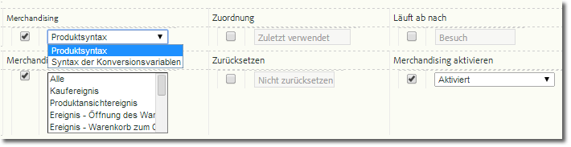

# Implementieren einer Merchandising-Variablen

Beschreibt, wie Merchandising-Variablen aktiviert und implementiert werden.

## Aktivieren einer Merchandising-Variablen {#section_331B41FF5AED42F2AEFE043DD60238C7}

Merchandising can be enabled for any custom eVar on the **[!UICONTROL Admin Tools]** &gt; **[!UICONTROL Report Suites]** &gt; **[!UICONTROL Conversion Variables]** page (you no longer need to call Adobe):



| Einstellung | Beschreibung |
|--- |--- |
| Läuft ab nach | Legt fest, wie lange Merchandising-Werte bestehen bleiben sollen. |
| Merchandising | Produktsyntax: Dieser Wert wird innerhalb von s.products festgelegt.    Konversionsvariablensyntax: Dieser Wert wird innerhalb der festgelegten s.eVar für das Merchandising gesetzt. |
| Merchandising-Binding-Ereignis (nur Konversionsvariablensyntax) | Gibt an, wann ein Produkt mit der aktuellen Merchandising-Kategorie verknüpft werden soll. Es können mehrere Ereignisse ausgewählt werden, indem Sie die STRG-Taste gedrückt halten und mehrere Elemente in der Liste anklicken.   Hinweis: Wenn „Produktsyntax“ ausgewählt wurde, können Sie keine Ereignisse auswählen (Ereignisse sind deaktiviert, aber nicht ausgegraut). Sie können nur ein Ereignis auswählen, wenn „Konversionsvariablensyntax“ ausgewählt wurde. |

## Implementierung anhand der Produktsyntax {#section_2774578D09CE40A093CB0D0A294DBF7C}

Wenn die Produktsyntax aktiviert ist, wird die Merchandising-Kategorie direkt innerhalb der Produktvariablen aufgefüllt. Daher ist es nicht erforderlich, ein Binding-Ereignis auszuwählen und festzulegen. Dies ist die empfohlene Methode und sollte verwendet werden, es sei denn, der in `s.products` festzulegende Wert ist nicht verfügbar, wenn das Erfolgsereignis stattfindet.

* **Syntax**

```js
  s.products="category;product;quantity;price;event_incrementer; 
<codeph outputclass="syntax">
  eVarN=merch_category| 
 <codeph outputclass="syntax">
   eVarM=merch_category2" 
 </codeph outputclass="syntax"> 
</codeph outputclass="syntax">
```

* **Beispiel**

```js
  s.events="prodView" 
  s.products=";Fernie Snow Goggles;;;; 
<codeph outputclass="syntax">
  eVar1=goggles" 
   In 
</codeph outputclass="syntax">
```

Der Wert „Skibrille“ für „eVar1“ wird dem Produkt „Fernie Snow Skibrille“ zugewiesen. Alle nachfolgenden Erfolgsereignisse (dem Warenkorb hinzugefügte Produkte, Checkouts, Käufe usw.), die mit diesem Produkt in Verbindung stehen, werden dem Wert „Skibrille“ gutgeschrieben.

## Implementierung anhand der Konversionsvariablensyntax {#section_6AE10F69F4A14636AB050BEA89A34E4E}

Die Konversionsvariablensyntax sollte verwendet werden, wenn der in `s.products` festzulegende eVar-Wert nicht verfügbar ist. Das bedeutet in der Regel, dass Ihre Seite keinen Kontext für den Merchandising-Kanal oder die Suchmethode hat. In diesen Fällen müssen Sie die Merchandising-Variable festlegen, bevor Sie auf die Produktseite gelangen, wobei der Wert solange bestehen bleibt, bis das Binding-Ereignis eintritt.

Wenn das bei der Konfiguration ausgewählte Binding-Ereignis eintritt, wird der beibehaltene Wert der „eVar“ dem Produkt zugewiesen. Wenn z. B. „prodView“ als Binding-Ereignis ausgewählt wird, wird die Merchandising-Kategorie nur während des Eintretens dieses Ereignisses mit der aktuellen Produktliste verknüpft. Eine Merchandising-eVar, die bereits einem Produkt zugewiesen wurde, kann nur von nachfolgenden Binding-Ereignissen aktualisiert werden.

* **Syntax** Auf derselben oder der vorhergehenden Seite vor dem Binding-Ereignis:

   ```js
   s.eVar1="merchandising_category"
   ```

   Auf der Seite, auf der das Binding-Ereignis eintritt:

   ```js
   s.events="prodView" 
   s.products="category;product"
   ```

* **Beispiel** Seite 1 des Besuchs:

   ```js
   s.eVar1="Outdoors:Ski Goggles"
   ```

   Seite 2 des Besuchs:

   ```js
   s.events="prodView" 
   s.products=";Fernie Snow Goggles"
   ```

   Der Wert „Outdoor:Skibrille“ für „eVar1“ wird dem Produkt „Fernie Snow Skibrille“ zugewiesen. Alle nachfolgenden Erfolgsereignisse (dem Warenkorb hinzugefügte Produkte, Checkouts, Käufe usw.), die mit diesem Produkt in Verbindung stehen, werden dem Wert „Skibrille“ gutgeschrieben.

Des Weiteren wird der aktuelle Wert der Merchandising-Variablen allen nachfolgenden Produkten zugewiesen, bis eine der folgenden Bedingungen erfüllt ist:

* „eVar“ läuft ab (basierend auf der Einstellung „Läuft ab nach“)
* Die Merchandising-eVar wird mit einem neuen Wert überschrieben.

Informationen finden Sie in „[Advanced Conversion Syntax Merchandising](https://analyticsdemystified.com/adobe-analytics/advanced-conversion-syntax-merchandising/)“ (Erweiterte Konversionssyntax für Merchandising) unter [!DNL analyticsdemystified.com].
