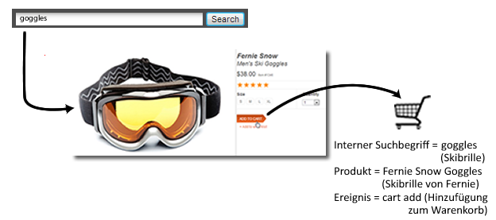
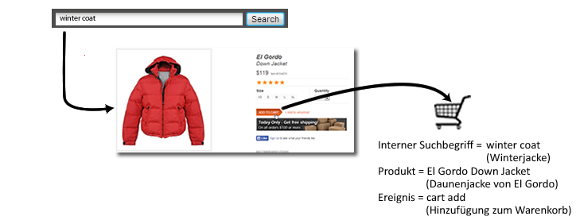

# Übersicht über Merchandising-Variablen

Wenn Sie den Erfolg von externen Kampagnen oder externen Suchbegriffen messen möchten, wünschen Sie in der Regel einen einzigen Wert, den Sie für jedes eingetretene Erfolgsereignis der jeweiligen Kampagne oder dem Suchbegriff gutschreiben können. Wenn ein Kunde z. B. auf einen Link in einer E-Mail-Kampagne klickt, um Ihre Website zu besuchen, sollten alle daraus resultierenden Käufe dieser Kampagne gutsgeschrieben werden.

Aber was ist mit Ereignissen, die auf die interne Suche oder das Durchsuchen von Kategorien zurückzuführen sind, wenn ein Kunde nach mehreren Artikeln sucht? Zum Beispiel sucht ein Kunde auf Ihrer Website nach einer Skibrille und fügt diese dem Warenkorb hinzu:

Vor der Bestellung sucht der Kunde noch nach einer Winterjacke und fügt dem Warenkorb noch eine Daunenjacke hinzu:

Wenn dieser Einkauf abgeschlossen und die Zuordnung „Zuletzt verwendet“ nicht geändert wurde, wird die interne Suche nach „Winterjacke“ dem Kauf der Skibrille gutgeschrieben. Das ist gut für den Suchbegriff „Winterjacke“, aber schlecht für das Treffen von Marketingentscheidungen:

| Interner Suchbegriff | Umsatz |
|---|---|
| Winterjacke | 157 $ |

**So können Merchandising-Variablen das Problem lösen**

Kategorieübergreifende Merchandising-Variablen bzw. „Merchandising-eVars“ ermöglichen es Ihnen, den aktuellen Wert einer „eVar“ zum Zeitpunkt eines Erfolgsereignisses einem Produkt zuzuweisen. Der Wert bleibt daraufhin mit dem Produkt verknüpft, selbst wenn später einer oder mehrere weitere Werte für die jeweilige „eVar“ gesetzt werden.

Wenn Merchandising für die „eVar“ aktiviert ist, würde das für das Beispiel oben bedeuten, dass der Suchbegriff „Skibrille“ mit der Skibrille von Fernie Snow und der Suchbegriff „Winterjacke“ mit der Daunenjacke von El Gordo verknüpft wird. Merchandising-Variablen ordnen Umsätze auf Produktebene zu, sodass jedem Begriff der Umsatz gutgeschrieben wird, der mit dem zugehörigen Produkt erzielt werden konnte:

| Interner Suchbegriff | Umsatz |
|---|---|
| Winterjacke | 119 $ |
| Skibrille | 38 $ |

