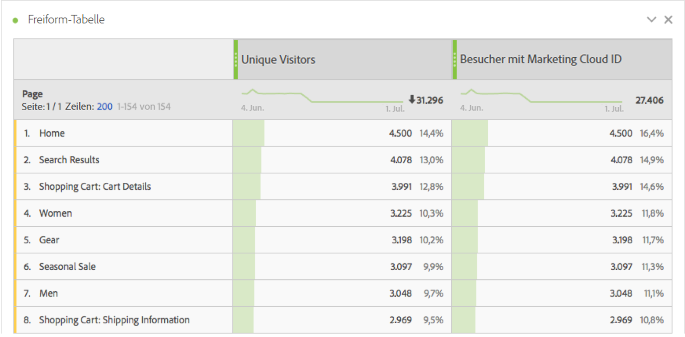
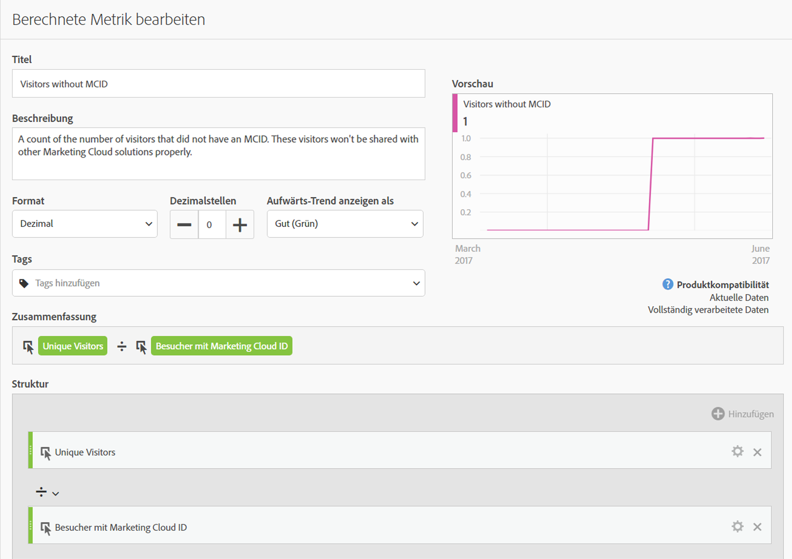
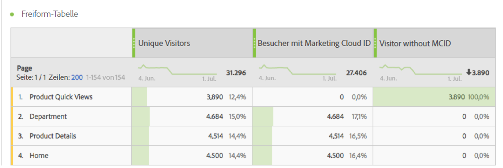
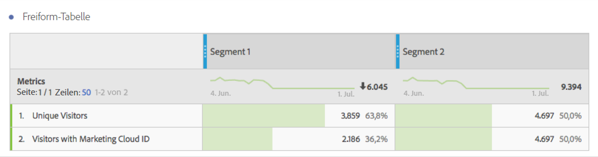

# Besucher mit Experience Cloud ID

Verfügbar in Analysis Workspace und in Segment Builder.

Zeigt die Anzahl der Benutzer, die über eine Experience Cloud ID verfügen. Sie können verstehen, welche Seiten den Identitätsdienst bereitgestellt haben und wie viele Besucher mit anderen Experience Cloud-Lösungen geteilt werden können. Sie können diese Metrik auch in Segmenten verwenden, die für die Experience Cloud freigegeben sind.

>[!IMPORTANT]
>
>For this metric to appear, you have to have the [Identity Service](https://marketing.adobe.com/resources/help/en_US/mcvid/) running for the report suite.

## Debugging Ihres Experience Cloud ID-Setups {#section_679E62142A3E46548FF8FBDA46568005}

The [!UICONTROL Visitors with Experience Cloud ID] metric is a useful metric in Adobe Analytics intended to help you find and debug your [!UICONTROL Identity Service]setup. Die Metrik ist eine Anzahl der Besucher in einer Report Suite, denen aus dem Identitätsdienst eine Experience Cloud ID zugewiesen wurde. Diese Metrik kann sehr hilfreich sein, wenn Sie herausfinden möchten, warum bestimmte Experience Cloud-Integrationen möglicherweise nicht so viele Besucher wie erwartet freigeben. Zudem können Sie damit Bereiche Ihrer Site identifizieren, für die die MCID möglicherweise noch nicht bereitgestellt wurde.

Wenn Sie die Metrik „Besucher mit Experience Cloud ID“ nutzen möchten, ziehen Sie sie einfach als Metrik in einen beliebigen Bericht, beispielsweise in diesen [!UICONTROL Seiten]-Bericht:

Beachten Sie Folgendes: In diesem Beispiel weist jede Seite eine identische Anzahl an Unique Visitors und Besuchern mit Experience Cloud ID auf. Die Gesamtanzahl an Unique Visitors ist dabei größer als die Gesamtanzahl an Besuchern mit Experience Cloud ID. Um die Seiten zu finden, für die die MCID nicht für alle Besucher festgelegt ist, [erstellen Sie eine berechnete Metrik](https://marketing.adobe.com/resources/help/en_US/analytics/calcmetrics/cm_build_metrics.html) anhand dieser Definition:

Wenn Sie die berechnete Metrik zum Bericht hinzufügen, können Sie den Seiten-Bericht so sortieren, dass die Seiten mit der größten Anzahl an Besuchern ohne MCID oben angezeigt werden:

Jetzt können Sie schnell erkennen, dass die Seiten "Produktschnellansichten" nicht ordnungsgemäß mit dem Identitätsdienst implementiert sind und so schnell wie möglich aktualisiert werden sollten. Ein ähnlicher Bericht kann für beliebige Dimensionstypen wie beispielsweise den Browsertyp, den Sitebereich oder Content-Typen erstellt werden.

Sobald Sie Seiten mit Besuchern ohne MCID identifiziert haben, sollten Sie diese Ihrem Implementierungsteam melden, damit das Team die entsprechenden Seiten korrigieren kann.

In manchen Fällen stellen Sie möglicherweise fest, dass eine geringe Anzahl an MCIDs für einige Besucher nicht festgelegt wurde, obwohl der MCID-Dienst auf der Seite implementiert wurde. Dies liegt meist an einer häufigen Fehlkonfiguration der JavaScript- oder DTM-Konfiguration von Analytics, bei der die AppMeasurement-Funktion vor dem Bereitstellen einer Report Suite aufgerufen wird. Stellen Sie sicher, dass der [Core-AppMeasurement-Code ordnungsgemäß eingefügt wird](https://marketing.adobe.com/resources/help/en_US/sc/implement/dtm/t_appmeasurement-code.html), um dies zu vermeiden.

Beachten Sie, dass alle Segmente auf Basis der Seite zu Produktschnellansichten (wie oben gezeigt), die Sie in der Experience Cloud freigeben, wahrscheinlich einen sehr geringen Übereinstimmungswert mit anderen Experience Cloud-Lösungen haben werden. Um die MCID-Abdeckung für ein beliebiges Segment zu überprüfen, können Sie einen Bericht erstellen, indem Sie wie folgt vorgehen:

Aus dieser Tabelle, in der die Anzahl an Unique Visitors mit der Anzahl an Besuchern mit Experience Cloud ID verglichen wird, können Sie leicht ablesen, dass das Segment 1 keine 100-prozentige MCID-Abdeckung aufweist, wohingegen das Segment 2 dies tut. Dies bedeutet Folgendes: Wenn Sie Segment 1 in der Experience Cloud freigeben, wären nur 2.186 der insgesamt 3.859 Besucher für die Freigabe qualifiziert.
