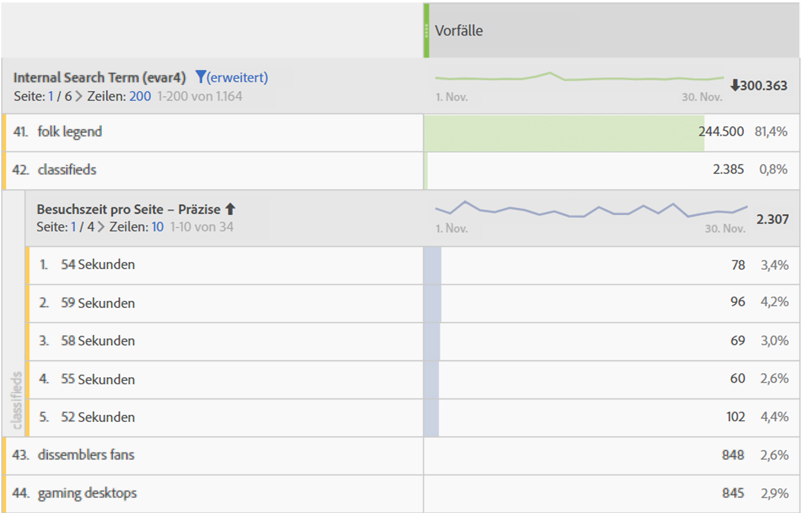

# Besuchszeit

Adobe Analytics bietet verschiedene Metriken und Dimensionen zur Besuchszeit. Erfahren Sie mehr über die Funktionsweise und die Berechnung solcher Metriken.

* [Besuchszeitmetriken](../../../components/c-variables/c-metrics/metrics-time-spent.md#section_4F54D70300944748A62088F5870E4B6C)
* [Besuchszeitdimensionen](../../../components/c-variables/c-metrics/metrics-time-spent.md#section_D51606544CB046FC902E2E317318892C)
* [Berechnung der Besuchszeit](../../../components/c-variables/c-metrics/metrics-time-spent.md#section_90A3882638974969A4B8B674FFDB7624)
* [FAQs zur Besuchszeit](../../../components/c-variables/c-metrics/metrics-time-spent.md#section_51C2735BACAB42CCBA1DD3CBF238E2F7)
* [Beispielberechnungen](../../../components/c-variables/c-metrics/metrics-time-spent.md#section_3D63D6A601F34E42AD5366435CB610D5)

## Besuchszeitmetriken {#section_4F54D70300944748A62088F5870E4B6C}

In dieser Tabelle sind die unterschiedlichen Besuchszeitmetriken sowie deren Definitionen aufgelistet. Außerdem finden Sie darin Informationen darüber, wo Sie sie in Adobe Analytics verwenden können.

<table id="table_7095406DF1614F3CAD5E437B919598D1"> 
 <thead> 
  <tr> 
   <th colname="col1" class="entry"> Metrik </th> 
   <th colname="col2" class="entry"> Definition </th> 
   <th colname="col3" class="entry"> Verfügbar in </th> 
  </tr> 
 </thead>
 <tbody> 
  <tr> 
   <td colname="col1"> 
Gesamtbesuchszeit in Sekunden 
 </td> 
   <td colname="col2"> 
Zeigt den Zeitraum an, über den Besucher insgesamt mit einem bestimmten Dimensionselement agieren. 
 
Enthält die Instanz eines Wertes sowie die Persistenz über alle folgenden Treffer hinweg. Bei Props wird die Besuchszeit auch über die nachfolgenden Verknüpfungsereignisse hinweg berechnet. 
 </td> 
   <td colname="col3"> 
Analysis Workspace 
 
Reports &amp; Analytics 
 
Report Builder (namens „Gesamtbesuchszeit“) 
 
Data Warehouse 
 </td> 
  </tr> 
  <tr> 
   <td colname="col1"> 
Zeit pro Besuch (Sekunden) 
 </td> 
   <td colname="col2"> 
<i>Gesamtbesuchszeit in Sekunden/(Besuch – Absprünge)</i> 
 
Stellt die durchschnittliche Zeit dar, die Besucher bei jedem Besuch mit einem bestimmten Dimensionselement interagieren. 
 </td> 
   <td colname="col3"> 
Analysis Workspace 
 
Reports &amp; Analytics 
 </td> 
  </tr> 
  <tr> 
   <td colname="col1"> 
Besuchszeit pro Besucher (Sekunden) 
 </td> 
   <td colname="col2"> 
<i>Gesamtbesuchszeit in Sekunden/(unique visitor – Absprünge unique visitors)</i> 
 
Stellt die durchschnittliche Zeit dar, die Besucher mit einem bestimmten Dimensionselement über die Lebensdauer des Besuchers (Cookie-Laufzeit) hinweg interagieren. 
 </td> 
   <td colname="col3"> 
Analysis Workspace 
 
Reports &amp; Analytics 
 </td> 
  </tr> 
  <tr> 
   <td colname="col1"> 
Durchschnittliche Besuchszeit pro Seite (Sekunden) 
 </td> 
   <td colname="col2"> 
Stellt die gesamte Zeit dar, die Besucher pro Dimensionselement-Sequenz mit einem bestimmten Dimensionselement interagieren. Anders als der Name vermuten lässt, beschränkt sich diese Metrik nicht nur auf Durchschnitte pro „Seite“. Weitere Informationen über Sequenzen finden Sie im Bereich „Berechnung der Besuchszeit“. 
 
Hinweis: Diese Metrik unterscheidet sich auf der Dimensionselement-Ebene mit hoher Wahrscheinlichkeit von „Zeit pro Besuch“, da bei der Berechnung ein anderer Nenner verwendet wird. 
 </td> 
   <td colname="col3"> 
Analysis Workspace 
 
Reports &amp; Analytics (wird in Minuten angezeigt) 
 
Report Builder (in Minuten angezeigt) 
 </td> 
  </tr> 
  <tr> 
   <td colname="col1"> 
Durchschnittliche Besuchszeit pro Seite 
 </td> 
   <td colname="col2"> 
<b>Veraltete Metrik. </b> 
 
Wir empfehlen Ihnen die Verwendung von „Durchschnittliche Besuchszeit pro Site“, wenn Sie die durchschnittliche Zeit für ein Dimensionselement in Erfahrung bringen möchten. 
 </td> 
   <td colname="col3"> 
Report Builder (wenn sich eine Dimension in der Anforderung befindet) 
 </td> 
  </tr> 
  <tr> 
   <td colname="col1"> 
Gesamtsitzungslänge 
 
(Auch bekannt als „Länge der vorherigen Session“) 
 </td> 
   <td colname="col2"> 
Nur SDK für Mobilanwendungen. Wird beim nächsten Start der App für die vorangegangene Sitzung bestimmt. Diese Metrik wird in Sekunden berechnet. Allerdings zählt sie nicht, wenn sie im Hintergrund ausgeführt wird, sondern nur, wenn sie direkt verwendet wird. Es handelt sich um eine Metrik auf Sitzungsebene. 
 
Ein Beispiel: Sie installieren die App ABC, starten die App und verwenden sie 2 Minuten lang, bevor Sie die App schließen. Es werden keine Daten über diese Sitzungsdauer gesendet. Wenn Sie die App das nächste Mal starten, wird die Gesamtsitzungslänge mit einem Wert von 120 gesendet. 
 </td> 
   <td colname="col3"> 
Analysis Workspace 
 
Reports &amp; Analytics 
 
Report Builder 
 
Mobile Services-Benutzeroberfläche 
 </td> 
  </tr> 
  <tr> 
   <td colname="col1"> 
Durchschnittliche Sitzungslänge (Mobil) 
 </td> 
   <td colname="col2"> 
Gesamtsitzungslänge/(Starts - Erste Starts) 
 
Nur SDK für Mobilanwendungen. Es handelt sich um eine Metrik auf Sitzungsebene. 
 </td> 
   <td colname="col3"> 
Report Builder 
 
Mobile Services-Benutzeroberfläche 
 </td> 
  </tr> 
 </tbody> 
</table>

## Besuchszeitdimensionen {#section_D51606544CB046FC902E2E317318892C}

In dieser Tabelle sind die unterschiedlichen Besuchszeitdimensionen sowie deren Definitionen aufgelistet. Außerdem finden Sie darin Informationen darüber, wo Sie sie in Adobe Analytics verwenden können.

<table id="table_BF1B7B8620714105BFB5C1AC37ABE02C"> 
 <thead> 
  <tr> 
   <th colname="col1" class="entry"> Dimension </th> 
   <th colname="col2" class="entry"> Definition </th> 
   <th colname="col3" class="entry"> Verfügbar in </th> 
  </tr> 
 </thead>
 <tbody> 
  <tr> 
   <td colname="col1"> 
Zeit pro Besuch – präzise 
 </td> 
   <td colname="col2"> 
Die gesamte bei einem Besuch verbrachte Zeit, die auf die nächste Sekunde gekürzt und auf alle Treffer angewendet wird, die Teil des Besuchs waren. Es handelt sich um eine Dimension auf Besuchsebene. 
 </td> 
   <td colname="col3"> 
Analysis Workspace 
 </td> 
  </tr> 
  <tr> 
   <td colname="col1"> 
Zeit pro Besuch – zusammengefasst 
 </td> 
   <td colname="col2"> 
Die präzise Dimension, die in 9 verschiedene Bereiche zusammengefasst wird. Es handelt sich um eine Dimension auf Besuchsebene. Die Bereiche sind: 
 
    <ul id="ul_BC909A2D22ED4D48A3F7CE6A666F26E5"> 
     <li id="li_0FB28A1F0D894B7C95724A8C6BD5B00B">Weniger als 1 Minute </li> 
     <li id="li_10223656420A475AAB3443981D49D10E">1-5 Minuten </li> 
     <li id="li_0DEE723B81C64EAFB5BD1125D48D3AD2">5-10 Minuten </li> 
     <li id="li_B736AC970E0049EB8844480702F345A6">10-30 Minuten </li> 
     <li id="li_21B8ECC3EE66497E8D870A004351B04B">30-60 Minuten </li> 
     <li id="li_79FB658128FD4F97AAE1A803F1687BD1">1-2 Stunden </li> 
     <li id="li_CCC0746FEB954BECB9E670ECCDBF30F3">2-5 Stunden </li> 
     <li id="li_BD7AFC524C814F9FAE423A4E301661D4">5-10 Stunden </li> 
     <li id="li_C9B5F1A83F99437A98A61756EE286687">10-15 Stunden </li> 
     <li id="li_8CC5A279D5804C5EA34C1B3589EF07BA">Über 15 Stunden </li> 
    </ul> 
Hinweis: Besuche, die länger als 12 Stunden dauern, können auftreten, wenn Treffer nicht in der richtigen Reihenfolge erhalten werden. 
 </td> 
   <td colname="col3"> 
Analysis Workspace 
 
Reports &amp; Analytics 
 
Report Builder 
 </td> 
  </tr> 
  <tr> 
   <td colname="col1"> 
Besuchszeit pro Seite – präzise 
 </td> 
   <td colname="col2"> 
Die gesamte bei einem Treffer verbrachte Zeit, die auf die nächste Sekunde gekürzt wird. Es handelt sich um eine Dimension auf Trefferebene, die sowohl Seitenansichten als auch Verknüpfungs-Ereignisse enthält. Anders als der Name vermuten lässt, beschränkt sich diese Metrik nicht nur auf die Dimension „Seite“. 
 </td> 
   <td colname="col3"> 
Analysis Workspace 
 </td> 
  </tr> 
  <tr> 
   <td colname="col1"> 
Besuchszeit pro Seite – zusammengefasst 
 </td> 
   <td colname="col2"> 
Die präzise Dimension, die in 10 verschiedene Bereiche zusammengefasst wird; die zusammengefasste Dimension zählt jedoch nur Seitenansichten (und schließt Verknüpfungs-Ereignisse aus). Es handelt sich um eine Dimension auf Trefferebene. Die Bereiche sind: 
 
    <ul id="ul_D5F067A2520646A99AA261F9A4625C03"> 
     <li id="li_82307DE66EC548F0AD79DB1505A21F0D">weniger als 15 Sekunden </li> 
     <li id="li_585965B82C4D43B6870978A5CE63B5B6">15–29 Sekunden </li> 
     <li id="li_5C20DC78E126472A838818EBA1D954D0">30–59 Sekunden </li> 
     <li id="li_2579C0B9279340ABA3AD4A527D758239">1–3 Minuten </li> 
     <li id="li_E0FD800E948049A48DB4329A3E7A2478">3–5 Minuten </li> 
     <li id="li_D9DBBFE6004F42BD80BB4F9268DF7DA7">5–10 Minuten </li> 
     <li id="li_20F146799679456E8D6434D79EE12C31">10–15 Minuten </li> 
     <li id="li_A38951A553A14AE7A0F23A904EEE35DE">15–20 Minuten </li> 
     <li id="li_D44D773A344E47BFAA771302A49D8BD4">20–30 Minuten </li> 
     <li id="li_8766683DB29147CD8470D2317F750E97">Mehr als 30 Minuten </li> 
    </ul> </td> 
   <td colname="col3"> 
Analysis Workspace 
 
Reports &amp; Analytics 
 </td> 
  </tr> 
 </tbody> 
</table>

## Berechnung der Besuchszeit {#section_90A3882638974969A4B8B674FFDB7624}

Adobe Analytics verwendet explizite Werte (einschließlich Verknüpfungs-Ereignissen und Videoaufrufen) zur Berechnung der [!UICONTROL Besuchszeit].

>[!NOTE]
>
>Without link events like [!UICONTROL Video Views] or [!UICONTROL Exit Links], time spent on the last hit of a visit cannot be known. Darüber hinaus wird [!UICONTROL Absprung-Besuchen] (d. h. [!UICONTROL Besuchen] mit einem einzelnen Treffer) keine [!UICONTROL Besuchszeit] zugewiesen.

Der **Zähler** ist in allen Besuchszeit-Berechnungen „Gesamtbesuchszeit in Sekunden“.

Der **Nenner** ist in Analytics nicht als separate Metrik verfügbar. Bei Besuchszeitmetriken auf Trefferebene besteht der Nenner in Sequenzen. Eine Sequenz ist ein Satz aufeinanderfolgender Treffer, in dem eine beliebige Variable denselben Wert enthält (egal, ob festgelegt, nach vorne verteilt oder permanent gespeichert). „Nach vorne verteilt“ bezieht sich auf die Persistenz von Props zwischen Seitenansichten (d. h. über aufeinanderfolgende Verknüpfungs-Ereignisse hinweg). Dies dient der Berechnung der Besuchszeit.

* Zum Beispiel ist der Nenner im Fall des [!UICONTROL Seitennamens] oder einer anderen Dimension auf der Trefferebene vor allem [!UICONTROL Instanzen] oder [!UICONTROL Seitenansichten], für die ein Neuladen und nicht festgelegte Werte (z. B. Verknüpfungs-Ereignisse) jedoch als einzelne Interaktion (eine Sequenz) gezählt werden.

* Treffer mit [!UICONTROL Absprung] und [!UICONTROL Ausstieg] werden auch aus dem Nenner entfernt, da die Besuchszeit nicht ermittelt werden kann.

## FAQs zur Besuchszeit {#section_51C2735BACAB42CCBA1DD3CBF238E2F7}

<table id="table_D8BA825412B6420390CA78D77A5E57C2"> 
 <thead> 
  <tr> 
   <th colname="col1" class="entry"> Frage </th> 
   <th colname="col2" class="entry"> Antwort </th> 
  </tr> 
 </thead>
 <tbody> 
  <tr> 
   <td colname="col1"> 
Können alle Besuchszeitmetriken auf jede Dimension angewendet werden? 
 </td> 
   <td colname="col2"> 
Die folgenden Besuchszeitmetriken können auf jede beliebige Dimension angewendet werden: 
 
    <ul id="ul_FC9513D0184B4A74BA1F4CCEA8BC1940"> 
     <li id="li_669156CC549040E08AB4977AF4B8AECB">Gesamtbesuchszeit in Sekunden </li> 
     <li id="li_3CCD7E7D127448689228E98A5EE854CB">Zeit pro Besuch (Sekunden) </li> 
     <li id="li_1F61C157EC414C7F8702BC3F365AA2D7">Besuchszeit pro Besucher (Sekunden) </li> 
     <li id="li_A3EF959A9BAB4872915F1A5C1A86D48E">Durchschnittliche Besuchszeit pro Seite (Sekunden) </li> 
    </ul> </td> 
  </tr> 
  <tr> 
   <td colname="col1"> 
Welche Besuchszeitdimension empfiehlt sich am ehesten in Aufschlüsselungen mit anderen Dimensionen? 
 </td> 
   <td colname="col2"> 
Die Dimension "Besuchszeit pro Seite - granular" ist eine Trefferebene auf Trefferebene. Wenn Sie diese Dimension anhand einer anderen Dimension aufschlüsseln, können Sie die Sekunden ermitteln, über die sich ein Treffer erstreckte, von dem auch die Aufschlüsselungsdimension betroffen war. 
 
Im Beispiel unten ist der Suchbegriff „classifieds“ mit Treffer-Zeiten von 54 Sekunden, 59 Sekunden etc. verbunden, was möglicherweise anzeigt, dass Besucher Zeit mit dem Lesen von Inhalten verbringen, die für diesen Suchbegriff zurückgegeben werden. 
 
 
 </td> 
  </tr> 
  <tr> 
   <td colname="col1"> 
Welche Metrik ist für die Dimension "Besuchszeit pro Seite - granular" geeignet? 
 </td> 
   <td colname="col2"> 
Jede beliebige Metrik. Die Dimension zeigt die Besuchszeit für den Treffer an, bei dem es zu dem Ereignis kam. Eine längere Besuchszeit bedeutet, dass ein Besucher mehr Zeit auf einer Seite (Treffer) verbracht hat, auf der es zu dem Ereignis kam. 
 
 
 </td> 
  </tr> 
  <tr> 
   <td colname="col1"> Was ist der Unterschied zwischen Durchschnittliche Besuchszeit pro Site und Besuchsdauer pro Besuch ? </td> 
   <td colname="col2"> 
Der Unterschied ist der in der Metrik verwendete Nenner: 
 
    <ul id="ul_E9D7B4D3EDCC4691B2C724E0FE5480D2"> 
     <li id="li_CA34D84A3164473A8737D258425CA468">  Durchschnittliche Besuchszeit pro Site verwendet die Sequenzen, die ein Dimensionselement enthalten. </li> 
     <li id="li_2F2639480BE24927919732D00364EECA"> Besuchsdauer pro Besuch verwendet die Besuchsanzahl. </li> 
    </ul> 
Aus diesem Grund geben diese Metriken möglicherweise ähnliche Ergebnisse auf Besuchsebene zurück, unterscheiden sich aber auf einer Trefferebene. 
 </td> 
  </tr> 
 </tbody> 
</table>

## Beispielberechnungen {#section_3D63D6A601F34E42AD5366435CB610D5}

Angenommen, der folgende Satz von Server-Aufrufen gilt für einen einzigen Besucher mit einem einzigen Besuch:

<table id="table_63CBB5097E5A46659877E2CA3C94D81C"> 
 <thead> 
  <tr> 
   <th colname="col1" class="entry"> Besuch – Trefferanzahl </th> 
   <th colname="col2" class="entry"> 1 </th> 
   <th colname="col3" class="entry"> 2 </th> 
   <th colname="col4" class="entry"> 3 </th> 
   <th colname="col5" class="entry"> 4 </th> 
   <th colname="col6" class="entry"> 5 </th> 
   <th colname="col7" class="entry"> 6 </th> 
   <th colname="col8" class="entry"> 7 </th> 
  </tr> 
 </thead>
 <tbody> 
  <tr> 
   <td colname="col1"> <b>Besuch – vergangene Zeit (Sek.)</b> </td> 
   <td colname="col2"> 0 </td> 
   <td colname="col3"> 30 </td> 
   <td colname="col4"> 80 </td> 
   <td colname="col5"> 180 </td> 
   <td colname="col6"> 190 </td> 
   <td colname="col7"> 230 </td> 
   <td colname="col8"> 290 </td> 
  </tr> 
  <tr> 
   <td colname="col1"> <b>Besuchszeit in Sekunden</b> </td> 
   <td colname="col2"> 30 </td> 
   <td colname="col3"> 50 </td> 
   <td colname="col4"> 100 </td> 
   <td colname="col5"> 10 </td> 
   <td colname="col6"> 40 </td> 
   <td colname="col7"> 60 </td> 
   <td colname="col8"> - </td> 
  </tr> 
  <tr> 
   <td colname="col1"> <b>Treffertyp</b> </td> 
   <td colname="col2"> Seite </td> 
   <td colname="col3"> Link </td> 
   <td colname="col4"> Seite </td> 
   <td colname="col5"> Seite </td> 
   <td colname="col6"> Seite </td> 
   <td colname="col7"> Seite </td> 
   <td colname="col8"> Seite </td> 
  </tr> 
  <tr> 
   <td colname="col1"> <b>Seitenname</b> </td> 
   <td colname="col2"> Home </td> 
   <td colname="col3"> - </td> 
   <td colname="col4"> Produkt </td> 
   <td colname="col5"> Home </td> 
   <td colname="col6"> Home 
(neu laden) 
 </td> 
   <td colname="col7"> Korb </td> 
   <td colname="col8"> Bestellungsbestätigung </td> 
  </tr> 
 </tbody> 
</table>

### eVar-Beispiel

<table id="table_6D0CF0C53DC145D3A53C06EC3012BCC0">  
 <thead> 
  <tr> 
   <th colname="col1" class="entry"> Besuch – Trefferanzahl </th> 
   <th colname="col2" class="entry"> 1 </th> 
   <th colname="col3" class="entry"> 2 </th> 
   <th colname="col4" class="entry"> 3 </th> 
   <th colname="col5" class="entry"> 4 </th> 
   <th colname="col6" class="entry"> 5 </th> 
   <th colname="col7" class="entry"> 6 </th> 
   <th colname="col8" class="entry"> 7 </th> 
  </tr> 
 </thead>
 <tbody> 
  <tr> 
   <td colname="col1"> <b>eVar1</b> </td> 
   <td colname="col2"> Rot 
(festgelegt) 
 </td> 
   <td colname="col3"> Rot 
(permanent gespeichert) 
 </td> 
   <td colname="col4"> (abgelaufen) </td> 
   <td colname="col5"> Blau 
(festgelegt) 
 </td> 
   <td colname="col6"> Blau 
(festgelegt) 
 </td> 
   <td colname="col7"> Blau 
(permanent gespeichert) 
 </td> 
   <td colname="col8"> Rot 
(festgelegt) 
 </td> 
  </tr> 
  <tr> 
   <td colname="col1"> <b>eVar – Besuchszeit in Sekunden</b> </td> 
   <td colname="col2"> 30 </td> 
   <td colname="col3"> 50 </td> 
   <td colname="col4"> - </td> 
   <td colname="col5"> 10 </td> 
   <td colname="col6"> 40 </td> 
   <td colname="col7"> 60 </td> 
   <td colname="col8"> - </td> 
  </tr> 
 </tbody> 
</table>

### Prop-Beispiel

<table id="table_1CB4D24A6CAA479C8E59A7C77FFB8226">  
 <thead> 
  <tr> 
   <th colname="col1" class="entry"> Besuch – Trefferanzahl </th> 
   <th colname="col2" class="entry"> 1 </th> 
   <th colname="col3" class="entry"> 2 </th> 
   <th colname="col4" class="entry"> 3 </th> 
   <th colname="col5" class="entry"> 4 </th> 
   <th colname="col6" class="entry"> 5 </th> 
   <th colname="col7" class="entry"> 6 </th> 
   <th colname="col8" class="entry"> 7 </th> 
  </tr> 
 </thead>
 <tbody> 
  <tr> 
   <td colname="col1"> <b>prop1</b> </td> 
   <td colname="col2"> A 
(festgelegt) 
 </td> 
   <td colname="col3"> A 
(nach vorne verteilt) 
 </td> 
   <td colname="col4"> (nicht festgelegt) </td> 
   <td colname="col5"> B 
Festgelegt) 
 </td> 
   <td colname="col6"> B 
(festgelegt) 
 </td> 
   <td colname="col7"> A 
(festgelegt) 
 </td> 
   <td colname="col8"> C 
(festgelegt) 
 </td> 
  </tr> 
  <tr> 
   <td colname="col1"> <b>prop1 – Besuchszeit in Sekunden</b> </td> 
   <td colname="col2"> 30 </td> 
   <td colname="col3"> 50 </td> 
   <td colname="col4"> - </td> 
   <td colname="col5"> 10 </td> 
   <td colname="col6"> 40 </td> 
   <td colname="col7"> 60 </td> 
   <td colname="col8"> - </td> 
  </tr> 
 </tbody> 
</table>

Basierend auf der obigen Tabelle werden Besuchszeitmetriken wie folgt berechnet:

| prop1 | Gesamtbesuchszeit in Sekunden | Zeit pro Besuch | Besuchszeit pro Besucher | Sequenzanzahl | Durchschnittliche Besuchszeit pro Site |
|---|---|---|---|---|---|
| A | 30 + 50 + 60 = 140 | 140 / 1 = 140 | 140 / 1 = 140 | 2 | 140 / 2 = 70 |
| B | 10 + 40 = 50 | 50 / 1 = 50 | 50 / 1 = 50 | 1 | 50 / 1 = 50 |
| C | 0 | 0 | 0 | 0 | 0 |
| Nicht zugewiesene Zeit | 100 | - | - | - | - |

| eVar1 | Gesamtbesuchszeit in Sekunden | Zeit pro Besuch | Besuchszeit pro Besucher | Sequenzanzahl | Durchschnittliche Besuchszeit pro Site |
|---|---|---|---|---|---|
| Rot | 30 + 50 = 80 | 80 / 1 = 80 | 80 / 1 = 80 | 1 | 80 / 1 = 80 |
| Blau | 10 + 40 + 60 = 110 | 110 / 1 = 110 | 110 / 1 = 110 | 1 | 110 / 1 = 110 |
| Nicht zugewiesene Zeit | 100 | - | - | - | - |

Für Besuchszeitdimensionen werden in den verknüpften Berichten die folgenden Zeilen angezeigt:

* Zeit pro Besuch – (präzise): 290
* Besuchszeit pro Seite – (präzise): 10, 30, 40, 50, 60, 100

Einige zusätzliche Hinweise, um das Beispiel deutlicher zu machen:

* Alle Besuchszeitberechnungen basieren auf „Besuch – vergangene Zeit“. Dieser Wert beginnt beim ersten Treffer des Besuchs bei null.
* „Besuchszeit in Sekunden“ ist der Unterschied zwischen dem Zeitstempel des aktuellen Treffers und dem Zeitstempel des nächsten Treffers. Aus diesem Grund gibt es für den letzten Treffer des Besuchs (sowie die Absprünge) keine Besuchszeit.
* Eine „Sequenz“ ist ein Satz aufeinanderfolgender Treffer, in dem eine beliebige Variable denselben Wert enthält (egal, ob festgelegt, nach vorne verteilt oder permanent gespeichert). Zum Beispiel verfügt prop1 „A“ über zwei Sequenzen: Treffer 1 und 2 sowie Treffer 6. Werte des letzten Treffers eines Besuchs beginnen keine neue Sequenz, da es für den letzten Treffer keine Besuchszeit gibt. „Durchschnittliche Besuchszeit pro Site“ verwendet Sequenzen im Nenner.

   * Für die Besuchsdauer werden Props von Seitentreffern an darauffolgende Verknüpfungs-Treffer „nach vorne verteilt“. Dies wird oben für prop1 auf Treffer 2 dargestellt. Dadurch kann der für prop1 festgelegte Wert für Treffer 1 („A“) die bei Treffer 2 verbrachte Zeit sammeln.
   * eVars sammeln die Besuchszeit für jeden Treffer, bei dem der eVar festgelegt oder permanent gespeichert ist. Die eVar-Persistenz wird durch die eVar-Einstellungen in Analytics Admin definiert.
