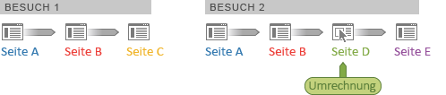

# Besucherbeitrag – Ad Hoc Analysis

Die Metrikenreihe zum Besucherbeitrag bietet Ihnen einen Einblick in den Beitrag zu Marketingkanälen, Kampagnen, Umsatz usw. über mehrere Besuchersitzungen hinweg. Beispielsweise können Einkauf- und Umsatzgutschriften zurück zu anderen Marketing-Berührungspunkten verfolgt werden, die vor dem Besuch stattfanden, bei dem eine Bestellung aufgegeben wurde. Ad Hoc Analysis erfassen den Besucherbeitrag über mehrere Besuche hinweg.

**Umsatz (Beitrag)**: Verteilt die Konversionsgutschrift über alle Seiten eines einzelnen Besuchs, die zu einer Konversion geführt haben, bis hin zur Konversionsseite.

**Umsatz (Besucherbeitrag)**: Verteilt die Konversionsgutschrift besuchsübergreifend auf allen Seiten, basierend auf einem von Ihnen festgelegten Zeitrahmen.

**Beispiel – besuchsübergreifender Umsatzbeitrag**

Ein Besucher hat Ihre Website zweimal besucht. Das Konversionsereignis erfolgt beim zweiten Besuch auf Seite D und bringt einen Umsatz von 60 USD.

Die Konversion wird im Bericht wie folgt zugeordnet:

* **Umsatz**: Der Seite zugeordnet.
* **Umsatz (Beitrag)**: Dem zweiten Besuch zugeordnet.
* **Umsatz (Besucherbeitrag)**: Beiden Besuchen zugeordnet.

<table id="table_91A7244E77854838A8392B49366FB445"> 
 <thead> 
  <tr> 
   <th colname="col1" class="entry"> Seite </th> 
   <th colname="col2" class="entry"> Umsatz </th> 
   <th colname="col3" class="entry"> Umsatz (Beitrag) </th> 
   <th colname="col4" class="entry"> Umsatz (Besucherbeitrag) </th> 
  </tr> 
 </thead>
 <tbody> 
  <tr> 
   <td colname="col1"> 
A 
 </td> 
   <td colname="col2"> 
0 
 </td> 
   <td colname="col3"> 
60 $ 
 </td> 
   <td colname="col4"> 
60 $ 
 </td> 
  </tr> 
  <tr> 
   <td colname="col1"> 
B 
 </td> 
   <td colname="col2"> 
0 
 </td> 
   <td colname="col3"> 
60 $ 
 </td> 
   <td colname="col4"> 
60 $ 
 </td> 
  </tr> 
  <tr> 
   <td colname="col1"> 
C 
 </td> 
   <td colname="col2"> 
0 
 </td> 
   <td colname="col3"> 
0 
 </td> 
   <td colname="col4"> 
60 $ 
 </td> 
  </tr> 
  <tr> 
   <td colname="col1"> 
D 
 </td> 
   <td colname="col2"> 
60 $ 
 </td> 
   <td colname="col3"> 
60 $ 
 </td> 
   <td colname="col4"> 
60 $ 
 </td> 
  </tr> 
 </tbody> 
</table>

