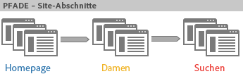
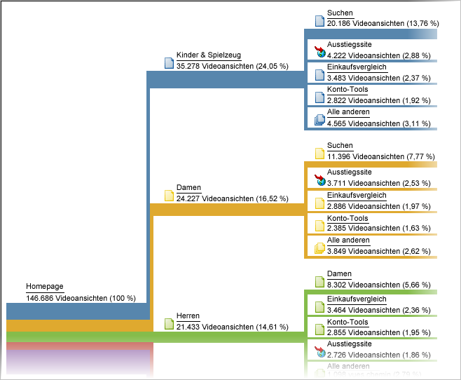

# Pfade

Eine Gruppe von auf Pfadanalysen basierenden Berichten. Technisch gesehen, sind Pfade die Navigation von einem Seitennamen zu einem anderen (von einem Wert zum nächsten).

Verwenden Sie die [Flussfunktion in Analysis Workspace](https://marketing.adobe.com/resources/help/en_US/analytics/analysis-workspace/flow.html) für flexiblere Pfadoptionen.

>[!NOTE]
>
>To enable pathing, go to **[!UICONTROL Admin &gt; Report Suites &gt; Edit Settings &gt; Traffic &gt; Traffic Variables]**. Wenden Sie sich zum Aktivieren von Pfaden in den Sitebereichs- und Server-Berichten an die Kundenunterstützung.

Wenn Sie die Reihenfolge benötigen, in der Werte erfasst werden, müssen Sie Pfade für die Variablenerfassung dieser Werte aktivieren. Pfade werden standardmäßig für Seiten aktiviert. Pfade werden nicht standardmäßig für Eigenschaften aktiviert, da dies nur in bestimmten Fällen angebracht ist. Wenden Sie sich an den Kundendienst, um Pfade für eine Eigenschaft zu aktivieren.

>[!NOTE]
>
>Wenn Sie in Ad-hoc-Analysen Classifications für eine prop aktivieren, werden Pfadmetriken für alle für die aktivierte Eigenschaft eingerichteten Classifications verfügbar.

**Beispiel: Pfade für Sitebereiche**

Mit dem Aktivieren von Pfaden für *`s.channel`* die Variable können Sie verfolgen, wie Sitebesucher zwischen Sitebereichen wechseln (da sich der Wert ändert).



Pfadsetzungen sind dann in unterschiedlichen Pfadberichten verfügbar, wie [!UICONTROL Bereichsfluss Nächste Site], in dem angezeigt wird, wie Besucher durch Seitengruppen oder Bereiche Ihrer Site navigieren.



**Beispiel: Pfade bei Suchvorgängen**

Dieses Konzept der Navigation von einem Wert zum nächsten gilt auch für andere Traffic-Variablen, wie *`s.props`*. For example, if you enable pathing for your Internal Search Term *`s.prop`*, you could see the path visitors take through search terms.

**Beispiel: Pfade pro Anmeldestatus**

Sie möchten vielleicht wissen, wie Besucher basierend auf ihrem Anmeldestatus durch Ihre Site navigieren. Um diese Informationen zu erhalten, würden Sie nicht die Pfadsetzungsberichte zum Anmeldestatus ansehen, da diese zeigen, wie Besucher Werte in diesem Bericht verändert haben oder welche Veränderungen Besucher zwischen An- und Abmelden durchgemacht haben. Sie würden stattdessen den Segmentwert mit der *`s.pageName`* Variablen verketten und dann den Pfad für die sich ergebende Variable analysieren. Hier ist ein Codebeispiel für eine Seitenpfadanalyse nach Mitgliedsstatus:

```js
s.pageName=“Home Page”; 
s.prop18=“Gold”; // Member Status 
s.prop19=s.prop18 + “:” + s.pageName;
```

Aktivieren Sie dann die Pfade für *`s.prop19`*, um zu verfolgen, wie Besucher durch die Seiten navigieren.

>[!NOTE]
>
>Wenn Sie Ad-hoc-Analysen durchführen, können Sie Seitenpfade segmentieren, ohne die Segmentwerte verketten zu müssen, und jedes Segment auf Pfadsetzungsberichte anwenden.

