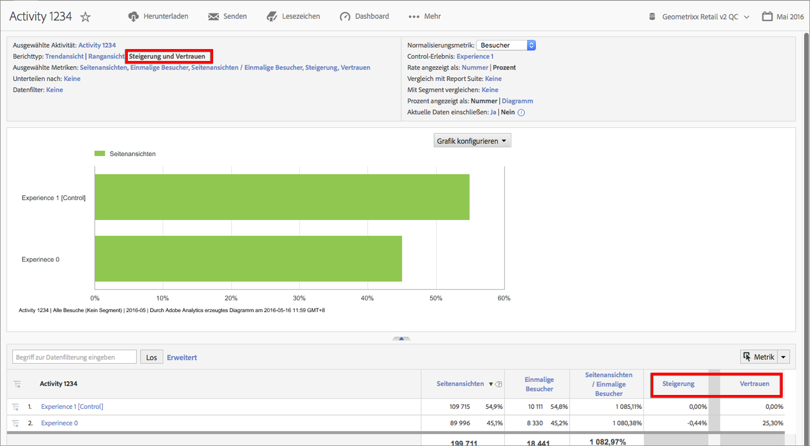

# Target – Steigerung und Konfidenz

Lets you assess the success of campaigns in Adobe Analytics in the same way you have done in [!DNL Target Classic]  in the past.

**[!UICONTROL Analytics]** &gt; **[!UICONTROL Berichte]** &gt; Alle Berichte **[!UICONTROL anzeigen]** &gt; **[!UICONTROL Adobe Target]** &gt; **[!UICONTROL Analytics für Target]** &gt; **** Target-Aktivitäten.

Die Dokumentation zu Adobe Target enthält weitere Informationen zu [Lift](https://marketing.adobe.com/resources/help/en_US/target/target/c_estimating_lift_in_revenue.html) und [Konfidenz](https://marketing.adobe.com/resources/help/en_US/rec/c_Confidence_Level_and_Confidence_Interval.html).

Lift und Konfidenz berechnen:

1. Klicken Sie im Bericht **[!UICONTROL Zielaktivitäten]auf eine Aktivität, damit die Details angezeigt werden.**
1. Wählen Sie unter „Berichtstyp“ **[!UICONTROL Lift und Konfidenz aus]**.
1. Klicken Sie auf **[!UICONTROL Metriken anzeigen], um eine Metrik hinzuzufügen.** Für diesen Berichtstyp kann nur eine Metrik hinzugefügt werden, weil sich die Bewertung eines Tests mit nur einer Metrik als Best Practice bewährt hat. Weitere Metriken führen zu Rauschen und verschlechtern das Signal des Tests.
1. (Optional) Under **[!UICONTROL Normalizing Metric]**, select one of the following: Visitors, Visits, or Impressions. In den meisten Fällen wird es sich um den Standardwert „Besucher“ handeln.

1. Der Bericht wird diese Metriken hinzufügen, einschließlich dem Verhältnis zwischen Metrik und Normalisierungsmetrik.

## Berichtseinstellungen {#section_3508439E09CA4E38B2EA309BA477C01D}

<table id="table_0FBB257C96454CDA82D487DC68459C13"> 
 <thead> 
  <tr> 
   <th colname="col1" class="entry"> Einstellung </th> 
   <th colname="col2" class="entry"> Beschreibung </th> 
  </tr> 
 </thead>
 <tbody> 
  <tr> 
   <td colname="col1"> Ausgewählte Aktivität </td> 
   <td colname="col2"> Die Zielaktivität, die gerade angezeigt wird und für die Lift und Konfidenz berechnet werden. </td> 
  </tr> 
  <tr> 
   <td colname="col1"> Berichtstyp </td> 
   <td colname="col2"> Hier wählen Sie Lift und Konfidenz aus – diese erscheinen als Metriken in den unterhalb angezeigten Berichtsergebnissen. </td> 
  </tr> 
  <tr> 
   <td colname="col1"> Ausgewählte Metriken </td> 
   <td colname="col2"> Zeigt die ausgewählte Metrik an (im obigen Beispiel den Umsatz), die Normalisierungsmetrik (Unique Visitors), das Verhältnis zwischen diesen beiden Metriken und dann die Lift- und Konfidenzberechnungen im Vergleich zum Control-Erlebnis. </td> 
  </tr> 
  <tr> 
   <td colname="col1"> Unterteilen nach </td> 
   <td colname="col2"> Sie können den Bericht mit anderen Berichten weiter aufschlüsseln. </td> 
  </tr> 
  <tr> 
   <td colname="col1"> Datenfilter </td> 
   <td colname="col2"> Wendet auf diesen Bericht bestimmte Filter an. </td> 
  </tr> 
  <tr> 
   <td colname="col1"> Normalisierungsmetrik </td> 
   <td colname="col2"> Sie können über Besuche, Besucher oder Impressionen normalisieren. Die Normalisierungsmetrik wird zum Nenner (Divisor) der Lift-Berechnung. Sie wirkt sich auch darauf aus, wie die Daten aggregiert werden, bevor die Konfidenzberechnung angewendet wird. </td> 
  </tr> 
  <tr> 
   <td colname="col1"> Control-Erlebnis </td> 
   <td colname="col2"> Das Zielerlebnis, mit dem der Vergleich durchgeführt und für das der Lift-Wert berechnet wird. </td> 
  </tr> 
  <tr> 
   <td colname="col1"> Vergleich mit Report Suite </td> 
   <td colname="col2"> Sie können andere Report Suites auswählen, mit denen ein Vergleich erfolgen soll. </td> 
  </tr> 
  <tr> 
   <td colname="col1"> Mit Segment vergleichen </td> 
   <td colname="col2"> Sie können Segmente auswählen, mit denen ein Vergleich erfolgen soll. </td> 
  </tr> 
  <tr> 
   <td colname="col1"> Prozentanzeige als Zahl/Diagramm </td> 
   <td colname="col2"> Zeigt den Lift- und Konfidenzprozentsatz als Zahl oder Diagramm an. </td> 
  </tr> 
  <tr> 
   <td colname="col1"> Aktuelle Daten einschließen </td> 
   <td colname="col2"> 
Mit der Option „Aktuelle Daten einschließen“ in Reports &amp; Analytics können Sie die jüngsten Analytics-Daten abrufen, und das häufig noch bevor die Daten vollständig verarbeitet und abgeschlossen sind. Die aktuellen Daten zeigen die meisten Metriken in Minutenschnelle und liefern so relevante Daten für die rasche Entscheidungsfindung. 
 </td> 
  </tr> 
 </tbody> 
</table>

