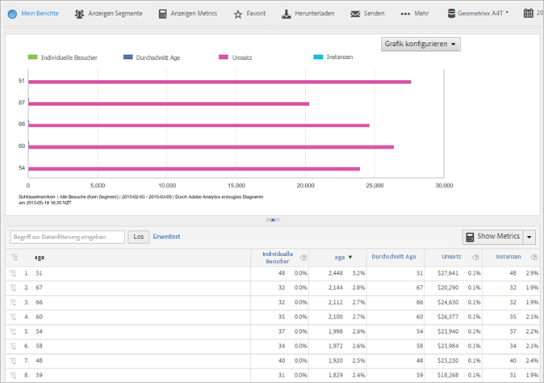

# Kundenattribute

Häufig gestellte Fragen zu Analytics für Kundenattribute und Informationen zum Erstellen des Berichts „Kundenattribute“.

**[!UICONTROL Berichte]** **[!UICONTROL &gt; Besucherprofil]** &gt; **[!UICONTROL Kundenattribute]**

Wenn Sie Daten von Unternehmenskunden in einer CRM-Datenbank (Customer Relationship Management) erfassen, können Sie diese Daten in eine Datenquelle für Kundenattribute in die Experience Cloud hochladen. Nach dem Hochladen der Daten können Sie in „Reports &amp; Analytics“ den Bericht „Kundenattribute“ erstellen.

* [Kundenattribute und Berichterstattungsmetriken in Analytics](../../../components/c-variables/dimensionslist/reports-customer-attributes.md#section_EF343662146B460A882D3DF772ADD86D)
* [Häufig gestellte Fragen – Kundenattribute in Analytics](../../../components/c-variables/dimensionslist/reports-customer-attributes.md#section_E29641D1F3D649C1AC9EA5231921F038)

Informationen zum Hochladen von Kundenattributdaten erhalten Sie unter [Kundenattribute](https://marketing.adobe.com/resources/help/en_US/mcloud/attributes.html) in Experience Cloud.

## Kundenattribute und Berichterstattungsmetriken in Analytics {#section_EF343662146B460A882D3DF772ADD86D}

Nach dem Hochladen von Kundenattributen und der Validierung des Schemas (in der Experience Cloud) erstellt das System Metriken basierend auf den benutzerfreundlichen Namen (wie *`age`* oder *`gender`*), die Sie den Attributzeichenfolgen und -ganzzahlen zuordnen. These metrics appear in **[!UICONTROL Visitor Profile]** &gt; **[!UICONTROL Customer Attributes]** reports.

Beispiel:

**[!UICONTROL Besucherprofil]** &gt; **[!UICONTROL Kundenattribute]** &gt; **[!UICONTROL Alter]**

**Beispiel – Metriken für das Alter**

Wenn Sie eine Zeichenfolge als *`age`*, the system creates the following metrics and dimensions:

* Altersdimension: Sie können einen Bericht basierend auf dem Altersattribut erstellen.
* Altersmetrik: Eine Metrik, die Sie zu einem Bericht hinzufügen können, beispielsweise einem Unique Visitors-Bericht.
* Zählung der Altersmetrik: Sie können beispielsweise nachvollziehen, ob Besucher einen Wert für *`age`* auf einem Formular angegeben haben.

Da Metriken in einer Berichtstabelle Summen darstellen, sollten Sie [eine berechnete Metrik erstellen](https://marketing.adobe.com/resources/help/en_US/analytics/calcmetrics/), über die Sie Informationen zum Durchschnittsalter erhalten. Die Formel für diese Metrik lautet `Age / Count of Age`.

## Häufig gestellte Fragen – Kundenattribute in Analytics {#section_E29641D1F3D649C1AC9EA5231921F038}

<table id="table_88631069013B408EBB0A810657662B36"> 
 <thead> 
  <tr> 
   <th colname="col1" class="entry"> Frage </th> 
   <th colname="col2" class="entry"> Antwort </th> 
  </tr> 
 </thead>
 <tbody> 
  <tr> 
   <td colname="col1"> 
Warum ist es besser, den Identitäts-Service zum Festlegen der Kunden-ID zu verwenden, anstatt die Kunden-ID in eine Prop oder eVar einzugeben? 
 </td> 
   <td colname="col2"> 
Die Verwendung des Identitätsdienstes bietet eine Reihe von Vorteilen: 
 
    <ul id="ul_5D3659604D43419F9CA5920B4F93728E"> 
     <li id="li_BA2EF0715C5A47EFAFA7191CFAD088A4">Wenn Sie die Kunden-ID nicht mit dem Identitätsdienst festlegen, stehen die Kundendatensätze nur für Adobe Analytics zur Verfügung. If you want to use the customer records for real-time targeting, you must use the Identity Service. </li> 
     <li id="li_228358684E474A298E39578D427BF932">Die Verwendung des Identitätsdienstes zum Festlegen der Kunden-ID verringert die Zeit, die für die Synchronisierung der IDs mit der Experience Cloud benötigt wird. Wenn Sie die Kunden-ID in eine Prop oder eVar eingeben, werden die Kunden-IDs über Back-End-Serversynchronisierung an Experience Cloud gesendet. Die Synchronisierung erfolgt in diesem Fall in Stapeln. Der Identitätsdienst synchronisiert die Kunden-ID sofort mit der Experience Cloud. </li> 
     <li id="li_BCF28219E4014FCF9F747C3D8D270526"> Die Verwendung des Identitätsdienstes anstelle einer Prop oder eVar gibt diese Prop oder eVar für andere Zwecke frei. </li> 
    </ul> </td> 
  </tr> 
  <tr> 
   <td colname="col1"> 
Wenn ich eine Kunden-ID bereits in einer Prop oder einer eVar speichere, warum sollte ich diese neue Funktion nutzen, anstatt meine Prop oder eVar mit CRM-Attributen zu klassifizieren? 
 </td> 
   <td colname="col2"> 
Props und eVars unterliegen Uniques Exceeded-Einschränkungen. Dank dieser Funktion können Sie Attributdaten für eine unbegrenzte Anzahl an Kunden-IDs einfügen. Außerdem werden durch den Prop/eVar-Ansatz die CRM-Informationen für Analytics eingeschränkt. 
 </td> 
  </tr> 
  <tr> 
   <td colname="col1"> 
Wie werden meine CRM-Attribute in Adobe Analytics angezeigt? 
 </td> 
   <td colname="col2"> 
CRM-Attribute werden in Analysis Workspace, Reports &amp; Analytics, Ad Hoc Analysis, der Berichterstellungs-API und in Report Builder angezeigt. Textattribute werden als Berichte/Dimensionen angezeigt. Numerische Attribute werden sowohl als Dimensionen als auch als Metriken angezeigt. 
 </td> 
  </tr> 
  <tr> 
   <td colname="col1"> 
Werden die CRM-Daten in Data Warehouse und in Datenfeeds verfügbar sein? 
 </td> 
   <td colname="col2"> 
Die CRM-Daten stehen derzeit nicht in Data Warehouse oder im Analytics Data Feed zur Verfügung. 
 </td> 
  </tr> 
 </tbody> 
</table>

