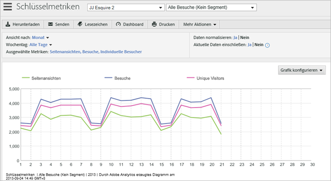

# Schlüsselmetriken

Mithilfe des Berichts „Schlüsselmetriken“ können Sie Metriken miteinander vergleichen, um gewisse Trends auszumachen. So können Sie zum Beispiel erkennen, ob vermehrte Seitenaufrufe auch mit einer Zunahme der Besucherzahlen einhergehen.

<!-- 

 <b>Use Cases</b> 
 

Social Media: You can use the Key Metrics Report to examine social groups, such as Total Mentions or Audience Sentiment, and see how they are affecting revenue. How do you tie key metrics like Revenue to Social metrics? Look at the KM report by those groupings--total mentions, total audience, mapped to revenue. i.e. tv grouping, computing grouping, to see if it spikes or drives revenue. 

 -->

