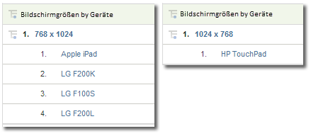

# Mobil

Zeigt Informationen über Website-Zugriffe von einem Mobilgerät an. Mobil-Berichte verbessern die Identifizierung der Besucher durch Datenerfassung von Mobilgeräten, die zum Anzeigen Ihrer Site verwendet wurden. Mobil-Berichten können Sie den Hersteller sowie die Leistungsdaten eines Geräts entnehmen, wie beispielsweise die Bildschirmgröße, Video, Audio, Cookie-Unterstützung und andere Metriken. Mobil-Berichte sind für alle Report Suites verfügbar.

## Mobil {#topic_D306EA4558194488AC47A45B9C570150}

Zeigt Informationen über Website-Zugriffe von einem Mobilgerät an. Mobil-Berichte verbessern die Identifizierung der Besucher durch Datenerfassung von Mobilgeräten, die zum Anzeigen Ihrer Site verwendet wurden. Mobil-Berichten können Sie den Hersteller sowie die Leistungsdaten eines Geräts entnehmen, wie beispielsweise die Bildschirmgröße, Video, Audio, Cookie-Unterstützung und andere Metriken. Mobil-Berichte sind für alle Report Suites verfügbar.

>[!NOTE]
>
>Die Mobil-Berichte zeigen nur den mobilen Web-Traffic an. Mobile Anwendungsdaten, die mit dem nativen iOS, Android und anderen SDKs erfasst wurden, erscheinen in den Mobilanwendungsberichten und werden nur angezeigt, wenn sie unter „Admin Tools“ aktiviert werden.

Die folgenden Mobile-Berichte sind verfügbar:

<table id="table_900BB8F2F3A746B6B97DC629B39910DA"> 
 <thead> 
  <tr> 
   <th colname="col1" class="entry"> Bericht </th> 
   <th colname="col2" class="entry"> Beschreibung </th> 
  </tr> 
 </thead>
 <tbody> 
  <tr> 
   <td colname="col1"> 
Geräte 
 </td> 
   <td colname="col2"> 
Zeigt die Anzahl der Besucher an, die mit Mobilgeräten auf Ihre Site zugegriffen haben, z. B. von einem iOS- oder Android-Gerät. Auf diese Weise können Sie den Einfluss von Mobilinitiativen bewerten, um diese in Ihre Planung aufzunehmen. Weitere Verwendungszwecke dieses Berichts: 
 
 
     <ul id="ul_8CC40461C2944A63AED561E384275D24"> 
      <li id="li_4667815ED7384DE9824FB47F02040374"> 
Strategien für Mobilanwender entwickeln 
 </li> 
      <li id="li_12C1F430E5464FB4AC29C2D970165935"> 
Zielgruppespräferenzen identifizieren 
 </li> 
      <li id="li_BFECB3B1F5A345BA82FC22BF99E8E418"> 
Wireless- und Mobilanwenderpräsenz zu verfolgen. 
 </li> 
     </ul> 
 </td> 
  </tr> 
  <tr> 
   <td colname="col1"> Hersteller </td> 
   <td colname="col2"> Fasst Treffer von Mobilgeräten auf Ihrer Site nach Mobilgerätehersteller zusammen. Der Bericht zeigt den Herstellertyp, die Anzahl der Ansichten pro Hersteller und die entsprechenden Prozentwerte an. </td> 
  </tr> 
  <tr> 
   <td colname="col1"> Bildschirmgröße </td> 
   <td colname="col2"> 
 Fasst die Treffer von Mobilgeräten auf Ihrer Site nach der Bildschirmgröße des Geräts zusammen. Der Bericht zeigt alle Bildschirmgrößen, die Anzahl der Besucher Ihrer Website, die die einzelnen Bildschirmgrößen verwenden, und den prozentualen Anteil der einzelnen Bildschirmgrößen an allen Ansichten. Der Bericht „Bildschirmgröße“ zeigt sowohl Höhe und Breite des Bildschirms im Vergleich zu den Berichten „Bildschirmhöhe“ und „Bildschirmbreite“ an. 
 
Der Bericht „Mobilgerät – Bildschirmgröße“ ist derzeit für jedes Gerät statisch. Jedes Gerät besitzt eine feste Bildschirmauflösung im Bericht, unabhängig von der Bildschirmausrichtung. Sie erkennen das anhand der Unterteilung der Bildschirmgröße nach Mobilgerät. 
 </td> 
  </tr> 
  <tr> 
   <td colname="col1"> Bildschirmhöhe </td> 
   <td colname="col2"> 
 Zeigt die Bildschirmhöhe verschiedener Mobilgeräte und die Anzahl der Ansichten für jede Bildschirmhöhe an. Aus dem Bericht Bildschirmgröße können Sie die Bildschirmhöhe und -breite ablesen. 
 </td> 
  </tr> 
  <tr> 
   <td colname="col1"> Bildschirmbreite </td> 
   <td colname="col2"> 
 Zeigt die Bildschirmbreite verschiedener Mobilgeräte und die Anzahl der Ansichten für jede Bildschirmbreite an. Aus dem Bericht Bildschirmgröße können Sie die Bildschirmhöhe und -breite ablesen. 
 </td> 
  </tr> 
  <tr> 
   <td colname="col1"> Cookie-Unterstützung </td> 
   <td colname="col2"> 
Fasst Treffer von Mobilgeräten danach zusammen, ob sie Cookies unterstützen. Besucher werden in Gruppen, die Cookies unterstützen, und in Gruppen, die dies nicht tun, unterteilt. Die Art des Mobilgeräts wird in der Zeichenfolge des Benutzeragents identifiziert. Adobe unterhält eine Liste der Mobilgeräte, die bekanntermaßen Cookies unterstützen. If the mobile device listed in the user agent string is also listed in Adobe’s list of mobile devices, then the  Supported line item in the  Cookie Support report is incremented. Otherwise, the  Not Supported line item in the report is incremented. 
 </td> 
  </tr> 
  <tr> 
   <td colname="col1"> Bildunterstützung </td> 
   <td colname="col2"> 
 Fasst Mobilgeräte nach der Art von Bildern zusammen, die sie unterstützen. 
 
Wenn beispielsweise das Handy eines Besuchers, das .jpeg-Bilder unterstützt, auf eine Site zugreift, wird der Bericht Bildunterstützung um mindestens 1 inkrementiert. Wenn Ihr Handy mehr als ein Bildformat unterstützt, ergibt der Besuch möglicherweise mehrere Inkrementierungen. Oder anders gesagt: Wenn Ihr Handy die Formate .jpeg, .png und .gif unterstützt, wird jede dieser Gruppen im Bericht inkrementiert. Somit ist die Summe der Gruppen möglicherweise größer als die Gesamtsumme am Ende des Berichts. 
 </td> 
  </tr> 
  <tr> 
   <td colname="col1"> Farbtiefe </td> 
   <td colname="col2"> 
 Fasst Treffer von Mobilgeräten nach der Anzahl der unterstützten Farben zusammen. Der Bericht zeigt die Gesamtanzahl der Besucher auf Ihrer Site an, die ein Mobilgerät verwendet haben, und unterteilt diese in Gruppen je nach Anzahl der auf dem jeweiligen Mobilgerät konfigurierten Farben. 
 
Wenn das Handy Ihres Besuchers z. B. 24 Farben unterstützt, inkrementiert der Bericht den Zeileneintrag entsprechend den 24 Farben. 
 </td> 
  </tr> 
  <tr> 
   <td colname="col1"> Audiounterstützung </td> 
   <td colname="col2"> 
 Fasst Mobilgeräte nach der Art von Audioformaten zusammen, die sie unterstützen. 
 
Wenn das Handy eines Benutzers beispielsweise das Format .mp3 unterstützt, wird der Bericht zur Audiounterstützung um mindestens 1 inkrementiert. Wenn Ihr Handy mehr als ein Audioformat unterstützt, ergibt ein Besuch auf der Site möglicherweise Inkrementierungen für jeden unterstützten Audiotyp. Sollte Ihr Handy die Formate .mp3, .aac und .amr unterstützen, wird jede dieser Gruppen im Bericht inkrementiert. Somit ist die Summe der Gruppen möglicherweise größer als die Gesamtsumme am Ende des Berichts. 
 </td> 
  </tr> 
  <tr> 
   <td colname="col1"> Video-Unterstützung </td> 
   <td colname="col2"> 
 Fasst Mobilgeräte nach den von ihnen unterstützten Videoformaten zusammen. 
 
Wenn das Mobilgerät eines Benutzers beispielsweise das Format .mp4 unterstützt, wird der Bericht „Video-Unterstützung“ beim Zugriff dieses Handys auf Ihre Site um mindestens 1 inkrementiert. Wenn das Telefon mehrere Bildformate unterstützt (z. B. .mp4 und .wmv), wird jede dieser Gruppen im Bericht inkrementiert. Somit ist die Summe der Gruppen möglicherweise größer als die Gesamtsumme am Ende des Berichts. 
 </td> 
  </tr> 
  <tr> 
   <td colname="col1"> DRM </td> 
   <td colname="col2"> 
 Gruppiert Mobilgeräte nach dem von ihnen unterstützten Digital Rights Management (DRM). Zu den DRM-Gruppen gehören  Forward Lock,  Combined Delivery,  Separate Deliveryund  Unknown. 
 </td> 
  </tr> 
  <tr> 
   <td colname="col1"> Netzprotokolle </td> 
   <td colname="col2"> 
 Gruppiert Mobilgeräte nach dem von ihnen unterstützten Netzprotokoll (GPRS, CSD, EDGE, HSCSD etc.). Der Bericht enthält u. a. die Gruppe „Unbekannt“ für nicht identifizierte Netzprotokolle. 
 
Wenn ein Besucher mit einem Mobilgerät auf Ihre Site zugreift, wird der Bericht „Netzprotokolle“ um mindestens 1 inkrementiert. Wenn das Telefon mehrere Netzprotokolle unterstützt, werden die entsprechenden Gruppen im Bericht inkrementiert. Somit ist die Summe der Gruppen möglicherweise größer als die Gesamtsumme am Ende des Berichts. 
 </td> 
  </tr> 
  <tr> 
   <td colname="col1"> Betriebssystem (veraltet) </td> 
   <td colname="col2"> 
 Gruppiert Mobilgeräte nach dem mobilen Betriebssystem, das auf dem Gerät ausgeführt wird. Zu den mobilen Betriebssystemen gehören Windows, RIM, iOS, Symbian etc. Der Bericht enthält u. a. die Gruppe „Unbekannt“ für nicht identifizierte mobile Betriebssysteme. 
 
Note: This report was deprecated when the Technology &gt; <a href="../../../components/c-variables/dimensionslist/reports-operating-system.md#concept_3FADC871C6204533B4FCE73316B0B34F" format="dita" scope="local"> Operating Systems</a> report was updated to include all operating systems, including mobile. Sie können ein Segment erstellen, wenn „Mobilgeräte“ vorhanden ist, und es auf den Bericht „Technologie &gt; Betriebssysteme“ anwenden, um lediglich Betriebssysteme für Mobilgeräte anzuzeigen. 
 </td> 
  </tr> 
  <tr> 
   <td colname="col1"> Java-Version </td> 
   <td colname="col2"> 
 Gruppiert Mobilgeräte nach der von diesen Geräten unterstützten Java-Version. Der Bericht zur Java-Version identifiziert die Java-Version nach dem vom Gerät unterstützten Java Specification Request (JSR). Der Bericht enthält u. a. die Gruppe „Unbekannt“ für nicht identifizierte mobile Betriebssysteme. 
 
Weitere Informationen zu bestimmten JSRs finden Sie auf der Website <a href="https://jcp.org/en/jsr/overview" scope="external" format="html">Java Community Process</a>. 
 </td> 
  </tr> 
  <tr> 
   <td colname="col1"> Länge der Lesezeichen-URL </td> 
   <td colname="col2"> 
 Gruppiert Mobilgeräte nach der maximal unterstützten Länge (in Zeichen) einer Lesezeichen-URL. 
 </td> 
  </tr> 
  <tr> 
   <td colname="col1"> Länge der Mail-URL </td> 
   <td colname="col2"> 
 Gruppiert Mobilgeräte nach der maximal unterstützten Länge (in Zeichen) einer E-Mail-URL. 
 </td> 
  </tr> 
  <tr> 
   <td colname="col1"> Länge der Browser-URL </td> 
   <td colname="col2"> 
 Gruppiert Mobilgeräte nach der maximal unterstützten Länge (in Zeichen) einer Webbrowser-URL. 
 </td> 
  </tr> 
  <tr> 
   <td colname="col1"> Gerätenr.-Übertragung (EIN/AUS) </td> 
   <td colname="col2"> 
 Gruppiert Mobilgeräte nach Unterstützung der Device Number Transmit (Gerätenr.-Übertragung). Der Bericht enthält u. a. die Gruppe „Unbekannt“ für Geräte, für die sich nicht feststellen lässt, ob sie die Gerätenr.-Übertragung unterstützen. 
 </td> 
  </tr> 
  <tr> 
   <td colname="col1"> PTT </td> 
   <td colname="col2"> 
 Gruppiert Mobilgeräte nach Unterstützung von Push To Talk (PTT). Der Bericht enthält u. a. die Gruppe  Unbekannte Gruppe für Geräte, auf denen die PTT-Unterstützung nicht ermittelt werden kann. 
 </td> 
  </tr> 
  <tr> 
   <td colname="col1"> Design-Mail-Unterstützung </td> 
   <td colname="col2"> 
 Gruppiert Mobilgeräte nach Unterstützung von Design-Mail. Design-Mail ermöglicht es Benutzern, E-Mail-Nachrichten mit Grafiken und Animationen zu gestalten. Der Bericht enthält u. a. die Gruppe  Unbekannte Gruppe für Geräte, auf denen Design-Mail-Unterstützung nicht ermittelt werden kann. 
 </td> 
  </tr> 
  <tr> 
   <td colname="col1"> Informationsdienste </td> 
   <td colname="col2"> 
 Gruppiert Mobilgeräte nach deren Unterstützung von Informationsdiensten (Channel I/B, EZ News Flash, W+INFO etc.) . Wenn ein Besucher mit einem Mobilgerät, das Informationsdienste unterstützt, auf Ihre Site zugreift, wird der Bericht Informationsdienste um mindestens 1 inkrementiert. Wenn das Telefon mehrere Informationsdienste unterstützt, werden die entsprechenden Gruppen im Bericht inkrementiert. Somit ist die Summe der Gruppen möglicherweise größer als die Gesamtsumme am Ende des Berichts. 
 </td> 
  </tr> 
 </tbody> 
</table>

