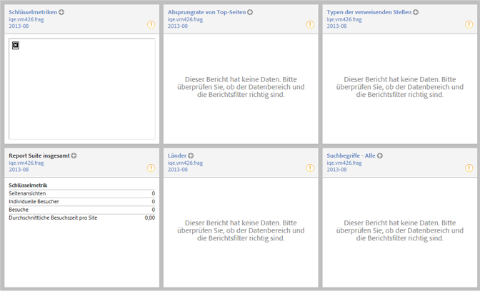

# Site-Übersicht

Der Bericht „Site-Metriken“ &gt; „Site-Übersicht“ wird bei der Anmeldung angezeigt, sodass Sie sofort die relevanten Daten sehen und mit diesen arbeiten können. Sie haben die Möglichkeit, das Layout zu bearbeiten, dieses als Dashboard zu speichern oder den Detaillierungsgrad der Daten für noch genauere Analysen zu erhöhen.

Klicken Sie in der Symbolleiste auf **[!UICONTROL Layout], um diesen Bericht benutzerspezifisch anzupassen und als Dashboard zu speichern.**

Wenn Sie ein Dashboard als Landingpage bestimmen, wird dieser Bericht nicht automatisch angezeigt.
