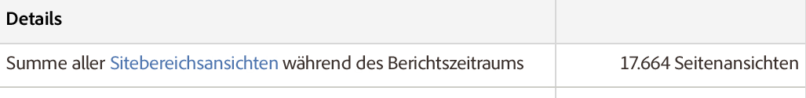

# Zusammenfassung für Sitebereiche

Ein zusammenfassender Bericht für Sitebereiche, der Einstiegspunkte auf vorherigen und nächsten Seiten sowie Informationen über Instanzen (in dieser Schnittstelle als Seitenansichten bezeichnet), die Tiefe von Sitebereichen, die auf dem Sitebereich verbrachte Zeit usw. anzeigt.

Die unter **[!UICONTROL Details]angezeigten Seitenansichten müssen hierfür wieder als Instanzen interpretiert werden:**

