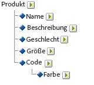

# Informationen über Unterklassifizierungen

Adobe Analytics unterstützt sowohl einstufige als auch mehrstufige Klassifizierungsmodelle. Mit einer Classification-Hierarchie können Sie eine Classification auf eine Classification anwenden.

>[!NOTE]
>
>Unterklassifizierungen bezeichnen die Möglichkeit, Klassifizierungen weiter zu klassifizieren. Das ist allerdings nicht dasselbe wie eine zum Erstellen von [!UICONTROL Hierarchie] berichten verwendete [!UICONTROL Classification-Hierarchie]. Weitere Informationen zu Klassifizierungshierarchien finden Sie unter [Klassifizierungshierarchien](/help/admin/admin/conversion-var-admin/classification-hierarchies.md).

Beispiel:

Jede Classification in diesem Modell ist unabhängig und entspricht einem neuen Unterbericht für die ausgewählte Berichterstellungsvariable. Darüber hinaus stellt jede Classification eine Datenspalte in der Datendatei dar, wobei der Classification-Name als Spaltenüberschrift dient. Beispiel:

| SCHLÜSSEL | EIGENSCHAFT 1 | EIGENSCHAFT 2 |
|---|---|---|
| 123 | ABC | A12B |
| 456 | DEF | C3D4 |

Weitere Informationen über die Datendatei finden Sie unter  [Klassifizierungsdatendateien](/help/components/classifications/importer/c-saint-data-files.md).

Mehrstufige Classifications bestehen aus über- und untergeordneten Classifications. Beispiel:

**Übergeordnete Classifications:** Als übergeordnete Classification zählt jede Classification, der eine andere Classification untergeordnet ist. Eine Classification kann gleichzeitig über- und untergeordnet sein. Die übergeordneten Klassifizierungen der obersten Ebene entsprechen einstufigen Klassifizierungen.

**Untergeordnete Classifications:** Als untergeordnete Classification gilt jede Classification, der eine andere Classification anstelle der Variablen übergeordnet ist. Untergeordnete Classifications enthalten zusätzliche Informationen über ihre übergeordnete Classification. Beispielsweise könnte einer [!UICONTROL Kampagnen]-Classification eine Kampagnenverantwortlichen-Classification untergeordnet sein. [!UICONTROL Nummerische] Classifications fungieren auch als Metriken in Classification-Berichten.

Jede Classification, ob über- oder untergeordnet, stellt eine Datenspalte in der Datendatei dar. Die Spaltenüberschrift für eine untergeordnete Classification nutzt das folgende Namensformat.

`<parent_name>^<child_name>`

Weitere Informationen zum Datendateiformat finden Sie unter [Klassifizierungsdatendateien](/help/components/classifications/importer/c-saint-data-files.md).

Beispiel:

| SCHLÜSSEL | EIGENSCHAFT 1 | Eigenschaft 1^Eigenschaft 1-1 | Eigenschaft 1^Eigenschaft 1-2 | Eigenschaft 2 |
|---|---|---|---|---|
| 123 | ABC | Grün | Klein | A12B |
| 456 | DEF | Rot | Groß | C3D4 |

Obwohl die Dateivorlage für eine mehrstufige Classification komplexer ist, liegt der Vorteil mehrstufiger Classifications darin, dass einzelne Stufen als einzelne Dateien hochgeladen werden können. Dieser Ansatz sorgt für eine Minimierung der Datenmenge, die regelmäßig hochgeladen werden muss (täglich, wöchentlich usw.), indem Daten in Classification-Stufen gruppiert werden, die sich mit der Zeit ändern, im Gegensatz zu solchen, die das nicht tun.

>[!NOTE]
>
>Wenn die [!UICONTROL Schlüssel]-Spalte in einer Datendatei leer ist, erzeugt Adobe automatisch eindeutige Schlüssel für jede Datenzeile. Um beim Hochladen einer Datendatei mit Classification-Daten der zweiten oder einer höheren Stufe mögliche Dateibeschädigungen zu vermeiden, fügen Sie in jeder Zeile der [!UICONTROL Schlüssel] spalte ein Sternchen (*) ein.

## Beispiele

>[!NOTE]
>
>Die Produkt-Classification-Daten sind auf Datenattribute beschränkt, die sich direkt auf das Produkt beziehen. Die Daten sind nicht darauf beschränkt, wie die Produkte kategorisiert sind oder auf der Website zum Verkauf angeboten werden. Datenelemente wie Verkaufskategorien, Website-Browserknoten oder Verkaufselemente sind keine Produkt-Classification-Daten. Diese Elemente werden stattdessen in Berichtskonversionsvariablen erfasst.

Beim Hochladen von Datendateien für diese Produkt-Classification können Sie die Classification-Daten wahlweise als einzelne Datei oder in mehreren Dateien hochladen (siehe unten). Durch das Aufteilen des Farbcodes in Datei 1 und des Farbnamens in Datei 2 müssen die Farbnamensdaten (die möglicherweise nur ein paar Zeilen umfassen) nur aktualisiert werden, wenn neue Farbcodes erstellt werden. Dies schließt das Farbnamenfeld (CODE^FARBE) aus der häufiger aktualisierten Datei 1 aus und verringert damit Dateigröße und Komplexität beim Generieren der Datendatei.

### Produkt-Classification – Einzeldatei {#section_E8C5E031869C449F9B636F5EB3BFEC17}

| SCHLÜSSEL | PRODUKTNAME | PRODUKTDETAILS | GESCHLECHT | GRÖSSE | CODE | CODE^FARBE |
|---|---|---|---|---|---|---|
| 410390013 | Polo-SS | Herren-Poloshirt – Kurzarm (M,01) | M | M | 01 | Stein |
| 410390014 | Polo-SS | Herren-Poloshirt – Kurzarm (L,03) | M | L | 03 | Heather |
| 410390015 | Polo-LS | Damen-Poloshirt – Langarm (S,23) | F | S | 23 | Aqua |

### Produkt-Classification – Mehrere Dateien (Datei 1)  {#section_A99F7D0F145540069BA4EEC0597FF13F}

| SCHLÜSSEL | PRODUKTNAME | PRODUKTDETAILS | GESCHLECHT | GRÖSSE | CODE |
|---|---|---|---|---|---|
| 410390013 | Polo-SS | Herren-Poloshirt – Kurzarm (M,01) | M | M | 01 |
| 410390014 | Polo-SS | Herren-Poloshirt – Kurzarm (L,03) | M | L | 03 |
| 410390015 | Polo-LS | Damen-Poloshirt – Langarm (S,23) | F | S | 23 |

### Produkt-Classification – Mehrere Dateien (Datei 2)  {#section_19ED95C33B174A9687E81714568D56A3}

| SCHLÜSSEL | CODE | CODE^FARBE |
|---|---|---|
| * | 01 | Stein |
| * | 03 | Heather |
| * | 23 | Aqua |
