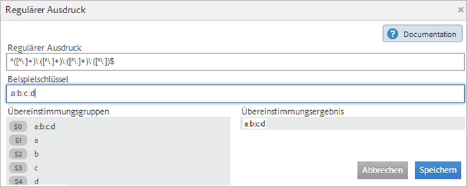

# Klassifizierungsregeln

Classification-Regeln suchen nach nicht klassifizierten Begriffen. Wird eine Regelübereinstimmung gefunden, so fügen die Regeln die Begriffe automatisch den Classification-Datentabellen hinzu. Mit Classification-Regeln können Sie außerdem vorhandene Schlüssel überschreiben.

**[!UICONTROL Analytics]** > **[!UICONTROL Admin]** > **[!UICONTROL Classification Rule Builder]**

Mit dem Rule Builder können Sie einen *`classification rule set`* erstellen, der eine Liste von *`classification rules`* ist. Eine Regel überprüft, ob eine Übereinstimmung mit den angegebenen Kriterien vorliegt, und führt dann eine Aktion durch.

Classification-Regeln eignen sich für Folgendes:

* **E-Mail-** und **Display-Anzeigen:** Erstellen Sie Classification-Regeln, die die einzelnen Display-Anzeigekampagnen gruppieren, so dass ersichtlich wird, wie die Display-Kampagnen im Vergleich zu den E-Mail-Kampagnen abschneiden.

* **Trackingcodes:** Erstellen Sie Classification-Regeln, die die aus den Zeichenfolgen in den Trackingcodes abgeleiteten Schlüsselwerte kategorisieren und dann prüfen, ob diese Schlüsselwerte mit den angegebenen Kriterien übereinstimmen.
* **Suchbegriffe**: Mithilfe von  [regulären Ausdrücken](/help/components/classifications/crb/classification-quickstart-rules.md) und Platzhaltern vereinfachen Sie die Classification der Suchbegriffe. Wenn ein Suchbegriff beispielsweise *`baseball`* enthält, können Sie eine *`Sports League`*-Classification auf *`MLB`* festlegen.

Der Trackingcode für eine E-Mail-Kampagnen-ID lautet beispielsweise:

`em:Summer:2013:Sale`.

Sie können drei Regeln in einem Regelsatz festlegen, die die Teile der Zeichenfolge ermitteln, und dann die Werte klassifizieren:

| Regeltyp auswählen | Übereinstimmungskriterien eingeben | Classification auswählen | Hierzu |
|---|---|---|---|
| Beginnt mit | em: | Kanal | E-Mail |
| Endet mit | Ausverkauf | Typ | Ausverkauf |
| Enthält | 2013 | Jahr | 2013 |

## Verarbeitung der Regeln {#how-rules-are-processed}

Wichtige Informationen zu den Verfahren, wie Classification-Regeln verarbeitet werden.

<!-- 

about_classification_rules.xml

 -->

* [Wichtige Informationen zu Regeln](/help/components/classifications/crb/classification-rule-builder.md)
* [In welchen Fällen werden Schlüssel nicht durch Regeln klassifiziert?](/help/components/classifications/crb/classification-rule-builder.md)
* [Informationen zur Regelpriorität](/help/components/classifications/crb/classification-quickstart-rules.md)

>[!NOTE]
>
>Der [!UICONTROL Rule Builder] unterstützt keine „Nummerisch 2“-Klassifizierungen.

## Wichtige Informationen zu Regeln

* Legen Sie [Gruppenberechtigungen](https://docs.adobe.com/content/help/de-DE/analytics/admin/user-product-management/user-groups/groups.html) für Classifications in den [!UICONTROL Admin Tools] fest.

* **Reguläre Ausdrücke**: Hilfe finden Sie unter [Reguläre Ausdrücke in Classification-Regeln](/help/components/classifications/crb/classification-quickstart-rules.md).

* **Report Suites:** Sie können erst dann eine Classification auswählen, wenn Sie mindestens eine Report Suite ausgewählt haben. Die Report Suite kann erst dann angewendet werden, wenn Sie den Regelsatz erstellt und eine Variable zugewiesen haben.

   Beim Testen des Regelsatzes verwenden Sie Schlüssel (die zu klassifizierende Variable) aus dem Bericht, um zu prüfen, wie sich der Regelsatz auf diese Schlüssel auswirkt. (Der [Schlüssel](/help/components/classifications/importer/c-saint-data-files.md) ist die zu klassifizierende Variable oder die erste Spalte in der Classification-Upload-Tabelle.)

* **Regelpriorität:** Wenn ein Schlüssel mit mehreren Regeln übereinstimmt, die dieselbe Classification festlegen (in der Spalte [!UICONTROL Classification auswählen]), wird die jeweils letzte mit der Classification übereinstimmende Regel verwendet. Siehe [Informationen zur Regelpriorität](/help/components/classifications/crb/classification-quickstart-rules.md).

* **Beschränkungen hinsichtlich der Regelanzahl:** Für die Anzahl der erstellbaren Regeln gelten keine Einschränkungen. Eine große Regelanzahl kann jedoch die Browserleistung beeinträchtigen.
* **Verarbeitung**: Regeln werden in kurzen Intervallen verarbeitet, die sich nach Ihrem Classification-Bezogenen Trafficvolumen richten.

   Aktive Regeln werden alle vier Stunden verarbeitet, wobei die zu untersuchenden Classification-Daten in der Regel einen Monat zurückgehen. Die Regeln suchen automatisch nach neuen Werten und laden die Classification mit dem Importeur hoch.

* **Überschreiben von vorhandenen Classifications:** Siehe [In welchen Fällen werden Schlüssel nicht durch Regeln klassifiziert?](/help/components/classifications/crb/classification-quickstart-rules.md) Bei Bedarf können Sie vorhandene Klassifizierungen mithilfe des Imports löschen oder entfernen.

## In welchen Fällen werden Schlüssel nicht durch Regeln klassifiziert?

Beim Aktivieren von Regeln können Sie vorhandene Classifications überschreiben. In den folgenden Situationen wird ein [Schlüssel](/help/components/classifications/importer/c-saint-data-files.md) (eine Variable) nicht durch eine Classification-Regel klassifiziert, wenn Folgendes gilt:

* Der Schlüssel wurde bereits klassifiziert, und Sie haben nicht die Option [Überschreiben von Classifications für](/help/components/classifications/crb/classification-rule-definitions.md) ausgewählt.

   Sie können Classifications überschreiben, wenn Sie  eine Regel [hinzufügen und aktivieren](/help/components/classifications/crb/classification-quickstart-rules.md), und wenn Sie eine Data Connectors-Integration aktivieren. (Regeln für Data Connectors werden von Partnern im Entwicklungszentrum erstellt und im [!UICONTROL Classification Rule Builder] angezeigt.)

* Ein klassifizierter Schlüssel wird beim Überschreiben nach Ablauf eines bestimmten Zeitrahmens auch dann nicht in den Daten sichtbar, wenn Sie die Option [Überschreiben von Classifications für](/help/components/classifications/crb/classification-rule-definitions.md) aktiviert haben.
* Der Schlüssel wird nicht klassifiziert, und nach Beginn des Zeitrahmens (vor etwa einem Monat) wurde der Schlüssel auch nicht in [!DNL Adobe Analytics] übergeben.

   >[!NOTE]
   >
   >In Berichten gelten Klassifizierungen für jeden beliebigen angegebenen Zeitrahmen, sofern ein Schlüssel existiert. Der Datumsbereich eines Berichts wirkt sich nicht auf die Berichterstellung aus.


## Reguläre Ausdrücke in Classification-Regeln {#regex-in-classification-rules}

Mithilfe von regulären Ausdrücken gleichen Sie konsistent formatierte Zeichenfolgenwerte mit einer Classification ab. So können Sie beispielsweise eine Classification anhand bestimmter Zeichen in einem Trackingcode erstellen. Sie können bestimmte Zeichen, Wörter oder Zeichenmuster abgleichen.

<!-- 

regex_classification_rules.xml

 -->

* [Regulärer Ausdruck – Beispiel für Trackingcode](/help/components/classifications/crb/classification-quickstart-rules.md#section_2EF7951398EB4C2F8E52CEFAB4032669)
* [Regulärer Ausdruck – Klassifizieren eines bestimmten Zeichens](/help/components/classifications/crb/classification-quickstart-rules.md#section_5D300C03FA484BADACBFCA983E738ACF)
* [Reguläre Ausdrücke – Abgleichen von Trackingcodes unterschiedlicher Länge](/help/components/classifications/crb/classification-quickstart-rules.md#section_E86F5BF5C2F44ABC8FFCE3EA67EE3BB2)
* [Reguläre Ausdrücke – Beispiel für „enthält nicht“ ](/help/components/classifications/crb/classification-quickstart-rules.md#section_FCA88A612A4E4B099458E3EF7B60B59C)
* [Reguläre Ausdrücke – Referenztabelle](/help/components/classifications/crb/classification-quickstart-rules.md#section_0211DCB1760042099CCD3ED7A665D716)

>[!NOTE]
>
>Reguläre Ausdrücke eignen sich als Best Practice für Trackingcodes, in denen Trennzeichen verwendet werden; dies gehört zu den bewährten Verfahren.

## Regulärer Ausdruck – Beispiel für Trackingcode {#section_2EF7951398EB4C2F8E52CEFAB4032669}

>[!NOTE]
>
>Wenn der Trackingcode URL-kodiert ist, wird er **nicht** durch den Rule Builder klassifiziert.

In diesem Beispiel wird angenommen, dass die folgende Kampagnen-ID klassifiziert werden soll:

[!UICONTROL Sample Key]: `em:JuneSale:20130601`

Die folgenden Teile des Trackingcodes sind zu klassifizieren:

* `em` = email
* `JuneSale` = Kampagnenname
* `20130601` = date

[!UICONTROL Regular Expression]: `^(.+)\:(.+)\:(.+)$`

Zusammenhang zwischen dem regulären Ausdruck und der Kampagnen-ID:


[!UICONTROL Übereinstimmungsgruppen:] Zeigt, wie der reguläre Ausdruck den Zeichen der Kampagnen-ID entspricht, so dass Sie eine Position in der Kampagnen-ID klassifizieren können.


In diesem Beispiel gilt die Regel, dass sich das Kampagnendatum `20140601` in der dritten Gruppe `(.+)` befindet, identifiziert durch `$3`.

**[!UICONTROL Regel-Builder]**

Konfigurieren Sie die Regel im [!UICONTROL Regel-Builder] wie folgt:

| Regeltyp auswählen | Übereinstimmungskriterien eingeben | Classification auswählen | Hierzu |
|---|---|---|---|
| Regulärer Ausdruck | &amp;Hat;(.+)\:(.+)\:(.+)$ | Kampagnendatum | 3$ |

**Syntax**

| Regulärer Ausdruck | Zeichenfolge oder Übereinstimmungsergebnis | Zugehörige Übereinstimmungsgruppen |
|--- |--- |--- |
| `^(.+)\:(.+)\:(.+)$` | em:JuneSale:20130601 | `$0`: em:JuniAusverkauf:20130601  `$1`: em  `$2`: JuniAusverkauf`$3`: 20130601 |
| Aufbauen der Syntax | `^` = Beginn einer Zeile () = gruppiert Zeichen und ermöglicht das Extrahieren von übereinstimmenden Zeichen in den Klammern.  `(.+)` = erfasst ein ( . ) Zeichen und ( + ) beliebige mehr \ = Beginn einer Zeichenfolge.  `$` = gibt an, dass das vorhergehende Zeichen (oder die vorhergehende Zeichengruppe) das letzte Element in der Zeile ist. |

Weitere Informationen zur Bedeutung der Zeichen in einem regulären Ausdruck finden Sie unter [Reguläre Ausdrücke – Referenztabelle](/help/components/classifications/crb/classification-quickstart-rules.md#section_0211DCB1760042099CCD3ED7A665D716).

## Regulärer Ausdruck – Klassifizieren eines bestimmten Zeichens  {#section_5D300C03FA484BADACBFCA983E738ACF}

Mit einem regulären Ausdruck können Sie beispielsweise ein bestimmes Zeichen in einer Zeichenfolge klassifizieren. Angenommen, der folgende Trackingcode enthält zwei wichtige Zeichen:

[!UICONTROL Sample Key]: `4s3234`

* `4` = Markenname
* `s` = Suchmaschine, z. B. Google


**[!UICONTROL Regel-Builder]**

Konfigurieren Sie die Regel im [!UICONTROL Regel-Builder] wie folgt:

| Regeltyp auswählen | Übereinstimmungskriterien eingeben | Classification auswählen | Hierzu |
|--- |--- |--- |--- |
| Regulärer Ausdruck | `^.(s).*$` | Marke und Suchmaschine | `$0` (Erfasst die ersten beiden Zeichen für den Markennamen und die Suchmaschine.) |
| Regulärer Ausdruck | `^.(s).*$` | Suchmaschine | `$1` (Erfasst das zweite Zeichen für Google.) |

## Reguläre Ausdrücke – Abgleichen von Trackingcodes unterschiedlicher Länge {#section_E86F5BF5C2F44ABC8FFCE3EA67EE3BB2}

Dieses Beispiel zeigt, wie Sie bestimmte Zeichen zwischen Doppelpunkten als Trennzeichen erkennen, wenn Sie Trackingcodes mit unterschiedlicher Länge nutzen. Adobe empfiehlt die Verwendung von je einem regulären Ausdruck pro Trackingcode.

Beispielschlüssel:

* `a:b`
* `a:b:c`
* `a:b:c:d`

**Syntax**




**[!UICONTROL Regel-Builder]**

Konfigurieren Sie die Regel im [!UICONTROL Regel-Builder] wie folgt:

| Regeltyp auswählen | Übereinstimmungskriterien eingeben | Classification auswählen | Hierzu |
|--- |--- |--- |--- |
| Regulärer Ausdruck: Für Übereinstimmungszeichenfolge a:b | `^([^\:]+)\:([^\:]+)$` | a | `$1` |
| Regulärer Ausdruck: Für Übereinstimmungszeichenfolge a:b | `^([^\:]+)\:([^\:]+)$` | b | `$2` |
| Regulärer Ausdruck: Für Übereinstimmungszeichenfolge a:b: c | `^([^\:]+)\:([^\:]+)\:([^\:]+)$` | a | `$1` |
| Regulärer Ausdruck: Für Übereinstimmungszeichenfolge a:b: c | `^([^\:]+)\:([^\:]+)\:([^\:]+)$` | b | `$2` |
| Regulärer Ausdruck: Für Übereinstimmungszeichenfolge a:b: c | `^([^\:]+)\:([^\:]+)\:([^\:]+)$` | c | `$3` |
| Regulärer Ausdruck  Für Übereinstimmungszeichenfolge a:b:c:d | `^([^\:]+)\:([^\:]+)\:([^\:]+)\:([^\:])$` | d | `$4` |

## Reguläre Ausdrücke – Beispiel für „enthält nicht“ {#section_FCA88A612A4E4B099458E3EF7B60B59C}

Dieses Beispiel zeigt einen regulären Ausdruck, mit dem alle Zeichenfolgen abgeglichen werden, die bestimmte Zeichen nicht enthalten (in diesem Fall `13`).

Regulärer Ausdruck:

`^(?!.*13.*).*$`

Testzeichenfolgen:

```
a:b:
a:b:1313
c:d:xoxo
c:d:yoyo
```

Übereinstimmungsergebnisse:

```
a:b:
c:d:xoxo
c:d:yoyo
```

In diesem Ergebnis zeigt `a:b:1313` keine Übereinstimmung an.

## Reguläre Ausdrücke – Referenztabelle {#section_0211DCB1760042099CCD3ED7A665D716}

| Ausdruck | Beschreibung |
|---|---|
| `(?ms)` | Der gesamte reguläre Ausdruck wird mit einer mehrzeiligen Eingabe abgeglichen, sodass das . -Platzhalterzeichen mit allen Zeilenumbruchzeichen abgeglichen wird |
| (`?i`) | Regulären Ausdrücke sind nicht mehr von der Schreibweise abhängig |
| [`abc`] | Beliebiges einzelnes Zeichen aus: a, b oder c |
| [`^abc`] | Beliebiges einzelnes Zeichen, außer: a, b oder c |
| [`a-z`] | Beliebiges einzelnes Zeichen im Bereich a-z |
| [`a-zA-Z`] | Beliebiges einzelnes Zeichen im Bereich a-z oder A-Z |
| `^` | Zeilenanfang (Übereinstimmung mit dem Zeilenanfang) |
| `$` | Übereinstimmung mit dem Zeilenende (oder vor dem Umbruch am Ende) |
| `\A` | Beginn der Zeichenfolge |
| `\z` | Ende der Zeichenfolge |
| `.` | Übereinstimmung mit einem beliebigen Zeichen (außer Umbruch) |
| `\s` | Beliebiges Whitespace-Zeichen |
| `\S` | Beliebiges Zeichen, außer Whitespace-Zeichen |
| `\d` | Beliebige Ziffer |
| `\D` | Beliebiges Zeichen, außer Ziffern |
| `\w` | Beliebiges Zeichen, das in Wörtern zulässig ist (Buchstabe, Ziffer, Unterstrich) |
| `\W` | Beliebiges Zeichen, das nicht in Wörtern zulässig ist |
| `\b` | Beliebige Wortgrenze |
| `(...)` | Alles erfassen zwischen |
| `(a|b)` | a oder b |
| `a?` | Null oder eins von a |
| `a*` | Null oder mehr von a |
| `a+` | Ein oder mehr von a |
| `a{3}` | Genau 3 von a |
| `a{3,}` | 3 oder mehr von a |
| `a{3,6}` | Zwischen 3 und 6 von a |

https://rubular.com/ ist eine gute Ressource, mit der Sie die Gültigkeit regulärer Ausdrücke testen können.

## Informationen zur Regelpriorität

Wenn ein Schlüssel mit mehreren Regeln übereinstimmt, die dieselbe Classification-Spalte festlegen (wie in der Spalte [!UICONTROL Classification auswählen] angegeben), wird die jeweils letzte Regel verwendet. Weisen Sie daher der wichtigsten Regel die letzte Stelle im Regelsatz zu.

<!-- 

rule_priority.xml

 -->

Wenn Sie mehrere Regeln erstellen, die nicht dieselbe Classification nutzen, ist die Verarbeitungsreihenfolge nicht von Bedeutung.

Im folgenden Beispiel für eine Suchbegriffregel werden Suchtypen für Sportler klassifiziert:

| Regelnummer | Regeltyp | Übereinstimmung | Classification auswählen | Hierzu |
|---|---|---|---|---|
| 1 | Enthält | Cowboys | Suchtyp | Team |
| 2 | Enthält | Fantasy | Suchtyp | Fantasie |
| 3 | Enthält | Romo | Suchtyp | Spieler |

Wenn ein Benutzer nach  *`Cowboys fantasy Tony Romo`* sucht, ist der Begriff *`Player`* klassifiziert, weil dieser Begriff mit der letzten in der Spalte „Classification auswählen“ angegebenen Classification übereinstimmt.

Ein weiteres Beispiel. Angenommen, Sie legen zwei Regeln in einem Regelsatz für die folgenden Suchbegriffe fest:

| Regelnummer | Regeltyp | Übereinstimmung | Classification auswählen | Hierzu |
|---|---|---|---|---|
| 1 | Enthält | Cowboys | Stadt | Dallas |
| 2 | Enthält | Broncos | Stadt | Denver |

Ein Benutzer sucht nach  *`Cowboys vs. Broncos`*. Wenn der Regel-Builder einen Konflikt bei der Regelübereinstimmung feststellt, gilt für diese Suche die Classification für die zweite Regel (Denver).

## Hinzufügen einer Klassifizierungsregel zu einem Regelsatz {#add-classification-to-rule-set}

<!-- 

t_classification_rule.xml

 -->

In diesen Schritten wird beschrieben, wie Sie Classification-Regeln hinzufügen oder bearbeiten.

Zum Hinzufügen einer Regel ordnen Sie eine Bedingung einer Classification zu, und legen Sie die gewünschte Aktion fest.

>[!NOTE]
>
>Im Rahmen dieses Verfahrens müssen Sie die Regeln auf eine oder mehrere Report Suites anwenden. Es wird empfohlen, zwischen 500 und 1000 Regeln in einen Regelsatz aufzunehmen. Es gibt allerdings keine Begrenzungen. Wenn Sie mehr als 100 Regeln nutzen, vereinfachen Sie den Regelsatz ggf. mithilfe von  [Unter-Classifications](/help/components/classifications/c-sub-classifications.md).

1. [Erstellen Sie einen Klassifizierungsregelsatz](/help/components/classifications/crb/classification-rule-set.md).
1. Klicken Sie auf der Regelsatzseite auf **[!UICONTROL Regel hinzufügen]**.

   

1. Klicken Sie neben **[!UICONTROL Report Suites]** auf **[!UICONTROL Suites hinzufügen]** und wählen Sie mindestens eine Report Suite aus, die diesem Regelsatz zugeordnet werden soll.

   Die Seite **[!UICONTROL Report Suites auswählen]** wird angezeigt.

   >[!NOTE]
   >
   >Report Suites werden *`only`* auf dieser Seite angezeigt, wenn die folgenden Bedingungen erfüllt sind:
   >
   >* Mindestens eine Classification ist für die Variable in [!UICONTROL Admin Tools] für die Report Suites definiert.
      >
      >   
      (Eine Erläuterung zu dieser Voraussetzung finden Sie unter *`Variable`* in den [Klassifizierungsregelsätzen](/help/components/classifications/crb/classification-rule-set.md).)
      >
      >
   * Sie haben die Report Suite auf der Seite **[!UICONTROL Verfügbare Report Suites]** ausgewählt, die angezeigt wird, wenn Sie auf [Regelsatz hinzufügen](/help/components/classifications/crb/classification-rule-set.md) klicken, um den Regelsatz zu erstellen.


1. Festlegen, ob vorhandene Werte überschrieben werden sollen:

   | **Regeln überschreiben alle vorhandenen Werte.** | (Standardeinstellung) Vorhandene Classification-Schlüssel werden immer überschrieben, einschließlich Classifications, die über das Importtool (SAINT) hochgeladen wurden. |
   |---|---|
   | **Regeln überschreiben nur nicht festgelegte Werte.** | Es werden nur leere (nicht festgelegte) Zellen ausgefüllt. Vorhandene Classifications werden nicht geändert. |

1. [Definieren Sie die Regel(n)](/help/components/classifications/crb/classification-rule-definitions.md#section_4A5BF384EEEE4994B6DC888339833529).

   

   Beispiele zum Erstellen von Regeln finden Sie unter [Classifications Rule Builder](/help/components/classifications/crb/classification-rule-builder.md) und [Reguläre Ausdrücke in Classification-Regeln](/help/components/classifications/crb/classification-quickstart-rules.md).

   >[!NOTE]
   >
   >Wenn ein Schlüssel mit mehreren Regeln übereinstimmt, die dieselbe Classification festlegen (in der Spalte „Classification auswählen“), wird die jeweils letzte mit der Classification übereinstimmende Regel verwendet. Weitere Informationen zum Sortieren der Regeln finden Sie unter **Informationen zur Regelpriorität**.

1. [Testen Sie den Regelsatz](/help/components/classifications/crb/classification-quickstart-rules.md).
1. Klicken Sie nach Abschluss der Tests auf **[!UICONTROL Aktiv]**. Damit wird die Regel validiert und aktiviert.

   Beim Aktivieren einer Regel wird die Datei automatisch erstellt und hochgeladen.

   Felddefinitionen: Vollständige Definitionen der Optionen auf dieser Seite finden Sie unter [Classification Rule Builder](/help/components/classifications/crb/classification-rule-definitions.md).

## Testen eines Klassifizierungsregelsatzes

<!-- 

t_classifications_test_rule.xml

 -->

In diesen Schritten wird beschrieben, wie Sie eine Classification-Regel oder einen Classification-Regelsatz testen. Im Rahmen des Tests werden alle Regeln innerhalb eines Satzes übeprüft.

1. [Erstellen Sie einen Klassifizierungsregelsatz](/help/components/classifications/crb/classification-rule-set.md).
1. Klicken Sie im [!UICONTROL Classification Rule Builder] auf den Namen des Regelsatzes.
1. Stellen Sie sicher, dass der Regelsatz einer Report Suite zugeordnet ist.
1. Klicken Sie im Regeleditor auf **[!UICONTROL Testregelsatz]**.

   

1. Geben oder fügen Sie Testschlüssel in das Feld [!UICONTROL Beispielschlüssel] ein.

   Beispielschlüssel umfassen Folgendes:

   * Trackingcodes
   * Keywords oder Suchausdrücke

   Siehe [Reguläre Ausdrücke in Classification-Regeln](/help/components/classifications/crb/classification-quickstart-rules.md), um Informationen zum Testen von regulären Ausdrücken zu erhalten.
1. Klicken Sie auf **[!UICONTROL Test ausführen]**.

   Passende Regeln werden in der [!UICONTROL Ergebnistabelle] angezeigt.
1. (Optional) Klicken Sie auf **[!UICONTROL Aktivieren]**, um die Regel zu aktivieren und bestehende Klassifizierungen zu überschreiben.

   Weitere Informationen zum Überschreiben vorhandener Klassifizierungen mithilfe von Regeln finden Sie hier.

## Validieren und Aktivieren von Klassifizierungsregeln

<!-- 

t_validate_rules.xml

 -->

In diesen Schritten wird beschrieben, wie Sie Classification-Regeln validieren und aktivieren.

1. [Erstellen Sie einen Classification-Regelsatz](/help/components/classifications/crb/classification-rule-set.md) und [fügen Sie dem Satz dann Classification-Regeln](/help/components/classifications/crb/classification-quickstart-rules.md) hinzu.
1. Klicken Sie im Regeleditor auf **[!UICONTROL Aktivieren]**.

   

1. (Optional) Wenn Sie Klassifizierungen überschreiben möchten, aktivieren Sie die Option **[!UICONTROL Überschreiben von Classifications für]** *`<selection>`*.

   Mit dieser Option können Sie bestehende Classifications für die betroffenen Schlüssel überschreiben.

   Eine Definition dieser Option finden Sie auf der [Seite „Regeln“](/help/components/classifications/crb/classification-rule-definitions.md#section_4A5BF384EEEE4994B6DC888339833529).
